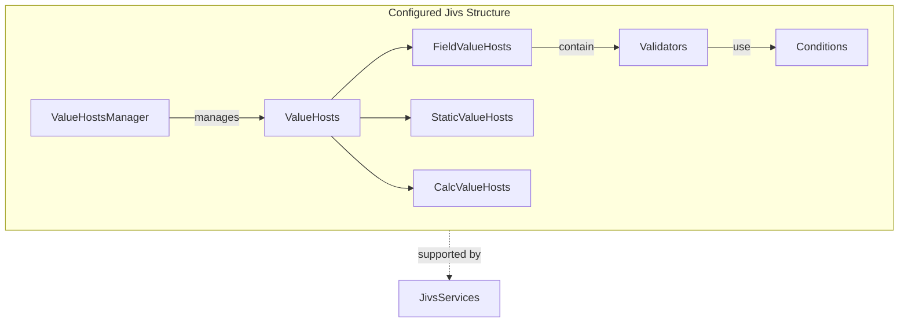
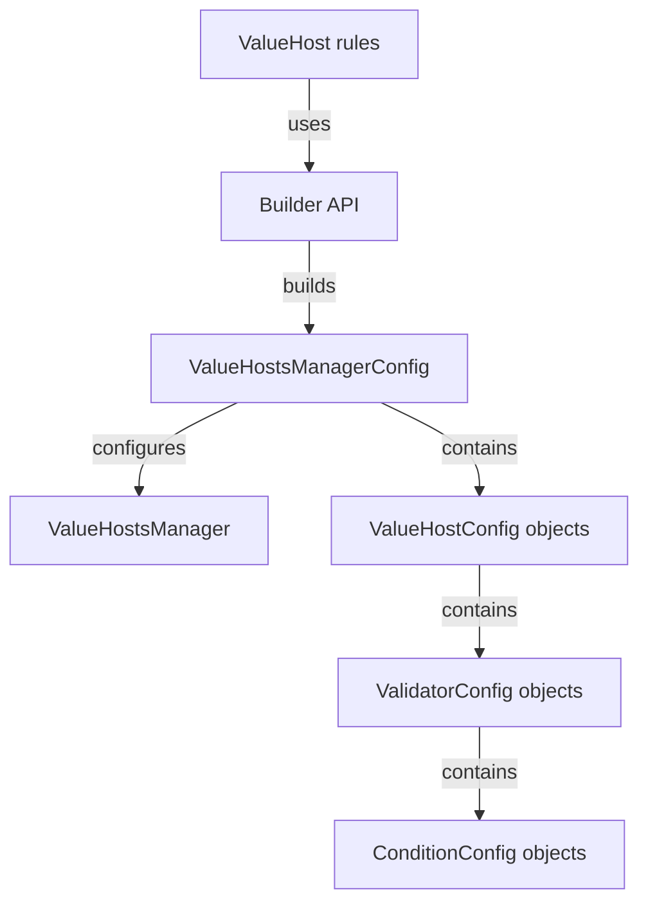
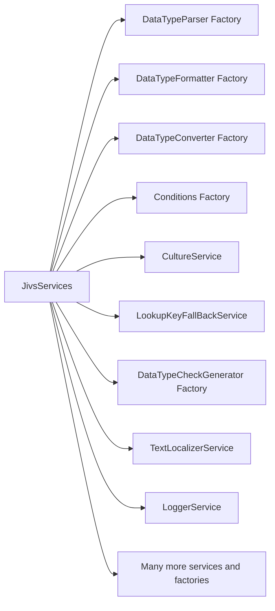

# The Jivs API

**Topics**
- [ValueHostsManager](./ValueHostsManager/Home.md)
- [ValueHosts](./ValueHosts/Home.md)
- [Validators](./Validators/Home.md)
- [Conditions](./Conditions/Home.md)
- [JivsServices](./JivsServices/Home.md)
- [ValueHost Rules](./ValueHost_Rules/Home.md)
- [Builder API](../ValueHostsManager_Configuration_Guide.md)
- [ModelReader and ModelWriter](./ModelReader_and_ModelWriter/Home.md)
- [ValidationState and IssueFound](./Validators/Validation_State.md)

**Additional topics**
- [Learning Jivs](../Learning_Jivs/Home.md)
- [ValueHostsManager Configuration Guide](../ValueHostsManager_Configuration_Guide.md)
- [Understanding Conditions within Validators](./Conditions/Understanding_Conditions_within_Validators.md)
- [Invoking Validation](./Validators/Invoking_Validation.md)
- [Handling ValidationState Changes](./Validators/Handling_ValidationState_Changes.md)
- [Data Types and Companion Services](./Data_Type_Support/Home.md)
- [Localization](./JivsServices/Localization.md)
- [Logging](./JivsServices/Logging.md)
- [Testing your work](../Testing/Home.md)

## Core Architecture

-   [`ValueHostsManager`](./ValueHostsManager/Home.md) – The central Jivs object. It coordinates a collection of `ValueHosts` and provides an application-level view of their validation state. Use it to invoke validation, inspect the results, and add issues found by application business logic. 

-   [`ValueHosts`](./ValueHosts/Home.md) – Represents one value participating in validation.

    + `FieldValueHost` – Represents a field-oriented value. It holds both a Native Value used by application code and a Text Value used by an editor.
    + `StaticValueHost` – Supplies a value that does not require validation but may be used by other validation rules.
    + `CalcValueHost` – Calculates a value needed by validation rules. For example, it might calculate the number of days between two dates.

-   [`Validator`](./Validators/Home.md) – Handles one validation rule on a `ValueHost`. It uses a `Condition` to evaluate the rule and reports a validation issue when the rule is not satisfied.

-   [`Condition`](./Conditions/Home.md) – Encapsulates a single business rule, including the logic that determines whether supplied values satisfy it. Jivs provides `Conditions` for rules such as requiring a value or comparing two values. [All Conditions included with Jivs](./Conditions/Conditions_Included_with_Jivs.md)

- [`JivsServices class`](./JivsServices/Home.md) – Provides the services and factories used throughout Jivs for dependency injection and customization.

## Configuring ValueHostsManager

- [`ValueHost rules`](./ValueHost_Rules/Home.md) – Package reusable `ValueHostsManager` configuration for a model or form. It generates a `ValueHostsManagerConfig object tree`.Create a `ValueHostRulesBase subclass` to describe its `ValueHosts` and validation rules. 
- [`Builder API`](../ValueHostsManager_Configuration_Guide.md) – Provides a fluent API for constructing the `ValueHostsManagerConfig object tree` within your `ValueHostRulesBase subclass`.
- `ValueHostsManagerConfig object tree` – The configuration object tree used to create a `ValueHostsManager`. It contains the nested `ValueHostConfig`, `ValidatorConfig`, and `ConditionConfig` objects, along with manager-level settings such as services and callbacks.

## Customizing through JivsServices

[`JivsServices`](./JivsServices/Home.md) is where much of customization occurs. Usually you'll edit your `createJivsServices()` function (lifted from [create_services.ts](https://github.com/plblum/jivs/blob/main/starter_code/create_services.ts)) to register these classes with their factories:
- [`DataTypeParser`](./Data_Type_Support/DataTypeParsers_Service.md) – `FieldValueHosts` use these to convert the text value (from an editor) into a native value.
- [`DataTypeFormatter`](./Data_Type_Support/DataTypeFormatters_Service.md) – Two use cases:
    + `FieldValueHost` can convert the native value into its text value when using `ValueHost.setValue()`.
    + Provides localized strings for the tokens within error messages.
- [`DataTypeConverter`](./Data_Type_Support/DataTypeConverters_Service.md) – For converting values between types, such as a Date object to a number of seconds.
- [`Conditions`](./Conditions/Creating_Your_Own.md)
- [`CultureService`](./JivsServices/CultureServices.md) - Identifies the Cultures used by your app through ISO language/region codes.
- [`LookupKeyFallbacksService`](./JivsServices/LookupKeyFallbackService.md) - Provides fallbacks for Lookup Keys so that if they cannot be matched to a parser, formatter, converter, etc, another Lookup Key will be used.
- [`DataTypeCheckGenerator`](./Data_Type_Support/DataTypeCheckGenerator_Service.md) - Ensures the automatic generation of a "Data Type Check" validator on each `FieldValueHost` based on its data type.

There are numerous other extensibility points on [`JivsServices`](./JivsServices/Home.md). Its where you will find [logging](./JivsServices/Logging.md) and [localization](./JivsServices/Localization.md), for instance.