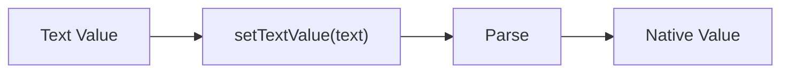
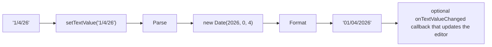

# Getting and Setting Values
Let's look into how to get and set values on `ValueHosts`. First, we need to provide terminology:

- **Native Value** - a value compatible with the model's property. Its the one you will save (if valid).
- **Text Value** - the value from an editor that is a textual representation of the native value.

`FieldValueHosts` use both. `StaticValueHost` and `CalcValueHost` only use native values.

The text value is the normal data associated with HTML `input`, `select`, and `textarea` elements. Its value often needs to be parsed to become a native value. Even if its destination is a string type, often you apply a minimal parser to trim spaces, remove unwanted characters, and even reformat it.
Therefore parsing is a part of the process. 

Your selection of functions to get and set depend on if you handle parsing or let Jivs do it. See [DataTypeParsers](../Data_Type_Support/DataTypeParsers_Service.md).



Similarly we use formatters to convert the native value into the text value shown by the editor. Again, you must select whether you handle formatting or let Jivs do it.


## Getting the Native Value
Use `getValue()` to get the native value from any `ValueHost`.
```ts
getValue(): any;
```
When it returns undefined, it indicates the value is undetermined.

```ts
// vhm = ValueHostsManager
let nativeValue = vhm.getValueHost("fieldname").getValue();
// or
let nativeValue = vhm.vh.any("fieldname").getValue();
```
See ["Getting a ValueHost"](./Home.md#getting-a-valuehost) for using `getValueHost()` and `vhm.vh`.

## Getting the Text Value
The `getTextValue()` function gets the text value from a `FieldValueHost`.
```ts
getTextValue(): string;
```
```ts
// vhm = ValueHostsManager
let textValue = vhm.getFieldValueHost("fieldname").getTextValue();
// or
let  textValue = vhm.vh.field("fieldname").getTextValue();
```
See ["Getting a ValueHost"](./Home.md#getting-a-valuehost) for using `getFieldValueHost()` and `vhm.vh`.

## Setting values
You will set values as you initialize the `ValueHostsManager` and as the values are changed. 

There are 4 functions available.
- `setValue(value: any, options?: SetValueOptions): void` - Set the native value. Optionally applies a `DataTypeFormatter` and sets the text value from the result.
- `setTextValue(textValue: string, options?: FieldValueHostSetValueOptions): void` - Only on FieldValueHosts. Sets the text value. Optionally applies a `DataTypeParser` and sets the native value from the result.
- `setValues(nativeValue: any, textValue: string, options?: SetValueOptions): void` - You have prepared both native and text values. Use this to set both of them together.
- `setValueToUndefined(options?: SetValueOptions): void` - The native value is undetermined, or your own parser could not convert from text to a native value, this will record the native value as undefined. 

### setValue() function
Set the native value. Optionally applies a `DataTypeFormatter` and sets the text value from the result.

_Use Cases:_
- Initializing the `ValueHost` from the native value on your model. [`ModelReader`](../ModelReader_and_ModelWriter/Home.md) uses this.
- The editor supplies a native value. Be careful, an HTML input offers a way to get a native date and some other values based on its type attribute. Always use its text value because it lets Jivs detect invalid input errors.

```ts
class ValueHost
{
    setValue(value: any, options?: SetValueOptions): void {}
}
```
- The [options parameter](#options-parameter-setvalueoptions) is described below.
- Formatting:
    - Your own formatter: If you handle converting native to text value outside of Jivs, use `setValues()` instead.
    - Using our formatter, you can wire up your UI element to take the resulting string by setting up the `ValueHostsManager.onTextValueChanged` callback handler. See [Decisions around formatting](#decisions-around-jivs-built-in-formatting) below.
- `CalcValueHosts` are effectively read-only, and calling this does nothing.

```ts
// vhm = ValueHostsManager
vhm.getValueHost("LastName").setValue("MyValue");
// or
vhm.vh.any("LastName").setValue("MyValue");
```
When initializing the value, the options parameter offers several properties that are used:

```ts
// vhm = ValueHostsManager
vhm.getValueHost("LastName").setValue("MyValue",
    {
        validate: false,    // don't need to validate just yet
        reset: true         // don't track a state change as if the user has edited the value
    }
);
```
See ["Getting a ValueHost"](#getting-a-valuehost) for using `getValueHost()` and `vhm.vh`.
#### Decisions around Jivs built-in formatting
Your `ValueHost` configuration determines if formatting will happen.

- LookupKey used to select the `DataTypeFormatter` comes from the `dataType` or `formatterLookupKey`.
    ```ts
    builder.field('BirthDate', LookupKey.Date); // will use DateFormatter
    builder.field('BirthDate', LookupKey.Date,
        {
            formatterLookupKey: LookupKey.LongDate  // will use LongDateFormatter, overriding the data type
        }
    )
    ```
- Prevent conversion to text value by assigning `behaviors.disableFormattingOnValueChange` to true.
    ```ts
    builder.behaviors.disableFormattingOnValueChange = true;
    ```    
- Prevent conversion to text value by assigning `formatterLookupKey` to null for case-by-case basis.
    ```ts
    builder.field('BirthDate', LookupKey.Date,
        {
            formatterLookupKey: null  // no conversion
        }
    )
    ```
- When the formatter has been setup, it can be disabled on demand.
    ```ts
    vhm.getValueHost('BirthDate').setValue(birthDate, { disableFormatter: true });
    ```
- Use the resulting text value in your user interface element
    ```ts
    builder.field('BirthDate', LookupKey.Date, { // will use DateFormatter
        elementIdentifier: 'idForBirthdate'  // hold the id attribute value of the input if different from the ValueHost name
    });
    let config = builder.completed();
    config.onTextValueChanged = (fieldValueHost, oldValue)=>{
        let newTextValue = fieldValueHost.getTextValue();
        // assign it to the input's value attribute
        document.getElementById(fieldValueHost.getElementIdentifier()).value = newTextValue;
    };
    let vhm = new ValueHostsManager(config);
    // suppose your have a model object with a 'BirthDate' property
    vhm.getValueHost('BirthDate').setValue(model.BirthDate);  // triggers onTextValueChanged
    ```
- Localize formatting with the `behaviors.activeCultureId` property.
    ```ts
    config.behaviors.activeCultureId = 'fr-FR';
    ```          
    See also [Localization](../JivsServices/Localization.md).
### setTextValue() function
Set the text value on a `FieldValueHost`. 
- Optionally applies a `DataTypeParser` and sets the native value from the result.
- Optionally reformats the text value and calls `onTextValueChanged` callback hook
so you can direct it to the editor.

_Use Cases:_
- Editor's value has changed, especially HTML `input`, `select`, and `textarea` using `onchange` and optionally `oninput` events.
- Initializing the `FieldValueHost` when the source value is the text value. [`FormReader`](../ModelReader_and_ModelWriter/Home.md) uses this.
    - From the HTML `input`, `select`, or `textarea` value attributes, previously initialized.
    - On the server, when posted an HTML form

```ts
class FieldValueHost {
    setTextValue(textValue: string, options?: FieldValueHostSetValueOptions): void {}
}
```
- The [options parameter](#options-parameter-setvalueoptions) is described below.
- Parsing:
    - Using our parser: See [Decisions around parsing](#decisions-around-jivs-built-in-parsing)
    - Your own parser: If you handle converting the text to native value outside of Jivs, use `setValues()` instead.
- Reformatting takes the original text, parses to native, then formats back to text which often applies desirable formatting. See [Reformatting the original text](#reformatting-the-original-text).
```ts
// vhm = ValueHostsManager
document.getElementById('birthDate').attachEventListener('onchange', (event)=> {
    vhm.getFieldValueHost('BirthDate').setTextValue(event.target.value);
    // or vhm.vh.field('BirthDate').setTextValue(event.target.value);
});
```
See ["Getting a ValueHost"](#getting-a-valuehost) for using `getFieldValueHost()` and `vhm.vh`.

#### Decisions around Jivs built-in parsing
Your `ValueHost` configuration determines if parsing will happen.

- LookupKey used to select the `DataTypeParser` comes from the `dataType` or `parserLookupKey`.
    ```ts
    builder.field('BirthDate', LookupKey.Date); // will use DateParser
    builder.field('BirthDate', LookupKey.Date,
        {
            parserLookupKey: LookupKey.LongDate  // will use LongDateParser, overriding the data type
        }
    )
    ```
- Prevent conversion to text value by assigning `behaviors.disableParsingOnValueChange` to true.
    ```ts
    builder.behaviors.disableParsingOnValueChange = true;
    ```    
- Prevent conversion to native value by assigning `parserLookupKey` to null on a case-by-case basis.
    ```ts
    builder.field('BirthDate', LookupKey.Date,
        {
            parserLookupKey: null  // no conversion
        }
    )
    ```
- When the parser has been setup, it can be disabled on demand.
    ```ts
    vhm.getValueHost('BirthDate').setValue(birthDate, { disableParser: true });
    ```
- Localize parsing with the `behaviors.activeCultureId` property.
    ```ts
    builder.behaviors.activeCultureId = 'fr-FR';
    ```        
    See also [Localization](#localization).

#### Reformatting the original text

Reformatting the original text is handled through configuration's `reformatTextValue` property.
You must have configured services and the FieldValueHost with the necessary `DataTypeFormatters`, `DataTypeParsers`, and their lookup keys.
```ts
builder.field('BirthDate', LookupKey.Date,
    {
        reformatTextValue: true // if DateFormatter and DateParser are setup, expect '1/2/2000' to reformat into '01/02/2000'
    }
)
```
Or using the `behavior.reformatTextValue` property to address all that don't explicity use `ValueHostConfig.reformatTextValue`.

```ts
builder.field('BirthDate', LookupKey.Date,
    {
        // if DateFormatter and DateParser are setup, expect '1/2/2000' to reformat into '01/02/2000'
    }
)
let config = builder.completed();
config.behaviors.reformatTextValue = true;
```
If neither `reformatTextValue` properties are set, the feature is disabled.    

### setValues() function
Set both native and text values together. No parsing or formatting is involved.

_Use Cases:_
- You prepare both values through parsing or formatting.

```ts
class FieldValueHost
{
    setValues(nativeValue: any, textValue: string, options?: SetValueOptions): void {}
}
```
- The [options parameter](#options-parameter-setvalueoptions) is described below.
- If conversion failed or the value is undetermined, pass the value `undefined` as the value.
- Even if configured, Jivs own parsers and formatters will not be used by `setValues()`.

```ts
// vhm = ValueHostsManager
// to initialize, convert the model's native value to text and assign to the HTML element
let textValue = myFormatter(model.birthDate);   // you write this
document.getElementById('birthDate').value = textValue ?? '';   // in case undefined, use ?? ''
vhm.getFieldValueHost('BirthDate').setValues(model.birthDate, textValue, {
    skipValueChangedCallback: true,  // in case you wire up the onTextValueChanged callback hook
    validate: false,    // don't need to validate just yet
    reset: true         // don't track a state change as if the user has edited the value    
});

// to handle the onchanged event, parse the text to make it the native value
document.getElementById('birthDate').attachEventListener('onchange', (event)=> {
    let textValue = event.target.value;
    let { nativeValue, errorMessage } = myParser(textValue); // return nativeValue=undefined and an error message if could not convert

    let parserError: InjectedError = undefined;
    if (errorMessage)
        parserError = {
            errorMessage: errorMessage,
            errorCode: 'MyParserError'  // useful to let TextLocalizerService replace the message
        };
    vhm.getFieldValueHost('BirthDate').setValues(nativeValue, textValue,
        {
            validate: true,  // if you like
            injectedError: parserError
        }
    );
    // or vhm.vh.field('BirthDate').setValues(...)
});
```
See [Options parameter](#options-parameter-setvalueoptions) for all options.

See ["Getting a ValueHost"](#getting-a-valuehost) for using `getFieldValueHost()` and `vhm.vh`.
### setValueToUndefined() function
Sets the native value to undefined.

_Use Cases:_
- The native value is undetermined
- Your own parser could not convert from text to a native value. You can also use `setValues(undefined, text value)`.
```ts
class ValueHost {
    setValueToUndefined(options?: SetValueOptions): void {}
}
```
- The [options parameter](#options-parameter-setvalueoptions) is described below.

### Options parameter: SetValueOptions
Each of the `setValue()` functions offer the options parameter. Here is its type:
```ts
interface SetValueOptions {
    validate?: boolean;
    reset?: boolean;
    skipValueChangedCallback?: boolean;
    duringEdit?: boolean;
    overrideDisabled?: boolean;    
    ensureEnabled?: boolean;
}

interface FieldValueHostSetValueOptions extends SetValueOptions
{
    injectedError? : InjectedError;
    disableParser?: boolean;
    disableFormatter?: boolean;
    skipIfUnchanged?: boolean;
}
```
These properties are all related to validation:
- `validate` - When true, invoke validation but only if the value changed. Only supported by validatable `ValueHosts`.
- `reset` - When true, change the state of the `ValueHost` to unchanged and validation has not been attempted. Consider setting this to true when using `setValue()` to initialize.
- `skipValueChangedCallback` - When true, the `onValueChanged` and `onTextValueChanged` callbacks will not be invoked.
- `duringEdit` - Set to true for an intermediate edit activity rather than a completed change.
     For example, on the client side this may be used for an HTMLInputElement.oninput event,
     where the user is still editing. In this mode, only validators intended for in-progress
     edits are used like requireText, notNull, stringLength and regExp.
- `overrideDisabled` - When true, it forces the change to the value even when the `ValueHost` is disabled.
    `ValueHost` is disabled when `isEnabled()` returns false.
    **Use case**: You may want to initialize a `ValueHost` with a value that is disabled. See [Disabling a ValueHost](#disabling-a-valuehost).
- `ensureEnabled` - When true, ensures that the `ValueHost` is enabled as part of setting the value.
    This is useful in scenarios where the `ValueHost` might be disabled by default, 
    but you want to ensure it is enabled when setting a new value.
    When applied, the reset option will be forced to true to clear the validation and change state.

    _Use case:_ server side generates the page and your initialization process sets the enabled state of each `ValueHost` to which there is an editor on the page.
    
- `injectedError` - When you handle parsing, your parser may report an error that you want to display.
  Use this option to pass along the error. Jivs will display it. See [Injecting errors on demand](#injecting-errors-on-demand).
- `disableParser` - When true, do not allow the parser to run on this `ValueHost`.
- `disableFormatter` - When true, do not allow the parser to run on this `ValueHost`.
- `skipIfUnchanged` - _Only available with setTextValue()_.
    When true, the value supplied is compared to the existing value and no further action is taken
    when they match.

    _Use case:_ page generated on the server after a round trip. The server may have changed
    elements. As we scrape the HTML for values, we want to retain the validation state of those unchanged.

---
Go to [ValueHost Home](./Home.md)

Go to [API Home](../Home.md)