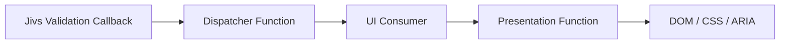

# Building Client Validation UI

Jivs determines validation state. The application decides how that state should appear in the UI.

Validation UI commonly includes:

- Field Error Displays
- Required Indicators
- styling that responds to field validation
- Validation Summaries
- Submit / Save Controls

This document uses basic HTML, CSS, and browser DOM APIs to show how those UI elements connect to Jivs.

These examples are **not a UI component library** and are not intended to become application copy-and-paste infrastructure. Jivs modules for specific frameworks and UI libraries can provide these behaviors through components, directives, hooks, or other framework-native mechanisms.

The examples here show the underlying responsibilities those integrations implement.

## Before Building the UI

Before building validation UI, it helps to make a few decisions about how the browser, CSS, markup, and Jivs validation state will work together.

This section covers the setup choices that make the later UI examples simpler:

- disabling native browser validation
- using CSS to react to validation state
- designing predictable field and form markup
- delivering validation state to the UI elements that will present it

These are not required implementation patterns. They are the plain-DOM techniques used by this document so the later Field UI and Form UI examples can stay focused on the widgets themselves.

A useful principle throughout this document is:

> **Expose validation state to the appropriate UI element, then let that element decide how to present it.**

### Disable Native Browser Validation

Browsers provide their own form validation for attributes such as `required`, input types, and other constraints.

When Jivs is responsible for validation, disable native browser form validation so browser-generated validation behavior does not compete with Jivs.

Use `novalidate` on the form:

```html
<form id="person-form" novalidate>
    ...
</form>
```

The examples in this document use `novalidate`.

Also avoid depending on native validation attributes such as `required` to define Jivs validation rules. Jivs validation state should remain the source used by the validation UI.

### Use CSS to Drive Presentation

JavaScript does not need to control every visual detail of validation UI.

A useful pattern is:

> **Use JavaScript to expose changing validation state on the elements that own that state. Use CSS to decide how that state should look.**

For example, an editor may receive an `invalid` class:

```html
<input
    class="validation-editor invalid">
```

CSS can style that state directly:

```css
.validation-editor.invalid {
    border: 2px solid currentColor;
}
```

This keeps presentation rules in CSS instead of spreading them through validation-related JavaScript.

#### Style Containers Based on Invalid Fields

A validation state may belong to one editor, while the visual response belongs to a larger part of the UI.

For example, an invalid editor may need to change the appearance of:

- its field container
- a surrounding fieldset
- a card or panel
- a larger group of related fields

JavaScript could locate and update each enclosing element, but that couples validation code to the page layout.

Modern CSS `:has()` lets a container respond to an invalid field inside it:

```css
.field-container:has(.validation-editor.invalid) {
    outline: 2px solid currentColor;
}
```

A larger container can use the same technique:

```css
.field-group:has(.validation-editor.invalid) {
    outline: 2px solid currentColor;
}
```

JavaScript only needs to expose the state where it belongs:

```ts
editor.classList.toggle(
    'invalid',
    isInvalid
);
```

CSS determines which surrounding elements should react.

### Plan Predictable UI Markup

Validation callbacks need a reliable way to connect validation state with the UI elements interested in that state.

The conventions below are used by the plain-DOM examples in this document. They are **not Jivs requirements**. Applications and framework integrations may use other names or other mechanisms entirely.

#### Field Markup

A field commonly has several related UI elements:

- editor, often an `<input>`, `<select>`, or `<textarea>`
- label
- Field Error Display
- Required Indicator
- an enclosing field container

Start with one identifier for the field:

```text
first-name
```

Related element IDs can use that common value with predictable suffixes:

```text
first-name or first-name_editor
first-name_label
first-name_errorMessages
first-name_required
first-name_container
```

We'll take advantage of HTML's ability to add custom attributes and the associated selector support by adding these attributes:

- `data-field` identifies which field an element belongs to. For example:

  ```css
  [data-field="first-name"]
  ```

- `data-validation-role` identifies the validation-related role of that element. For example:

  ```css
  [data-validation-role="error"]
  ```

These names are conventions introduced by this document. They are not required by Jivs.

The attributes can be combined to locate a particular validation element for a particular field:

```css
[data-field="first-name"][data-validation-role="error"]
```

For example:

```html
<div
    id="first-name_container"
    class="field-container"
    data-field="first-name"
    data-validation-role="container">

    <label
        id="first-name_label"
        for="first-name"
        data-field="first-name"
        data-validation-role="label">
        First name

        <span
            id="first-name_required"
            data-field="first-name"
            data-validation-role="required">
            *
        </span>
    </label>

    <input
        id="first-name"
        class="validation-editor"
        data-field="first-name"
        data-validation-role="editor">

    <div
        id="first-name_errorMessages"
        data-field="first-name"
        data-validation-role="error">
    </div>
</div>
```

Application code can construct the same kind of selector generically for any field.

##### Connect the FieldValueHost to the Field Identifier

The validation state changed callback gives us the `FieldValueHost` that changed. To update its UI, application code needs to locate the elements associated with that field.

So far, our HTML examples use a shared field identifier such as:

```text
first-name
```

That may not match the ValueHost name:

```text
FirstName
```

We therefore need a reliable way to get the UI's field identifier from the `FieldValueHost`.

By default, that identifier is the ValueHost's name. When the UI uses a different identifier, set `elementIdentifier` during configuration:

```ts
builder.field('FirstName', LookupKey.String, {
    elementIdentifier: 'first-name'
});
```

`getElementIdentifier()` returns the configured `elementIdentifier`, or falls back to `valueHost.getName()` when one is not configured:

```ts
const fieldId =
    valueHost.getElementIdentifier();
// "first-name"
```

`getElementIdentifier()` also accepts a template for related element IDs that use a suffix. Place `{0}` where the resolved identifier should appear:

```ts
const errorId =
    valueHost.getElementIdentifier(
        '{0}_errorMessages'
    );
// "first-name_errorMessages"
```

#### Form Markup

Form-level validation can have several UI consumers, such as a Validation Summary or Submit button.

Just as field-level code can use custom HTML attributes to locate the UI for a particular field, form-level code can use `data-validation-role` to locate these consumers with CSS selectors.

```html
<div
    data-validation-role="summary">
</div>

<button
    type="submit"
    data-validation-role="submit">
    Save
</button>
```

Application code can then locate form-level consumers by role:

```css
[data-validation-role="summary"]

[data-validation-role="submit"]
```

The exact role names are application-owned. The important idea is that form-level validation consumers are discoverable without tying the Dispatcher Function to one particular widget implementation.

### Deliver Validation State to the UI

For a UI element to update as validation state changes, three things need to be set up:

1. **A callback on ValueHostsManager** — tells application code that validation state changed and supplies the new state. It calls the Dispatcher Function.
2. **A Dispatcher Function** — locates the UI elements interested in that change and calls the Presentation Function on matching elements. You have to write this, although it's usually boilerplate.
3. **A Presentation Function** — creates the presentation specific to the element based on the validation state passed to it. It gets wired to the element as a callback that is invoked by the Dispatcher Function.

The Dispatcher Function is the bridge between Jivs and the UI.

For example, consider just one Field Error Display:

```html
<div
    data-field="first-name"
    data-validation-role="error">
</div>
```

`basicErrorDisplay()` is this example's overly simplistic Presentation Function for the Field Error Display:

```ts
function basicErrorDisplay(
    element: HTMLElement,
    _valueHost: IFieldValueHost,
    validationState: ValueHostValidationState
): void {
    element.textContent =
        validationState.issuesFound?.[0]?.errorMessage ?? '';
}
```

Wire the function to Field Error Displays:

```ts
const errorDisplays =
    document.querySelectorAll<IFieldValidationConsumerElement>(
        '[data-validation-role="error"]'
    );

for (const errorDisplay of errorDisplays) {
    errorDisplay.onFieldValidationStateChanged =
        basicErrorDisplay;
}
```

To make TypeScript aware of the Presentation Function on these HTML elements, declare an interface:

```ts
interface IFieldValidationConsumerElement extends HTMLElement {
    onFieldValidationStateChanged?: (
        element: HTMLElement,
        valueHost: IFieldValueHost,
        validationState: ValueHostValidationState
    ) => void;
}
```

The `fieldValidated()` Dispatcher Function uses the field identifier and the custom attributes planned earlier to find matching Field Error Displays and notify them:

```ts
function fieldValidated(
    valueHost: IFieldValueHost,
    validationState: ValueHostValidationState
): void {
    const elemId =
        valueHost.getElementIdentifier();

    const errorDisplays =
        document.querySelectorAll<IFieldValidationConsumerElement>(
            `[data-field="${CSS.escape(elemId)}"]` +
            `[data-validation-role="error"]`
        );

    for (const errorDisplay of errorDisplays) {
        errorDisplay.onFieldValidationStateChanged?.(
            errorDisplay,
            valueHost,
            validationState
        );
    }
}
```

Wire the Dispatcher Function to the `ValueHostsManager` callback:

```ts
config.onValueHostValidationStateChanged =
    fieldValidated;

const vhm =
    new ValueHostsManager(config);
```

The later field and form sections build out this pattern for their individual UI elements. Form-level consumers will use the corresponding `IFormValidationConsumerElement` and `onFormValidationStateChanged` callback.

## Build the Field Validation UI

A field may have several UI elements that respond to validation: its editor, label, Field Error Display, Required Indicator, and sometimes application-specific widgets.

The preparation from **Before Building the UI** now pays off:

- We need a Dispatcher Function that dispatches validation changes to interested UI elements.
- We need Presentation Functions for each approach to presenting validation in the UI.
- `elementIdentifier` connects the `FieldValueHost` to its field identifier.
- The `data-field` attribute lets us find elements belonging to that field.
- The `data-validation-role` attribute identifies what each element does.

The work ahead:

- Build your Dispatcher Function and wire it to `ValueHostsManager.onValueHostValidationStateChanged`.
- Build Presentation Functions for each use case and connect them to the `onFieldValidationStateChanged` callback of the relevant elements.

### Code Prerequisite

The plain-DOM design used in this document adds an `onFieldValidationStateChanged` callback to elements that consume field validation state.

TypeScript needs to know about that callback:

```ts
interface IFieldValidationConsumerElement extends HTMLElement {
    onFieldValidationStateChanged?: (
        element: HTMLElement,
        valueHost: IFieldValueHost,
        validationState: ValueHostValidationState
    ) => void;
}
```

`IFieldValidationConsumerElement` supports the design shown here. It is not required by Jivs. An application or framework integration that delivers validation state another way does not need this interface.

### The Dispatcher Function

A field Dispatcher Function has this TypeScript contract:

```ts
type FieldDispatcher = (
    valueHost: IFieldValueHost,
    validationState: ValueHostValidationState
) => void;
```

It is attached to the `ValueHostsManager` through its `onValueHostValidationStateChanged` callback:

```ts
config.onValueHostValidationStateChanged = yourFieldDispatcher;

const vhm = new ValueHostsManager(config);
```

*Before showing our implementation, remember this is just one way to do things. It's modeled after the strategy for HTML attributes and the element identifier described in **Before Building the UI**.*

This function locates every validation consumer associated with that field and calls its `onFieldValidationStateChanged` Presentation Function:

```ts
function fieldValidated(
    valueHost: IFieldValueHost,
    validationState: ValueHostValidationState
): void {
    const fieldId =
        valueHost.getElementIdentifier();

    const consumers =
        document.querySelectorAll<IFieldValidationConsumerElement>(
            `[data-field="${CSS.escape(fieldId)}"]` +
            `[data-validation-role]`
        );

    for (const consumer of consumers) {
        consumer.onFieldValidationStateChanged?.(
            consumer,
            valueHost,
            validationState
        );
    }
}
```

The Dispatcher Function does not change CSS classes, rebuild Error Messages, manage ARIA attributes, or decide whether a Required Indicator is visible.

Those decisions belong to the individual Presentation Functions.

### The Presentation Functions

Presentation Functions receive validation state from the Dispatcher Function and decide how an individual UI element should respond.

A Presentation Function may change content, expose state through CSS classes, manage visibility, update accessibility attributes, or perform other presentation work appropriate to that element.

Each one is connected to the `onFieldValidationStateChanged` callback of the elements it manages.

#### Understanding ValueHostValidationState

Every field Presentation Function receives the same `ValueHostValidationState`.

The complete state available to the Presentation Function is:

```ts
interface ValueHostValidationState {
    isValid: boolean;
    doNotSave: boolean;
    issuesFound: IssueFound[] | null;
    asyncProcessing: boolean;
    status: ValidationStatus;
    corrected: boolean;
}
```

Its properties are:

- `isValid` — whether validation currently considers the field valid
- `doNotSave` — whether the field's current validation state should prevent saving
- `issuesFound` — the issues currently associated with the field
- `asyncProcessing` — whether asynchronous validation is running
- `status` — the current `ValidationStatus`
- `corrected` — whether previously invalid Validators have been corrected

`isValid` and `doNotSave` answer different questions. For example, a Warning produces an `IssueFound` while the value remains valid due to `severity = Warning`. `doNotSave` also accounts for states such as validation still being required or asynchronous validation still running.

##### Understanding IssueFound

Each entry in `issuesFound` is an `IssueFound`:

```ts
interface IssueFound {
    valueHostName?: ValueHostName;
    errorCode?: string;
    severity?: ValidationSeverity;
    errorMessage: string;
    summaryMessage?: string;
    doNotSave?: boolean;
}
```

For Field Error Displays, the most important properties are:

- `errorMessage` — the fully prepared Error Message normally presented for the field
- `severity` — identifies the severity of the issue
- `summaryMessage` — an alternative message intended for a form-level Validation Summary
- `valueHostName` — identifies the ValueHost associated with the issue
- `errorCode` — identifies the type of issue or Validator that supplied it

A field can have more than one `IssueFound`. The Field Error Display decides whether to present one issue, every issue, selected severities, or another presentation entirely.

Warnings illustrate an important distinction. A Warning can appear in `issuesFound` while `validationState.isValid` remains `true`. This allows the Field Error Display to present the Warning without applying invalid styling to the editor, label, or surrounding containers.

A Presentation Function normally uses only the pieces of state relevant to that UI element.

#### Present Validation on the Editor

The editor commonly changes appearance when the field becomes invalid.

Its Presentation Function can expose that validation state through a CSS class:

```ts
function editorValidationChanged(
    element: HTMLElement,
    _valueHost: IFieldValueHost,
    validationState: ValueHostValidationState
): void {
    element.classList.toggle(
        'invalid',
        validationState.isValid === false
    );
}
```

Wire that function to editor elements:

```ts
const editors =
    document.querySelectorAll<IFieldValidationConsumerElement>(
        '[data-validation-role="editor"]'
    );

for (const editor of editors) {
    editor.onFieldValidationStateChanged =
        editorValidationChanged;
}
```

CSS determines how that state looks:

```css
[data-validation-role="editor"].invalid {
    border: 2px solid currentColor;
}
```

The editor can also own its validation-related ARIA attributes. Those are covered later under **Accessible Validation Presentation**.

#### Present Validation on the Label

A label may also change appearance when its field is invalid.

Because the label may not have a predictable sibling relationship with the editor, give it its own Presentation Function:

```ts
function labelValidationChanged(
    element: HTMLElement,
    _valueHost: IFieldValueHost,
    validationState: ValueHostValidationState
): void {
    element.classList.toggle(
        'invalid',
        validationState.isValid === false
    );
}
```

Wire it to labels:

```ts
const labels =
    document.querySelectorAll<IFieldValidationConsumerElement>(
        '[data-validation-role="label"]'
    );

for (const label of labels) {
    label.onFieldValidationStateChanged =
        labelValidationChanged;
}
```

Then CSS owns the appearance:

```css
[data-validation-role="label"].invalid {
    font-weight: 700;
}
```

#### Style Enclosing Containers

A container often needs to change appearance when a field inside it is invalid.

It does not necessarily need its own Presentation Function.

Because the editor exposes the field's invalid state using `validationState.isValid`, CSS can react to it:

```css
[data-validation-role="container"]:has(
    [data-validation-role="editor"].invalid
) {
    outline: 2px solid currentColor;
}
```

The same technique can reach larger structures:

```css
.field-group:has(
    [data-validation-role="editor"].invalid
) {
    outline: 2px solid currentColor;
}
```

A Warning can therefore appear in a Field Error Display without causing these invalid styles to appear.

This keeps knowledge of the page hierarchy out of the Dispatcher Function and the individual Presentation Functions.

#### Present a Field Error Display

Field Error Displays vary widely. Some forms show Error Messages directly below the editor, some use a compact icon or native tooltip, and others hand the messages to a popup or alert component supplied by a UI library.

Applications commonly use approaches such as:

- one Error Message at a time
- all Error Messages displayed together
- a native browser tooltip
- a popup, alert, or popover
- an error icon that reveals messages on interaction
- application-specific components or notifications

This section separates the common work from those presentation choices. We'll:

- generate reusable HTML for one or multiple Error Messages
- generate plain text for native browser tooltips
- build an inline Error Display
- show an error icon with a native tooltip
- attach a native tooltip to the container around an editor
- show how the same generated HTML can be handed to a UI-library popup, alert, or popover

These are intentionally different presentations of the same `issuesFound` data. Their Presentation Functions decide how the messages appear; the Dispatcher Function does not change.

Most Field Error Displays have two parts:

1. **Generate the Error Messages** — turn `issuesFound` into either HTML or plain text.
2. **Present those Error Messages** — decide where and how they appear.

Keeping those responsibilities separate lets several Field Error Display designs share the same Error Message generation.

##### Generate Error Message HTML

Most validation systems present one Error Message at a time, so the single-message case should remain simple.

For one issue, generate a containing `<span>`:

```html
<span data-error-code="RequireText">
    The First name requires a value.
</span>
```

For multiple issues, generate a list:

```html
<ul>
    <li data-error-code="RequireText">
        The First name requires a value.
    </li>
    <li
        data-error-code="UnusualValue"
        data-severity="warning">
        This value is unusual.
    </li>
</ul>
```

Each Error Message element can expose information from its `IssueFound` for CSS and other presentation logic:

- `data-error-code` contains `IssueFound.errorCode` when supplied
- `data-severity` contains the severity name when the severity is not the normal `Error`

Error Messages may also contain prepared HTML, such as `<span>` elements inserted while resolving message tokens. The HTML generator preserves that prepared markup.

The same generator can later be used by a Validation Summary by selecting `summaryMessage` instead of `errorMessage`. When `summaryMessage` is not supplied, it falls back to `errorMessage`.

```ts
const severityNames: Array<string | null> = [
    'warning',
    null,
    'severe'
];

function buildErrorMessagesHtml(
    issues: IssueFound[],
    useSummaryMessage = false
): string {
    if (issues.length === 0) {
        return '';
    }

    if (issues.length === 1) {
        return buildErrorMessageHtml(
            'span',
            issues[0],
            useSummaryMessage
        );
    }

    const items =
        issues
            .map(issue =>
                buildErrorMessageHtml(
                    'li',
                    issue,
                    useSummaryMessage
                )
            )
            .join('');

    return `<ul>${items}</ul>`;
}

function buildErrorMessageHtml(
    tagName: 'span' | 'li',
    issue: IssueFound,
    useSummaryMessage: boolean
): string {
    const attributes: string[] = [];

    if (issue.errorCode) {
        attributes.push(
            `data-error-code="${issue.errorCode}"`
        );
    }

    const severity =
        issue.severity === undefined
            ? null
            : severityNames[issue.severity];

    if (severity) {
        attributes.push(
            `data-severity="${severity}"`
        );
    }

    const attributeText =
        attributes.length
            ? ` ${attributes.join(' ')}`
            : '';

    const message =
        useSummaryMessage
            ? issue.summaryMessage ?? issue.errorMessage
            : issue.errorMessage;

    return (
        `<${tagName}${attributeText}>` +
        message +
        `</${tagName}>`
    );
}
```

For Field Error Displays:

```ts
buildErrorMessagesHtml(issues);
```

Later, a Validation Summary can use the same function:

```ts
buildErrorMessagesHtml(
    issues,
    true
);
```

The normal `Error` severity does not need a `data-severity` attribute. `issue.errorMessage` and `issue.summaryMessage` are deliberately inserted as prepared HTML rather than encoded as text.

##### Generate Error Message Text

A native browser tooltip uses the `title` attribute, which accepts plain text rather than HTML.

Because an Error Message may contain prepared HTML, the text builder first lets the browser parse that markup and then extracts its text.

```ts
function buildErrorMessagesText(
    issues: IssueFound[]
): string {
    return issues
        .map(issue =>
            errorMessageToText(
                issue.errorMessage
            )
        )
        .join(' • ');
}

function errorMessageToText(
    errorMessage: string
): string {
    const container =
        document.createElement('div');

    container.innerHTML =
        errorMessage;

    return container.textContent ?? '';
}
```

When there are several issues, the visible `•` separator avoids depending on how a browser chooses to render line breaks in its native tooltip.

For example:

```text
The First name requires a value. • This value is unusual.
```

##### Inline Error Display

The simplest Field Error Display places the generated HTML directly in the page.

```html
<div
    data-field="first-name"
    data-validation-role="error">
</div>
```

Its Presentation Function generates the messages and exposes whether there are any issues:

```ts
function inlineErrorDisplayChanged(
    element: HTMLElement,
    _valueHost: IFieldValueHost,
    validationState: ValueHostValidationState
): void {
    const issues =
        validationState.issuesFound;

    element.classList.toggle(
        'has-issues',
        Boolean(issues?.length)
    );

    element.innerHTML =
        issues?.length
            ? buildErrorMessagesHtml(issues)
            : '';
}
```

CSS can hide the Error Display when there are no issues:

```css
[data-validation-role="error"] {
    display: none;
}

[data-validation-role="error"].has-issues {
    display: block;
}
```

The Error Display tests `issuesFound`, not `isValid`, because it should also present issues such as Warnings that do not make the field invalid.

*Accessibility requirements for dynamically presented Error Messages are covered later in **Accessible Validation Presentation**.*

##### Error Icon with a Native Tooltip

A compact Field Error Display can show an error icon only while issues are present. Pointing to the icon displays the Error Messages through the browser's native tooltip.

This example uses the ❗ symbol:

```html
<span
    class="field-error-icon"
    data-field="first-name"
    data-validation-role="error">
    &#x2757;
</span>
```

The Presentation Function adds or removes the tooltip text and exposes whether the icon should be visible:

```ts
function errorIconChanged(
    element: HTMLElement,
    _valueHost: IFieldValueHost,
    validationState: ValueHostValidationState
): void {
    const issues =
        validationState.issuesFound;

    const hasIssues =
        Boolean(issues?.length);

    element.classList.toggle(
        'has-issues',
        hasIssues
    );

    if (!issues?.length) {
        element.removeAttribute('title');
        return;
    }

    element.title =
        buildErrorMessagesText(issues);
}
```

CSS controls whether the icon is shown:

```css
.field-error-icon {
    display: none;
}

.field-error-icon.has-issues {
    display: inline;
}
```

This gives pointer users a compact native tooltip presentation.

*The later **Accessible Validation Presentation** section covers the additional accessibility needed beyond a native `title` tooltip.*

##### Put the Editor's Errors in a Native Tooltip

Another compact approach makes the tooltip appear to belong directly to the editor.

Wrap the editor in a container with no additional spacing:

```html
<span
    class="editor-error-container"
    data-field="first-name"
    data-validation-role="error">

    <input
        id="first-name"
        data-field="first-name"
        data-validation-role="editor">
</span>
```

The container is the Field Error Display, and in this case it is always visible. Its Presentation Function adds or removes the native tooltip:

```ts
function editorTooltipChanged(
    element: HTMLElement,
    _valueHost: IFieldValueHost,
    validationState: ValueHostValidationState
): void {
    const issues =
        validationState.issuesFound;

    if (!issues?.length) {
        element.removeAttribute('title');
        return;
    }

    element.title =
        buildErrorMessagesText(issues);
}
```

Because the container closely surrounds the editor, pointing within that area makes the Error Messages appear as a tooltip associated with the editor.

The Presentation Function does not need to modify the editor itself, and the Dispatcher Function does not need any special knowledge of this presentation.

*The later **Accessible Validation Presentation** section covers the additional accessibility needed beyond a native `title` tooltip.*

##### Use a UI-Library Popup, Alert, or Popover

Applications that need richer popup behavior should usually use the popup, alert, popover, or similar component already provided by their UI library.

The Presentation Function still has the same responsibilities:

- determine whether issues exist
- generate the Error Message content
- provide that content to the UI-library component
- show or hide the component as appropriate

For example, conceptually:

```ts
function popupErrorDisplayChanged(
    element: HTMLElement,
    _valueHost: IFieldValueHost,
    validationState: ValueHostValidationState
): void {
    const issues =
        validationState.issuesFound;

    if (!issues?.length) {
        hideErrorPopup(element);
        return;
    }

    showErrorPopup(
        element,
        buildErrorMessagesHtml(issues)
    );
}
```

`showErrorPopup()` and `hideErrorPopup()` represent the application's UI-library integration.

The UI library remains responsible for popup behavior such as positioning, dismissal, focus handling, keyboard interaction, and accessibility. Jivs supplies the validation state, while the Presentation Function supplies the Error Message content and decides when the popup is needed.

#### Build a Required Indicator

A Required Indicator communicates `valueHost.requiresInput`.

There are two reasonable ways to present it.

A Required Indicator can be a validation consumer with its own Presentation Function:

```ts
function requiredIndicatorChanged(
    element: HTMLElement,
    valueHost: IFieldValueHost,
    _validationState: ValueHostValidationState
): void {
    element.classList.toggle(
        'required',
        valueHost.requiresInput
    );
}
```

```css
[data-validation-role="required"] {
    display: none;
}

[data-validation-role="required"].required {
    display: inline;
}
```

Or, when required state is already exposed elsewhere in the field markup, CSS can derive the Required Indicator's visibility from that state.

The Presentation Function approach is useful when the Required Indicator has its own behavior or presentation responsibilities.

#### Use Other Field Validation State

The same Dispatcher Function can support optional field presentation without learning about those features itself.

For example, a consumer may use `corrected`:

```ts
element.classList.toggle(
    'corrected',
    validationState.corrected
);
```

A widget may use `asyncProcessing` to show that validation for the field is still running.

A Field Error Display may inspect each `IssueFound.severity` to distinguish Warnings, Errors, and Severe issues.

These are additional uses of the same field validation state, not additional responsibilities for the Dispatcher Function.

## Form UI

Form UI responds to validation state across the complete `ValueHostsManager`.

The primary Form UI consumers in these examples are the Validation Summary and Submit / Save Control.

### Receiving Form Validation Changes

`onValidationStateChanged` supplies the `ValueHostsManager` and a `ValidationState`:

```ts
interface ValidationState {
    isValid: boolean;
    doNotSave: boolean;
    issuesFound: Array<IssueFound> | null;
    asyncProcessing: boolean;
}
```

The properties answer different questions:

- `isValid` — whether validation currently knows of an error that makes the data invalid
- `doNotSave` — whether the current state should prevent saving
- `issuesFound` — the current validation issues
- `asyncProcessing` — whether asynchronous validation is still running

For Save and Submit decisions, prefer `doNotSave`.

### Form Validation Consumers

Form UI uses a corresponding consumer interface:

```ts
interface IFormValidationConsumerElement extends HTMLElement {
    onFormValidationStateChanged?: (
        element: HTMLElement,
        valueHostsManager: IValueHostsManager,
        validationState: ValidationState
    ) => void;
}
```

### Dispatching Form Validation Changes

`formValidated()` locates Form UI consumers and notifies them:

```ts
function formValidated(
    vhm: IValueHostsManager,
    validationState: ValidationState
): void {
    const consumers =
        document.querySelectorAll<IFormValidationConsumerElement>(
            '[data-validation-role="summary"],' +
            '[data-validation-role="submit"]'
        );

    for (const consumer of consumers) {
        consumer.onFormValidationStateChanged?.(
            consumer,
            vhm,
            validationState
        );
    }
}
```

Wire it to the `ValueHostsManager` configuration:

```ts
config.onValidationStateChanged =
    formValidated;
```

As with `fieldValidated()`, the Dispatcher Function only distributes state. Each Form UI element determines how it responds.

### Validation Summary

A Validation Summary presents issues across the complete `ValueHostsManager`.

```html
<div
    data-validation-role="summary">
</div>
```

Its Presentation Function can rebuild the issue list:

```ts
function validationSummaryChanged(
    element: HTMLElement,
    _vhm: IValueHostsManager,
    validationState: ValidationState
): void {
    element.replaceChildren();

    const issues =
        validationState.issuesFound;

    if (!issues?.length) {
        element.classList.remove(
            'has-errors'
        );
        return;
    }

    const list =
        document.createElement('ul');

    for (const issue of issues) {
        const item =
            document.createElement('li');

        item.textContent =
            issue.summaryMessage ??
            issue.errorMessage;

        list.append(item);
    }

    element.append(list);

    element.classList.add(
        'has-errors'
    );
}
```

```css
[data-validation-role="summary"] {
    display: none;
}

[data-validation-role="summary"].has-errors {
    display: block;
}
```

`summaryMessage` is intended for Validation Summary presentation. When it is absent, use `errorMessage`.

Applications can have several Validation Summaries with different Presentation Functions. The Form Dispatcher Function does not need to change.

### Submit / Save Control

A Submit or Save Control uses `doNotSave` to determine whether the operation should currently be allowed:

```ts
function submitValidationChanged(
    element: HTMLElement,
    _vhm: IValueHostsManager,
    validationState: ValidationState
): void {
    const button =
        element as HTMLButtonElement;

    button.disabled =
        validationState.doNotSave;
}
```

`doNotSave` is preferred over `isValid` because it represents whether the current validation state is ready to save, including states where validation still needs to complete.

### Helping Users Reach Validation Problems

A Validation Summary can do more than list messages.

When an `IssueFound` supplies `valueHostName`, application code can resolve the corresponding `FieldValueHost` and use its element identifier to locate the editor.

That can support interactions such as:

- focusing the editor
- scrolling it into view
- opening an accordion
- selecting a tab
- opening a dialog
- revealing a popup Field Error Display

Navigation remains application-owned because it depends on the surrounding UI structure.

## Accessible Validation Presentation

Validation information should be communicated both visually and to assistive technologies.

The same validation state delivered to each Presentation Function can drive the ARIA attributes owned by that UI element. Framework-specific Jivs modules can automate these responsibilities. The examples here show the underlying DOM behavior.

### Input ARIA State

The editor commonly manages:

- `aria-invalid`
- `aria-required`
- `aria-errormessage`

`aria-invalid` follows validation state:

```ts
editor.setAttribute(
    'aria-invalid',
    String(validationState.isValid === false)
);
```

`aria-required` follows the FieldValueHost's required state:

```ts
if (valueHost.requiresInput) {
    editor.setAttribute(
        'aria-required',
        'true'
    );
}
else {
    editor.removeAttribute(
        'aria-required'
    );
}
```

### Linking Editors and Field Error Displays

The predictable ID convention established earlier makes `aria-errormessage` straightforward.

For:

```html
<input
    id="first-name"
    aria-errormessage="first-name_errorMessages">

<div
    id="first-name_errorMessages"
    data-field="first-name"
    data-validation-role="error">
</div>
```

the Field Error Display ID can also be obtained with:

```ts
const errorId =
    valueHost.getElementIdentifier(
        '{0}_errorMessages'
    );
```

If an editor has no ID, omit `aria-errormessage`.

Dynamic or repeated forms must keep IDs unique.

### Field Error Display ARIA State

The Field Error Display owns ARIA that describes its own state.

For example:

```ts
const hasIssues =
    Boolean(validationState.issuesFound?.length);

element.setAttribute(
    'aria-hidden',
    String(!hasIssues)
);

element.setAttribute(
    'aria-live',
    hasIssues ? 'polite' : 'off'
);
```

An application may choose `"assertive"` for issues that require more immediate announcement. Severity-aware behavior should inspect the individual `IssueFound` objects.

### Role Description

A Field Error Display may use a localized `aria-roledescription`:

```html
<div
    id="first-name_errorMessages"
    data-field="first-name"
    data-validation-role="error"
    aria-roledescription="Error message">
</div>
```

Framework integrations can configure and localize this text.

### Hidden and Popup Error Displays

Some UIs reveal validation messages through a popup, icon, notification, or editor focus instead of displaying them inline.

In those designs, visual visibility and accessibility visibility need to remain coordinated.

If error content is completely unavailable while hidden, do not assume `aria-errormessage` alone makes it available to assistive technology. Either expose the content when needed or use the UI's accessible popup or notification mechanism.

Other ARIA attributes needed by specialized controls remain the responsibility of those controls.

## Putting It Together

The basic relationship throughout this document is:



For fields:

```text
onValueHostValidationStateChanged
            ↓
      fieldValidated()
            ↓
onFieldValidationStateChanged()
            ↓
 field presentation
```

For the form:

```text
onValidationStateChanged
          ↓
    formValidated()
          ↓
onFormValidationStateChanged()
          ↓
 form presentation
```

The application can implement these responsibilities directly with browser APIs or replace them with framework-specific Jivs modules.

Jivs remains responsible for validation state. The application or framework integration remains responsible for presenting that state.

---

Continue with [Submitting the Client Form](Submitting_the_Client_Form.md) to see how validation UI participates when submission is stopped or validation issues return from the server.