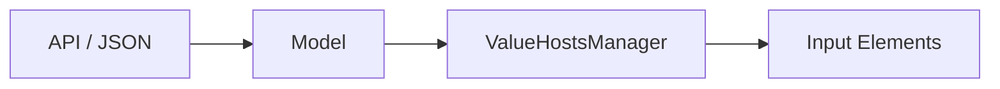
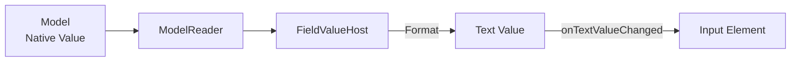
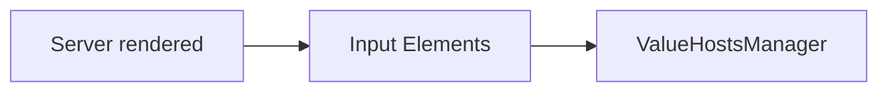
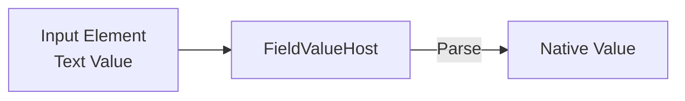
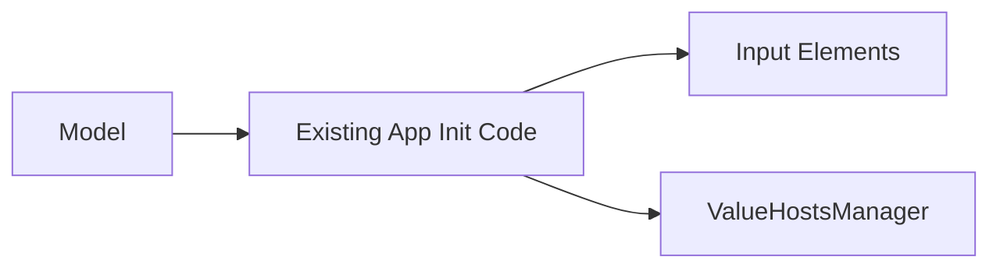

# Initializing the Client Form

Before editing begins, the UI and the `ValueHostsManager` need to start with the same values.

Where those values enter Jivs depends on how the application already initializes the form. The important rule is simple:

**Initialize Jivs from the point where the application's initial values are already available.**

Three common initialization flows are shown below. None is more correct than the others. Jivs should fit into the application's existing initialization approach rather than require that approach to be replaced.

## API / JSON Initialization



When data arrives from an API as JSON, the application deserializes it into a Model containing Native Values. Those values can initialize the `ValueHostsManager` before the user begins editing.

When Jivs formatting is used to initialize the inputs, first connect the `onTextValueChanged` callback introduced in [Using the ValueHostsManager within the Client](Using_the_ValueHostsManager_within_the_Client.md):

```ts
const services = createJivsServices('en-US');
const rules = new PersonFormRules(services);
const config = rules.configure();

config.onTextValueChanged = onTextValueChanged;

const vhm = new ValueHostsManager(config);
```

Now `ModelReader` can copy the Model properties into their corresponding `FieldValueHosts`:

```ts
const reader = new ModelReader(vhm, person);
reader.readFromModel();
```

`ModelReader` uses the Model property name configured for each `FieldValueHost`. By default, that property name is the name supplied to `builder.field()`.

When the `FieldValueHost` name and Model property name differ, set `propertyName` while configuring the field:

```ts
builder.field('FirstName', LookupKey.String, {
    propertyName: 'firstName'
});
```

Now `ModelReader` knows that the `FirstName` ValueHost gets its initial Native Value from `person.firstName`.

The same mapping is later used in the opposite direction by `ModelWriter` when building a Model for submission.

Each `FieldValueHost` now has its initial Native Value. When Jivs formatting is configured, setting that value also produces the Text Value used by the input element.

The `onTextValueChanged` callback can place that Text Value into the associated input.



`ModelReader` is convenient when initializing a group of fields from a Model. An individual Native Value can also be supplied directly:

```ts
vhm.vh('FirstName').setValue(person.firstName, {
    validate: false,
    reset: true
});
```

Both approaches establish the same starting point: Jivs receives the Native Values from the Model, and its Text Values can initialize the inputs.

## Server-Rendered Initialization



With server-rendered HTML, the input elements already contain their initial Text Values when the client-side code begins. Instead of recreating those values from a Model, initialize Jivs from the inputs.

For example:

```html
<input type="text" id="FirstName" value="Maria">
<input type="text" id="LastName" value="Santos">
```

After creating the `ValueHostsManager`, read each input and supply its Text Value to the corresponding `FieldValueHost`:

```ts
const firstNameInput =
    document.getElementById('FirstName') as HTMLInputElement;
const lastNameInput =
    document.getElementById('LastName') as HTMLInputElement;

vhm.vh('FirstName').setTextValue(firstNameInput.value, {
    validate: false,
    reset: true
});

vhm.vh('LastName').setTextValue(lastNameInput.value, {
    validate: false,
    reset: true
});
```

`setTextValue()` gives Jivs the value already displayed by the input. When a parser is configured, Jivs also establishes the corresponding Native Value.



### Using ElementIdentifier

For a larger form, assigning each field individually becomes repetitive. If the `FieldValueHosts` have ElementIdentifiers, application code can enumerate them and locate their corresponding inputs.

```ts
const valueHosts = vhm.enumerateValueHosts(
    (valueHost) => valueHost instanceof FieldValueHost
);

for (const vh of valueHosts) {
    const valueHost = vh as IFieldValueHost;
    const element = getElement(valueHost);
    // getElement() was defined in the previous document.

    if (element instanceof HTMLInputElement) {
        valueHost.setTextValue(element.value, {
            validate: false,
            reset: true
        });
    }
}
```

This uses the same `ElementIdentifier` relationship introduced in [Using the ValueHostsManager within the Client](Using_the_ValueHostsManager_within_the_Client.md), but in the opposite direction: instead of finding an input after Jivs reports a change, initialization finds each input so its existing value can be supplied to Jivs.

## Existing Application Initialization



An application may already have initialization code that takes Model values and supplies them to its inputs. Jivs does not require replacing that code.

Instead, include the corresponding `FieldValueHost` when the application initializes each input, and supply the same initial Text Value to Jivs.

For example, an application component that creates an input might already receive its identifier and initial Text Value. It can also receive the `FieldValueHost` associated with that input:

```ts
function createTextInput(
    id: string,
    initialValue: string,
    valueHost: IFieldValueHost
): HTMLInputElement {
    const input = document.createElement('input');
    input.type = 'text';
    input.id = id;
    input.value = initialValue;

    valueHost.setTextValue(initialValue, {
        validate: false,
        reset: true
    });
    valueHost.setElementIdentifier(id);

    return input;
}
```

The component already has the input, its initial Text Value, and the `FieldValueHost`, so it can initialize both sides and establish their ElementIdentifier relationship at the same time.

The important point is to preserve the existing initialization flow and make Jivs another destination for the values already moving through it.

## Ready for Editing

Regardless of the initialization flow, the goal is the same: the input elements contain their starting Text Values, and the `ValueHostsManager` has the corresponding values it needs for validation.

From this point, the connections established in [Using the ValueHostsManager within the Client](Using_the_ValueHostsManager_within_the_Client.md) handle values and validation as the user edits the form.

---

Next, learn how to [submit the client form](Submitting_the_Client_Form.md).
