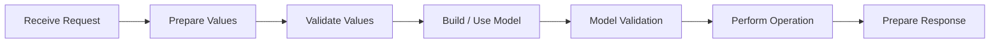
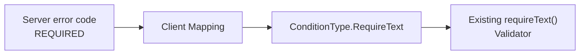

# Integrating Non-Jivs Server Validation

The server does not need to use Jivs for the client to benefit from Jivs validation.

Keep the server's existing validation system, business logic, request handling, and response contract. The client-side integration translates the server's validation results into the form Jivs needs.

This follows the same architecture introduced in [Understanding Server-Side Validation](Understanding_Server_Side_Validation.md).

## The Server-Side Process

A non-Jivs server follows the same processing stages:



The technologies and APIs used for each stage are application-owned.

## Prepare Values

Prepare incoming values in whatever way the server technology and existing application require.

For example:

- JSON values may already be deserialized into useful native types;
- form posts may provide strings that require parsing or conversion;
- existing application code may already perform mapping or normalization.

Unlike Jivs with `FormReader`, a non-Jivs server normally performs parsing through its own request-processing or validation code.

Parsing failures are validation issues. Add them to the same validation results returned for other rejected input rather than treating them as operational server failures.

## Validate Values

Use the server's existing validation system to validate the prepared values.

For example, it might detect:

- missing required values;
- invalid formats;
- values outside an allowed range;
- failed conversions or parsing.

There is no requirement to reproduce Jivs rules or Jivs terminology on the server.

The server remains responsible for independently validating incoming data even when the client has already performed similar validation.

## Build / Use the Model

Once the incoming values are usable, build or populate the application's Model using its existing code.

The Model does not need to resemble the client's ValueHosts. Field names, datatypes, and internal structure remain application-owned.

## Model Validation

Run the application's broader business validation against the completed Model.

Typical examples include:

- rules involving several Model properties;
- checking whether an operation is allowed for the current state;
- checking whether a username, email address, or other value is already in use;
- other business rules that require information beyond individual input values.

Add these issues to the server's normal validation error collection.

## Perform the Operation

When validation succeeds, perform the requested operation using the application's existing business and persistence code.

The operation can still produce:

- success;
- an additional validation issue, such as a data constraint discovered while saving;
- an operational failure.

Validation issues belong in the validation response. Operational failures, such as a database connection failure or unavailable service, follow the application's normal error-handling path.

## Prepare the Response

Keep the server's existing validation response format.

For example, an application might already return:

```json
{
    "validationErrors": [
        {
            "field": "first_name",
            "code": "REQUIRED",
            "message": "First name is required."
        }
    ]
}
```

There is no need to rename these properties or replace the server's error codes with Jivs values.

As described in [Error Messages, Error Codes, and Field Names](Understanding_Server_Side_Validation.md#error-messages-error-codes-and-field-names), stable error codes and field identifiers make the response much easier for the client to integrate.

Published APIs should preserve their established contracts. Change the server response only when the existing contract does not provide enough information for the caller to understand and associate validation issues.

## Adapt Server Validation to Jivs on the Client

The client-side integration converts the server's validation errors into Jivs `IssueFound` objects.

Suppose the server uses this application-defined type:

```ts
interface ServerValidationError {
    message: string;
    code?: string;
    field?: string;
}
```

The adapter can translate it into Jivs:

```ts
function convertToIssueFound(
    errors: ServerValidationError[]
): IssueFound[] {
    return errors.map(error => ({
        errorMessage: error.message,
        errorCode: mapErrorCode(error.code),
        valueHostName: mapFieldName(error.field)
    }));
}
```

`convertToIssueFound()` is application code. It is the integration boundary between the server's validation contract and Jivs.

### Map Error Codes

The server should continue using its own stable error codes.

The client maps those codes to Jivs values when a useful equivalent exists:

```ts
function mapErrorCode(
    errorCode?: string
): string | undefined {
    switch (errorCode) {
        case 'REQUIRED':
            return ConditionType.RequireText;

        case 'TOO_LONG':
            return ConditionType.StringLength;

        default:
            return errorCode;
    }
}
```

For example:



When the mapped error code matches a validator on the destination ValueHost, Jivs can activate that validator as though the validation issue had been found on the client. Jivs can then use its configured error message, including localization, instead of relying on the server's message.

If there is no useful mapping, keep the server's error code or omit it. The server's `message` still provides the required `IssueFound.errorMessage`.

### Map Field Names

The server can also keep its existing field names.

Map them to the ValueHostNames used by the client:

```ts
function mapFieldName(
    fieldName?: string
): string | undefined {
    switch (fieldName) {
        case 'first_name':
            return 'FirstName';

        case 'last_name':
            return 'LastName';

        default:
            return undefined;
    }
}
```

The mapped `valueHostName` tells Jivs where the issue belongs and allows it to appear with the correct ValueHost's error display.

When both the mapped `valueHostName` and `errorCode` identify a validator on that ValueHost, Jivs can restore the issue directly into that validator's state.

## Add the Issues to Jivs

After converting the server errors, add them to the client's `ValueHostsManager`:

```ts
const issuesFound = convertToIssueFound(
    response.validationErrors
);

vhm.addExternalIssuesFound(issuesFound, false);
```

The `false` argument allows these imported issues to be cleared by the next client-side validation attempt.

The client does not need the server to understand Jivs. It only needs an adapter that translates the server's validation contract into `IssueFound`.

## Putting the Client Integration Together

A typical response-handling path looks like this:

```ts
function handleServerValidation(
    response: SavePersonResponse,
    vhm: ValueHostsManager
): boolean {
    if (
        !response.validationErrors ||
        response.validationErrors.length === 0
    ) {
        return false;
    }

    const issuesFound = convertToIssueFound(
        response.validationErrors
    );

    vhm.addExternalIssuesFound(issuesFound, false);
    return true;
}
```

Returning `true` means validation issues were found and handled, so submission processing should stop. Returning `false` means there were no server validation issues.

The complete client submission flow is covered in [Submitting the Client Form](Submitting_the_Client_Form.md).

---

For the common server-side architecture behind both approaches, return to [Understanding Server-Side Validation](Understanding_Server_Side_Validation.md).