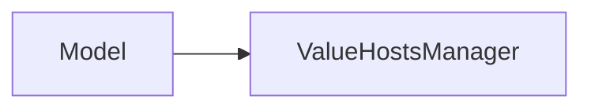
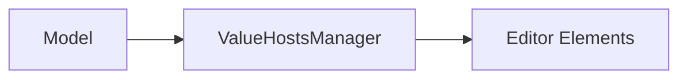
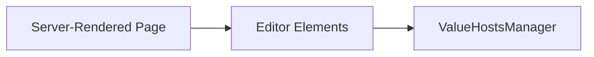
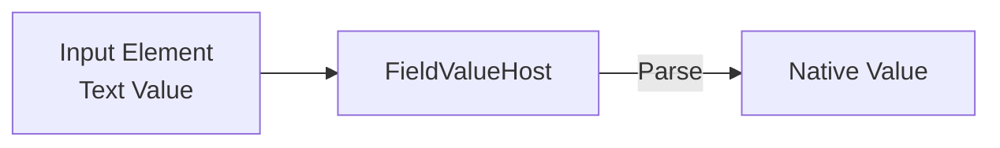
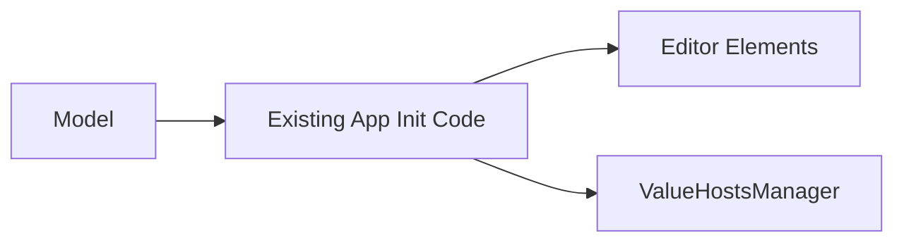

# Initializing the Client Form

Before editing begins, the UI and the `ValueHostsManager` need to start with the same values.

Where those values enter Jivs depends on how the application already initializes the form. The important rule is simple:

**Initialize Jivs from the point where the application's initial values are already available.**

Three common initialization flows are shown below. None is more correct than the others. Jivs should fit into the application's existing initialization approach rather than require that approach to be replaced.

- **Getting values from a Model.** Supply Native Values to Jivs through `ModelReader` or `setValue()`. The Model may be embedded in the page or retrieved from an API.
- **Getting values already embedded in HTML.** Read the Text Values placed into controls by the server and supply them to Jivs through `setTextValue()`.
- **Getting values from existing application initialization code.** Extend code that already distributes initial values so it supplies the same values to Jivs.

The examples assume that the application has configured its Rules. Each approach begins by creating the `ValueHostsManager` with the familiar pattern:

```ts
const services = createJivsServices('en-US');
const rules = new SomeRulesObject(services);
const config = rules.configure();

// Assign any callbacks required by the initialization flow.

const vhm = new ValueHostsManager(config);
```

For more, see [Intro to Creating a ValueHostsManager](Intro_to_Creating_a_ValueHostsManager.md).

## Getting Values from a Model



### Get the Model

The Model may be embedded in the page or retrieved from an API as JSON. In either case, the application makes a Model containing Native Values available to the client.

### Use ModelReader to Transfer Values

The `ModelReader` supplied by Jivs makes quick work of transferring values from a Model into the `ValueHostsManager`. It uses each `FieldValueHost` configuration to map Model properties and adapt incoming values.

```ts
const reader = new ModelReader(vhm, person);
reader.readFromModel();
```

`ModelReader` uses the Model property name configured for each `FieldValueHost`. By default, that name is the same as the `FieldValueHost` name. When they differ, set `propertyName` while configuring the field:

```ts
builder.field('FirstName', LookupKey.String, {
    propertyName: 'firstName',
    modelReaderRule: {
        when: 'null',
        then: 'emptystring'
    }
});
```

`ModelReader` now knows that the `FieldValueHost` named `FirstName` receives its initial Native Value from `person.firstName`. The `modelReaderRule` configuration also converts a `null` value to an empty string.

The same `propertyName` mapping is later used by `ModelWriter` when building a Model for submission.

### Use FieldValueHost.setValue() Instead of ModelReader

To initialize selected fields individually, skip `ModelReader` and call `setValue()` on each `FieldValueHost`:

```ts
vhm.vh.field('FirstName').setValue(person.firstName, {
    validate: false,
    reset: true
});
```

### Wire Up the onTextValueChanged Callback

After initialization, each `FieldValueHost` has a Text Value in addition to its Native Value. If your editor elements need their values set, wire up the `onTextValueChanged` callback of the `ValueHostsManager`.

Configure this callback before creating the `ValueHostsManager` and initializing its values.



See [Using the ValueHostsManager within the Client](Using_the_ValueHostsManager_within_the_Client.md) for guidance on creating the function and assigning it to the `ValueHostsManager` configuration.

## Getting Values Already Embedded in HTML



Server-rendered pages commonly arrive in the browser with their initial Text Values already embedded in `input`, `select`, and `textarea` elements. Instead of recreating those values from a Model, initialize Jivs from the elements.

For example:

```html
<input type="text" id="FirstName" value="Maria">
<input type="text" id="LastName" value="Santos">
```

After creating the `ValueHostsManager`, read each input and supply its Text Value to the corresponding `FieldValueHost`:

```ts
const firstNameInput =
    document.getElementById('FirstName') as HTMLInputElement;
const lastNameInput =
    document.getElementById('LastName') as HTMLInputElement;

vhm.vh.field('FirstName').setTextValue(firstNameInput.value, {
    validate: false,
    reset: true
});

vhm.vh.field('LastName').setTextValue(lastNameInput.value, {
    validate: false,
    reset: true
});
```

`setTextValue()` gives Jivs the value already displayed by the input. When a parser is configured, Jivs also establishes the corresponding Native Value.



### Scraping the Entire Form

For a larger form, initializing each field individually becomes repetitive. If the `FieldValueHost` instances have **Element Identifiers**, application code can enumerate them and locate their corresponding elements. See [Finding the UI Element for a FieldValueHost](Using_the_ValueHostsManager_within_the_Client.md#finding-the-ui-element-for-a-fieldvaluehost).

```ts
const valueHosts = vhm.enumerateValueHosts(
    (valueHost) => valueHost instanceof FieldValueHost
);

for (const vh of valueHosts) {
    const valueHost = vh as FieldValueHost;
    const element = getElement(valueHost);
    // getElement() was defined in the previous document.

    if (
        element instanceof HTMLInputElement ||
        element instanceof HTMLSelectElement ||
        element instanceof HTMLTextAreaElement
    ) {
        valueHost.setTextValue(element.value, {
            validate: false,
            reset: true
        });
    }
}
```

## Getting Values from Existing Application Initialization Code



An application may already have initialization code that takes Model values and supplies them to its editors. Jivs does not require replacing that code.

Instead, include the corresponding `FieldValueHost` when the application initializes each editor, and supply the same initial Text Value to Jivs.

For example, an application component that creates an input might already receive its identifier and initial Text Value. It can also receive the `FieldValueHost` associated with that input:

```ts
function createTextInput(
    id: string,
    initialValue: string,
    valueHost: IFieldValueHost
): HTMLInputElement {
    const input = document.createElement('input');
    input.type = 'text';
    input.id = id;
    input.value = initialValue;

    valueHost.setTextValue(initialValue, {
        validate: false,
        reset: true
    });
    valueHost.setElementIdentifier(id);

    return input;
}
```

The component already has the input, its initial Text Value, and the `FieldValueHost`, so it can initialize both sides and establish their ElementIdentifier relationship at the same time.

The important point is to preserve the existing initialization flow and make Jivs another destination for the values already moving through it.

## Ready for Editing

Regardless of the initialization flow, the goal is the same: the editors contain their starting Text Values, and the `ValueHostsManager` contains the corresponding values needed for validation.

From this point, the connections established in [Using the ValueHostsManager within the Client](Using_the_ValueHostsManager_within_the_Client.md) handle values and validation as the user edits the form.

---

Next, learn how to [submit the client form](Submitting_the_Client_Form.md).

Return to [Learning Jivs TOC](./Learning_Jivs_Home.md).
