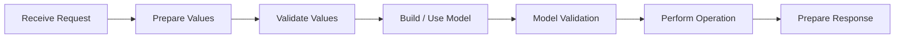

# Integrating Non-Jivs Server Validation

The server does not need to use Jivs for the client to benefit from Jivs validation.

Keep the server's existing validation system, business logic, request handling, and response contract. The client-side integration can translate the server's validation results into the information Jivs needs.

This follows the same architecture introduced in [Understanding Server-Side Validation](Understanding_Server_Side_Validation.md).

## The Server-Side Process

A non-Jivs server follows the same processing stages:



The technologies and APIs used for each stage remain application-owned.

## Prepare Values

Prepare incoming values in whatever way the server technology and existing application require.

For example:

- JSON values may already be deserialized into useful native types;
- form posts may provide strings that require parsing or conversion;
- existing application code may already perform mapping, conversion, or normalization.

A non-Jivs server normally performs parsing through its own request-processing or validation code.

Parsing failures are validation issues. Include them with the other validation results rather than treating them as operational server failures.

## Validate Values

Use the server's existing validation system to validate the prepared values.

For example, it might detect:

- missing required values;
- invalid formats;
- values outside an allowed range;
- failed conversions or parsing.

There is no requirement to reproduce Jivs rules or Jivs terminology on the server.

The server remains responsible for independently validating incoming data even when the client has already performed similar validation.

## Build / Use the Model

Once the incoming values are usable, build or populate the application's Model using its existing code.

The Model does not need to resemble the client's ValueHosts. Property names, datatypes, and internal structure remain application-owned.

## Model Validation

Run the application's broader business validation against the completed Model.

Common examples include:

- checking relationships across several Model properties;
- determining whether an operation is allowed for the current state;
- checking whether a username, email address, or other value is already in use;
- applying other business rules that require the completed Model or additional application data.

Gather these problems into the server's normal validation error collection.

## Perform the Operation

When validation succeeds, perform the requested operation using the application's existing business and persistence code.

The operation can still produce:

- success;
- an additional validation issue, such as a data constraint discovered while saving;
- an operational failure.

Validation issues belong in the validation response. Operational failures, such as a database connection failure or unavailable service, follow the application's normal error-handling path.

## Prepare the Response

Keep the server's existing validation response format.

For example:

```json
{
    "validationErrors": [
        {
            "field": "first_name",
            "code": "REQUIRED",
            "message": "First name is required."
        }
    ]
}
```

There is no need to rename these properties, replace the server's field names, or adopt Jivs error codes.

As described in [Error Messages, Error Codes, and Field Names](Understanding_Server_Side_Validation.md#error-messages-error-codes-and-field-names), a useful validation response should provide enough information for the client to understand the issue and, when available, identify what kind of issue occurred and where it belongs.

In particular:

- a **message** communicates what was rejected;
- a stable **error code** gives the client something it can map to a corresponding Jivs error code or `ConditionType`;
- a stable **field name** gives the client something it can map to the appropriate `ValueHostName`.

The server can continue using its own names and codes. The client performs the mapping when integrating the response with Jivs.

Published APIs should preserve their established contracts. Change the server response only when the existing contract does not provide enough validation information for the caller to understand and associate what was rejected.

## What Happens on the Client

The server does not need to translate its validation results into Jivs.

When the response reaches the client, application code converts the server's validation errors into Jivs `IssueFound` objects. That client-side integration can:

- use the server message as the `errorMessage`;
- map the server error code to a Jivs `errorCode` or `ConditionType`;
- map the server field name to a `ValueHostName`.

When both mappings identify a validator on the destination ValueHost, Jivs can restore the issue through that validator as though the validation problem had been found on the client.

The complete mapping and integration code is covered in [When the Server Uses Another Validation System](Submitting_the_Client_Form.md#when-the-server-uses-another-validation-system).

---

For the common server-side architecture behind both server approaches, return to [Understanding Server-Side Validation](Understanding_Server_Side_Validation.md).

Return to [Learning Jivs TOC](./Home.md).