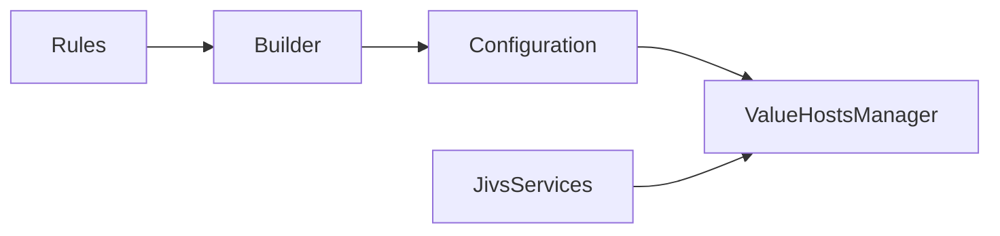

# Intro to Creating a ValueHostsManager

A `ValueHostsManager` needs to know which `ValueHosts` it contains, their data types, their validation rules, and other information that affects their behavior.

Jivs describes all of that through configuration. Jivs provides the **Builder API** to make the configuration readable and maintainable.

At a high level, creating a `ValueHostsManager` looks like this:



The rules describe the `ValueHosts` using Jivs' **Builder API**. The Builder turns those descriptions into the configuration used to create the `ValueHostsManager`. You'll see the Builder throughout this document.

`JivsServices` is required along the way. It provides the shared services used by the rules, the `ValueHostsManager`, and its `ValueHosts`.

## The Creation Pattern

Expect to write this code each time you need a `ValueHostsManager`:

```ts
const services = createJivsServices('en-US');
const rules = new YourRulesClass(services);
const config = rules.configure();

const vhm = new ValueHostsManager(config);
```

There are four steps:

1. Create the required `JivsServices`.
2. Create a rules class that describes the `ValueHosts`.
3. Call `configure()` to build the configuration.
4. Create the `ValueHostsManager` from that configuration.

There will often be application-specific work between `configure()` and creating the `ValueHostsManager`. We'll get to that later.

## Defining ValueHosts with a Rules Class

The configuration starts with a **ValueHost Rules class**. ValueHost Rules describe the `ValueHosts` that will be created and the validation rules that apply to them.

* **Separation of concerns.** Validation rules are defined outside the UI that consumes them. For model-driven forms, that lets the rules live with the business logic and be reused by the client. For form-only scenarios, the rules can still remain separate from the form code itself.
* **Testability.** Because the rules class has no dependency on the UI, it can be tested independently.

ValueHost Rules classes derive from `ValueHostRulesBase`. Jivs supplies a Builder object to the class so it can define each `ValueHost` and its configuration.

For example:

```ts
export class SearchFormRules extends ValueHostRulesBase {
    protected override configureRules(
        builder: IValueHostsManagerConfigBuilder,
        options?: ValueHostRulesOptions
    ): void {
        builder.field('SearchText', LookupKey.String)
            .requireText()
            .stringLength(100);
    }
}
```

`builder.field()` defines a `FieldValueHost`. Here it gives the field a unique name, `SearchText`, and identifies its data type as `String`.

The calls that follow add validation rules. This search value is required and can contain no more than 100 characters.

The Builder API can configure considerably more than this. For now, the important point is that **configuration describes what the ValueHostsManager will contain and how those ValueHosts should behave**.

See the [ValueHostsManager Configuration Guide](../ValueHostsManager_Configuration_Guide.md) when you need the available configuration options.

## Example: Starting with Rules from a Model

When validation rules belong to the business logic, those rules should remain the **single source of truth**. A form can reuse them rather than create and maintain an independent definition.

Suppose the application works with a `Person` Model:

```ts
export class Person {
    firstName?: string;
    lastName?: string;
    birthDate?: Date | null;
    prefix?: string;
    suffix?: string;
}
```

Its validation rules can be defined independently of any particular UI:

```ts
export class PersonModelRules extends ValueHostRulesBase {
    protected override configureRules(
        builder: IValueHostsManagerConfigBuilder,
        options?: ValueHostRulesOptions
    ): void {
        builder.field('FirstName', LookupKey.String)
            .requireText()
            .stringLength(50);

        builder.field('LastName', LookupKey.String)
            .requireText()
            .stringLength(50);

        builder.field('BirthDate', LookupKey.Date)
            .notNull();

        builder.field('Prefix', LookupKey.String);
        builder.field('Suffix', LookupKey.String);
    }
}
```

The form does not need to redefine those business rules. Instead, it can derive its rules from `PersonModelRules` and implement `IAdaptModelRulesToForm`.

The adapter lets the form reuse those business logic validation rules in the UI while making the UI-specific changes the form needs.

```ts
export class PersonFormRules
    extends PersonModelRules
    implements IAdaptModelRulesToForm
{
    public adaptToForm(
        adapter: IFormConfigAdapter,
        options?: ValueHostRulesOptions
    ): void {
        adapter.useOnlyTheseModelFields(['FirstName', 'LastName']);

        adapter.modify('FirstName', { label: 'First name' })
            .validator(
                ConditionType.StringLength,
                'No more than {maximum} characters. You entered {length}.'
            );

        adapter.modify('LastName', { label: 'Last name' })
            .validator(ConditionType.StringLength, {
                errorMessage:
                    'No more than {maximum} characters. You entered {length}.'
            });
    }
}
```

For example, this form might only edit the person's first and last names:

```html
<form>
    <label for="FirstName">First name</label>
    <input type="text" id="FirstName" name="FirstName">

    <label for="LastName">Last name</label>
    <input type="text" id="LastName" name="LastName">

    <button type="submit">Save</button>
</form>
```

Creating its `ValueHostsManager` uses the same pattern:

```ts
const services = createJivsServices('en-US');
const rules = new PersonFormRules(services);
const config = rules.configure();

const vhm = new ValueHostsManager(config);
```

At this point, the `ValueHostsManager` contains the `ValueHosts` and validation rules needed by this form. Nothing has been connected to the HTML yet.

## Example: A Search Form

Not every form represents a business Model. Sometimes the values exist only because the form needs them.

Consider a small search form:

```html
<form>
    <label for="SearchText">Search</label>
    <input type="search" id="SearchText" name="SearchText">
    <button type="submit">Search</button>
</form>
```

Its rules can belong directly to the form:

```ts
export class SearchFormRules extends ValueHostRulesBase {
    protected override configureRules(
        builder: IValueHostsManagerConfigBuilder,
        options?: ValueHostRulesOptions
    ): void {
        builder.field('SearchText', LookupKey.String)
            .requireText()
            .stringLength(100);
    }
}
```

Now use the standard creation pattern:

```ts
const services = createJivsServices('en-US');
const rules = new SearchFormRules(services);
const config = rules.configure();

const vhm = new ValueHostsManager(config);
```

The resulting `ValueHostsManager` contains a `FieldValueHost` named `SearchText` with the data type and validation rules defined by `SearchFormRules`.

Nothing has been connected to the HTML yet. At this point, we have only created the validation system the form will use.

The two examples arrive at the same place from different directions:

* `PersonFormRules` starts with validation rules owned by the business logic and adapts them to a particular form.
* `SearchFormRules` defines values and validation rules that exist specifically for the form.

In both cases, the result is a configured `ValueHostsManager` ready for values and validation.

---

Now let's [use the ValueHostsManager within the Client](Using_the_ValueHostsManager_within_the_Client.md).

Return to [Learning Jivs TOC](./Home.md).