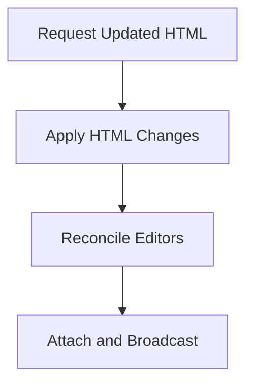

# Server Pages Workflow: Elements Changed

An AJAX operation can return HTML that adds, removes, or revises elements without reloading the page. The returned HTML may change a small part of the form or replace the complete form.

Configure the `ValueHostsManager` through Rules with *every field* that may appear. As part of this workflow, application code enables or disables each relevant `FieldValueHost` based on whether its editor is present in the resulting HTML.

The existing `ValueHostsManager` remains active throughout this process. After applying the returned HTML, reconcile that manager with the editors now present in the page.

> Ensure that your `ValueHostsManager` instance is retained during the AJAX operation.

For a complete page reload that reconstructs the `ValueHostsManager`, see [Server Pages Workflow: Round Trip](Server_pages_workflow_round_trip.md).

This workflow has four stages:

1. Request the updated HTML from the server.
2. Apply the returned HTML to the page.
3. Reconcile the existing `ValueHostsManager` with the resulting editors.
4. Attach handlers and broadcast the current state.



The important rule is:

> Keep the existing `ValueHostsManager`. After changing the page's elements, reconcile the ValueHosts associated with the changed region, attach handlers to newly created elements, and broadcast the resulting state.

## Request the Updated HTML

Use the application's normal AJAX mechanism to request the server operation. The request can contain the editor values or other application data needed by the server.

The server performs the requested operation and returns the HTML needed to update the page.

The returned HTML may:

- retain the same editors
- replace existing editors with new elements
- add editors
- remove editors
- supply initial Text Values for new or replaced editors
- include Field Error Displays, Required Indicators, and other presentation elements; however, they get their content and presentation from Jivs on the client side

Operational failures should use the application's normal AJAX error handling. Do not change the page or reconcile the `ValueHostsManager` when the request fails.

## Apply the Returned HTML

Apply the successful response using the application's normal DOM integration code:

```ts
const html = await requestUpdatedHtml();

applyReturnedHtml(html);
```

`requestUpdatedHtml()` and `applyReturnedHtml()` represent application-specific AJAX and DOM operations. The Jivs workflow begins after the returned HTML has been applied completely.

The existing `ValueHostsManager` instance must remain available.

## Reconcile the Current Editors

After applying the HTML, use the `reconcileValueHostsWithEditors()` helper described in [Add the Editor Reconciliation Helpers](Using_Jivs_with_Server_Generated_Pages.md#add-the-editor-reconciliation-helpers). Its options depend on the use case:

- When the entire group should be treated as new values, use `skipIfUnchanged: false`. This is often appropriate for a refresh or revert operation.

  ```ts
  reconcileValueHostsWithEditors(vhm, {
      skipIfUnchanged: false
  });
  ```

- When only changed values should be reset, use `skipIfUnchanged: true`. Matching Text Values retain their current state.

  ```ts
  reconcileValueHostsWithEditors(vhm, {
      skipIfUnchanged: true
  });
  ```

- When AJAX replaces only a subset of the editors, pass the names of every ValueHost that may appear in that region, *including those whose editors may have been removed*. ValueHosts outside that scope remain untouched.

  ```ts
  const accountSectionValueHostNames = [
      'AccountType',
      'BusinessName',
      'TaxIdentifier'
  ];

  reconcileValueHostsWithEditors(vhm, {
      valueHostNames: accountSectionValueHostNames,
      skipIfUnchanged: true // Use false for a refresh or revert.
  });
  ```

## Attach Handlers and Broadcast the Current State

Attach the editor and presentation handlers after reconciliation:

```ts
attachEditorEventHandlers(vhm);
attachPresentationHandlers(vhm);

vhm.broadcastState();
```

The attachment helpers should be idempotent. Existing elements retain their handlers, while newly created elements receive the handlers they need.

`broadcastState()` then distributes the current Text Values and validation state through the configured callbacks. This initializes the editors and validation presentation introduced by the AJAX response.

---

Return to [Using Jivs with Server-Generated Pages](Using_Jivs_with_server_generated_pages.md).

Return to [Learning Jivs](../Learning_Jivs_Home.md).
