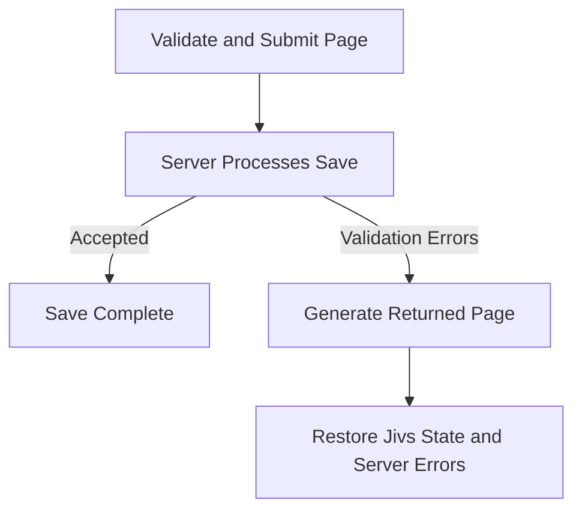

# Server Pages Workflow: Page Save

A Page Save starts when the user attempts to submit the page. At this point, the `ValueHostsManager` contains the values supplied by the editors and can perform form-level validation.

Successful client validation and submission do not complete the save. The server must also validate the submitted data. When server validation prevents the save, the server returns the errors through a regenerated page.

> Traditional server-generated pages often inject validation messages directly into their output. With Jivs, the server places the validation information in a hidden input and generates the HTML elements that will present it. After the page reloads, client-side Jivs supplies the validation information to the Field Error Displays, Validation Summary, and other presentation elements.

This document focuses on the client workflow and the information the regenerated page must provide. For the server validation process, see [Understanding Server-Side Validation](../Understanding_Server_Side_Validation.md).

This workflow has two distinct stages:

1. **Validate and submit the current page.** Validate the `ValueHostsManager`, save its state, and submit the page to the server.
2. **Reconstruct and restore the returned page with server validation errors.** Generate the page for the submitted state, create a new `ValueHostsManager` from that state, and apply the server validation errors.



The important rule for the returned page is:

**Restore the `ValueHostsManager` from its submitted saved state. Do not replace its values with values from the regenerated page’s editors.**

The saved state retains the values and Jivs state that existed when the user submitted the form.

## Validate and Submit the Current Page

This process begins with the client-side validation described in [Submitting the Client Form](../Submitting_the_Client_Form.md). The application then performs a normal server-page submission instead of making an API request.

Call `ValueHostsManager.validate()` and stop when the resulting `ValidationState` prevents saving:

```ts
const validationState = vhm.validate();

if (validationState.doNotSave) {
    return;
}
```

See [Validate the Form](../Submitting_the_Client_Form.md#validate-the-form).

> When validation prevents saving, the existing validation callbacks update the presentation.

After client validation succeeds, place the current saved state into the form’s state transport element.

The page’s HTML contains this hidden input:

```html
<input type="hidden" id="_jivsCapturedState" name="_jivsCapturedState">
```

Populate it immediately before submitting the form:

```ts
const capturedStateInput =
    document.getElementById('_jivsCapturedState') as HTMLInputElement;

capturedStateInput.value = vhm.getCapturedState();
```

`getCapturedState()` returns an opaque string. Application code should submit and return that string without inspecting or modifying its contents.

> The request contains the form’s application fields along with Jivs transport data. The `_jivs` prefix makes the transport fields easy for server code to recognize and exclude from normal application processing.

The application can then submit the form through its normal server-page mechanism.

## Process the Save on the Server

The server has its own validation and save responsibilities, as described in [Understanding Server-Side Validation](../Understanding_Server_Side_Validation.md).

The request body contains the application’s form data and the Jivs saved state. Use the form data for validation and the save operation. The saved state is client restoration data that the server returns unchanged when validation prevents the save.

The result falls into one of three categories:

- When the save succeeds, continue with the application’s normal success behavior.
- When an operational failure occurs, use the application’s normal error handling.
- When validation prevents the save, regenerate the page so the user can correct the submitted values.

### Server Validation Prevented the Save

Regenerate the page with three things:

1. **The client restoration setup.** Generate client code that restores the `ValueHostsManager` using saved state. It also retrieves the server validation errors and supplies them to `handleServerIssues()`.
2. **The submitted Jivs saved state.** Return the same opaque string sent by the client. Populate the page’s existing `_jivsCapturedState` input with that value.
3. **The server validation errors.** Place the validation information in the page’s `_jivsServerIssues` input.

The regenerated inputs will resemble this:

```html
<input type="hidden" id="_jivsCapturedState" name="_jivsCapturedState"
    value="[HTML-attribute-encoded saved state]">

<input type="hidden" id="_jivsServerIssues"
    value="[HTML-attribute-encoded server issues]">
```

The value of `_jivsServerIssues` depends on the server:

- A server using Jivs supplies a Jivs Validation Payload.
- A server using another validation system supplies its serialized validation errors.

The restoration code is otherwise the same:

```ts
const capturedStateInput =
    document.getElementById('_jivsCapturedState') as HTMLInputElement;

const serverIssuesInput =
    document.getElementById('_jivsServerIssues') as HTMLInputElement;

const services = createJivsServices('en-US');
const rules = new PersonFormRules(services);
const config = rules.configure();

config.capturedState = capturedStateInput.value;

config.onTextValueChanged = onTextValueChanged; // optional
config.onValueHostValidationStateChanged = fieldValidated;
config.onValidationStateChanged = formValidated;

const vhm = new ValueHostsManager(config);

attachEditorEventHandlers(vhm);
attachPresentationHandlers(vhm);

handleServerIssues(serverIssuesInput.value, vhm);
```

> This restoration path does not call `reconcileValueHostsWithEditors()`. The submitted saved state restores the `ValueHostsManager` values.

`handleServerIssues()` interprets the transported string and provides the validation issues to Jivs. Its implementation depends on the server:

- When the server uses Jivs, it passes the Validation Payload to `vhm.fromValidationPayload()`. See [When the Server Uses Jivs](../Submitting_the_Client_Form.md#when-the-server-uses-jivs).
- When the server uses another validation system, it deserializes and converts the errors before calling `vhm.addExternalIssuesFound()`. See [When the Server Uses Another Validation System](../Submitting_the_Client_Form.md#when-the-server-uses-another-validation-system).

The returned page follows this order:

1. Restore the `ValueHostsManager` from the submitted saved state.
2. Attach the editor and presentation handlers.
3. Apply the server validation errors.

Applying the errors last allows the validation callbacks to update the restored page’s Field Error Displays, Validation Summary, and other validation presentation.

---

For a server-generated page that preserves Jivs state without attempting a save, continue to [Server Pages Workflow: Round Trip](Server_pages_workflow_round_trip.md).

Return to [Learning Jivs](../Home.md).
