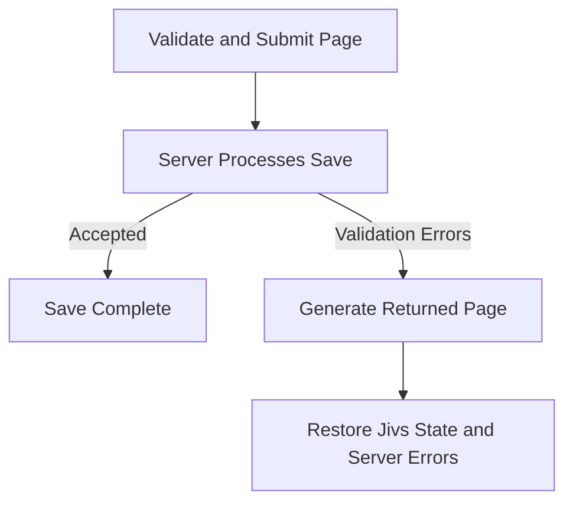

# Server Pages Workflow: Page Save

A Page Save starts when the user attempts to submit the page. At this point, the `ValueHostsManager` contains the values supplied by the editors and can perform form-level validation.

Successful client validation and submission do not complete the save. The server must also validate the submitted data and may reject it. When that happens, the server returns the errors through a regenerated page.

> Traditional server-generated pages often inject validation messages directly into their output. With Jivs, the server injects the validation information and the HTML elements that will present it. After the page reloads, client-side Jivs supplies the messages to the Field Error Displays, Validation Summary, and other presentation elements.

This document focuses on the client workflow and the information the regenerated page must provide. For the server validation process, see [Understanding Server-Side Validation](Understanding_Server_Side_Validation.md).

This workflow has two distinct stages:

1. **Validate and submit the current page.** Validate the `ValueHostsManager`, save its state, and submit the page to the server.
2. **Reconstruct and restore the returned page with server validation errors.** Generate the page for the submitted state, create a new `ValueHostsManager` from that state, and apply the server validation errors.



The important rule for the returned page is:

**Restore the `ValueHostsManager` from its submitted saved state. Do not initialize its values from the Model or the page's elements.**

The saved state retains the values the user actually submitted. A Model or another initialization source may still contain older values.

## Validate and Submit the Current Page

This process follows the client-side validation steps described in [Submitting the Client Form](Submitting_the_Client_Form.md). The difference is that the application performs a normal server-page submission instead of making an API request.

1. **Validate the form.** Call `ValueHostsManager.validate()` and stop when the resulting `ValidationState` prevents saving.

   ```ts
   const validationState = vhm.validate();

   if (validationState.doNotSave) {
       return;
   }
   ```

   See [Validate the Form](Submitting_the_Client_Form.md#validate-the-form).

   > When validation prevents saving, the existing validation callbacks update the presentation.

2. **Optionally build and validate the Model.** Do this when the application needs additional business logic validation against a completed Model or intends to submit the Model to the server.

   ```ts
   const model = new Model();
   const writer = new ModelWriter(vhm, model);
   writer.writeToModel();

   const issuesFound = businessLogicValidation(model);

   if (issuesFound.length > 0) {
       vhm.addExternalIssuesFound(issuesFound, true);
       return;
   }
   ```

   See [Build the Model](Submitting_the_Client_Form.md#build-the-model) and [Run Business Logic Validation](Submitting_the_Client_Form.md#run-business-logic-validation).

After all client validation succeeds, place the current saved state into the form's state transport element.

The page's HTML is expected to contain this hidden input:

```html
<input type="hidden" id="_jivsSavedState" name="_jivsSavedState">
```

Populate it immediately before submitting the form:

```ts
const savedStateInput =
    document.getElementById('_jivsSavedState') as HTMLInputElement;

savedStateInput.value = vhm.getSavedState();
```

`getSavedState()` returns an opaque string. Application code should submit and return that string without inspecting or modifying its contents.

> A form submission now mixes Model-oriented fields with Jivs internal data. This can make it harder for server code to build the Model from the request body because not every submitted name and value belongs to the Model. The `_jivs` prefix makes Jivs transport fields easy to recognize and exclude from Model construction and validation.

The application can then submit the form through its normal server-page mechanism.

## Process the Save on the Server

The server has its own validation and save responsibilities, as described in [Understanding Server-Side Validation](Understanding_Server_Side_Validation.md).

The request body contains both the application data and the Jivs saved state. Use the application data for validation and the save operation. The result falls into one of three categories:

- When the save succeeds, continue with the application's normal success behavior.
- When an operational failure occurs, use the application's normal error handling.
- When validation prevents the save, regenerate the page so the user can correct the submitted values.

### Server Validation Prevented the Save

Regenerate the page with three things:

1. **The client restoration setup.** Generate client code that restores the `ValueHostsManager` using saved state instead of initializing it with initial values. It also retrieves the server validation errors and supplies them to `handleServerIssues()`.
2. **The submitted Jivs saved state.** Return the same opaque string sent by the client. Populate the page's existing `_jivsSavedState` input with that value.
3. **The server validation errors.** Place the validation information in the page's `_jivsServerIssues` input.

The regenerated inputs will resemble this:

```html
<input type="hidden" id="_jivsSavedState" name="_jivsSavedState"
    value="[HTML-attribute-encoded saved state]">

<input type="hidden" id="_jivsServerIssues"
    value="[HTML-attribute-encoded server issues]">
```

The value of `_jivsServerIssues` depends on the server:

- A server using Jivs supplies a Jivs Validation Payload.
- A server using another validation system supplies its serialized validation errors.

The restoration code is otherwise the same:

```ts
const savedStateInput =
    document.getElementById('_jivsSavedState') as HTMLInputElement;

const serverIssuesInput =
    document.getElementById('_jivsServerIssues') as HTMLInputElement;

const services = createJivsServices('en-US');
const rules = new PersonFormRules(services);
const config = rules.configure();
config.savedState = serverStateInput;

config.onTextValueChanged = onTextValueChanged;
config.onValueHostValidationStateChanged = fieldValidated;
config.onValidationStateChanged = formValidated;

const vhm = new ValueHostsManager(config);

attachEditorEventHandlers(vhm);
attachPresentationHandlers(vhm);

handleServerIssues(serverIssuesInput.value, vhm);
```

This is the restoration path. It does not call `initializeValues()`.

`handleServerIssues()` interprets the transported string and provides the validation issues to Jivs. Its implementation depends on the server:

- When the server uses Jivs, it passes the Validation Payload to `ValueHostsManager.fromValidationPayload()`. See [When the Server Uses Jivs](Submitting_the_Client_Form.md#when-the-server-uses-jivs).
- When the server uses another validation system, it deserializes and converts the errors before calling `ValueHostsManager.addExternalIssuesFound()`. See [When the Server Uses Another Validation System](Submitting_the_Client_Form.md#when-the-server-uses-another-validation-system).

The returned page follows this order:

1. Restore the `ValueHostsManager` from the submitted saved state.
2. Attach the editor and presentation handlers.
3. Apply the server validation errors.

Applying the errors last allows the validation callbacks to update the restored page's Field Error Displays, Validation Summary, and other validation presentation.

---

For a server-generated page that preserves Jivs state without attempting a save, continue to [Server Pages Workflow: Round Trip](Server_pages_workflow_round_trip.md).

Return to [Learning Jivs](Learning_Jivs_Home.md).
