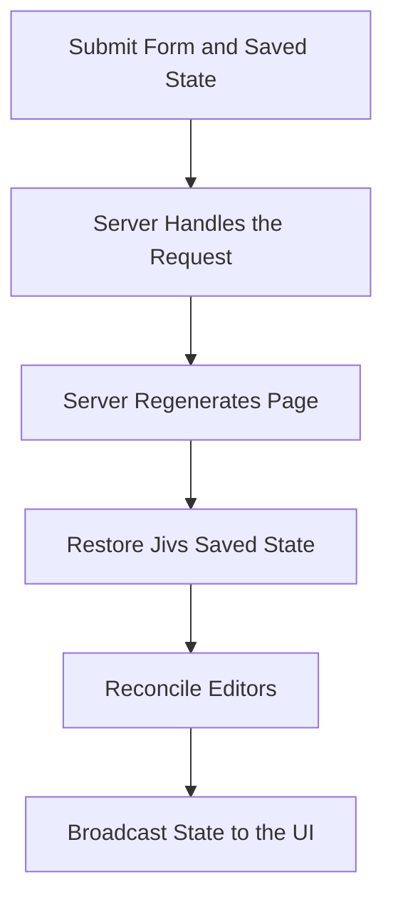

# Server Pages Workflow: Round Trip

A server-page Round Trip occurs when the application submits the form so the server can perform an operation and regenerate the page without attempting to save it. The client does not perform form-level validation before this submission. The regenerated page may contain a different set of editors or revised editor values.

This document covers a complete page regeneration. For partial-page or AJAX replacement, see [Server Pages Workflow: Elements Changed](Server_pages_workflow_elements_changed.md).

A Round Trip has three stages:

1. Preserve the current Jivs state and submit the form.
2. Let the server process the form and regenerate the page.
3. Restore the saved state, then reconcile it with the editors in the regenerated page.



The saved state preserves the current values and validation state held by Jivs. The regenerated editors represent any changes intentionally made by the server. The reconciliation process brings those two sources together.

## Submit the Current Page

A Round Trip is not a save attempt, so it does not require form-level validation before submission. Invalid and incomplete values may need to survive the Round Trip so the user can continue editing them afterward.

The page is expected to contain the same saved-state input used by the Page Save workflow:

```html
<input type="hidden" id="_jivsCapturedState" name="_jivsCapturedState">
```

Immediately before submitting the form, place the current Jivs saved state into that input:

```ts
const capturedStateInput =
    document.getElementById('_jivsCapturedState') as HTMLInputElement;

capturedStateInput.value = vhm.getCapturedState();
```

`getCapturedState()` returns an opaque string. Application code should submit and return it without inspecting or modifying its contents.

The application can then submit the form through its normal server-page mechanism. The request contains:

- the values submitted by the form's editors
- the Jivs saved state in `_jivsCapturedState`
- any other application-specific form data

## Regenerate the Page on the Server

The server handles the requested operation using the submitted form data.

It may regenerate the same editors unchanged, or it may change the form. For example, selecting an account type might cause the server to add business-specific editors, remove personal-account editors, or revise a value that no longer applies.

> Configure the `ValueHostsManager` through Rules with every field that may appear. During reconciliation, a `FieldValueHost` is enabled when its editor appears in the regenerated page and disabled when its editor is absent.

When generating the returned page, the server:

1. Generates the form and its current editors.
2. Returns the same Jivs saved-state string received from the client.
3. Places that string into the regenerated `_jivsCapturedState` input.

The server must HTML-attribute-encode the saved state when writing it into the input:

```html
<input
    type="hidden"
    id="_jivsCapturedState"
    name="_jivsCapturedState"
    value="[HTML-attribute-encoded saved state]">
```

## Restore the Returned Page

The returned page has two relevant sources of state:

- The Jivs saved state contains the values and validation state that existed before submission.
- The regenerated editors contain any values supplied or revised by the server.

Start with the saved state. Then reconcile the restored ValueHosts with the editors in the regenerated page.

The important rule is:

> Preserve the restored state for unchanged editors. Use the server-rendered Text Value for a changed editor. Enable ValueHosts that have editors and disable those whose editors are absent.

### Restore the ValueHostsManager

Read the saved-state input and assign its value to the configuration before constructing the `ValueHostsManager`:

```ts
const capturedStateInput =
    document.getElementById('_jivsCapturedState') as HTMLInputElement;

const services = createJivsServices('en-US');
const rules = new PersonFormRules(services);
const config = rules.configure();

config.capturedState = capturedStateInput.value;

config.onTextValueChanged = onTextValueChanged;
config.onValueHostValidationStateChanged = fieldValidated;
config.onValidationStateChanged = formValidated;

const vhm = new ValueHostsManager(config);
```

The constructor restores the state available for the configured ValueHosts. This is not initial Page Load, so do not initialize the `ValueHostsManager` from the form elements.

### Reconcile the Regenerated Editors

After restoring the saved state, use the helper described in [Add the Editor Reconciliation Helpers](Using_Jivs_with_Server_Generated_Pages.md#add-the-editor-reconciliation-helpers):

```ts
reconcileValueHostsWithEditors(vhm, {
    skipIfUnchanged: true
});
```

`skipIfUnchanged: true` preserves the restored value, change state, and validation state for an unchanged editor. When the server supplies a different Text Value, that value becomes the field's new starting value and its validation status is reset to `NotAttempted`.

The helper also enables ValueHosts that have supported editors and disables those whose editors are absent or unsupported. When the enabled state changes, that change supersedes `skipIfUnchanged`.

### Connect and Update the Page

After reconciling the editor values and enabled states, attach the page handlers and ask the `ValueHostsManager` to broadcast its current state:

```ts
attachEditorEventHandlers(vhm);
attachPresentationHandlers(vhm);

vhm.broadcast();
```

`broadcast()` redistributes the current Text Values and validation state through the configured callbacks. This updates editors and validation presentation after their handlers have been attached.

The complete restoration order is:

1. Restore the `ValueHostsManager` from `config.capturedState`.
2. Reconcile the regenerated editors using `skipIfUnchanged: true`.
3. Attach the editor event handlers.
4. Attach the presentation handlers.
5. Call `broadcast()`.

The user can now continue editing the regenerated form with the retained Jivs state and any changes supplied by the server.

---

For partial-page replacement without a complete page reload, continue to [Server Pages Workflow: Elements Changed](Server_pages_workflow_elements_changed.md).

Return to [Learning Jivs](../Learning_Jivs_Home.md).
