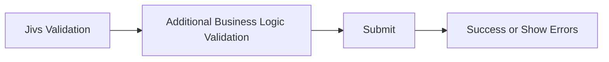
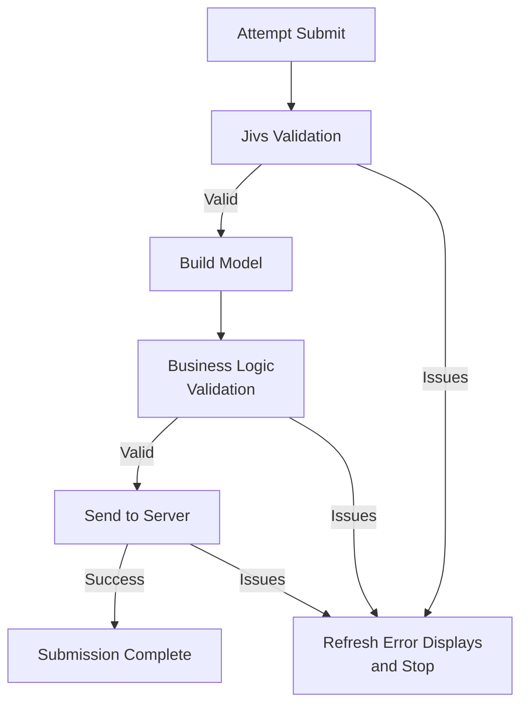
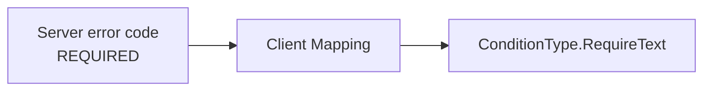

# Submitting the Client Form

When the user submits a form, validation may happen at several points before the operation succeeds.

Jivs performs its validation first. The application may then perform additional business logic validation on the completed Model, followed by validation on the server.

At a high level, submission moves through four stages:



Each stage may report errors and stop the submission. When that happens, the error displays are refreshed so the user can correct the form.

The complete flow looks like this:



The sections below walk through that pipeline.

## Validate the Form

Start by validating the entire `ValueHostsManager`.

```ts
const validationState = vhm.validate();

if (validationState.doNotSave) {
    return;
}
```

`validate()` runs the validation needed for submission. `ValueHostsManager` distributes the results to the UI through the `onValidationStateChanged` callback. See [Using the ValueHostsManager within the Client](Using_the_ValueHostsManager_within_the_Client.md) for details.

If `doNotSave` is `true`, submission stops here.

## Build the Model

Once Jivs validation succeeds, the Native Values can be copied into the Model that will be used for business validation and sent to the server.

`ModelWriter` provides the convenient way to copy the configured `FieldValueHosts` into a Model:

```ts
const person = new Person();
const writer = new ModelWriter(vhm, person);
writer.writeToModel();
```

`ModelWriter` uses the Model property name configured for each `FieldValueHost`. By default, that property name is the name supplied to `builder.field()`.

When the `FieldValueHost` name and Model property name differ, set `propertyName` while configuring the field:

```ts
builder.field('FirstName', LookupKey.String, {
    propertyName: 'firstName'
});
```

Now `ModelWriter` knows that the `FirstName` ValueHost should be written to `person.firstName`.

Individual values can also be retrieved directly when needed:

```ts
person.firstName = vhm.vh.field('FirstName').getValue();
```

At this point the Model contains the Native Values established while the user edited the form.

## Run Business Logic Validation

Jivs validation is not necessarily the last validation required before saving.

The completed Model can be passed to application business logic for checks that operate on the Model as a whole or require other application data.

```ts
const issuesFound: Array<IssueFound> =
    validatePersonBeforeSave(person);
```

If business logic finds issues, provide them to the `ValueHostsManager`:

```ts
if (issuesFound.length > 0) {
    vhm.addExternalIssuesFound(issuesFound, true);
    return;
}
```

These issues join the validation information already managed by Jivs. The same validation callbacks refresh the application's error displays.

Submission stops until those issues have been resolved.

## Send the Model to the Server

Once client-side Jivs validation and business logic validation succeed, send the Model using the application's normal server communication.

```ts
const response = await savePerson(person);
```

Jivs does not require a particular HTTP library, API design, or submission mechanism.

Client-side validation also does not replace validation on the server. The server must determine whether the submitted data is actually acceptable before saving it.

## Handle Request Failures

Sending the Model can fail for reasons unrelated to validation.

Examples include:

- the server cannot be reached;
- the request times out;
- the server returns an unexpected error response;
- an internal server failure prevents the request from being completed.

These are not validation issues. Handle them through the application's normal request/error UI rather than adding them to the `ValueHostsManager`.

For example:

```ts
let response: SavePersonResponse;

try {
    response = await savePerson(person);
}
catch (error) {
    handleConnectionFailure(error);
    return;
}

if (handleHttpFailure(response))
    return;
```

This example assumes validation results are returned as part of a successful response. That is a useful convention because it keeps expected validation outcomes separate from operational failures.

An existing API may instead use a non-success HTTP status for validation. Keep that API contract; its request-handling code should recognize those responses as validation results before applying general HTTP error handling.

## Handle Server Validation Results

After the request completes normally, the server may still report validation issues.

Provide those issues to Jivs so the existing validation UI is refreshed.

There are two equally valid approaches.

If the server uses Jivs and returns a Jivs Validation Payload, apply it directly:

```ts
vhm.fromValidationPayload(response.validationPayload);
```

If the server uses another validation system, convert its returned errors into `IssueFound` objects and add them to Jivs:

```ts
const issuesFound = convertToIssueFound(response.validationErrors);
vhm.addExternalIssuesFound(issuesFound, false);
```

In either case, updating the `ValueHostsManager` causes the validation callbacks established earlier to refresh the Field Errors, Validation Summary, and other validation-related UI.

The user can then correct the form and submit again.

## Submission Complete

When the server accepts the submitted data, the submission pipeline is complete. The application can perform whatever success behavior it requires, such as navigation, displaying confirmation, or updating the current view.

## Putting the Submission Process Together

Here is the complete client-side submission process. Application-specific business validation, server communication, and handling of server issues are represented by functions supplied by the application.

> We have creating actual classes that let you get started more quickly in [jivs-DOM_Helpers.ts](../../starter_code/jivs-DOM_helpers.ts). Consider subclassing from either ClientSubmitsToJivsOnServerBase or ClientSubmitsToServerBase as you develop submit code to handle your server-side infrastructure and various models.

```ts
async function submitPerson(vhm: ValueHostsManager): Promise<void> {
    const validationState = vhm.validate();

    if (validationState.doNotSave) {
        return;
    }

    const person = new Person();
    const writer = new ModelWriter(vhm, person);
    writer.writeToModel();

    const issuesFound = validatePersonBeforeSave(person);
    if (issuesFound.length > 0) {
        vhm.addExternalIssuesFound(issuesFound, true);
        return;
    }

    let response: SavePersonResponse;

    try {
        response = await savePerson(person);
    }
    catch (error) {
        handleConnectionFailure(error);
        return;
    }

    if (handleHttpFailure(response))
    {
        return;
    }

    if (handleServerIssues(response, vhm)) {
        return;
    }

    submissionSucceeded(person);
}
```

`handleHttpFailure()` handles HTTP or server failures that are not validation results.

`handleServerIssues()` determines whether the response contains validation issues and provides them to Jivs. Its implementation depends on whether the server uses Jivs or another validation system.

`SavePersonResponse` is an application-defined response type.

### When the Server Uses Jivs

A server using Jivs can return a Jivs Validation Payload:

```ts
function handleServerIssues(
    response: SavePersonResponse,
    vhm: ValueHostsManager
): boolean {
    if (!response.validationPayload) {
        return false;
    }

    vhm.fromValidationPayload(response.validationPayload);
    return true;
}
```

### When the Server Uses Another Validation System

A server using another validation system can keep its existing error format, field names, and error codes. The client adapts those values into Jivs `IssueFound` objects.

Suppose the server returns errors using this application-defined type:

```ts
interface ServerValidationError {
    message: string;
    code?: string;
    field?: string;
}
```

`convertToIssueFound()` provides the integration boundary between that server contract and Jivs:

```ts
function convertToIssueFound(
    errors: ServerValidationError[]
): IssueFound[] {
    return errors.map(error => ({
        errorMessage: error.message,
        errorCode: mapErrorCode(error.code),
        valueHostName: mapFieldName(error.field)
    }));
}
```

The server's message becomes the required `IssueFound.errorMessage`. Its error code and field name can be mapped when corresponding Jivs values are available.

#### Map Error Codes

An error code identifies what kind of validation problem occurred. The server does not need to use Jivs error codes.

Map the server's codes to Jivs values where a useful equivalent exists:

```ts
function mapErrorCode(
    errorCode?: string
): string | undefined {
    switch (errorCode) {
        case 'REQUIRED':
            return ConditionType.RequireText;

        case 'TOO_LONG':
            return ConditionType.StringLength;

        default:
            return errorCode;
    }
}
```

For example:



The mapped error code lets Jivs identify the kind of validation issue and use configured error messages, including localized messages, instead of relying only on the server's message.

If there is no useful mapping, the server's error code can be retained or omitted. The server message remains available as `errorMessage`.

#### Map Field Names

A field name identifies where the validation issue belongs. The server can continue using its own field naming.

Map that value to the appropriate client `ValueHostName`:

```ts
function mapFieldName(
    fieldName?: string
): string | undefined {
    switch (fieldName) {
        case 'first_name':
            return 'FirstName';

        case 'last_name':
            return 'LastName';

        default:
            return undefined;
    }
}
```

The mapped `valueHostName` allows Jivs to attach the issue to the correct ValueHost and its error display.

When both the mapped `valueHostName` and error code identify a validator on that ValueHost, Jivs can activate that validator as though the validation issue had been found on the client.

#### Handle the Server Issues

Use the adapter when the server response contains validation errors:

```ts
function handleServerIssues(
    response: SavePersonResponse,
    vhm: ValueHostsManager
): boolean {
    if (!response.validationErrors || response.validationErrors.length === 0) {
        return false;
    }

    const issuesFound =
        convertToIssueFound(response.validationErrors);

    vhm.addExternalIssuesFound(
        issuesFound,
        false // Issues came from another system.
    );
    return true;
}
```

The `false` argument allows these imported issues to be cleared by the next client-side validation attempt.

Returning `true` means validation issues were found and handled, so submission processing stops. Returning `false` means there were no server validation issues.

The server does not need to understand Jivs. The client-side adapter translates the server's validation contract into the `IssueFound` information Jivs needs.

---
Next, we'll look at [Client Presentation of Jivs Validation](./Client_Presentation_of_Jivs_Validation.md)

Or start on the server with [how Jivs participates in validation on the server](./Understanding_Server_Side_Validation.md).

Return to [Learning Jivs TOC](./Learning_Jivs_Home.md).