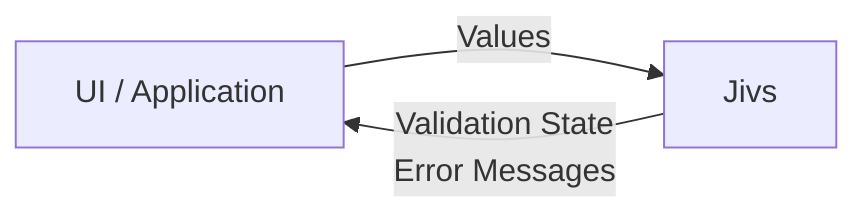
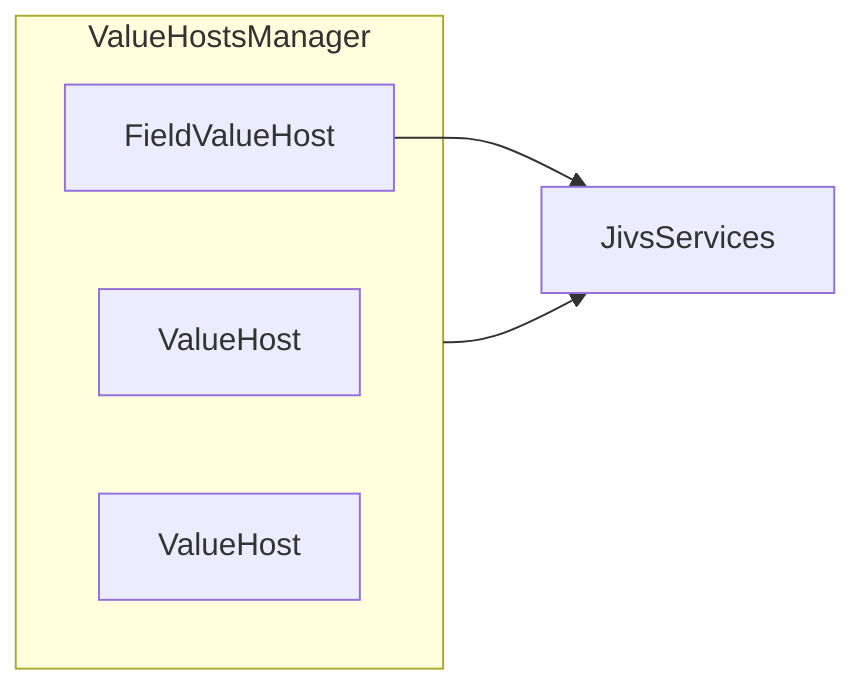

# Understanding Jivs

Jivs implements the Value Manager described in [Understanding Value Management](Understanding_Value_Management.md), providing the features of obtaining values, parsing and formatting them, validating them, and communicating errors back to the application.

When building a new form, Jivs can handle value management end-to-end. It can also provide validation while integrating with existing approaches for obtaining values, parsing, and formatting.

## What Jivs Is Trying to Do

Jivs helps answer a practical question: _how should input validation be handled in the UI and/or the Model?_

Jivs takes a focused approach to that problem. Validation rules can remain part of the business logic while the UI stays concerned with presentation and interaction.

The UI knows very little about what needs to be validated. It delivers input values to Jivs and asks for validation results. Jivs reports the current **Validation State**, such as `Valid`, `Invalid`, or `Undetermined`, along with any errors that were found.

The application can then decide what to do with that information: show a Field Error, update a Validation Summary, change the appearance of an input, or prevent submission.

Jivs does not know about the UI that performs those actions. The UI supplies values to Jivs, and Jivs supplies validation information back to the application.

## The Core Jivs Concepts

Four names appear throughout Jivs and are worth learning early:

1. **ValueHost** — represents a value that participates in the validation system. It has a unique name that you'll use to look it up, and a data type that dictates some of its behavior.
2. **FieldValueHost** — a ValueHost designed for values associated with fields, including Text Values and Native Values. There are other ValueHosts for calculated and static values, both of which can be used by validators but are not editable model fields.
3. **ValueHostsManager** — coordinates a collection of ValueHosts and provides the application-level view of their validation state. Think of this as the actual Value Manager described earlier.
4. **JivsServices** — the required services object used by Jivs for dependency injection and customization. Among its many tools, it has the validation rules, parsers, and formatters.

---

Now let's [create a ValueHostsManager](Intro_to_Creating_a_ValueHostsManager.md).

Return to [Learning Jivs TOC](./Learning_Jivs_Home.md).