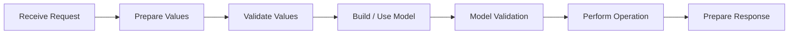
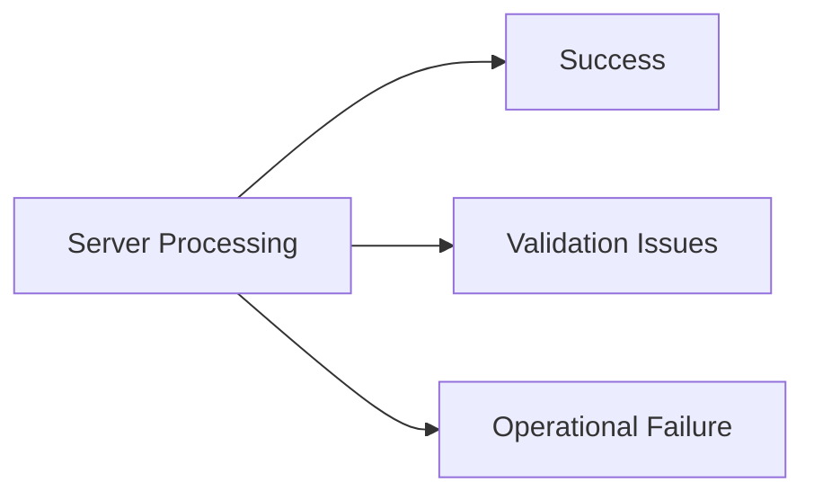

# Understanding Server-Side Validation

Server-side request processing follows the same fundamental pattern regardless of the technology used to implement it: receive incoming data, determine whether it is usable, perform the requested operation, and prepare an appropriate response.

**Always validate incoming data on the server, even when the client has already validated the same values.** Client-side validation improves the user experience, but it is not a security boundary. A caller can bypass the UI, modify requests, or call an endpoint directly. The server must independently determine that incoming data is acceptable before trusting or saving it.

Applications may also have security controls that inspect requests before they reach this process. A web application firewall, middleware, request filter, or other security layer may detect malicious input and reject the request before application validation code receives it. Those protections complement server-side validation; they do not replace it.

Jivs can implement much of the application validation process when the server uses Node.js. Servers using other technologies follow the same architecture and can continue using their existing validation systems.

## The Server-Side Process



Security controls may reject a request before **Receive Request**. The workflow above begins once the request has reached the application code responsible for processing it.

The sections below expand the stages that need additional explanation.

## Preparing Values

Incoming request data may need preparation before it can participate in validation and Model construction.

- **JSON / Native Values** — JSON may already have been deserialized into values suitable for validation and Model construction. Some values may still need conversion into the application's Native Value types, such as converting a JSON date string into a `Date` object.
- **Form / Text Values** — form posts commonly supply Text Values that may need parsing before Native Values are available.
- **Existing application preparation** — application code may already extract, convert, map, or otherwise prepare request data before it reaches validation.
- **Other request formats** — APIs and application-specific protocols may require their own preparation before the values can be validated.

The goal is to reach the representation expected by the server's validation process without unnecessarily replacing existing request-handling infrastructure.

## Validation Issues and Operational Failures

Validation issues can be discovered while validating values, validating the completed Model, or even while performing the operation. For example, a database may reject a value because it violates a business or data constraint.



Examples of **validation issues** include:

- a required value is missing;
- text cannot be converted to the required Native Value;
- a business rule rejects the completed Model;
- a database uniqueness or other data constraint is violated.

Examples of **operational failures** include:

- the database is unavailable;
- a connection fails;
- a required service cannot be reached;
- an unexpected server error occurs.

Validation issues should be returned in a form the caller can use to identify and communicate what was rejected. Operational failures follow the application's normal HTTP and error-handling conventions.

### Error Messages, Error Codes, and Field Names

A validation issue should include a message that explains what was rejected.

When possible, also include a stable **error code** and **field name**:

```json
{
    "errorMessage": "First name is required.",
    "errorCode": "Require",
    "fieldName": "FirstName"
}
```

The message communicates the problem. The additional identifiers give the client enough information to integrate that issue with **Jivs on the client side**.

- **Error code** identifies what kind of validation problem occurred. The server can use its own stable code. The client can map that code to a Jivs `errorCode` or `ConditionType`, allowing Jivs to use configured error messages, including localized messages, instead of relying on the server's message.

- **Field name** identifies where the validation issue belongs. The server can use its own field naming. The client can map that value to the appropriate `ValueHostName`, allowing Jivs to attach the issue to the correct ValueHost and its error display.

- **Together**, a mapped `ValueHostName` and error code allow Jivs to find and activate a matching validator on that ValueHost, as though the validation issue had been found on the client.

The server does not need to use Jivs field names or error codes. The client-side integration maps the server's values into Jivs.

## Preparing the Response

The response mechanism is application-owned. Validation information can be returned in several ways.

- **JSON response body**

  ```http
  HTTP/1.1 200 OK
  Content-Type: application/json

  {
      "validationErrors": [
          {
              "fieldName": "FirstName",
              "errorCode": "Require",
              "errorMessage": "First name is required."
          }
      ]
  }
  ```

- **HTTP header**

  ```http
  HTTP/1.1 200 OK
  Content-Type: application/json
  Validation-Errors: <encoded validation data>

  {
      "success": false
  }
  ```

- **Regenerated HTML page with the submitted values and validation errors**

  ```http
  HTTP/1.1 200 OK
  Content-Type: text/html

  <form>
      <input name="FirstName" value="">
      <span>First name is required.</span>
  </form>
  ```

  This lifecycle also requires preserving submitted state and restoring validation information when the page is regenerated.

- **Another application-specific mechanism**

The examples are only possible response shapes. Existing applications and published APIs should keep their established contracts.

**For validation issues, prefer an HTTP 200-style successful response.** Validation is an expected application outcome, not an operational failure. Other response conventions are also valid when they better fit the application or an existing API contract.

The important requirement is that a validation response contain enough information for the caller to identify and communicate what was rejected.

---

Continue with the path that matches the server:

- [Using Jivs for Server-Side Validation](Using_Jivs_for_Server_Side_Validation.md)
- [Integrating Non-Jivs Server Validation](Integrating_Non_Jivs_Server_Validation.md)

Return to [Learning Jivs TOC](./Learning_Jivs_Home.md).