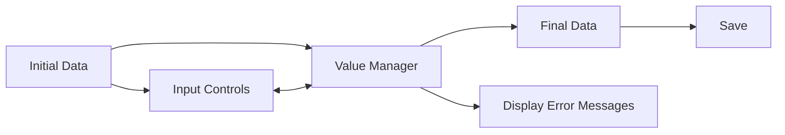
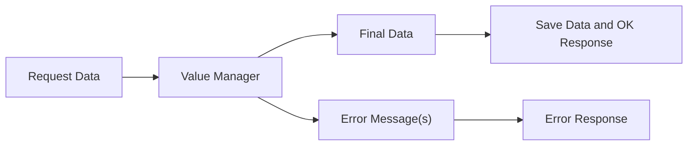
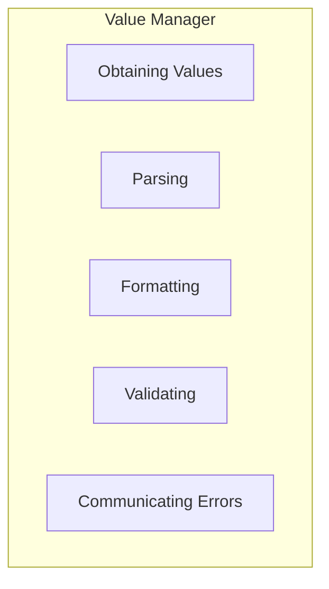
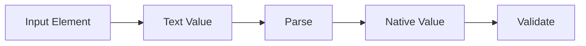
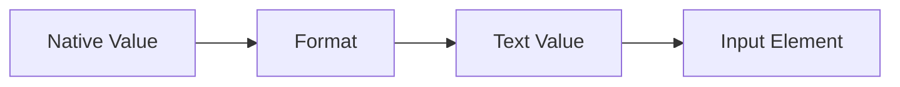
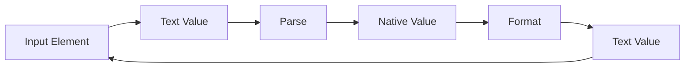
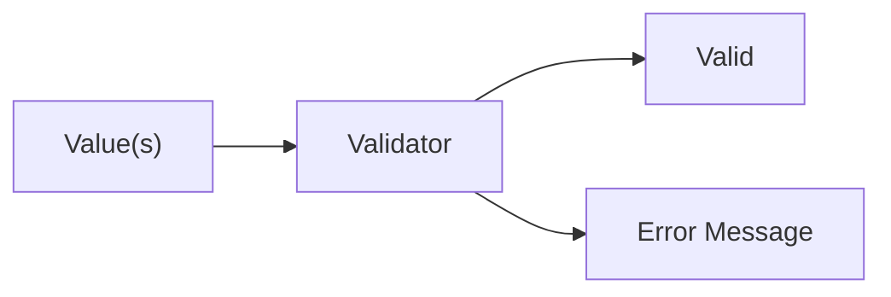
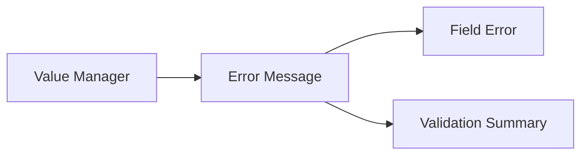
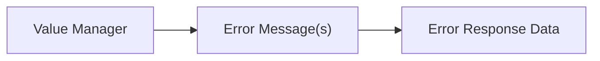

# Understanding Value Management

Validation is rarely an isolated operation. It is one part of a larger job: getting values into an application, determining whether those values are usable, communicating problems, and ultimately producing data that the application can use.

That job exists on both the client and the server, with the server carrying more responsibility for security and ensuring incoming data is actually suitable.

The two environments have different participants, but much of the work between those boundaries is the same:

* receive values
* convert values when necessary
* validate them
* retain validation results
* produce usable values or report problems

This document uses the term **Value Manager** to refer to the part of an application responsible for this work.

An application may already have code or libraries that handle some or all of these responsibilities. Using Jivs involves recognizing when such existing code should be preserved and incorporated rather than replaced.

## Value Management in Context

Client-side and server-side value management solve closely related problems, but interact with different parts of the application.

Flow 1: Client-Side Validation Flow



Flow 2: Server-Side Validation Flow



The surrounding participants differ, but the Value Managers perform the same central function: values pass through them before becoming usable final data, while error messages take a different path. Despite differences in environment, both client and server implementations rely on the same **value-management tools**.

On the client, the Value Manager participates throughout editing. It receives initial data, exchanges values with input controls, produces error messages for display, and ultimately provides the final data that can be saved.

On the server, incoming values may arrive through different application boundaries. A user-facing client might submit text-oriented form data, while a published API might receive JSON that has already been deserialized into an object. The corresponding error messages may also be returned differently. These boundary concerns can vary, while the underlying value-management responsibilities remain substantially the same.

## Inside the Value Manager

At this level, the Value Manager is not a particular class, library, or implementation. It is a convenient way to identify the validation-related work that sits between incoming values and usable data.

That work can be summarized as five responsibilities:



These responsibilities describe what a validation system may need to do, not how it must be implemented.

An application may already handle some of them with existing code or libraries. They may be implemented together or separately, and not every environment needs every responsibility. For example, formatting is primarily useful where values need to be presented for editing or display.

### Obtaining Values

The values used by validation and other Value Manager tools need to make their way into the Value Manager. Some implementations retrieve values when needed; others expect values to be delivered. *Hint: Jivs uses delivered values.* Either way, the Value Manager must obtain the values it works with.

Those values may arrive in different representations.

A **Text Value** is a textual representation, such as `"12/15/2026"` or `"42"`.

A **Native Value** is the representation used by application code, such as a date object or number.

```text id="jigxe2"
Text Value   → "12/15/2026"
Native Value → new Date("2026-12-15")

Text Value   → "42"
Native Value → 42
```

A Value Manager may receive either representation, depending on the source and what processing has already occurred.

A Value Manager uses parsing and formatting to move between Text Values and Native Values.

### Parsing and Formatting

Parsing converts a Text Value into the corresponding Native Value expected by application code.

```text id="usqf84"
"12/15/2026" → new Date("2026-12-15")
"42"         → 42
```

A typical parsing workflow starts with text from an input element and ends with validation of the resulting Native Value.



Formatting performs the complementary job when a Native Value needs a Text Value suitable for editing or display.

*Note: It is rare for the server side to use Formatting, as it is gathering Native Values for the model.*

```text id="xz6w67"
new Date("2026-12-15") → "12/15/2026"
42 → "42"
```

Formatting for the Input Element starts with a Native Value and produces text that can optionally be assigned to an input element.



Parsing and formatting can also be used together. For example, text entered by a user can be parsed into a Native Value and then formatted back into the input as its latest Text Value.



An application may already have code or libraries that perform either responsibility.

### Validating

Validation takes one or more values and determines whether they satisfy the application's rules.



The values supplied to a validator may include:

* a Text Value
* a Native Value
* multiple related values
* application-specific conditions

### Communicating Errors

Finding a validation problem and communicating it are separate concerns. The Value Manager needs to make **Error Messages** available to the surrounding application, but it does not need to own what happens next.

On the client, an Error Message may appear with the field that caused it, in a Validation Summary, or both.



On the server, one or more Error Messages become data that can be included in an error response.



The user interface and transport mechanisms remain outside the Value Manager.

---

Now let's see how [Jivs provides this](Understanding_Jivs.md).

Return to [Learning Jivs TOC](./Home.md).