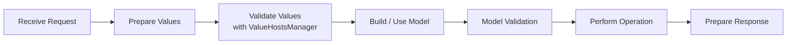
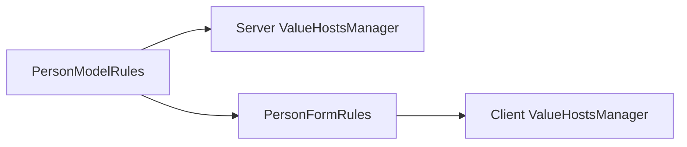
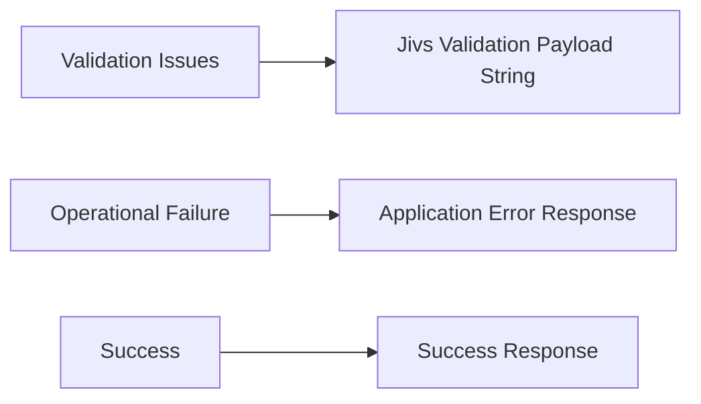

# Using Jivs for Server-Side Validation

When the server runs Node.js, Jivs can implement the value-management and validation stages described in [Understanding Server-Side Validation](Understanding_Server_Side_Validation.md).

One of the main advantages of using Jivs on both the client and server is that the **ValueHost validation rules for the Model can come from the same `ValueHostRulesBase` subclass**.

For example, a shared rules class might define the value validation for a `Person` Model:

```ts id="3bvq3o"
export class PersonModelRules extends ValueHostRulesBase {
    protected override configureRules(
        builder: IValueHostsManagerConfigBuilder,
        options?: ValueHostRulesOptions
    ): void {
        builder.field('FirstName', LookupKey.String, {
            propertyName: 'firstName'
        })
            .requireText()
            .stringLength(50);

        builder.field('LastName', LookupKey.String, {
            propertyName: 'lastName'
        })
            .requireText()
            .stringLength(50);
    }
}
```

Client-side form rules can derive from this class when they need UI-specific adaptations. Server-side code can use `PersonModelRules` directly.

That keeps the Model's ValueHost validation rules in one codebase rather than maintaining separate client and server definitions.

## The Server-Side Process with Jivs

The same server-side process introduced earlier now has Jivs implementing the value-management stages:



Jivs does not replace request handling, Model-level business logic, persistence, or response construction. It provides the `ValueHostsManager` and related tools used to prepare and validate the values that participate in that process.

## Create the Server ValueHostsManager

Server-side code uses the same creation pattern introduced earlier:

```ts id="1lsgpl"
const services = createJivsServices('en-US');
const rules = new PersonModelRules(services);
const config = rules.configure();

const vhm = new ValueHostsManager(config);
```

The important difference from a client-side form is which rules class is used.

A form may derive from `PersonModelRules` to add labels, messages, ElementIdentifiers, or other UI-specific adaptations. The server normally uses the shared Model rules directly.



The Model rules remain the shared source of truth.

## Prepare Values with Jivs

Request data commonly reaches the server in one of two useful forms.

### JSON / Native Values

JSON may already have been deserialized into values suitable for validation and Model construction. Some values may still need conversion into the application's Native Value types.

`ModelReader` supplies Native Values from an object to the configured `FieldValueHosts`:

```ts id="2sqbw9"
const reader = new ModelReader(vhm, requestData);
reader.readFromModel();
```

`ModelReader` does not parse Text Values.

It uses the Model property mapping configured for each `FieldValueHost`. When the ValueHost name differs from the Model property name, configure `propertyName`:

```ts id="kebuw2"
builder.field('FirstName', LookupKey.String, {
    propertyName: 'firstName'
});
```

This mapping lets `ModelReader` obtain the Native Value from `requestData.firstName`.

Sometimes the Model value itself needs adjustment before it can be assigned to the `FieldValueHost`. For example, the Model and Jivs may use different values to represent an unassigned field.

Use `modelReaderRules` to adapt the value during transfer:

```ts id="4kc105"
builder.field('Count', LookupKey.Number, {
    modelReaderRules: {
        when: 'undefined',
        then: '0'
    }
});
```

Here, an `undefined` Model value becomes `0` in the `FieldValueHost`.

See [Value Adapter rules](Jivs_API.md#value-adapter-rules) for the available rules and customization options.

### Form / Text Values

HTML form posts commonly supply a dictionary of Text Values. With Express, `express.urlencoded()` can populate that dictionary from the request body:

```ts id="83fm9r"
const express = require('express');
const app = express();

app.use(express.urlencoded({ extended: true }));

app.post('/submit', (req, res) => {
    const formValues = req.body;

    const reader = new FormReader(vhm, formValues);
    reader.readFromModel();

    const validationState = vhm.validate();

    // Continue processing the validation result...
});
```

`FormReader` supplies each Text Value to its corresponding `FieldValueHost` using `setTextValue()`. When `validate()` runs, the configured parsers convert those Text Values into Native Values. Parsing errors participate in the same validation result as the other configured validation rules.

Application code can also supply individual values when needed:

```ts id="rii7mf"
vhm.vh('BirthDate').setValue(nativeBirthDate);
vhm.vh('BirthDateText').setTextValue(birthDateText);
```

Use `setValue()` for Native Values and `setTextValue()` for Text Values.

## Validate Values

Once the request values have been supplied, validate the complete `ValueHostsManager`:

```ts id="5r6kua"
const validationState = vhm.validate();

if (validationState.doNotSave) {
    return prepareValidationResponse(
        vhm.toValidationPayload(null)
    );
}
```

`validate()` runs the configured ValueHost validation rules. When Text Values were supplied, parsing errors are included in the same validation results.

At this stage, the validation issues belong to Jivs, so there are no additional application issues to supply to `toValidationPayload()`.

If validation succeeds, the Native Values are ready for Model construction.

## Build / Use the Model

`ModelWriter` copies the validated Native Values into the Model:

```ts id="nd8v08"
const person = new Person();
const writer = new ModelWriter(vhm, person);
writer.writeToModel();
```

`ModelWriter` needs to know which Model property corresponds to each `FieldValueHost`. When the ValueHost name differs from the Model property name, configure `propertyName`:

```ts id="6ji3uj"
builder.field('FirstName', LookupKey.String, {
    propertyName: 'firstName'
});
```

This maps the `FirstName` ValueHost to `person.firstName`. The same mapping is used by both `ModelReader` and `ModelWriter`.

Sometimes the Native Value also needs adjustment before it is assigned to the Model. Use `modelWriterRules` to adapt the value during transfer:

```ts id="gtq6ao"
builder.field('FirstName', LookupKey.String, {
    modelWriterRules: {
        when: 'emptystring',
        then: 'undefined'
    }
});
```

Here, an empty string in the ValueHost becomes `undefined` when written to the Model.

See [Value Adapter rules](Jivs_API.md#value-adapter-rules) for the available rules and customization options.

## Representing Additional Validation Issues

After Jivs validation succeeds, later application logic may discover additional validation issues. Gather these into a single `IssueFound[]` as processing continues:

```ts id="3vge9g"
const issuesFound: IssueFound[] = [];
```

Each issue uses the `IssueFound` datatype:

```ts id="jtzc67"
interface IssueFound {
    errorMessage: string;
    errorCode?: string;
    valueHostName?: string;
    severity?: ValidationSeverity;
    summaryMessage?: string;
}
```

Only `errorMessage` is required. The optional identifiers correspond directly to the error-code and field-name concepts introduced in [Understanding Server-Side Validation](Understanding_Server_Side_Validation.md#error-messages-error-codes-and-field-names):

- `errorCode` identifies what kind of validation issue occurred. When it matches a Jivs error code or `ConditionType`, the client can use Jivs-configured error messages, including localized messages.
- `valueHostName` identifies the destination ValueHost, allowing the issue to appear with that ValueHost's error display.
- when both `valueHostName` and a matching `errorCode` are present, Jivs can align the imported issue with a validator on that ValueHost and activate it as though the issue had been found on the client.
- `severity` identifies the validation severity.
- `summaryMessage` provides an alternate message for summary-style displays.

Because both sides use Jivs in this path, server code can usually supply the Jivs `valueHostName` and `errorCode` directly rather than introducing an additional mapping layer.

For example:

```ts id="ahrckv"
issuesFound.push({
    errorMessage: 'This email address is already in use.',
    errorCode: 'EmailAlreadyUsed',
    valueHostName: 'EmailAddress'
});
```

The same list can collect issues discovered during Model Validation and while performing the operation. When preparing a validation response, pass the list to `toValidationPayload()`.

## Model Validation

Value-level validation may not be the final validation required before the operation can proceed.

Model validation is useful for rules that need the completed Model or information beyond the individual values already validated by Jivs. Common examples include:

- checking relationships across several Model properties;
- determining whether a change is allowed based on other application data;
- checking whether a value, such as a username or email address, is already in use;
- applying other business rules that operate on the Model as a whole.

Pass the completed Model to the application's broader business logic and gather any issues it finds:

```ts id="32qmxz"
issuesFound.push(
    ...validatePersonBeforeSave(person)
);

if (issuesFound.length > 0) {
    return prepareValidationResponse(
        vhm.toValidationPayload(issuesFound)
    );
}
```

This keeps Model-level business validation separate from the ValueHost validation rules while allowing its issues to participate in the same Jivs validation response.

Some problems occur later and do not belong to this stage:

- **Data constraints discovered while performing the operation** are handled under **Perform the Operation** and may still become validation issues.
- **Operational failures**, such as a database connection failure, follow the application's normal server error path rather than becoming validation issues.

## Perform the Operation

Once value validation and Model validation succeed, continue with the application's normal operation:

```ts id="cbkn3s"
const saveResult = await savePerson(person);
```

Jivs does not prescribe how Models are saved, which database is used, or how other services participate.

The operation can still produce one of three outcomes:

- success;
- a validation issue discovered by the operation, such as the database rejecting a value that violates a constraint;
- an operational failure.

Business logic does not need to know about Jivs or `IssueFound`. When it returns validation-like errors in the application's normal error format, convert them at the Jivs integration boundary:

```ts id="kztood"
if (saveResult.issues.length > 0) {
    issuesFound.push(
        ...toIssuesFound(saveResult.issues)
    );
}
```

`toIssuesFound()` is also where application-specific field names or error codes can be mapped to Jivs values when they differ.

Operational failures use the application's normal error response instead.

## Prepare the Response

`ValueHostsManager.toValidationPayload()` combines Jivs validator-generated issues with any additional `IssueFound` objects supplied by the application and returns the result as a **string**.

For Jivs validation alone:

```ts id="a2droz"
const validationPayload =
    vhm.toValidationPayload(null);
```

When later application processing has gathered additional issues:

```ts id="zojig2"
const validationPayload =
    vhm.toValidationPayload(issuesFound);
```

The application should treat the returned payload as an opaque string. Its internal format is owned by Jivs and is not intended to be inspected or modified by application code.

Place that string wherever the application's response contract carries validation information.

For example, it can be a string property in a JSON response:

```http id="fkvets"
HTTP/1.1 200 OK
Content-Type: application/json

{
    "validationPayload": "<Jivs validation payload string>"
}
```

or carried in an HTTP header:

```http id="5jc4n0"
HTTP/1.1 200 OK
Jivs-Validation: <encoded Jivs validation payload string>
```

When using an HTTP header, encode the payload as needed for safe header transport.

These are suggested conventions, not requirements.

**For validation issues, prefer an HTTP 200-style successful response.** Validation is an expected application outcome, not an operational failure. Other response conventions are also valid when they better fit the application or an existing API contract.

Published APIs can use the same Jivs validation process without adopting these particular response shapes. Preserve the API's established contract and place the payload string where that contract can carry it.

The final response depends on the outcome of the server-side process:



Validation results use the application's chosen transport for the Jivs Validation Payload. Operational failures and successful responses continue to use the application's existing response conventions.

## Putting It Together

The complete flow uses the same Jivs setup and processing stages shown throughout this document:

```ts id="p4jco1"
async function processPersonRequest(
    requestData: PersonRequestData
): Promise<SavePersonResponse> {
    const services = createJivsServices('en-US');
    const rules = new PersonModelRules(services);
    const config = rules.configure();
    const vhm = new ValueHostsManager(config);

    const reader = new ModelReader(vhm, requestData);
    reader.readFromModel();

    const validationState = vhm.validate();

    if (validationState.doNotSave) {
        return prepareValidationResponse(
            vhm.toValidationPayload(null)
        );
    }

    const person = new Person();
    const writer = new ModelWriter(vhm, person);
    writer.writeToModel();

    const issuesFound: IssueFound[] = [
        ...await validatePersonBeforeSave(person)
    ];

    if (issuesFound.length > 0) {
        return prepareValidationResponse(
            vhm.toValidationPayload(issuesFound)
        );
    }

    let saveResult: SavePersonResult;

    try {
        saveResult = await savePerson(person);

        if (saveResult.issues.length > 0) {
            issuesFound.push(
                ...toIssuesFound(saveResult.issues)
            );
        }
    }
    catch (error) {
        return prepareOperationalFailureResponse(error);
    }

    if (issuesFound.length > 0) {
        return prepareValidationResponse(
            vhm.toValidationPayload(issuesFound)
        );
    }

    return prepareSuccessResponse(saveResult);
}
```

`validatePersonBeforeSave()`, `savePerson()`, `toIssuesFound()`, and the response helper functions are application code.

In particular, `savePerson()` can remain independent of Jivs and return the application's normal business-logic result format. `toIssuesFound()` adapts those errors to Jivs at the request-processing boundary.

## Receiving the Validation Payload on the Client

The server sends the Jivs Validation Payload as an opaque string. On the client, pass that string directly to the form's `ValueHostsManager`.

When transferred validation messages will be displayed in HTML, use the supplied `htmlEncoder`:

```ts id="dt6f8i"
vhm.fromValidationPayload(
    response.validationPayload,
    htmlEncoder
);
```

If HTML encoding is not needed, the payload can also be restored without an encoder:

```ts id="wfqxm4"
vhm.fromValidationPayload(response.validationPayload);
```

`fromValidationPayload()` restores the transferred validation state. As described in [Error Messages, Error Codes, and Field Names](Understanding_Server_Side_Validation.md#error-messages-error-codes-and-field-names), `valueHostName` determines where an imported issue belongs, while a compatible `errorCode` can align it with an existing validator on that ValueHost.

The complete client submission flow is covered in [Submitting the Client Form](Submitting_the_Client_Form.md).

---

For servers using another validation system, continue with [Integrating Non-Jivs Server Validation](Integrating_Non_Jivs_Server_Validation.md).