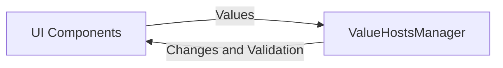
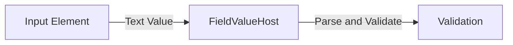
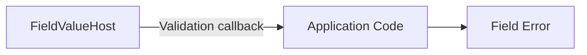
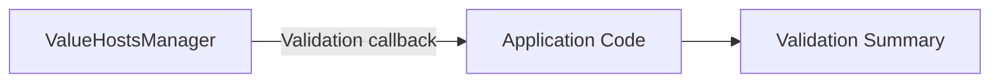
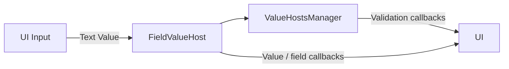

# Using the ValueHostsManager within the Client

At this point, the application has a configured `ValueHostsManager`. The next job is to connect it to the interactive parts of the Client.

Jivs does not know which UI framework or component library the application uses. It works with values and validation state, while application code makes the connection to input elements, error displays, validation summaries, and other interactive components.

This document stays UI-framework agnostic so the underlying Jivs patterns are clear. Framework-specific modules can provide the corresponding integration patterns for their components.

The interaction has two directions:



The code that connects those two sides can remain small. Its job is to move values into Jivs and respond to callbacks when Jivs has something the UI needs to know.

> Many code snippets here can also be found in this source code file intended to be added to your application as a quick start: [`jivs-DOM_helpers.ts`](../../starter_code/jivs-DOM_helpers.ts)

## Finding the UI Element for a FieldValueHost

Consider a `FieldValueHost` for `FirstName` and the input element that edits it:

```html
<input type="text" id="FirstName">
```

When Jivs invokes a field-specific callback, the callback is passed the `FieldValueHost`, not the element or any ID for it. When that callback needs to update the input or its Field Error, it must first locate the corresponding HTML element.

One approach is to let application code resolve the element identifier from the `FieldValueHost`:

```ts
function getElement(valueHost: FieldValueHost): HTMLElement | null {
    const fldId = resolveFieldId(valueHost);
    return document.getElementById(fldId);
}
```

Another approach is to store that identifier in the `FieldValueHost` configuration and retrieve it directly:

```ts
function getElement(
    valueHost: FieldValueHost,
    pattern?: string
): HTMLElement | null {
    const fldId = valueHost.getElementIdentifier(pattern);
    return fldId ? document.getElementById(fldId) : null;
}
```
> Found in [`jivs-DOM_helpers.ts`](../../starter_code/jivs-DOM_helpers.ts)
By default, `getElementIdentifier()` returns the same value as `getName()`.

### The elementIdentifier property
Frequently `getName()` does not match to your UI, and you have to use the element identifier feature
on the `FieldValueHost`.
An element identifier can be established in two common ways:

* If the element identifier is known while the rules are being configured, assign it through the Builder.

  ```ts
  builder.field('FirstName', LookupKey.String, {
      elementIdentifier: 'FirstName'
  });
  ```

* If the identifier is not known until the HTML has been generated, locate the relationship during setup and assign it to the `FieldValueHost` then.

  ```ts
  valueHost.setElementIdentifier('generated-FirstName');
  ```

Common ways to interpret an element identifier include:

* An HTML `id`:

  ```ts
  const element = document.getElementById(elementIdentifier);
  ```

* An element `name`:

  ```ts
  const element = document.getElementsByName(elementIdentifier)[0];
  ```

* A selector:

  ```ts
  const element = document.querySelector(elementIdentifier);
  ```

## Sending User Input to Jivs

When a user edits an input, application code supplies the current Text Value to the corresponding `FieldValueHost`.

The usual starting point is the element's `change` event:



A small setup function can connect the element to its `FieldValueHost`:

```ts
function attachJivsToInput(
    input: HTMLInputElement,
    fieldValueHost: FieldValueHost,
    duringEdit: boolean = false
): void {
    input.addEventListener('change', () => {
        fieldValueHost.setTextValue(input.value);
    });

    if (duringEdit) {
        input.addEventListener('input', () => {
            fieldValueHost.setTextValue(input.value, {
                duringEdit: true
            });
        });
    }
}
```
> Found in [`jivs-DOM_helpers.ts`](../../starter_code/jivs-DOM_helpers.ts) along with support for select and textarea tags.

Using `change` waits until the edit is committed. Adding `input` lets Jivs validate while the user is still editing.

With `duringEdit: true`, Jivs runs only validators intended for during-edit validation, helping avoid premature errors while a value is still being formed.

Calling `setTextValue()` automatically triggers validation for that `FieldValueHost`.

## Receiving Changes from Jivs

Jivs reports changes through callback functions assigned to the `ValueHostsManager` configuration. After `rules.configure()` returns the config object, application code can attach the callbacks it needs before creating the `ValueHostsManager`.

We'll focus on three callbacks:

* `onTextValueChanged` — a `FieldValueHost` has a new Text Value.
* `onValueHostValidationStateChanged` — validation changed for an individual `ValueHost`.
* `onValidationStateChanged` — validation changed for the full `ValueHostsManager`.

They are wired onto the configuration before the `ValueHostsManager` is created:

```ts
const config = rules.configure();

config.onTextValueChanged = onTextValueChanged;
config.onValueHostValidationStateChanged =
    onValueHostValidationStateChanged;
config.onValidationStateChanged = onValidationStateChanged;

const vhm = new ValueHostsManager(config);
```

The examples below keep the application code intentionally lightweight. They show how Jivs communicates with the UI, not how the final presentation should look.

### When a Text Value Changes

`onTextValueChanged` reports the current Text Value produced by Jivs.

Applications using Jivs formatting can use this callback to place that value into the corresponding input. Be deliberate about doing this because it replaces the input's current text. If parsing and formatting are handled outside Jivs, that application code should remain responsible for updating the UI.

A simple callback can update the associated input:

```ts
function onTextValueChanged(
    valueHost: FieldValueHost,
    oldValue: string
): void {
    const element = getElement(valueHost);

    if (element instanceof HTMLInputElement) {
        element.value = valueHost.getTextValue();
    }
}
```

This can be useful when Jivs formats a Native Value for display or reformats a value supplied during editing.

### When a Field's Validation Changes

`onValueHostValidationStateChanged` reports validation changes for an individual `ValueHost`.

For a `FieldValueHost`, application code can use that notification to update a Field Error or make another field-specific visual change.

For example, an input can have a companion element reserved for its Error Message:

```html
<label for="FirstName">First name</label>
<input type="text" id="FirstName">
<span id="FirstName-error"></span>
```

The `FieldValueHost` uses `FirstName` as its ElementIdentifier. Passing `'{0}-error'` to `getElement()` resolves the companion Field Error as `FirstName-error`.



A lightweight callback can use the same `getElement()` helper to locate that error element:

```ts
function onValueHostValidationStateChanged(
    valueHost: FieldValueHost,
    validationState: ValueHostValidationState
): void {
    const errorElement = getElement(valueHost, '{0}-error');

    if (!errorElement) {
        return;
    }

    errorElement.textContent =
        validationState.issuesFound?.[0]?.errorMessage ?? '';
}
```
> See the `fieldValidated()` function within [Build the Field Validation UI](./Presentation/Field_Presentation_of_Jivs_Validation.md#the-field-dispatcher-function) for a fully implemented callback.

This example shows only the first Error Message. An application may instead display several messages, change field styling, or use another presentation appropriate to its UI.

For much more, see [Build the Field Validation UI](./Presentation/Field_Presentation_of_Jivs_Validation.md#the-field-dispatcher-function).

### When Overall Validation Changes

`onValidationStateChanged` reports changes to the validation state of the full `ValueHostsManager`.

This is useful when the UI needs to react to the state of the form as a whole, such as updating a Validation Summary or deciding whether an action should remain available.



A callback can inspect the current Validation State and available Error Messages, then pass that information to the application's Validation Summary.

The details of that presentation belong to the UI. What matters here is the boundary: Jivs reports the change, and application code decides how to communicate it.

For much more, see [Build the Form Validation UI](./Presentation/Form_Presentation_of_Jivs_Validation.md).

## The Interactive Connection

At this point, the Client has the essential two-way connection:



The UI supplies values to Jivs. Jivs parses and validates those values, then uses callbacks to report changes back to application code.

The UI framework remains outside that process. Whether the application uses native HTML elements or framework-specific components, the same Jivs responsibilities remain in place.

---

Next, we'll look at [the form initialization process](Initializing_the_Client_Form.md).

Return to [Learning Jivs TOC](./Learning_Jivs_Home.md).