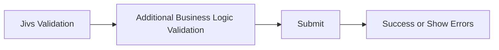
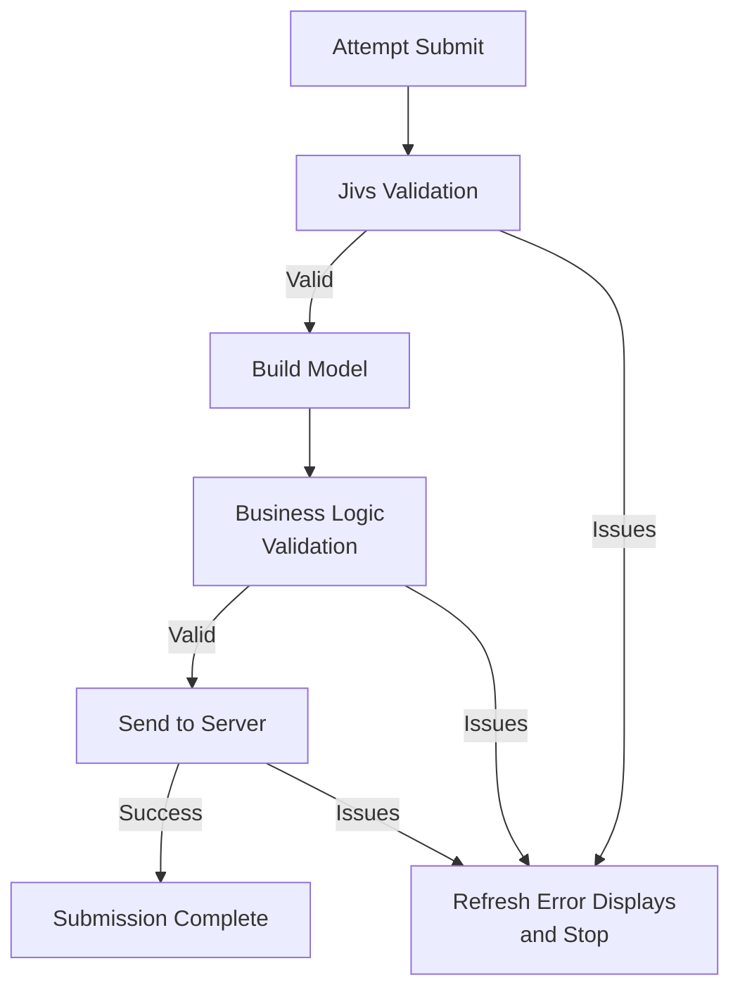

# Submitting the Client Form

When the user submits a form, validation may happen at several points before the operation succeeds.

Jivs performs its validation first. The application may then perform additional business logic validation on the completed Model, followed by validation on the server.

At a high level, submission moves through four stages:



Each stage may report errors and stop the submission. When that happens, the error displays are refreshed so the user can correct the form.

The complete flow looks like this:



The sections below walk through that pipeline.

## Validate the Form

Start by validating the entire `ValueHostsManager`.

```ts
const validationState = vhm.validate();

if (validationState.doNotSave) {
    return;
}
```

`validate()` runs the validation needed for submission. `ValueHostsManager` distributes the results to the UI through the `onValidationStateChanged` callback. See [Using the ValueHostsManager within the Client](Using_the_ValueHostsManager_within_the_Client.md) for details.

If `doNotSave` is `true`, submission stops here.

## Build the Model

Once Jivs validation succeeds, the Native Values can be copied into the Model that will be used for business validation and sent to the server.

`ModelWriter` provides the convenient way to copy the configured `FieldValueHosts` into a Model:

```ts
const person = new Person();
const writer = new ModelWriter(vhm, person);
writer.writeToModel();
```

`ModelWriter` uses the Model property name configured for each `FieldValueHost`. By default, that property name is the name supplied to `builder.field()`.

When the `FieldValueHost` name and Model property name differ, set `propertyName` while configuring the field:

```ts
builder.field('FirstName', LookupKey.String, {
    propertyName: 'firstName'
});
```

Now `ModelWriter` knows that the `FirstName` ValueHost should be written to `person.firstName`.

Individual values can also be retrieved directly when needed:

```ts
person.firstName = vhm.vh('FirstName').getValue();
```

At this point the Model contains the Native Values established while the user edited the form.

## Run Business Logic Validation

Jivs validation is not necessarily the last validation required before saving.

The completed Model can be passed to application business logic for checks that operate on the Model as a whole or require other application data.

```ts
const issuesFound: Array<IssueFound> =
    validatePersonBeforeSave(person);
```

If business logic finds issues, provide them to the `ValueHostsManager`:

```ts
if (issuesFound.length > 0) {
    vhm.addExternalIssuesFound(issuesFound, true);
    return;
}
```

These issues join the validation information already managed by Jivs. The same validation callbacks refresh the application's error displays.

Submission stops until those issues have been resolved.

## Send the Model to the Server

Once client-side Jivs validation and business logic validation succeed, send the Model using the application's normal server communication.

```ts
const response = await savePerson(person);
```

Jivs does not require a particular HTTP library, API design, or submission mechanism.

Client-side validation also does not replace validation on the server. The server must determine whether the submitted data is actually acceptable before saving it.

## Handle Server Validation Results

A successful server response completes the submission.

When the server reports validation issues, provide them to Jivs so the existing validation UI is refreshed.

There are two equally valid approaches.

If the server uses Jivs and returns a Jivs Validation Payload, apply it directly:

```ts
vhm.fromValidationPayload(response.validationPayload);
```

If the server uses another validation system, convert its returned errors into `IssueFound` objects and add them to Jivs:

```ts
const issuesFound = convertToIssueFound(response.validationErrors);
vhm.addExternalIssuesFound(issuesFound, false);
```

In either case, updating the `ValueHostsManager` causes the validation callbacks established earlier to refresh the Field Errors, Validation Summary, and other validation-related UI.

The user can then correct the form and submit again.

## Submission Complete

When the server accepts the submitted data, the submission pipeline is complete. The application can perform whatever success behavior it requires, such as navigation, displaying confirmation, or updating the current view.

## Putting the Submission Process Together

Here is the complete client-side submission process. Application-specific business validation, server communication, and handling of server issues are represented by functions supplied by the application.

```ts
async function submitPerson(vhm: ValueHostsManager): Promise<void> {
    const validationState = vhm.validate();

    if (validationState.doNotSave) {
        return;
    }

    const person = new Person();
    const writer = new ModelWriter(vhm, person);
    writer.writeToModel();

    const issuesFound = validatePersonBeforeSave(person);
    if (issuesFound.length > 0) {
        vhm.addExternalIssuesFound(issuesFound, true);
        return;
    }

    const response = await savePerson(person);

    if (handleServerIssues(response, vhm)) {
        return;
    }

    submissionSucceeded(person);
}
```

`handleServerIssues()` determines whether the response contains validation issues and provides them to Jivs. Its implementation depends on whether the server uses Jivs or another validation system.

`SavePersonResponse` is an application-defined response type.

### When the Server Uses Jivs

A server using Jivs can return a Jivs Validation Payload:

```ts
function handleServerIssues(
    response: SavePersonResponse,
    vhm: ValueHostsManager
): boolean {
    if (!response.validationPayload) {
        return false;
    }

    vhm.fromValidationPayload(response.validationPayload);
    return true;
}
```

### When the Server Uses Another Validation System

An application using another server-side validation system can convert its errors into `IssueFound` objects:

```ts
function handleServerIssues(
    response: SavePersonResponse,
    vhm: ValueHostsManager
): boolean {
    if (response.validationErrors.length === 0) {
        return false;
    }

    const issuesFound =
        convertToIssueFound(response.validationErrors);

    vhm.addExternalIssuesFound(
        issuesFound,
        false // Issues came from another system.
    );
    return true;
}
```

The submission function itself does not change. Only the application-specific handling of server issues depends on how validation is implemented on the server.

---

Next, we'll look at how Jivs participates in validation on the server.
