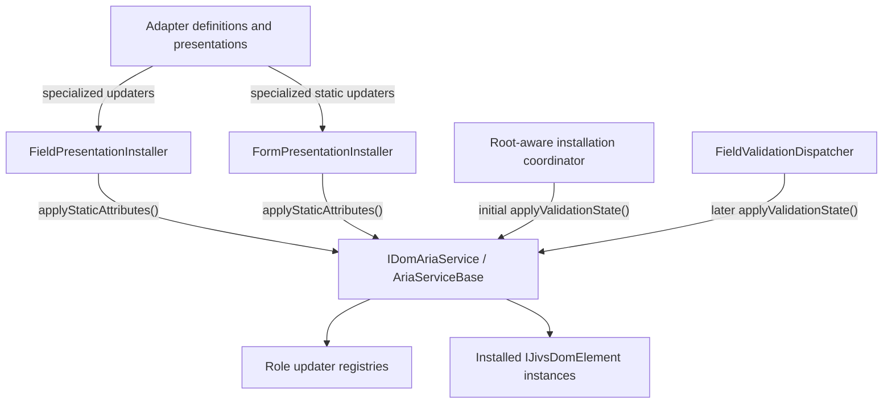

# Jivs-DOM ARIA Design

## Purpose

This is the working design for ARIA support in `jivs-dom` and `jivs-simpledom`. It records the participating types, responsibilities, and decisions settled through Q269.

The ARIA section in `Jivs-DOM_Implementation_Design.md` remains unchanged until this design is settled and a revision is requested.

## Design Direction

- `AriaServiceBase` coordinates ARIA work but contains very little element-specific behavior.
- Immutable updater objects perform role-specific or widget-specific work.
- Static installation work and dynamic field-state work use separate updater interfaces.
- `AriaServiceBase` owns the role-to-updater registries directly.
- An Editor Adapter Definition may supply widget-specific updaters.
- A field or form presentation may optionally supply presentation-specific updaters.
- Editor ARIA behavior belongs exclusively to its Adapter Definition, not its field presentation.
- Visual presentation and accessibility behavior remain separate responsibilities.
- All dynamic attributes managed by an updater are synchronized to current Jivs state.

## Updater Concept

An updater is an immutable object that applies one category of accessibility behavior to an element. It receives the target element and all operation-specific data as method parameters; it does not retain the element or its field state.

Two updater kinds separate installation work from validation-state work:

- A static updater establishes fixed semantics such as `role`, `aria-hidden`, or an error-message element ID.
- A field-state updater synchronizes changing semantics or content such as required state, invalid state, `aria-errormessage`, or dedicated plain-text error content.

An element may be affected by two updater sources:

- The ARIA service registry supplies at most one updater for the element's role. This is the reusable default behavior for that role.
- An Editor Adapter Definition or presentation may supply a specialized updater for its widget or markup.

The specialized updater decides through `alsoRunRoleUpdater` whether the role updater runs first. `AriaServiceBase` coordinates this composition but delegates the element-specific work.

## Architecture



The installers are installation-time consumers. They request static composition and record the specialized field-state updater on each installed element. The root-aware coordinator initializes dynamic ARIA after the field's elements are installed. `FieldValidationDispatcher` invokes the same validation-state operation after later validation changes.

## Core Updater Contracts

### `IDomAriaStaticElementUpdater`

Applies fixed accessibility behavior during installation.

```ts
interface IDomAriaStaticElementUpdater {
    readonly alsoRunRoleUpdater: boolean;

    applyStaticAttributes(
        element: IJivsDomElement,
        role: ElementRole | string,
        valueHost?: IFieldValueHost
    ): void;
}
```

`valueHost` is available for field roles and omitted for form roles.

### `IDomAriaFieldStateElementUpdater`

Synchronizes one installed field element with the current field state.

```ts
interface IDomAriaFieldStateElementUpdater {
    readonly alsoRunRoleUpdater: boolean;

    applyValidationState(
        element: IJivsDomElement,
        role: ElementRole | string,
        valueHost: IFieldValueHost,
        state: ValueHostValidationState,
        errorMessageId?: string
    ): void;
}
```

`errorMessageId` is the existing ID of the selected error-message element. Editor updaters consume it when managing `aria-errormessage`.

### Updater Composition

- A role may have zero or one registered static updater and zero or one registered field-state updater.
- Registering another updater for the same role replaces the previous registration.
- There are no unregister operations.
- A specialized updater is supplied by an Adapter Definition or presentation.
- When no specialized updater is supplied, the registered role updater runs when available.
- When a specialized updater is supplied and `alsoRunRoleUpdater` is `true`, the registered role updater runs first and the specialized updater runs second.
- When `alsoRunRoleUpdater` is `false`, only the specialized updater runs.
- `alsoRunRoleUpdater` is ignored when an updater itself was obtained from the role registry.
- If the role updater throws, the specialized updater is not invoked.

### Updater Lifetime

All updater instances are immutable after construction.

- They may expose immutable configuration established during construction.
- They do not retain elements, ValueHosts, validation states, roots, or operation-specific data.
- Registration methods accept updater instances rather than creator functions.
- Adapter Definitions and presentations may return a shared updater instance.

## `IDomAriaService`

The optional, replaceable `DomServices` child service that coordinates static and dynamic ARIA work.

```ts
interface IDomAriaService {
    registerStaticUpdater(
        role: ElementRole | string,
        updater: IDomAriaStaticElementUpdater
    ): void;

    registerFieldStateUpdater(
        role: ElementRole | string,
        updater: IDomAriaFieldStateElementUpdater
    ): void;

    applyStaticAttributes(
        element: IJivsDomElement,
        role: ElementRole | string,
        valueHost: IFieldValueHost | undefined,
        specializedUpdater:
            IDomAriaStaticElementUpdater | null
    ): void;

    applyValidationState(
        root: HTMLElement,
        valueHost: IFieldValueHost,
        state: ValueHostValidationState
    ): void;
}
```

Setting the `DomServices` ARIA service property to `null` disables Jivs-managed ARIA work.

Role updater lookup occurs during each operation. Replacing a static role updater affects future installations. Replacing a field-state role updater affects already-installed elements on their next validation-state application.

`AriaServiceBase` does not catch or log discovery or updater exceptions. They propagate to the installation coordinator or dispatcher, which owns failure handling and logging.

## Specialized-Updater Providers

The existing Adapter Definition and presentation contracts expose optional updater getters directly. An omitted getter and a getter returning `null` both indicate that the provider supplies no specialized updater of that kind.

```ts
interface IDomEditorAdapterDefinition {
    // Existing members.

    getStaticAriaElementUpdater?():
        IDomAriaStaticElementUpdater | null;

    getFieldStateAriaElementUpdater?():
        IDomAriaFieldStateElementUpdater | null;
}

interface IFieldPresentation {
    // Existing members.

    getStaticAriaElementUpdater?():
        IDomAriaStaticElementUpdater | null;

    getFieldStateAriaElementUpdater?():
        IDomAriaFieldStateElementUpdater | null;
}

interface IFormPresentation {
    // Existing members.

    getStaticAriaElementUpdater?():
        IDomAriaStaticElementUpdater | null;
}
```

There are no separate `IDomAriaEditorDefinition`, `IDomAriaPresentation`, or `IDomAriaFieldPresentation` capability interfaces.

- Field and form presentations may supply static updaters.
- Only field presentations may supply field-state updaters.
- Form roles currently have no validation-state ARIA updater contract.
- `aria-error` never uses a presentation.
- The former `findAriaEditors()` operation is removed. A specialized updater receives the installed editor anchor and owns any widget-specific distribution of work.

### Specialized-Updater Ownership

- For `editor`, the Adapter Definition is the sole specialized-updater provider.
- `EditorInstaller` passes the Adapter Definition's updater or explicit `null` to `FieldPresentationInstaller`.
- An editor presentation is never consulted for editor ARIA updaters.
- For non-editor field roles, `FieldPresentationInstaller` obtains specialized updaters from the installed presentation when the caller does not explicitly supply them.
- `aria-error` has no presentation and therefore relies on its registered role updaters.

## Installed Element State

`IJivsDomElement` stores only the specialized field-state updater selected during installation.

```ts
interface IJivsDomElement extends HTMLElement {
    jivsAriaFieldStateUpdater?:
        IDomAriaFieldStateElementUpdater | null;

    // Existing installed capabilities.
}
```

| Value | Meaning |
| --- | --- |
| `undefined` | ARIA installation did not complete. Field-state processing skips the element. |
| `null` | ARIA installation completed without a specialized updater. The registered role updater remains eligible. |
| Updater instance | ARIA installation completed with a specialized updater. Its `alsoRunRoleUpdater` value controls composition. |

The property is also the completion guard for the element's entire ARIA installation. Static updaters are applied immediately and are not stored.

If static application throws, the property remains `undefined`. A later installation attempt may retry, so static updaters must be idempotent.

## Field Presentation Installation Support

```ts
interface FieldPresentationInstallOptions {
    presentationName?: string | null;

    staticAriaUpdater?:
        IDomAriaStaticElementUpdater | null;

    fieldStateAriaUpdater?:
        IDomAriaFieldStateElementUpdater | null;
}
```

The ARIA option values mean:

| Value | Meaning |
| --- | --- |
| `undefined` | Obtain the specialized updater from the installed presentation's optional ARIA capability. |
| `null` | The caller explicitly supplies no specialized updater. |
| Updater instance | Use the caller-supplied specialized updater. |

`FieldPresentationInstaller.install()` completes presentation work before independent ARIA work:

1. Resolve, create, initially apply, and store the presentation when presentation installation is required.
2. Resolve specialized ARIA updaters from the options or installed presentation.
3. Apply static ARIA through `IDomAriaService.applyStaticAttributes()`.
4. Store the specialized field-state updater or `null`.

A presentation result of `null` does not prevent ARIA installation. If ARIA installation fails after presentation installation succeeds, the presentation remains stored and ARIA remains `undefined` for retry.

`EditorInstaller` always calls `FieldPresentationInstaller` during a new editor installation, even when the editor has no presentation. Presentation and ARIA installation are independent.

## `ElementRole`

The standard role vocabulary adds:

```ts
enum ElementRole {
    // Existing members.
    ariaError = "aria-error"
}
```

The `aria-error` role identifies the dedicated, visually hidden error-message element owned entirely by ARIA processing. It does not support a presentation.

## Field Element Discovery

```ts
interface IFieldAriaElementAnchors {
    readonly editorAnchor:
        IJivsDomElement | null;

    readonly errorMessageElement:
        IJivsDomElement | null;

    readonly errorMessageRole:
        ElementRole.error |
        ElementRole.ariaError |
        null;
}
```

The role identifies content ownership:

- `error`: a field presentation owns the element's error content.
- `ariaError`: the registered ARIA field-state updater owns plain-text content.
- `null`: no eligible error-message element was selected.

The anchors determine which element is passed to each updater. Updaters do not receive the complete anchors object.

## `AriaServiceBase`

`AriaServiceBase` remains the shared abstract coordinator.

```ts
abstract class AriaServiceBase
    implements IDomAriaService {

    // Implements the public service operations.

    protected abstract findElements(
        root: HTMLElement,
        valueHost: IFieldValueHost
    ): IFieldAriaElementAnchors;
}
```

It:

- owns the static and field-state role registries;
- implements registration and replacement;
- implements updater composition;
- implements static application;
- orchestrates field-state application;
- retrieves the selected error-message element's existing ID;
- performs no role-specific attribute or content mutation itself.

`SimpleDomAriaService` implements `findElements()` using SimpleDom attributes and selectors. It contains no role-specific ARIA mutation logic.

## SimpleDom Error-Message Selection

`SimpleDomAriaService.findElements()` performs fresh discovery beneath the supplied root and uses this precedence:

1. Select the field's `data-jivs-role="error"` element when it declares `data-aria-errormessage="true"`. Return `ElementRole.error`.
2. Otherwise, select the field's `data-jivs-role="aria-error"` element. Return `ElementRole.ariaError`.
3. Otherwise, return no error-message element and a `null` role.

An editor cannot serve as its own error-message element. The absence of an eligible error-message element does not prevent required or invalid state from being applied to the editor.

## Validation-State Orchestration

`AriaServiceBase.applyValidationState()`:

1. Calls `findElements()`.
2. Skips any selected element whose `jivsAriaFieldStateUpdater` remains `undefined`.
3. Reads the selected error-message element's existing, nonempty ID.
4. Applies the error-message element's registered and specialized field-state updaters in the agreed order.
5. Applies the editor's registered and specialized field-state updaters, passing the error-message ID.

The error-message element is processed before the editor. The ID is established during static installation and is not generated during field-state processing.

If a selected error-message element lacks a usable ID, field-state processing passes `undefined` and continues. The editor updater omits `aria-errormessage` but may still apply required and invalid state.

The root-aware installation coordinator performs initial dynamic ARIA once it has installed the editor and all field-presentation elements for the field:

```ts
ariaService.applyValidationState(
    root,
    valueHost,
    valueHost.currentValidationState
);
```

This initial call occurs after presentation initialization. The identity and complete algorithm of the root-aware coordinator are deferred to the implementation guide's installation-coordination section.

## Built-in Updater Inventory

Exact concrete class names remain to be selected.

### Registered Static Updaters

| Role | Behavior |
| --- | --- |
| `ElementRole.summary` | Assign `role="status"` when `role` is absent. Assign `aria-atomic="true"` when `aria-atomic` is absent. Preserve each existing value independently. |
| `ElementRole.required` | Assign `aria-hidden="true"` when `aria-hidden` is absent. |
| `ElementRole.error` | Assign a missing ID using the `error` suffix. |
| `ElementRole.ariaError` | Assign a missing ID using the `ariaerror` suffix. |

One immutable error-element updater may be registered under both error roles and use its `role` parameter to select the suffix.

Default generated IDs use distinct forms so both error elements may coexist:

```text
{containerIdentifier}_{elementIdentifier}_error
{containerIdentifier}_{elementIdentifier}_ariaerror
```

Existing developer-supplied IDs are preserved.

### Registered Field-State Updaters

| Role | Behavior |
| --- | --- |
| `ElementRole.editor` | Native-editor default. Synchronizes native `required`, `aria-invalid`, and `aria-errormessage`. Does not assign `aria-required`. |
| `ElementRole.ariaError` | Writes the selected field error messages as plain text and clears the content when appropriate. |

There is no registered field-state updater for `ElementRole.error`. Its presentation owns state-dependent content. A presentation may supply a specialized updater when its markup requires additional accessibility behavior.

The `aria-error` updater uses the existing Issues Found formatter so issue ordering, field message selection, and HTML-to-text conversion are shared:

```ts
element.textContent = state.isValid
    ? ""
    : issuesFoundFormatter.buildAsText(
        state.issuesFound,
        false,
        "; "
    );
```

The semicolon-and-space delimiter is supplied explicitly instead of using the formatter's default bullet delimiter.

### Exported ARIA-Required Editor Updater

Jivs-DOM also exports a reusable field-state updater that synchronizes:

- `aria-required`;
- `aria-invalid`;
- `aria-errormessage`.

It is not registered as the default updater for `ElementRole.editor`. Adapter Definitions for editors without equivalent native required semantics may return it with `alsoRunRoleUpdater: false`.

### `InputRadioButtonAdapterDefinition`

The built-in radio-group definition supplies:

- a specialized static updater that assigns `role="radiogroup"` to the containing installation anchor only when `role` is absent;
- the exported ARIA-required field-state updater with `alsoRunRoleUpdater: false`.

The containing anchor receives group-level required, invalid, and error-message relationship state. Descendant radio inputs do not receive duplicate group-level ARIA state.

## Attribute Ownership Rules

### Static Attributes

Static updaters assign their attributes only when the attribute is absent. Developer-supplied values are preserved.

### Dynamic Attributes

Field-state updaters fully own the dynamic attributes they manage. They set or remove them according to current Jivs configuration and validation state, even when authored markup initially supplied them.

| Attribute | Standard dynamic rule |
| --- | --- |
| `required` | Present when `valueHost.required` is `true`; removed otherwise. |
| `aria-required="true"` | Present when `valueHost.required` is `true`; removed otherwise. |
| `aria-invalid="true"` | Present when `state.isValid === false`; removed otherwise. |
| `aria-errormessage="{id}"` | Present while invalid when a usable error-message ID exists; removed otherwise. |

An Adapter Definition may suppress the role updater and supply different ownership rules through its specialized updater.

## Error Handling

- Updaters and discovery operations throw normally.
- `AriaServiceBase` does not log or catch their exceptions.
- A registered-updater failure stops processing before the specialized updater for that element.
- The installation coordinator owns installation logging and rethrows installation failures.
- Runtime validation dispatch follows the dispatcher's established failure policy.

## Deferred Items

The following decisions belong to later implementation-guide sections or require final review:

- exact concrete class names for built-in updaters;
- the root-aware installation coordinator's concrete identity and complete algorithm;
- concrete `EditorInstaller` ownership and construction;
- `DomServices` default construction and registration of built-in updaters;
- any logging policy for replacing an existing role registration;
- final TypeScript documentation comments and public export list.
