# Jivs-DOM Implementation Design

## Purpose and Scope

This document is the implementation blueprint for adding DOM support to the Jivs repository. It defines the architecture, public API, concrete types, and package responsibilities needed to implement:

* `@plblum/jivs-dom`
* `@plblum/jivs-simpledom`
* demonstration websites that exercise and explain those packages

`jivs-dom` provides reusable integration between Jivs and browser DOM elements. It supplies editor adapters, installation services, dispatchers, validation presentations, accessibility support, error-message formatting, and related CSS without imposing a particular HTML markup convention.

`jivs-simpledom` is a concrete implementation built on `jivs-dom`. It uses a defined set of HTML attributes to discover elements, associate them with Jivs objects, select presentations, and install the required DOM behavior.

The document also identifies changes required in `jivs-engine` to support these packages.

This is a coding blueprint rather than a history of the design process or an end-user learning guide. It uses exact API names and signatures where decisions have been completed. Any remaining conceptual APIs are identified as unresolved and must be finalized before their implementation sections are considered complete.

Repository placement, demonstration website organization, and testing responsibilities are included where they affect the implementation design. Detailed development commands, migration sequencing, publishing procedures, and end-user documentation remain outside its scope.

## Architectural Overview

### Relationship with jivs-engine

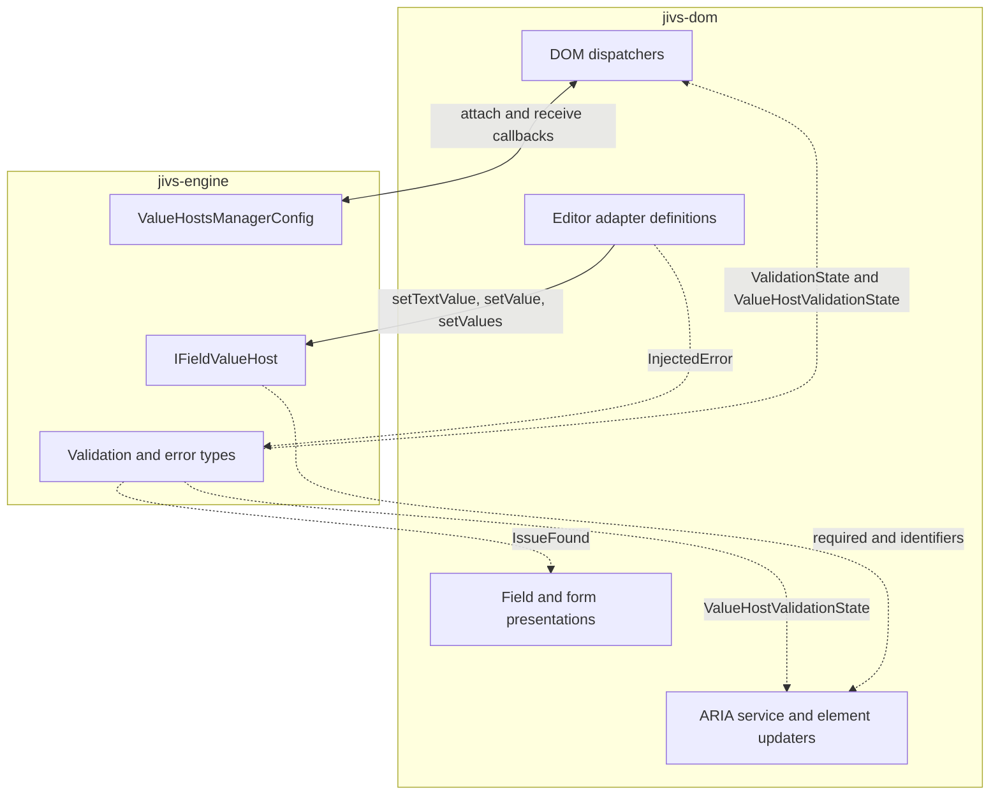

The principal `jivs-engine` integration points are:

| Jivs API                                                    | Use within `jivs-dom`                                                                                                                                                               |
| ----------------------------------------------------------- | ----------------------------------------------------------------------------------------------------------------------------------------------------------------------------------- |
| `ValueHostsManagerConfig.onTextValueChanged`                | Notifies a Text Value dispatcher. The dispatcher obtains the current Text Value from the supplied `IFieldValueHost` and writes it through installed `IDomTextValueAdapter` objects. |
| `ValueHostsManagerConfig.onValueChanged`                    | Notifies a Native Value dispatcher. The dispatcher obtains the current Native Value from the supplied `IValueHost` and writes it through installed `IDomValueAdapter` objects.      |
| `ValueHostsManagerConfig.onValueHostValidationStateChanged` | Supplies the `ValueHostValidationState` used by installed field presentations and field-level ARIA behavior.                                                                        |
| `ValueHostsManagerConfig.onValidationStateChanged`          | Supplies the `ValidationState` used by installed form presentations.                                                                                                                |
| `IFieldValueHost.setTextValue()`                            | Accepts textual editor input and lets Jivs perform its configured parsing and validation.                                                                                           |
| `IFieldValueHost.setValue()`                                | Accepts a Native Value from an editor that exposes non-textual or structured data.                                                                                                  |
| `IFieldValueHost.setValues()`                               | Accepts related Text and Native Values when parsing is performed outside Jivs. It can also receive an `InjectedError` when that parsing fails.                                      |
| `IFieldValueHost.getElementIdentifier()`                    | Supplies the application-defined identifier used by a DOM convention to associate the field with its elements.                                                                      |
| `ValidationState`                                           | Describes validation across the `ValueHostsManager` and drives form presentation.                                                                                                   |
| `ValueHostValidationState`                                  | Describes validation for one ValueHost and drives field presentation.                                                                                                               |
| `IssueFound`                                                | Supplies the validation messages and metadata consumed by error displays, summaries, and DOM-oriented message formatting.                                                           |
| `InjectedError`                                             | Allows an editor adapter definition that performs external parsing to report a parsing failure through Jivs validation.                                                             |
| `ValueHostsManager.broadcastState()`                        | Republishes current Text Values, field validation state, and form validation state when initialization did not produce the usual change callbacks.                                  |

### Editor Element Installation

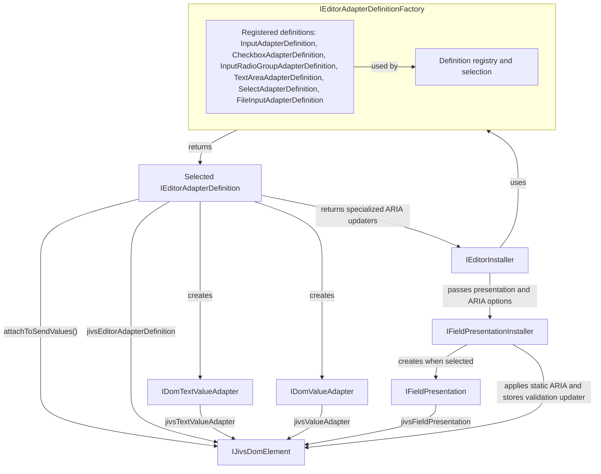

### Editor Callback Flows

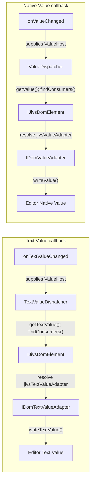

### Presentation Installation

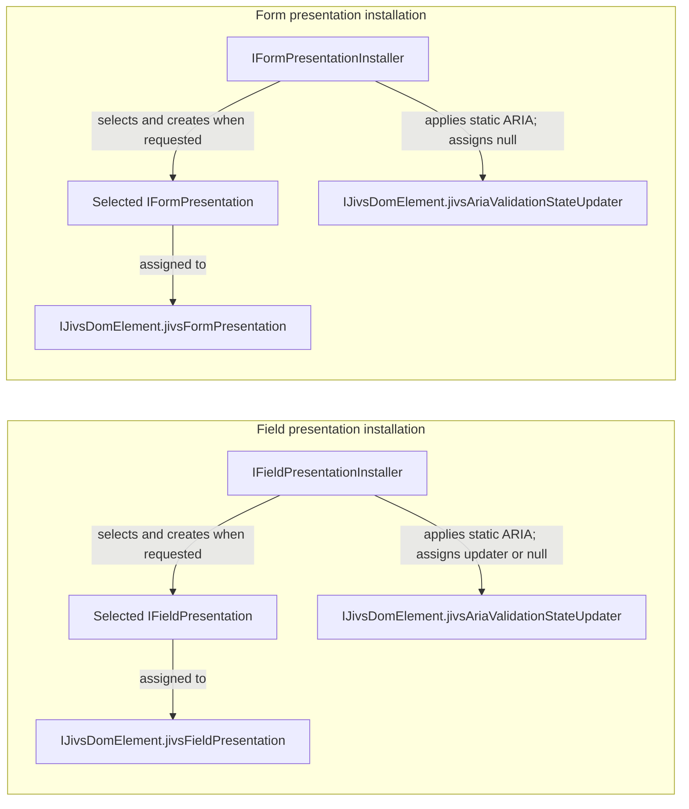

### Field Presentation Flow

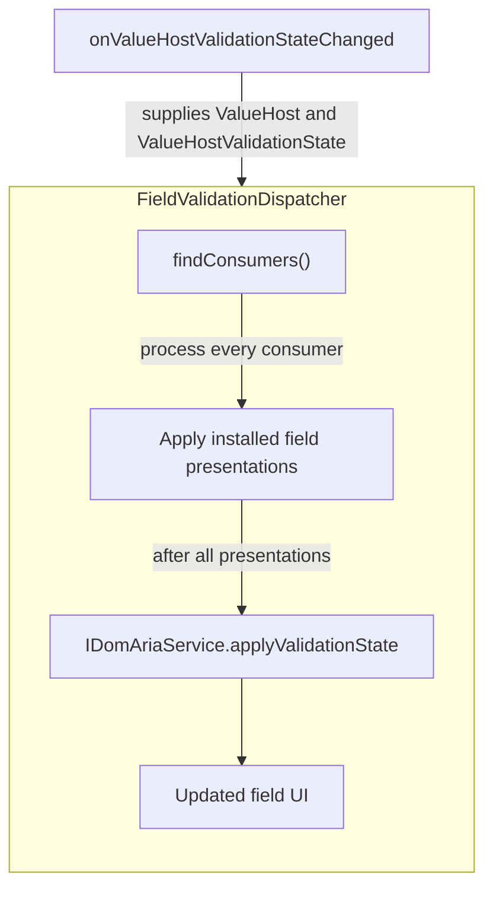

### Form Presentation Flow

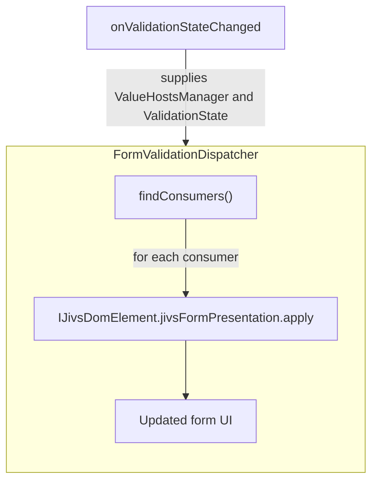
## Core Design Principles

* DOM elements own element-specific installation state. Installed adapter definitions, adapters, and presentations are exposed through the `IJivsDomElement` contract.

* Registered adapter definitions are shared and immutable. They do not retain element-specific, ValueHost-specific, or installation-specific state.

* Adapters and presentations are created for individual elements. They may retain state belonging to that element but do not retain a `ValueHostsManager`.

* Shared services do not retain forms, elements, element collections, or DOM subtrees.

* Dispatchers are created for a specific callback attachment. They may retain configuration and discovery policy, but they rediscover consumer elements during every dispatch and do not retain the elements they find.

* The four callback capabilities remain independent: Text Value changes, Native Value changes, field validation changes, and form validation changes can be attached and replaced separately.

* Editor installation is idempotent after successful completion. Later calls that resolve to the same installation anchor do not modify the anchor or attach additional event handlers.

* Public behavior is replaceable through interfaces, service properties, factories, and registration methods. Applications can supply custom widgets, presentations, dispatchers, discovery conventions, accessibility behavior, and message formatting without changing `jivs-dom` internals.

* Where reusable behavior requires markup-specific element discovery, `jivs-dom` exposes protected abstract methods for a concrete DOM convention to implement. `jivs-simpledom` supplies the standard implementation delivered with Jivs, while `jivs-dom` remains independent of SimpleDom attributes and selectors.

## Required Jivs Engine Support

### Container Identifier

A page may contain more than one `ValueHostsManager`, each responsible for a different form or region of the DOM. Field identifiers, presentation roles, and other selector characteristics may be repeated between those regions.

Dispatchers rediscover consumer elements whenever a callback occurs. If discovery always begins at the document level, a dispatcher may find and update elements belonging to another `ValueHostsManager`.

The manager therefore needs an optional identifier for its containing DOM region. A dispatcher can resolve that container first and restrict all consumer discovery to the resulting subtree.

`ValueHostsManagerConfig` adds:

```ts
interface ValueHostsManagerConfig {
    containerIdentifier?: string | null;
}
```

`IValueHostsManager` and `ValueHostsManager` expose that identifier through:

```ts
getContainerIdentifier(
    template?: string
): string | null;
```

When `containerIdentifier` contains a nonempty string, `getContainerIdentifier()` returns it. When a template is supplied, the method replaces `{0}` with the configured identifier.

When the configuration value is absent, `null`, or empty, the method returns `null`. Unlike `IFieldValueHost.getElementIdentifier()`, it does not fall back to a ValueHost name.

DOM dispatchers use the result to determine their query root:

* When the result is `null`, discovery begins at `document.body`.
* When an identifier is returned, the concrete DOM convention resolves the corresponding container element and uses it as the discovery root.
* When a configured identifier cannot be resolved, dispatch is abandoned and logged. It must not fall back to `document.body`, where it could affect elements belonging to another `ValueHostsManager`.

The engine stores the identifier but does not interpret it. A concrete DOM convention decides whether it represents selector syntax or another lookup mechanism.

### Current Validation State

Form presentation installation requires access to the manager’s current validation state without running validation or invoking validation callbacks. Validation groups make this state group-specific.

#### Validation-State Group

`ValidationState` gains an optional `group` property:

```ts
interface ValidationState {
    group?: string;
    isValid: boolean;
    doNotSave: boolean;
    issuesFound: IssueFound[] | null;
    asyncProcessing: boolean;
}
```

The property identifies the validation group used to construct the state. When no group was supplied, it remains `undefined`.

`ValueHostValidationState` continues to extend `ValidationState`. It therefore also includes `group`:

```ts
interface ValueHostValidationState
    extends ValidationState {

    status: ValidationStatus;

    // Existing field-specific members.
}
```

A `ValueHostValidationState` retains the group supplied through `ValidateOptions.group` when its field was validated.

The standard explicit wildcard group is `"*"`. Omitting the group remains valid and produces `undefined`. Group comparison uses the existing `groupsMatch()` behavior, under which `null`, `undefined`, `""`, and `"*"` all mean that group matching is unrestricted.

#### Manager Current-State Method

`IValueHostsManager` exposes the current manager state as a method because the requested group affects the result:

```ts
interface IValueHostsManager {
    currentValidationState(
        group?: string
    ): ValidationState;
}
```

`currentValidationState(group)` returns a state calculated for the requested group:

* `isValid`, `doNotSave`, `issuesFound`, and `asyncProcessing` include only the Value Hosts and validation results applicable to that group;
* the returned state carries the requested group in `state.group`;
* omitting the argument returns the unrestricted manager state;
* calling the method does not run validation;
* calling the method does not invoke validation callbacks.

This allows a newly installed Validation Summary or submit-control presentation to receive the correct existing state:

```ts
presentation.apply(
    valueHostsManager,
    valueHostsManager.currentValidationState(
        options.group
    )
);
```

#### Group-Specific Caching

Constructing a manager `ValidationState` requires calculating several aggregate values and collecting the applicable issues. The result is therefore cached.

The cache must associate each state with the group for which it was created. A state created for one specific group must never satisfy a request for another group.

Group keys follow the same case-insensitive semantics used by validation-group matching. Wildcard forms represent the unrestricted state.

Whenever engine activity changes validation information that could affect a manager state, all cached manager states are invalidated. Clearing the complete cache is required because one change may affect:

* a specifically grouped state;
* the unrestricted state;
* another state whose applicable validators overlap that group.

The next call to `currentValidationState(group)` reconstructs and caches the missing state for that group. Repeated calls for the same group return the cached instance until invalidation.

#### State Construction

The existing protected state-construction behavior remains the source of the calculated values:

```ts
protected createValidationState(
    options?: ValidateOptions
): ValidationState {
    return {
        group: options?.group,
        isValid:
            this.calculateIsValid(options),
        doNotSave:
            this.calculateDoNotSave(options),
        issuesFound:
            this.getIssuesFound(options?.group),
        asyncProcessing:
            this.calculateAsyncProcessing(options)
    };
}
```

Normal validation processing continues to create one `ValidationState` instance and deliver that same instance to every validation-state listener.

Cache invalidation and state calculation must be separated sufficiently for `currentValidationState(group)` to populate one missing cache entry without invalidating valid entries for other groups. This may be implemented with a private calculation helper shared by `createValidationState()` and `currentValidationState()`, while normal state-changing engine paths invalidate the cache before creating and notifying their new state.

This support allows `jivs-dom` to initialize and update grouped form presentations without rerunning validation and without independently reconstructing manager validation state.

## The Installed DOM Element

`IJivsDomElement` is the stateful installation surface shared by installers, dispatchers, and the ARIA service. It augments an ordinary `HTMLElement` with the Jivs behavior installed for that element.

It is a TypeScript contract, not a new runtime element class:

```ts
interface IJivsDomElement extends HTMLElement {
    jivsEditorAdapterDefinition?:
        IEditorAdapterDefinition;

    jivsTextValueAdapter?:
        IDomTextValueAdapter | null;

    jivsValueAdapter?:
        IDomValueAdapter | null;

    jivsFieldPresentation?:
        IFieldPresentation | null;

    jivsAriaValidationStateUpdater?:
        IDomAriaValidationStateElementUpdater | null;

    jivsFormPresentation?:
        IFormPresentation | null;

    jivsFormPresentationGroup?: string;
}
```

### Adapter Definition State

`jivsEditorAdapterDefinition` has two states:

| Value                         | Meaning                                                                                                   |
| ----------------------------- | --------------------------------------------------------------------------------------------------------- |
| `undefined`                   | Editor installation has not completed on this element.                                                    |
| `IEditorAdapterDefinition` | Editor installation completed on this element using this definition. Later installation calls are no-ops. |

`IEditorInstaller` assigns the definition only after installing the anchor’s adapter capabilities, DOM-to-Jivs event handling, field presentation, and ARIA behavior. The property therefore identifies both the installed definition and successful completion of editor installation.

The installed definition is shared and immutable. It describes the widget behavior but does not contain state belonging to this element.

### Adapter State

`jivsTextValueAdapter` and `jivsValueAdapter` each have three states:

| Value            | Meaning                                                                                                       |
| ---------------- | ------------------------------------------------------------------------------------------------------------- |
| `undefined`      | The capability has not been examined. An installer may attempt to create it.                                  |
| Adapter instance | The capability is installed and available to its dispatcher.                                                  |
| `null`           | The capability was examined but is unavailable for this widget. Installation does not retry it automatically. |

Text Value and Native Value capabilities are independent. An element may provide either adapter, both adapters, or neither adapter.

### Presentation State

`jivsFieldPresentation` and `jivsFormPresentation` also have three states:

| Value                 | Meaning                                                                                               |
| --------------------- | ----------------------------------------------------------------------------------------------------- |
| `undefined`           | Presentation installation has not been attempted.                                                     |
| Presentation instance | The presentation is installed and available to its dispatcher.                                        |
| `null`                | The element has no presentation because it was disabled or no form-role default was configured.       |

A no-op presentation is still a presentation instance. `null` specifically records the decision that the element has no presentation.

For a field presentation, `null` results from explicit disabling. For a form presentation, it can also result when neither an explicit presentation name nor a role default is available.

`jivsFormPresentationGroup` stores the routing group bound to an installed form presentation. It remains `undefined` when form presentation installation has not completed or resolves to `null`.

The presentation installer methods return nullable results consistent with these states:

```ts
interface FieldPresentationInstallOptions {
    presentationName?: string | null;

    staticAriaUpdater?:
        IDomAriaStaticElementUpdater | null;

    validationStateAriaUpdater?:
        IDomAriaValidationStateElementUpdater | null;
}

interface IFieldPresentationInstaller {
    install(
        valueHost: IFieldValueHost,
        element: IJivsDomElement,
        role: ElementRole | string,
        options?: FieldPresentationInstallOptions
    ): IFieldPresentation | null;
}

interface FormPresentationInstallOptions {
    presentationName?: string | null;
    group?: string;
}

interface IFormPresentationInstaller {
    install(
        valueHostsManager: IValueHostsManager,
        element: IJivsDomElement,
        role: ElementRole | string,
        options?: FormPresentationInstallOptions
    ): IFormPresentation | null;
}
```

### ARIA State

`jivsAriaValidationStateUpdater` records whether ARIA installation completed for the element and retains any specialized validation-state updater selected during installation:

| Value            | Meaning                                                                                                                         |
| ---------------- | ------------------------------------------------------------------------------------------------------------------------------- |
| `undefined`      | ARIA installation did not complete. Validation-state processing skips the element.                                              |
| `null`           | ARIA installation completed without a specialized validation-state updater. The registered role updater remains eligible.       |
| Updater instance | ARIA installation completed with a specialized validation-state updater. Its `alsoRunRoleUpdater` value controls composition.    |

Static updaters run during installation and are not retained. The property is assigned only after static ARIA work succeeds. A failure therefore leaves it `undefined` so a later installation attempt can retry.

Field-role elements may store an updater instance or `null`. Form-role elements do not use field validation-state updaters and store `null` solely as their ARIA completion marker.

When `DomServices.ariaService` is `null`, installers skip ARIA work and leave this property `undefined`.

### Element Lifetime

Adapter and presentation instances belong to the element on which they are installed. For editor installation, that element is the installation anchor resolved by the selected editor adapter definition and may differ from the element originally supplied to `IEditorInstaller.install()`.

Replacing an installation anchor removes its installed Jivs behavior with it. The replacement element must be installed before dispatchers can use it.

Replacing any installed element also removes its ARIA completion state. Static ARIA work and validation-state updater selection must be performed for the replacement element.

Dispatchers and the ARIA service read these public properties but never create missing capabilities during dispatch. Presentation and adapter properties are skipped when `undefined` or `null`. ARIA validation-state processing skips `jivsAriaValidationStateUpdater` only when it is `undefined`; `null` still permits the registered role updater to run.

Applications may replace installed adapter and presentation instances through these public properties. The definition recorded by a completed editor installation remains assigned for the lifetime of the anchor.

## Editor Architecture

### Editor Adapter Contracts

An Editor Adapter gives a specific editor widget the value-transfer functions needed by `jivs-dom`. Different widget behaviors require different adapter implementations. Initial implementations will support input, textarea, and select elements, with specialized implementations where their value semantics differ.

Applications do not register adapters directly. They register an `IEditorAdapterDefinition` with `IEditorAdapterDefinitionFactory`. The factory maintains and selects from those definitions. After a definition is selected for an element, the definition directly instantiates the appropriate adapters. There is no separate adapter registry or adapter lookup.

Editor adapters support two directions of communication:

* The write methods support Jivs-to-DOM callbacks. `onTextValueChanged` ultimately calls `writeTextValue()`, while `onValueChanged` ultimately calls `writeValue()`.
* The read methods support DOM-to-Jivs event handling. An `IEditorAdapterDefinition` attaches the editor’s change events and uses the installed adapter to obtain the current value before sending it to the `IFieldValueHost`.

> Without the DOM-to-Jivs event-handling requirement, the read methods would not be part of these adapter contracts. They exist so adapter definitions can reuse the same widget-specific value access used by callback dispatchers in the opposite direction.

Text Value and Native Value support remain separate capabilities. An adapter definition may create a Text Value adapter, a Native Value adapter, or both:

```ts
interface IDomTextValueAdapter {
    readTextValue(): string | undefined;

    writeTextValue(
        textValue: string | undefined
    ): void;
}

interface IDomValueAdapter {
    readValue(): unknown;

    writeValue(
        value: unknown
    ): void;
}
```

> Text Value adapters preserve the `string | undefined` contract of `IFieldValueHost.getTextValue()` and `IFieldValueHost.setTextValue()`. A concrete adapter is responsible for translating `undefined` when its DOM widget cannot represent it directly.

Each adapter instance belongs to one element. The standard base classes give concrete implementations strongly typed access to that element while preserving normal class behavior:

```ts
abstract class DomTextValueAdapterBase<
    TElement extends HTMLElement = HTMLElement
> implements IDomTextValueAdapter {

    public constructor(
        protected readonly element: TElement
    ) {
    }

    public abstract readTextValue():
        string | undefined;

    public abstract writeTextValue(
        textValue: string | undefined
    ): void;
}

abstract class DomValueAdapterBase<
    TElement extends HTMLElement = HTMLElement
> implements IDomValueAdapter {

    public constructor(
        protected readonly element: TElement
    ) {
    }

    public abstract readValue(): unknown;

    public abstract writeValue(
        value: unknown
    ): void;
}
```

Concrete adapters select the element type appropriate to their widget:

```ts
class InputTextValueAdapter
    extends DomTextValueAdapterBase<HTMLInputElement> {

    public readTextValue(): string {
        return this.element.value;
    }

    public writeTextValue(
        textValue: string | undefined
    ): void {
        this.element.value = textValue ?? "";
    }
}
```

Within adapter methods, `this` is the adapter instance. The associated DOM element is available through `this.element`.

The selected adapter definition constructs each adapter with the installation anchor and returns an instance ready for immediate use. No separate binding operation is required.

Adapters may retain additional element-specific state as class members. They do not retain an `IFieldValueHost` or `IValueHostsManager`.
### Editor Adapter Definitions

An editor adapter definition keeps the behaviors for one widget model together. Without this coordinating type, widget recognition, installation-anchor selection, Jivs-to-DOM value transfer, and DOM-to-Jivs event handling could be implemented independently and disagree about how the editor represents its value.

A definition is responsible for:

* recognizing fields and elements that use its widget model;
* resolving the element that serves as the installation anchor;
* directly constructing the anchor’s Text Value and Native Value adapters;
* attaching DOM event handlers that send edited values to the `IFieldValueHost`;
* identifying the default field presentation associated with the widget, when applicable;
* optionally supplying specialized static and validation-state ARIA updaters for the widget.

```ts
interface IEditorAdapterDefinition {
    readonly adapterKey: string;
    readonly priority: number;

    readonly defaultFieldPresentationName?:
        string | null;

    matches(
        valueHost: IFieldValueHost,
        element: HTMLElement
    ): boolean;

    resolveInstallationAnchor(
        valueHost: IFieldValueHost,
        element: IJivsDomElement
    ): IJivsDomElement;

    createTextValueAdapter(
        valueHost: IFieldValueHost,
        anchor: IJivsDomElement
    ): IDomTextValueAdapter | null;

    createValueAdapter(
        valueHost: IFieldValueHost,
        anchor: IJivsDomElement
    ): IDomValueAdapter | null;

    getStaticAriaElementUpdater():
        IDomAriaStaticElementUpdater | null;

    getValidationStateAriaElementUpdater():
        IDomAriaValidationStateElementUpdater | null;

    attachToSendValues(
        valueHost: IFieldValueHost,
        anchor: IJivsDomElement,
        options: EditorInstallOptions
    ): void;
}
```

The `IFieldValueHost` provides installation-time context to each operation. Neither the definition nor its returned adapters or ARIA updaters retain it.

A getter returning `null` means that the definition supplies no specialized updater of that kind. Returned updater instances are immutable and may be shared by every editor installed through the definition.

#### Definition Selection

`IEditorAdapterDefinitionFactory` registers and selects editor adapter definitions. It does not register, create, or look up adapter instances. Once the factory selects a definition, the definition resolves the installation anchor and directly instantiates the adapters appropriate to that anchor.

```ts
interface IEditorAdapterDefinitionFactory {
    register(
        definition: IEditorAdapterDefinition
    ): void;

    getDefinition(
        adapterKey: string
    ): IEditorAdapterDefinition | null;

    findDefinition(
        valueHost: IFieldValueHost,
        element: HTMLElement
    ): IEditorAdapterDefinition | null;
}
```

The factory preregisters all adapter definitions supplied with jivs-dom. They are given a low priority to allow easy overrides. It maintains an internal list of registrations ordered by priority in descending order for searching.

`getDefinition()` performs explicit selection by `adapterKey`. It does not use `priority` or call `matches()`.

`findDefinition()` performs automatic selection:

1. It evaluates definitions in descending numeric `priority` order.
2. It preserves registration order among definitions having the same priority.
3. It calls `matches(valueHost, element)` until the first definition returns `true`.
4. It returns `null` when no definition matches.

Priorities from `0` through `100` are the documented normal range, with larger values examined first. Negative values and values greater than `100` remain valid so applications are not prevented from placing definitions before or after the standard range.

`adapterKey` uniquely identifies a registered definition. Registering another definition with an existing key logs the replacement and uses the new definition for future explicit and automatic selection. Anchors already installed with the earlier definition retain it.

`matches()` is a read-only predicate. It must not modify or retain either argument.

#### Resolving the Installation Anchor

The element supplied to `IEditorInstaller.install()` identifies the editor encountered by the caller. The selected definition determines which element stores the completed installation and its installed capabilities.

`resolveInstallationAnchor()` returns that element.

For ordinary editors, the supplied element is also the installation anchor. `EditorAdapterDefinitionBase` implements this default behavior.

A composite editor may use several DOM elements for one logical value. Its definition can override `resolveInstallationAnchor()` so calls involving those elements converge on one anchor. The built-in `InputRadioGroupAdapterDefinition` instead requires the enclosing radio-group element to be supplied directly and uses the inherited default resolution.

Anchor resolution occurs before the installer examines `jivsEditorAdapterDefinition` or performs any installation mutations. Once an anchor is resolved, the installer passes that anchor to the adapter creation, event attachment, and presentation installation operations.

`resolveInstallationAnchor()` must not install adapters, attach events, install a presentation, or assign `jivsEditorAdapterDefinition`.

#### Completed Installation State

`IJivsDomElement.jivsEditorAdapterDefinition` records that editor installation completed successfully on the anchor.

The definition does not assign this property. `IEditorInstaller` assigns it after installing the adapters, event handlers, and presentation.

When anchor resolution returns an element whose `jivsEditorAdapterDefinition` is already assigned, the installer returns without calling the definition’s adapter creation or event attachment methods.

The property therefore serves both as the installed definition and as the completed-installation marker. No additional symbol or event-attachment marker is used.

#### Adapter Creation

The adapter creation methods are independent:

* An omitted method indicates that the definition never supports that capability.
* A returned adapter installs that capability on the anchor.
* A returned `null` records that the capability is unavailable for this particular installation.

The definition directly constructs the adapter. There is no adapter-instance registry or secondary factory lookup.

#### Base Implementation

`EditorAdapterDefinitionBase` implements shared definition behavior, default anchor resolution, diagnostic logging, and the standard DOM-to-Jivs submission paths.

Its constructor initializes the immutable definition properties:

```ts
abstract class EditorAdapterDefinitionBase
    implements IEditorAdapterDefinition {

    protected constructor(
        public readonly adapterKey: string,
        public readonly priority: number,
        public readonly defaultFieldPresentationName?:
            string | null
    ) {
    }

    public abstract matches(
        valueHost: IFieldValueHost,
        element: HTMLElement
    ): boolean;

    public resolveInstallationAnchor(
        valueHost: IFieldValueHost,
        element: IJivsDomElement
    ): IJivsDomElement {
        return element;
    }

    public attachToSendValues(
        valueHost: IFieldValueHost,
        anchor: IJivsDomElement,
        options: EditorInstallOptions
    ): void {
        // Log the start of event attachment at Debug level.

        this.attachToSendValuesCore(
            valueHost,
            anchor,
            options
        );

        // Log successful completion at Debug level.
    }

    protected abstract attachToSendValuesCore(
        valueHost: IFieldValueHost,
        anchor: IJivsDomElement,
        options: EditorInstallOptions
    ): void;
}
```

Concrete definitions override `attachToSendValuesCore()`, not `attachToSendValues()`. They choose and attach the DOM events appropriate to their widgets, while the public method provides consistent logging.

Definitions for ordinary editors inherit `resolveInstallationAnchor()`. Definitions for composite editors override it.

#### Diagnostic Logging

`attachToSendValues()` has access to `valueHost.services.loggingService`. It logs at `LoggingLevel.Debug` so normal applications do not receive installation noise unless diagnostic logging is enabled.

Useful entries include:

* attachment started, identifying the ValueHost and `adapterKey`;
* attachment completed successfully;
* a concrete definition intentionally attached no handler;
* a required installed adapter was unavailable when an event fired.

Concrete definitions may add Debug entries describing their selected event strategy, such as attaching `change` alone or attaching both `input` and `change`.

Logs should identify the ValueHost, adapter key, and relevant event names. They should not include the editor’s actual value because it may contain private application data.

#### Protected Submission Helpers

The base class provides protected methods for the standard event-handler paths. Concrete definitions attach events and invoke the appropriate helper.

##### Send a Text Value

```ts
protected sendTextValue(
    valueHost: IFieldValueHost,
    anchor: IJivsDomElement,
    duringEdit: boolean
): void;
```

This helper:

1. obtains `anchor.jivsTextValueAdapter`;
2. returns after a Debug log when the adapter is `undefined` or `null`;
3. calls `readTextValue()`;
4. calls `valueHost.setTextValue()` with the result;
5. sets `validate: true`;
6. includes `duringEdit: true` only for an intermediate-edit event.

Conceptually:

```ts
valueHost.setTextValue(
    adapter.readTextValue(),
    {
        validate: true,
        duringEdit: duringEdit || undefined
    }
);
```

##### Send a Native Value

```ts
protected sendNativeValue(
    valueHost: IFieldValueHost,
    anchor: IJivsDomElement
): void;
```

This helper:

1. obtains `anchor.jivsValueAdapter`;
2. returns after a Debug log when the adapter is `undefined` or `null`;
3. calls `readValue()`;
4. calls `valueHost.setValue()` with the result;
5. sets `validate: true`.

Conceptually:

```ts
valueHost.setValue(
    adapter.readValue(),
    {
        validate: true
    }
);
```

##### Send an Externally Parsed Text Value

Applications may need to parse editor text outside Jivs while still preserving both the Native Value and Text Value in the `IFieldValueHost`. `ParsedTextEditorAdapterDefinition` adds this submission path.

```ts
abstract class ParsedTextEditorAdapterDefinition
    extends EditorAdapterDefinitionBase {

    protected abstract parseTextValue(
        textValue: string | undefined,
        valueHost: IFieldValueHost,
        anchor: IJivsDomElement
    ): {
        nativeValue: unknown | undefined;
        injectedError?: InjectedError;
    };

    protected sendParsedTextValue(
        valueHost: IFieldValueHost,
        anchor: IJivsDomElement,
        duringEdit: boolean
    ): void;
}
```

`sendParsedTextValue()`:

1. obtains `anchor.jivsTextValueAdapter`;
2. returns after a Debug log when the adapter is `undefined` or `null`;
3. obtains the current Text Value through `readTextValue()`;
4. passes it to `parseTextValue()`;
5. calls `valueHost.setValues()` with both values;
6. supplies any returned `InjectedError`;
7. sets `validate: true`;
8. includes `duringEdit: true` only for an intermediate-edit event.

Conceptually:

```ts
const textValue = adapter.readTextValue();

const result = this.parseTextValue(
    textValue,
    valueHost,
    anchor
);

valueHost.setValues(
    result.nativeValue,
    textValue,
    {
        validate: true,
        duringEdit: duringEdit || undefined,
        injectedError: result.injectedError
    }
);
```

The helper methods do not catch errors from adapters, parsing, or the `IFieldValueHost`. Logging may record the failure, but the original exception remains observable.

#### Built-in Definitions

`jivs-dom` supplies these concrete descendants of `EditorAdapterDefinitionBase`:

* `InputAdapterDefinition` for ordinary input types other than checkbox, radio, and file, with adapter keys in `input:type` format;
* `CheckboxAdapterDefinition` for checkbox inputs with `adapterKey="input:checkbox"`;
* `InputRadioGroupAdapterDefinition` for native input radio groups with `adapterKey="input:radio-group"`;
* `TextAreaAdapterDefinition` for textarea elements with `adapterKey="textarea"`;
* `SelectAdapterDefinition` for select elements with `adapterKey="select"`;
* `FileInputAdapterDefinition` for file inputs with `adapterKey="input:file"`.

Each class supplies its matching rules, directly creates its adapters, and attaches its widget-specific events. The concrete definitions inherit diagnostic logging and the standard ValueHost submission helpers.

`ParsedTextEditorAdapterDefinition` is an abstract extension point for applications that parse editor text outside Jivs. It is not one of the built-in native HTML definitions.

A registered definition instance is shared by every element that selects it. It remains immutable after registration and does not retain element-specific, ValueHost-specific, or installation-specific state.

### Editor Installation

An editor element needs several related behaviors installed consistently:

- one adapter definition must be selected;
- one installation anchor must be resolved;
- the definition’s Text Value and Native Value capabilities must be examined;
- its DOM-to-Jivs event handlers must be attached;
- its field presentation and ARIA behavior must be installed independently;
- the completed installation must be recorded on the anchor element.

`IEditorInstaller` coordinates these operations for one supplied element and `IFieldValueHost`. It does not discover editor elements or interpret SimpleDom attributes.

```ts
interface IEditorInstaller {
    install(
        valueHost: IFieldValueHost,
        element: IJivsDomElement,
        options?: EditorInstallOptions
    ): void;
}

interface EditorInstallOptions {
    adapterKey?: string | null;
    presentationName?: string | null;
    duringEdit?: boolean;
}
```

SimpleDom discovers editor elements, interprets their attributes, and calls `install()` with the resulting options. Applications may also call `install()` directly.

There is no separate operation that merely binds an adapter key. Supplying an explicit adapter key is part of complete editor installation.

#### Selecting a Definition and Resolving the Anchor

The installer must first obtain the definition because that definition determines how to resolve the installation anchor:

1. If `options.adapterKey` is a string, obtain the definition through `editorAdapterFactory.getDefinition()`.
2. Otherwise, call `editorAdapterFactory.findDefinition(valueHost, element)`.
3. If no definition can be selected, log the failure and throw.
4. Call `definition.resolveInstallationAnchor(valueHost, element)` to obtain the anchor.

An explicit adapter key bypasses priority-based matching. An unregistered explicit key is an installation failure.

For ordinary editors, the supplied element is also the anchor. A definition for a composite editor may return another element. For example, a radio definition may return the radio-group member on which that group was already installed.

After resolving the anchor, every remaining installation decision and mutation uses the anchor rather than the originally supplied element.

#### Completed-Installation Guard

The installer next examines:

```ts
anchor.jivsEditorAdapterDefinition
```

If it is already assigned, `install()` returns immediately. The existing value means that installation for the anchor completed successfully.

The no-op is unconditional. The installer does not compare the current `valueHost`, definition, adapter key, presentation name, `duringEdit` setting, or any other argument with those used by the completed installation.

Consequently, the first successful installation establishes the permanent configuration for that anchor’s DOM lifetime. Replacing the anchor element creates a new installation lifetime.

For a composite editor, resolving several supplied elements to the same installed anchor makes later calls no-ops. This allows a DOM scrape to call `install()` for every discovered element without installing the composite editor more than once.

#### Installing Adapter Capabilities

When the anchor has not completed installation, the installer examines its two adapter properties independently.

For `anchor.jivsTextValueAdapter`:

* `undefined` causes the installer to call `definition.createTextValueAdapter()` when the definition supplies that method;
* an omitted creation method produces `null`;
* the returned adapter or `null` is assigned to the anchor;
* an existing adapter instance or `null` is preserved.

The same rules apply independently to `anchor.jivsValueAdapter` and `definition.createValueAdapter()`.

This preserves the three-state contract:

| State            | Installer behavior                              |
| ---------------- | ----------------------------------------------- |
| `undefined`      | Examine and install the capability.             |
| Adapter instance | Preserve the installed implementation.          |
| `null`           | Preserve the decision that it is not available. |

A definition may install either adapter, both adapters, or neither adapter.

#### Attaching DOM-to-Jivs Behavior

After examining the adapter capabilities, the installer calls:

```ts
definition.attachToSendValues(
    valueHost,
    anchor,
    options
);
```

A completed installation never reaches this call again because the installer has already returned upon finding `anchor.jivsEditorAdapterDefinition`.

`duringEdit` controls intermediate Text Value handling:

* `undefined` or `false` installs only the definition’s completed-edit behavior;
* `true` permits the definition to attach an intermediate-edit event, such as `input`;
* intermediate Text Value and parsed Text Value events pass `duringEdit: true` to Jivs;
* Native Value submission does not support `duringEdit`, so native-only definitions ignore this option.

The option determines which DOM triggers are attached. It is not passed to callers as an unrestricted `FieldValueHostSetValueOptions` object.

The standard submission helpers always request validation. `EditorInstallOptions` does not expose Jivs options such as `validate`, `reset`, `skipIfUnchanged`, `injectedError`, `ensureEnabled`, `overrideDisabled`, `skipValueChangedCallback`, `disableParser`, or `disableFormatter`.

#### Installing the Editor Presentation and ARIA

The editor installer always invokes `IFieldPresentationInstaller` for `ElementRole.editor` during a new editor installation. This call is required even when the editor has no presentation because the field installer also performs ARIA installation.

It resolves the presentation name in this order:

1. If `options.presentationName` is a string or `null`, use it.
2. Otherwise, if `definition.defaultFieldPresentationName` is a string or `null`, use it.
3. Otherwise, pass `undefined` so the presentation installer can apply its universal editor fallback.

The values have distinct meanings:

| Value       | Meaning                                                  |
| ----------- | -------------------------------------------------------- |
| String      | Request that named presentation.                         |
| `null`      | Explicitly disable presentation for the editor.          |
| `undefined` | Allow the next fallback policy to select a presentation. |

The editor installer obtains both specialized ARIA updaters directly from the adapter definition. An omitted getter or a returned `null` is passed as explicit `null`, preventing an editor presentation from becoming an alternative ARIA-updater provider.

It then calls:

```ts
fieldPresentationInstaller.install(
    valueHost,
    anchor,
    ElementRole.editor,
    {
        presentationName:
            resolvedPresentationName,
        staticAriaUpdater:
            definition
                .getStaticAriaElementUpdater?.()
                ?? null,
        validationStateAriaUpdater:
            definition
                .getValidationStateAriaElementUpdater?.()
                ?? null
    }
);
```

`IFieldPresentationInstaller` independently preserves any existing presentation state and performs ARIA installation when its ARIA completion property remains `undefined`.

A definition can therefore select a widget-specific presentation, such as one for a radio group, without requiring every definition to repeat the universal editor default.

#### Recording Completed Installation

`anchor.jivsEditorAdapterDefinition` is assigned only after the installation operations complete successfully:

```ts
anchor.jivsEditorAdapterDefinition = definition;
```

This assignment records completed installation. Once assigned, a later call resolving to the same anchor is an immediate no-op.

Conceptually:

```ts
public install(
    valueHost: IFieldValueHost,
    element: IJivsDomElement,
    options: EditorInstallOptions = {}
): void {
    const definition = this.selectDefinition(
        valueHost,
        element,
        options.adapterKey
    );

    const anchor = definition.resolveInstallationAnchor(
        valueHost,
        element
    );

    if (anchor.jivsEditorAdapterDefinition !== undefined) {
        return;
    }

    if (anchor.jivsTextValueAdapter === undefined) {
        anchor.jivsTextValueAdapter =
            definition.createTextValueAdapter?.(
                valueHost,
                anchor
            ) ?? null;
    }

    if (anchor.jivsValueAdapter === undefined) {
        anchor.jivsValueAdapter =
            definition.createValueAdapter?.(
                valueHost,
                anchor
            ) ?? null;
    }

    definition.attachToSendValues(
        valueHost,
        anchor,
        options
    );

    const presentationName =
        options.presentationName !== undefined
            ? options.presentationName
            : definition.defaultFieldPresentationName;

    this.fieldPresentationInstaller.install(
        valueHost,
        anchor,
        ElementRole.editor,
        {
            presentationName,
            staticAriaUpdater:
                definition
                    .getStaticAriaElementUpdater?.()
                    ?? null,
            validationStateAriaUpdater:
                definition
                    .getValidationStateAriaElementUpdater?.()
                    ?? null
        }
    );

    anchor.jivsEditorAdapterDefinition = definition;
}
```

#### Installation Sequence

The complete installation sequence is:

1. Select the adapter definition for the supplied element.
2. Ask that definition to resolve the installation anchor.
3. Return immediately if the anchor already has `jivsEditorAdapterDefinition`.
4. Examine and install the anchor’s Text Value adapter capability.
5. Examine and install the anchor’s Native Value adapter capability.
6. Attach the definition’s DOM-to-Jivs event handling to the anchor.
7. Resolve the editor presentation name and obtain the definition’s specialized ARIA updaters.
8. Ask `IFieldPresentationInstaller` to complete presentation and ARIA installation independently.
9. Assign the definition to `anchor.jivsEditorAdapterDefinition`, recording successful completion.

Once installation completes, subsequent calls may repeat definition selection and anchor resolution, but they return without modifying the anchor or attaching additional event handlers.

The installer may write Debug-level entries describing definition selection, anchor resolution, adapter creation, unavailable capabilities, completed-installation no-ops, presentation selection, ARIA-updater selection, and installation completion. Installation failures are logged before being thrown.

### Built-in Native Editor Definitions

Native HTML editors expose superficially similar APIs, but several have materially different value and event behavior. The built-in definitions provide those differences without requiring application code to configure common HTML controls individually.

All initial built-in definitions use the Text Value path. They read strings from the DOM and let Jivs perform parsing, formatting, and validation. Native Value adapters remain available for application-defined widgets whose primary value is not textual.

| Editor case              | Registered definition              | Text Value adapter                | Default event behavior                              |
| ------------------------ | ---------------------------------- | --------------------------------- | --------------------------------------------------- |
| Ordinary `input`         | `InputAdapterDefinition`           | `InputTextValueAdapter`           | `change`, plus `input` when `duringEdit` is enabled |
| Checkbox `input`         | `CheckboxAdapterDefinition`        | `CheckboxTextValueAdapter`        | `change`                                            |
| Native input radio group | `InputRadioGroupAdapterDefinition` | `InputRadioGroupTextValueAdapter` | One bubbling `change` handler on the group anchor   |
| `textarea`               | `TextAreaAdapterDefinition`        | `TextAreaTextValueAdapter`        | `change`, plus `input` when `duringEdit` is enabled |
| Single-value `select`    | `SelectAdapterDefinition`          | `SelectTextValueAdapter`          | `change`                                            |
| File `input`             | `FileInputAdapterDefinition`       | `FileInputTextValueAdapter`       | `change`                                            |

None of these definitions creates an `IDomValueAdapter`. During installation, `jivsValueAdapter` is therefore set to `null`.

#### Input Definition Registration

Each supported ordinary input type has its own adapter key and registered definition. This allows an application to override one input case without changing the others.

The factory registers a separate `InputAdapterDefinition` instance for each supported type:

```text
input:text
input:search
input:tel
input:url
input:email
input:password
input:number
input:range
input:date
input:month
input:week
input:time
input:datetime-local
input:color
```

The input type is passed to the definition’s constructor. Unless an adapter key is supplied explicitly, the constructor derives it using the standard `input:type` pattern.

Conceptually, built-in registration is:

```ts
const inputTypes = [
    "text",
    "search",
    "tel",
    "url",
    "email",
    "password",
    "number",
    "range",
    "date",
    "month",
    "week",
    "time",
    "datetime-local",
    "color"
];

for (const inputType of inputTypes) {
    editorAdapterFactory.register(
        new InputAdapterDefinition(inputType)
    );
}
```

`InputAdapterDefinition.matches()` requires an `HTMLInputElement` whose normalized `type` equals the definition’s configured input type. The type distinguishes registered definitions but does not change their adapter or event implementation.

All these definitions create `InputTextValueAdapter`. The adapter is type-agnostic: it reads and writes `HTMLInputElement.value`. Numeric, date, time, color, and other specialized browser input types do not cause `jivs-dom` to parse their values or adopt the browser’s interpretation as a Native Value.

#### Input Adapter Definition

`InputAdapterDefinition` illustrates the expected shape of a concrete definition:

```ts
class InputAdapterDefinition
    extends EditorAdapterDefinitionBase {

    private readonly inputType: string;

    public constructor(
        inputType: string,
        adapterKey?: string,
        priority: number = 0,
        defaultFieldPresentationName?:
            string | null
    ) {
        const normalizedInputType =
            inputType.toLowerCase();

        super(
            adapterKey ??
                `input:${normalizedInputType}`,
            priority,
            defaultFieldPresentationName
        );

        this.inputType = normalizedInputType;
    }

    public matches(
        _valueHost: IFieldValueHost,
        element: HTMLElement
    ): boolean {
        return element instanceof HTMLInputElement
            && element.type === this.inputType;
    }

    public createTextValueAdapter(
        _valueHost: IFieldValueHost,
        element: IJivsDomElement
    ): IDomTextValueAdapter {
        return new InputTextValueAdapter(
            this.requireInputElement(element)
        );
    }

    protected attachToSendValuesCore(
        valueHost: IFieldValueHost,
        element: IJivsDomElement,
        options: EditorInstallOptions
    ): void {
        const input =
            this.requireInputElement(element);

        input.addEventListener(
            "change",
            () => this.sendTextValue(
                valueHost,
                element,
                false
            )
        );

        if (options.duringEdit) {
            input.addEventListener(
                "input",
                () => this.sendTextValue(
                    valueHost,
                    element,
                    true
                )
            );
        }
    }

    private requireInputElement(
        element: IJivsDomElement
    ): HTMLInputElement {
        if (
            !(element instanceof HTMLInputElement)
            || element.type !== this.inputType
        ) {
            throw new Error(
                `Adapter definition '${this.adapterKey}' `
                + `requires input type '${this.inputType}'.`
            );
        }

        return element;
    }
}
```

The definition does not implement `createValueAdapter()`. The editor installer therefore records `null` in `jivsValueAdapter`.

`attachToSendValuesCore()` attaches the completed-edit `change` event in every installation. It additionally attaches the intermediate `input` event when `duringEdit` is enabled. The inherited public `attachToSendValues()` method provides diagnostic logging around this implementation.

#### Checkbox Adapter Definition

Checkboxes use a separate `CheckboxAdapterDefinition` registered with `adapterKey="input:checkbox"`. The ordinary `InputAdapterDefinition` does not select or configure checkboxes.

A checkbox remains on the Text Value path because `jivs-dom` cannot assume that the field’s Native Value is Boolean. The Text Value is passed through the field’s configured parser, which determines the appropriate Native Value type.

`CheckboxTextValueAdapter` maps the checked state to the checkbox element’s string value:

```ts
class CheckboxTextValueAdapter
    extends DomTextValueAdapterBase<HTMLInputElement> {

    public readTextValue(): string {
        return this.element.checked
            ? this.element.value
            : "";
    }

    public writeTextValue(
        textValue: string | undefined
    ): void {
        this.element.checked =
            textValue === this.element.value;
    }
}
```

This mapping is reciprocal:

* a checked checkbox reads as `element.value`;
* an unchecked checkbox reads as an empty string;
* writing `element.value` checks the checkbox;
* writing another string or `undefined` clears it.

Applications remain free to use a Native Value for checkboxes. For example, an application can register a higher-priority definition whose `matches()` requires both an `input[type="checkbox"]` and a Boolean field data type. That definition can create an `IDomValueAdapter` backed by `HTMLInputElement.checked` and submit through `setValue()`.

#### Native Input Radio Groups

A native radio group uses several `HTMLInputElement` instances to represent one Text Value. The built-in implementation treats an enclosing element as the logical editor and installation anchor. Value access queries its descendant radio inputs, while event handling, presentation, and ARIA state operate on the anchor.

```html
<div role="radiogroup">
    <label>
        First:
        <input
            type="radio"
            name="groupname"
            value="1"
        >
    </label>

    <label>
        Second:
        <input
            type="radio"
            name="groupname"
            value="2"
        >
    </label>

    <label>
        Third:
        <input
            type="radio"
            name="groupname"
            value="3"
        >
    </label>
</div>
```

The enclosing element, rather than one of its radio inputs, is passed to `IEditorInstaller.install()`.

This container-based approach also illustrates how applications can implement other composite editors, such as a dynamic list of textboxes that produces one delimited Text Value.

> If an application requires radio inputs without an enclosing installation element, it supplies its own Adapter Definition and Text Value adapter. `IEditorAdapterDefinition.resolveInstallationAnchor()` supports that use case, but `jivs-dom` does not provide the implementation.

##### Radio-Group Markup

The enclosing element must:

* contain all radio inputs belonging to the logical editor, including radios nested at any descendant level;
* have `role="radiogroup"`;
* when ARIA support is needed, have an accessible name supplied through `aria-label`, `aria-labelledby`, or an equivalent mechanism.

All descendant `input[type="radio"]` elements must belong to this logical editor and must use the same nonempty `name`.

These are markup requirements of the built-in implementation. `jivs-dom` does not query the group during installation to verify that it contains radios, that their names are nonempty, or that their names agree.

A labeled group can use markup such as:

```html
<div
    role="radiogroup"
    aria-labelledby="delivery-method-label"
>
    <span id="delivery-method-label">
        Delivery method
    </span>

    <label>
        <input
            type="radio"
            name="deliveryMethod"
            value="standard"
        >
        Standard
    </label>

    <div>
        <label>
            <input
                type="radio"
                name="deliveryMethod"
                value="express"
            >
            Express
        </label>
    </div>
</div>
```

##### Input Radio-Group Adapter Definition

`InputRadioGroupAdapterDefinition` represents radio groups constructed from native `input[type="radio"]` elements.

| Rule                      | Value                               |
| ------------------------- | ----------------------------------- |
| Default `adapterKey`      | `"input:radio-group"`               |
| Default matching selector | `"[role=\"radiogroup\"]"`           |
| Installation anchor       | The element supplied to `install()` |
| Text Value adapter        | `InputRadioGroupTextValueAdapter`   |
| Native Value adapter      | None                                |
| Static ARIA updater       | `RadioGroupAriaStaticElementUpdater` |
| Validation-state ARIA updater | `AriaRequiredEditorValidationStateElementUpdater` |

The matching selector can be replaced through the constructor.

The relevant definition behavior is:

```ts
class InputRadioGroupAdapterDefinition
    extends EditorAdapterDefinitionBase {

    private readonly matchingSelector: string;

    private readonly staticAriaUpdater =
        new RadioGroupAriaStaticElementUpdater();

    private readonly validationStateAriaUpdater =
        new AriaRequiredEditorValidationStateElementUpdater();

    public constructor(
        matchingSelector:
            string = '[role="radiogroup"]',
        adapterKey:
            string = "input:radio-group",
        priority: number = 0,
        defaultFieldPresentationName?:
            string | null
    ) {
        super(
            adapterKey,
            priority,
            defaultFieldPresentationName
        );

        this.matchingSelector =
            matchingSelector;
    }

    public matches(
        _valueHost: IFieldValueHost,
        element: HTMLElement
    ): boolean {
        return element.matches(
            this.matchingSelector
        );
    }

    public createTextValueAdapter(
        _valueHost: IFieldValueHost,
        element: IJivsDomElement
    ): IDomTextValueAdapter {
        return new InputRadioGroupTextValueAdapter(
            element
        );
    }

    public getStaticAriaElementUpdater():
        IDomAriaStaticElementUpdater {

        return this.staticAriaUpdater;
    }

    public getValidationStateAriaElementUpdater():
        IDomAriaValidationStateElementUpdater {

        return this.validationStateAriaUpdater;
    }

    protected attachToSendValuesCore(
        valueHost: IFieldValueHost,
        element: IJivsDomElement,
        _options: EditorInstallOptions
    ): void {
        element.addEventListener(
            "change",
            () => this.sendTextValue(
                valueHost,
                element,
                false
            )
        );
    }

}
```

`matches()` tests only the candidate installation element. It does not search beneath every candidate while the adapter factory is selecting a definition.

The inherited `resolveInstallationAnchor()` returns the supplied element. An application supporting radio groups without an enclosing installation element can replace the definition and override that method.

`attachToSendValuesCore()` attaches one `change` handler to the installation anchor. Every `change` event that bubbles to the anchor submits the adapter’s current Text Value. The handler does not inspect or filter the event target.

The `duringEdit` option has no effect. Applications that place other editable controls within the same anchor or require different event filtering can replace the definition.

The definition owns one immutable instance of each specialized ARIA updater and returns those shared instances for every installation.

##### Input Radio-Group Text Value Adapter

`InputRadioGroupTextValueAdapter` retains the installation anchor. It queries the anchor’s current descendants for `input[type="radio"]` whenever it reads or writes the Text Value.

```ts
class InputRadioGroupTextValueAdapter
    implements IDomTextValueAdapter {

    public constructor(
        private readonly anchor: IJivsDomElement
    ) {
    }

    public readTextValue():
        string | undefined {

        for (const radio of this.getRadios()) {
            if (radio.checked) {
                return radio.value;
            }
        }

        return undefined;
    }

    public writeTextValue(
        textValue: string | undefined
    ): void {
        let matched = false;

        for (const radio of this.getRadios()) {
            const shouldCheck =
                !matched &&
                textValue !== undefined &&
                radio.value === textValue;

            radio.checked = shouldCheck;

            if (shouldCheck) {
                matched = true;
            }
        }
    }

    private getRadios():
        HTMLInputElement[] {

        return Array.from(
            this.anchor.querySelectorAll<HTMLInputElement>(
                'input[type="radio"]'
            )
        );
    }
}
```

The implementation establishes these rules:

| Situation                           | Result                                                        |
| ----------------------------------- | ------------------------------------------------------------- |
| No radio is checked                 | `readTextValue()` returns `undefined`.                        |
| More than one radio is checked      | The first checked radio in DOM order supplies the Text Value. |
| `writeTextValue(undefined)`         | Every radio is unchecked.                                     |
| The string matches one radio        | That radio is checked and all others are unchecked.           |
| The string matches duplicate values | Only the first matching radio in DOM order is checked.        |
| The string matches no radio         | Every radio is unchecked.                                     |
| The string is `""`                  | The first radio whose value is `""` is checked.               |

The adapter does not retain the discovered radio elements. Radios added or removed after installation therefore participate in the next read or write automatically. The anchor-level event handler also receives changes from newly added radios through event bubbling.

##### Radio-Group Presentation and ARIA

The installation anchor is the editor’s presentation target. Its field presentation can apply validation-related CSS classes to the radio group as a whole instead of modifying each radio input.

The built-in definition does not require a radio-specific presentation. Normal presentation-name resolution remains in effect.

`InputRadioGroupAdapterDefinition` returns a `RadioGroupAriaStaticElementUpdater` that assigns `role="radiogroup"` to the installation anchor only when `role` is absent. It also returns an `AriaRequiredEditorValidationStateElementUpdater` with `alsoRunRoleUpdater` set to `false`.

The validation-state updater applies group-level state to the anchor, including:

* `aria-required`;
* `aria-invalid`;
* `aria-errormessage`.

It does not apply native `required` or duplicate validation-state attributes across the descendant radio inputs.

The static updater supplies the anchor’s role, but the definition and its updaters do not supply or validate its accessible name. Applications using a different accessibility model can replace the definition.

#### Other Definition Keys

The other built-in definitions use these keys:

| Definition                         | Default `adapterKey` |
| ---------------------------------- | -------------------- |
| `CheckboxAdapterDefinition`        | `input:checkbox`     |
| `InputRadioGroupAdapterDefinition` | `input:radio-group`  |
| `TextAreaAdapterDefinition`        | `textarea`           |
| `SelectAdapterDefinition`          | `select`             |
| `FileInputAdapterDefinition`       | `input:file`         |

The built-in definitions are registered at a low priority so application definitions can match before them. An application may also replace a built-in registration under the same adapter key when it wants future explicit and automatic selection for that case to use the replacement definition.

#### Excluded and Deferred Elements

The initial built-in definitions do not support:

* `select[multiple]`, pending a Jivs collection-value contract;
* `contenteditable`, which remains an application-defined widget scenario;
* radio inputs without an enclosing radio-group installation anchor;
* custom ARIA radio widgets that do not use native `input[type="radio"]` descendants;
* button, submit, reset, and image inputs, as they are not editors;
* `button`, `output`, `meter`, and `progress` elements, as they are not editors;
* reading file contents.

Action and display elements are not editors. File support is limited to the browser-exposed string available from `HTMLInputElement.value`.

## Field Presentation Architecture

### Field Presentation Contracts

A field presentation translates one field’s current validation state into changes to one widget. Each installed presentation is an element-bound object that may retain presentation-specific state.

Presentation installation occurs after the `ValueHostsManager` and its `IFieldValueHost` instances have been created. This allows installation to apply the field’s current validation state immediately, regardless of whether preliminary validation has already run.

`FieldValidationDispatcher` locates each relevant consumer element, reads its installed `jivsFieldPresentation`, and invokes `apply()`. After all installed presentations have been processed, it invokes `IDomAriaService.applyValidationState()` once for the field when the ARIA service is available.

Although `ValueHostValidationState` includes the group that caused validation, `FieldValidationDispatcher` does not perform group routing. A field presentation is already scoped to one `IFieldValueHost` and reflects that field's current state regardless of which validation group produced it.

#### Field Presentation Interface and Base Class

```ts
interface IFieldPresentation {
    init(): void;
    apply(
        valueHost: IFieldValueHost,
        state: ValueHostValidationState
    ): void;

    getStaticAriaElementUpdater():
        IDomAriaStaticElementUpdater | null;

    getValidationStateAriaElementUpdater():
        IDomAriaValidationStateElementUpdater | null;
}

abstract class FieldPresentationBase<
    TElement extends HTMLElement = HTMLElement
> implements IFieldPresentation {

    public constructor(
        protected readonly element: TElement
    ) {
    }

    public init(): void {}

    public abstract apply(
        valueHost: IFieldValueHost,
        state: ValueHostValidationState
    ): void;
}
```

An `IFieldPresentation` instance may retain its own state. Within `apply()`, `this` is the presentation instance; the target DOM element is available through `this.element` when the presentation derives from `FieldPresentationBase`.

The presentation retains its element but does not retain the `IFieldValueHost` or its validation state. Those values are supplied to each `apply()` call.

Applications may implement `IFieldPresentation` directly or derive from `FieldPresentationBase`.

The optional ARIA getters allow a presentation whose generated HTML requires specialized accessibility behavior to supply immutable updater instances. A getter returning `null` means that the presentation supplies no specialized updater of that kind. The presentation itself does not mutate ARIA attributes through these getters.

#### Field Presentation Factory

The field presentation factory creates element-bound presentation instances from registered presentation names. It is consumed by the Field Presentation Installer.

```ts
type FieldPresentationCreator = (
    element: IJivsDomElement
) => IFieldPresentation;

interface IFieldPresentationFactory {
    register(
        presentationName: string,
        creator: FieldPresentationCreator
    ): void;

    setDefaultPresentationName(
        role: ElementRole | string,
        presentationName: string
    ): void;

    create(
        element: IJivsDomElement,
        role: ElementRole | string,
        presentationName?: string
    ): IFieldPresentation;
}
```

Presentation names and roles are open-ended strings. The built-in `ElementRole` values provide the standard role vocabulary, while applications may register presentations and defaults for custom roles.

`register()` associates a presentation name with a creator. Registering the same name again replaces its creator for future installations. Presentations already installed on elements are unaffected.

`setDefaultPresentationName()` associates a role with the presentation name used when `create()` receives no explicit name. For editors, `IEditorInstaller` first considers `EditorInstallOptions.presentationName`, then `IEditorAdapterDefinition.defaultFieldPresentationName`. Only when neither supplies a value does it pass `undefined`, allowing the factory to use the default registered for `ElementRole.editor`.

Assigning another default for the same role replaces the earlier string. The method does not require the named presentation to be registered at that time, allowing defaults and creators to be configured in either order.

The factory does not provide an operation for removing a role default after it has been assigned.

`create()` resolves the presentation name as follows:

1. When `presentationName` is supplied, use it directly.
2. Otherwise, obtain the default presentation name registered for `role`.
3. Resolve the creator registered under that name.
4. Invoke the creator with `element`
5. Invoke its init()
6. Return the resulting IFieldPresentation instance.

If an explicit name is not registered, or an omitted name has no role default, the factory logs the failure and throws. A role default that identifies an unregistered presentation also logs and throws when creation is attempted.

Each successful call creates a new presentation instance for the supplied element. The factory does not retain created presentations or DOM elements.

`DomServices` exposes the replaceable factory used by the installer:

```ts
domServices.fieldPresentationFactory
```

This public access allows applications to register their presentations and replace built-in registrations or role defaults during setup.

Because the factory uses logging, it requires a reference to DomServices which has a reference to JivsServices.loggingService.

#### Field Presentation Installer

```ts
interface IFieldPresentationInstaller {
    install(
        valueHost: IFieldValueHost,
        element: IJivsDomElement,
        role: ElementRole | string,
        options?: FieldPresentationInstallOptions
    ): IFieldPresentation | null;
}

interface FieldPresentationInstallOptions {
    presentationName?: string | null;

    staticAriaUpdater?:
        IDomAriaStaticElementUpdater | null;

    validationStateAriaUpdater?:
        IDomAriaValidationStateElementUpdater | null;
}
```

The three possible `options.presentationName` values have distinct meanings:

| Value       | Meaning                                                  |
| ----------- | -------------------------------------------------------- |
| String      | Create the presentation registered under that name.      |
| `undefined` | Use the default presentation name registered for `role`. |
| `null`      | Explicitly disable field presentation for this element.  |

Presentation installation is idempotent through `IJivsDomElement.jivsFieldPresentation`:

| Existing property value | Installer behavior                                      |
| ----------------------- | ------------------------------------------------------- |
| `undefined`             | Perform presentation installation.                      |
| Presentation instance   | Preserve the existing instance without applying it.     |
| `null`                  | Preserve `null` without attempting presentation resolution. |

When presentation installation is required and `options.presentationName` is `null`, the installer assigns `null` to `element.jivsFieldPresentation` without calling the factory.

Otherwise, when the presentation property is `undefined`, the installer:

1. Calls `fieldPresentationFactory.create()` with the element, role, and requested presentation name.
2. Executes init()
3. Applies the current field state:

    ```ts
    presentation.apply(
        valueHost,
        valueHost.currentValidationState
    );
    ```

4. Assigns the successfully initialized presentation to `element.jivsFieldPresentation`.

Using `currentValidationState` allows presentation installation to occur before or after an application calls:

```ts
valueHost.validate({
    preliminary: true
});
```

When validation has not run, `currentValidationState` supplies the field’s initial neutral state. When validation has already run, the newly installed presentation immediately reflects the resulting state.

A later validation callback may apply the same state again. Presentation implementations must therefore tolerate repeated `apply()` calls.

If factory resolution, presentation creation, or the initial `apply()` call throws, installation logs and propagates the failure. The presentation property remains `undefined`, identifying that installation did not complete successfully.

Presentation completion does not complete ARIA installation. After obtaining the newly installed or previously stored presentation, the installer independently examines `element.jivsAriaValidationStateUpdater`:

| Existing property value | Installer behavior |
| --- | --- |
| `undefined` | Perform ARIA installation when `DomServices.ariaService` is available. |
| Updater instance | Preserve the installed specialized updater. |
| `null` | Preserve completed ARIA installation without a specialized updater. |

When `DomServices.ariaService` is `null`, the installer skips ARIA work and leaves `jivsAriaValidationStateUpdater` as `undefined`. Assigning an ARIA service later does not trigger replay or reinstallation.

When ARIA installation is required, each ARIA option is resolved independently:

| Option value | Specialized-updater selection |
| --- | --- |
| `undefined` | Call the corresponding optional getter on the installed presentation. An absent presentation or getter produces `null`. |
| `null` | Use no specialized updater of that kind. Do not consult the presentation. |
| Updater instance | Use the supplied updater. Do not consult the presentation. |

For `ElementRole.editor`, `EditorInstaller` always supplies each option as an updater instance or explicit `null`; an editor presentation is therefore never consulted for ARIA updaters. For other field roles, an omitted option allows the installed presentation to supply the specialized updater. `ElementRole.ariaError` has no presentation and relies on its registered role updaters.

The installer then:

1. Calls `ariaService.applyStaticAttributes()` with the element, role, `valueHost`, and selected specialized static updater.
2. Assigns the selected specialized validation-state updater or `null` to `element.jivsAriaValidationStateUpdater` only after static application succeeds.

Conceptually, after completing or preserving presentation installation:

```ts
const presentation =
    element.jivsFieldPresentation;

const ariaService =
    this.domServices.ariaService;

if (
    ariaService !== null
    && element.jivsAriaValidationStateUpdater
        === undefined
) {
    const staticAriaUpdater =
        options?.staticAriaUpdater !== undefined
            ? options.staticAriaUpdater
            : presentation
                ?.getStaticAriaElementUpdater()
                ?? null;

    const validationStateAriaUpdater =
        options?.validationStateAriaUpdater
            !== undefined
            ? options.validationStateAriaUpdater
            : presentation
                ?.getValidationStateAriaElementUpdater()
                ?? null;

    ariaService.applyStaticAttributes(
        element,
        role,
        valueHost,
        staticAriaUpdater
    );

    element.jivsAriaValidationStateUpdater =
        validationStateAriaUpdater;
}

return presentation;
```

If specialized-updater resolution or static ARIA application throws after presentation installation succeeds, installation logs and propagates the failure. The presentation remains stored while `jivsAriaValidationStateUpdater` remains `undefined`, allowing a later installation call to retry only the incomplete ARIA work. Static updaters must therefore be idempotent.

`FieldPresentationInstaller` does not perform initial validation-state ARIA application. `DomFormInstallerBase` calls `IDomAriaService.applyValidationState()` once for each distinct non-null field represented in the field collector lists, only after all collected elements have been installed and their presentations initialized.

Replacing the DOM element creates a new installation lifetime. The replacement element begins with both `jivsFieldPresentation` and `jivsAriaValidationStateUpdater` set to `undefined` and must be installed separately.

### Built-in Field Presentations
> This section is a work in progress. Much of it is based on conversations that are unfinished. We'll be returning to it in a separate chat.

`jivs-dom` supplies field presentations for common validation visualizations. Applications can replace their registrations, select another presentation explicitly, or derive from the exported base classes.

Presentation code owns visual content and CSS state. A presentation may supply specialized ARIA updater objects when its generated HTML requires them, but the presentation itself does not assign ARIA attributes through its `apply()` method. All ARIA mutation remains the responsibility of registered or specialized updaters coordinated by `IDomAriaService`.

The initial presentation CSS will be supplied in one file:

```text
jivs-dom.css
```

The initial CSS definitions will be designed separately after the presentation contracts are finalized.

#### Invalid-State Presentations

Editors, labels, and field containers use separate presentations because their visual treatments are substantially different.

| Role      | Presentation name  | State class              |
| --------- | ------------------ | ------------------------ |
| Editor    | `invalidEditor`    | `jivs-invalid-editor`    |
| Label     | `invalidLabel`     | `jivs-invalid-label`     |
| Container | `invalidContainer` | `jivs-invalid-container` |

Each presentation toggles its state class when:

```ts
state.isValid === false
```

They share an exported invalid-state base class that accepts or otherwise defines the class to toggle. The base class is part of the public extensibility API so applications can create equivalent presentations for custom roles.

#### Required Indicator Presentation

A Required Indicator is installed as an `IFieldPresentation`. Its `apply()` implementation toggles the `jivs-required` class according to:

```ts
valueHost.required
```

The presentation assigns the persistent `jivs-required-indicator` class to identify its element without depending on a particular DOM discovery convention. It does not assign a visible `display` value. CSS hides an inactive Required Indicator:

```css
.jivs-required-indicator:not(.jivs-required) {
    display: none;
}
```

Separate CSS applies the desired appearance while the indicator is active:

```css
.jivs-required-indicator.jivs-required {
    /* visual styling */
}
```

This separates two CSS responsibilities:

* visibility when the indicator is inactive;
* appearance when the indicator is active.

The active rule should not assign `display`, because `jivs-dom` cannot predict whether the application expects the element to use inline, inline-block, flex, or another layout mode.

The presentation does not create or replace the indicator’s content. The application may supply `*`, the word “Required,” an icon, or other content in its markup.

#### Error Display Direction

Error displays require a more specialized design and will be completed in a focused presentation-design pass.

The intended developer experience is that the application supplies one installation element:

```html
<span
    data-jivs-role="error"
    data-jivs-presentation="...">
</span>
```

The selected presentation constructs the complete error-display widget. Depending on the presentation, that may include:

* an inline message container;
* an icon or other popup trigger;
* a popup container;
* a header;
* the generated Issue Found messages;
* a footer;
* other presentation-specific content.

The user should not need to mark up and register each internal part separately. Customization should normally require only presentation properties and CSS.

A presentation may create descendants, siblings, or another presentation-specific structure associated with its installation element. It may retain references to generated elements, retain generated identifiers, or use a known relationship such as a generated next sibling.

Non-popup structure may be created during installation and retained for the presentation’s lifetime. Popup structure may be created lazily. Once created, it also remains presentation-owned state for the rest of that lifetime.

#### Shared Issue-Display Construction

Field Error Displays and the Validation Summary need substantially the same HTML-construction machinery. Shared base behavior should support:

* selecting an HTML template;
* resolving template tokens;
* obtaining localized presentation text;
* generating Issue Found message HTML;
* assigning the resulting HTML;
* exposing issue state through CSS classes.

Field and form presentations then supply their different contexts:

* a Field Error Display can supply `{Label}`;
* a Validation Summary can supply `{Count}`.

The exact inheritance and helper-class structure remains to be designed.

#### Complete HTML Templates

Rather than prescribing separate header, message, and footer markup, the presentation should allow the application to supply the complete HTML within the generated container.

Two templates are anticipated:

* the normal template, including the multiple-issue case;
* an optional single-issue template.

When the single-issue template is blank or absent, the normal template is used.

Templates may establish any required HTML structure, CSS classes, and inline presentation details. Tokens use the existing PascalCase convention. Anticipated tokens include:

```text
{HeaderHtml}
{IssuesFound}
{FooterHtml}
{Label}
{Count}
```

Additional tokens may be introduced when the detailed design identifies a concrete need.

The complete template is structural HTML controlled by the developer. Human-readable static text used by the presentation must be localizable through `ErrorMessagesService`.

#### Token Content and Encoding

`{Label}` is plain dynamic text and must be HTML-encoded before insertion.

`{Count}` is a generated numeric value and can be inserted directly.

`{IssuesFound}` is deliberately inserted as HTML. Its error messages and dynamic token values have already passed through the existing message-generation and encoding pipeline. The resulting HTML may contain intentional markup. For example:

```text
The {Label} is required.
```

may become:

```html
The <span class="labelstyle">Book</span> is required.
```

The detailed design must preserve this distinction between trusted generated HTML and dynamic values that still require encoding.

#### Deferred Error-Display Decisions

The focused presentation-design work still needs to determine:

* the exact base classes and public configuration API;
* how header and footer text and their Localization Keys are configured;
* whether issue-count selection requires rules beyond normal and single-issue templates;
* which tokens are supported by field and form presentations;
* the trust and encoding contract for localized HTML fragments;
* the initial inline, icon, tooltip, popup, and Validation Summary presentations;
* popup construction and interaction behavior;
* the state classes used by each presentation;
* the initial definitions in `jivs-dom.css`.

## Form Presentation Architecture

### Form Presentation Contracts

A form presentation translates the `ValueHostsManager` validation state into changes to one form-level consumer. Typical consumers include Validation Summaries and submit controls.

Form presentations are separate from field presentations because they receive an `IValueHostsManager` and `ValidationState` rather than an individual `IFieldValueHost` and `ValueHostValidationState`.

`FormValidationDispatcher` locates each relevant consumer element, reads its installed `IJivsDomElement.jivsFormPresentation`, and invokes `apply()` with the callback’s `IValueHostsManager` and complete `ValidationState`.

#### Form Presentation Interface and Base Class

```ts
interface IFormPresentation {
    init(): void;
    apply(
        valueHostsManager: IValueHostsManager,
        state: ValidationState
    ): void;

    getStaticAriaElementUpdater():
        IDomAriaStaticElementUpdater | null;
}

abstract class FormPresentationBase<
    TElement extends IJivsDomElement =
        IJivsDomElement
> implements IFormPresentation {

    public respondToWildcardGroup: boolean =
        false;

    public constructor(
        protected readonly element: TElement
    ) {
    }
    public init(): void
    {
        // nothing in the base
    }

    public apply(
        valueHostsManager: IValueHostsManager,
        state: ValidationState
    ): void {
        const presentationGroup =
            this.element.jivsFormPresentationGroup;

        const presentationIsWildcard =
            this.isWildcardGroup(
                presentationGroup
            );

        const stateIsWildcard =
            this.isWildcardGroup(
                state.group
            );

        if (
            !presentationIsWildcard
            && stateIsWildcard
        ) {
            if (!this.respondToWildcardGroup) {
                return;
            }

            this.applyCore(
                valueHostsManager,
                valueHostsManager
                    .currentValidationState(
                        presentationGroup
                    )
            );
            return;
        }

        if (
            presentationIsWildcard
            !== stateIsWildcard
        ) {
            return;
        }

        if (
            !groupsMatch(
                presentationGroup,
                state.group
            )
        ) {
            return;
        }

        this.applyCore(
            valueHostsManager,
            state
        );
    }

    protected abstract applyCore(
        valueHostsManager: IValueHostsManager,
        state: ValidationState
    ): void;

    private isWildcardGroup(
        group: string | null | undefined
    ): boolean {
        return group === null
            || group === undefined
            || group === ""
            || group === "*";
    }
}
```

An `IFormPresentation` instance may retain presentation-specific state belonging to its element. The base class retains its element but does not retain the `IValueHostsManager` or a validation state. Those values are supplied to every `apply()` call.

`FormPresentationBase.apply()` owns the standard group-routing behavior. Derived presentations implement `applyCore()` to update their element after the base class has determined that the state applies.

Group routing is intentionally asymmetric:

| Presentation group                                  | Validation-state group | Result                                                                              |
| --------------------------------------------------- | ---------------------- | ----------------------------------------------------------------------------------- |
| Same normalized group                               | Same group             | Call `applyCore()` with the supplied state.                                         |
| Specific group                                      | Wildcard               | Ignore unless `respondToWildcardGroup` is `true`.                                   |
| Specific group with `respondToWildcardGroup = true` | Wildcard               | Obtain the current state for the presentation’s group and pass it to `applyCore()`. |
| Wildcard                                            | Specific group         | Ignore.                                                                             |
| Different specific groups                           | Different groups       | Ignore.                                                                             |

In jivs-engine, the `groupsMatch()` function provides the established case-insensitive comparison. `null`, `undefined`, `""`, and `"*"` are treated as wildcard forms when determining the routing case.

When wildcard response is enabled for a group-specific presentation, the base class obtains:

```ts
valueHostsManager.currentValidationState(
    presentationGroup
);
```

The resulting group-specific state is passed intact to `applyCore()`. The base class does not create a replacement `ValidationState` or copy selected properties from the wildcard state.

`respondToWildcardGroup` defaults to `false`. It is presentation configuration rather than an installation option. A registered presentation creator may set this property, along with any other configurable presentation properties, before returning the instance. An application that needs different configurations registers different presentation names.

Applications may implement `IFormPresentation` directly instead of deriving from `FormPresentationBase`. A direct implementation receives every state supplied by the dispatcher and is responsible for its own group-routing policy.

The optional ARIA getter allows a form presentation whose generated HTML requires specialized accessibility behavior to supply an immutable static updater. A getter returning `null` means that the presentation supplies no specialized updater. Form presentations do not supply field validation-state updaters.

### Form Presentation Factory

Form presentations use a factory separate from the field presentation factory.

```ts
type FormPresentationCreator = (
    element: IJivsDomElement
) => IFormPresentation;

interface IFormPresentationFactory {
    register(
        presentationName: string,
        creator: FormPresentationCreator
    ): void;

    setDefaultPresentationName(
        role: ElementRole | string,
        presentationName: string
    ): void;

    create(
        element: IJivsDomElement,
        role: ElementRole | string,
        presentationName?: string
    ): IFormPresentation | null;
}
```

Presentation names and roles are open-ended strings. The standard form roles are `ElementRole.summary` and `ElementRole.submit`.

`register()` associates a presentation name with a creator. Registering the same name again replaces its creator for future installations. Presentations already installed on elements are unaffected.

A creator constructs and configures the presentation before returning it. Configuration such as `respondToWildcardGroup` is therefore associated with the registered presentation name rather than supplied through `FormPresentationInstallOptions`.

`setDefaultPresentationName()` associates a role with the presentation name used when `create()` receives no explicit name. Assigning another default for the same role replaces the earlier string. The method does not require the presentation to be registered at that time, allowing defaults and creators to be configured in either order.

The factory does not provide an operation for removing a role default after it has been assigned.

`create()` resolves the presentation as follows:

1. When `presentationName` is supplied, use it directly.
2. Otherwise, obtain the default presentation name registered for `role`.
3. If the role has no default, return `null`.
4. Resolve the creator registered under the selected name.
5. Invoke the creator with `element` and return the resulting `IFormPresentation`.

An explicit name that is not registered logs and throws. A role default that identifies an unregistered presentation also logs and throws. In contrast, omitting the name when the role has no configured default is an expected no-presentation case and returns `null` without error.

Each successful call creates a new presentation instance for the supplied element. The factory does not retain created presentations or DOM elements.

`DomServices` exposes the replaceable form presentation factory:

```ts
domServices.formPresentationFactory
```

This factory has registrations and role defaults independent of `fieldPresentationFactory`.

### Form Presentation Installer

```ts
interface FormPresentationInstallOptions {
    presentationName?: string | null;
    group?: string;
}

interface IFormPresentationInstaller {
    install(
        valueHostsManager: IValueHostsManager,
        element: IJivsDomElement,
        role: ElementRole | string,
        options?: FormPresentationInstallOptions
    ): IFormPresentation | null;
}
```

The possible `options.presentationName` values have these meanings:

| Value       | Meaning                                                            |
| ----------- | ------------------------------------------------------------------ |
| String      | Create the presentation registered under that name.                |
| `undefined` | Use the default presentation registered for `role`, if one exists. |
| `null`      | Explicitly disable form presentation for this element.             |

`options.group` selects the validation group represented by the presentation. The value is preserved exactly as supplied:

| Supplied value | Stored value                 |
| -------------- | ---------------------------- |
| Omitted        | `undefined`                  |
| `"*"`          | `"*"`                        |
| `""`           | `""`                         |
| Named group    | Original spelling and casing |

The installer does not normalize the stored value. Group comparison and current-state caching apply the established group semantics when the value is used.

Presentation installation is idempotent through `IJivsDomElement.jivsFormPresentation`:

| Existing property value | Installer behavior                                             |
| ----------------------- | -------------------------------------------------------------- |
| `undefined`             | Perform presentation installation.                            |
| Presentation instance   | Preserve the existing instance and its installed group.       |
| `null`                  | Preserve `null` without attempting presentation resolution.   |

The first completed presentation installation permanently binds both the presentation and its group to the element. Later installation calls ignore newly supplied presentation and group options, but may still retry incomplete static ARIA installation.

When presentation installation is required and `options.presentationName` is `null`, the installer assigns `null` to `element.jivsFormPresentation` without calling the factory. `jivsFormPresentationGroup` remains `undefined`.

Otherwise, when presentation installation is required, the installer calls `formPresentationFactory.create()`. If the factory returns `null` because neither an explicit name nor a role default exists, the installer assigns `null` to `element.jivsFormPresentation`. The group remains unassigned.

When the factory creates a presentation, the installer performs these steps:

1. Assigns the requested group to `element.jivsFormPresentationGroup`.
2. Obtains the manager’s current validation state for that group.
3. Calls the presentation’s initial `apply()`.
4. Assigns the successfully initialized presentation to `element.jivsFormPresentation`.
5. Continues to static ARIA installation.

Conceptually:

```ts
let presentation =
    element.jivsFormPresentation;

if (presentation === undefined) {
    if (options?.presentationName === null) {
        presentation = null;
        element.jivsFormPresentation = null;
    }
    else {
        presentation =
            formPresentationFactory.create(
                element,
                role,
                options?.presentationName
            );

        if (presentation === null) {
            element.jivsFormPresentation = null;
        }
        else {
            const group = options?.group;

            element.jivsFormPresentationGroup =
                group;

            try {
                presentation.apply(
                    valueHostsManager,
                    valueHostsManager
                        .currentValidationState(
                            group
                        )
                );

                element.jivsFormPresentation =
                    presentation;
            }
            catch (error) {
                delete element
                    .jivsFormPresentationGroup;

                throw error;
            }
        }
    }
}
```

Assigning the group before the initial `apply()` allows `FormPresentationBase` to read it from the element while performing routing.

The initial call does not invoke validation or notify validation callbacks. `currentValidationState(group)` returns the ValueHostsManager’s cached current state for that group or creates it when no cached state exists.

A later validation callback may apply the same effective state again. Form presentations must therefore tolerate repeated `apply()` calls.

If factory resolution, presentation creation, or the initial `apply()` call throws, installation logs and propagates the failure. Both `jivsFormPresentation` and `jivsFormPresentationGroup` remain `undefined`, identifying that installation did not complete successfully.

Presentation completion does not complete ARIA installation. The installer independently uses `jivsAriaValidationStateUpdater` as the form element’s static ARIA completion guard:

| Existing property value | Installer behavior |
| --- | --- |
| `undefined` | Perform static ARIA installation when `DomServices.ariaService` is available. |
| `null` | Preserve completed static ARIA installation. |
| Updater instance | Preserve the value, although form roles do not install validation-state updaters. |

When `DomServices.ariaService` is `null`, the installer skips ARIA work and leaves the property `undefined`.

When static ARIA installation is required, the installer obtains the specialized updater from the installed form presentation’s optional getter. An absent presentation or getter produces `null`. The installer then calls:

```ts
const ariaService =
    this.domServices.ariaService;

if (
    ariaService !== null
    && element.jivsAriaValidationStateUpdater
        === undefined
) {
    const staticAriaUpdater =
        presentation
            ?.getStaticAriaElementUpdater?.()
            ?? null;

    ariaService.applyStaticAttributes(
        element,
        role,
        undefined,
        staticAriaUpdater
    );

    element.jivsAriaValidationStateUpdater =
        null;
}

return presentation;
```

The `undefined` ValueHost argument distinguishes form-role installation from field-role installation. Registered static role updaters remain eligible even when no form presentation or specialized updater exists.

If specialized-updater resolution or static ARIA application throws after presentation installation succeeds, installation logs and propagates the failure. The presentation and its group remain stored while `jivsAriaValidationStateUpdater` remains `undefined`, allowing a later installation call to retry only static ARIA work. Static updaters must therefore be idempotent.

Replacing the DOM element creates a new installation lifetime. The replacement element begins with both form-presentation properties and `jivsAriaValidationStateUpdater` set to `undefined` and must be installed separately.

### Form Validation Dispatcher

`FormValidationDispatcher` does not evaluate validation groups. Group-routing policy belongs to each form presentation.

For every discovered form-level consumer, the dispatcher:

1. Reads `element.jivsFormPresentation`.
2. Skips the element when the property is `undefined` or `null`.
3. Calls the installed presentation with the callback’s `IValueHostsManager` and complete `ValidationState`.

Conceptually:

```ts
const presentation =
    element.jivsFormPresentation;

if (presentation) {
    presentation.apply(
        valueHostsManager,
        state
    );
}
```

The dispatcher does not compare group names, call `groupsMatch()`, filter `state.issuesFound`, replace the state, or obtain another state from the manager.

Presentations derived from `FormPresentationBase` receive the standard routing behavior described earlier. Direct `IFormPresentation` implementations determine for themselves whether and how to respond.

The dispatcher does not call `IDomAriaService`. Form roles use static ARIA only, which `FormPresentationInstaller` applies during installation. Dynamic validation-state ARIA uses the field-specific updater contract and does not apply to form roles.

### SimpleDom Form Presentation Selection

`jivs-simpledom` discovers both `data-jivs-role="summary"` and `data-jivs-role="submit"` elements whether or not they declare `data-jivs-presentation`.

When `data-jivs-presentation` is present, its value supplies `FormPresentationInstallOptions.presentationName`. When it is absent, SimpleDom leaves that option `undefined` so the form presentation factory can use the role-specific default.

The `data-jivs-group` attribute supplies `FormPresentationInstallOptions.group`. When the attribute is absent, the group is `undefined`. SimpleDom preserves the supplied attribute value without normalizing its casing or wildcard form.

Both Validation Summaries and submit-role elements use the same selection rules:

* an explicit presentation name takes precedence;
* otherwise, the form presentation factory consults the default for that role;
* when the role has no default, installation records `jivsFormPresentation = null`; registered static ARIA for the role may still modify the element.

### Built-in Form Presentations

The built-in configuration:

* registers `validationSummary` and assigns it as the default presentation for `ElementRole.summary`;
* registers `disableSubmit` as an available presentation;
* does not assign a default presentation for `ElementRole.submit`.

Consequently, a Validation Summary receives the standard summary presentation unless it requests another one. A submit-role element without an explicit or application-configured default receives no presentation; it changes only when applicable static ARIA behavior has been registered. Submit-role elements are not limited to buttons, and additional submit presentations may implement other approaches.

The built-in `validationSummary` registration leaves `respondToWildcardGroup` at its default value of `false`. Applications that want a group-specific summary to respond when wildcard validation occurs can register another presentation name whose creator enables the property.

Applications may register additional form presentations and may assign their own default for either role. The detailed HTML, interaction, group-display policy, and CSS design of the initial Validation Summary and submit presentations remain part of the focused presentation-design work.

## Built-in Form Presentations

> PENDING: Detailed implementation design for the built-in Validation Summary and submit presentations is deferred.

## Issues Found Formatter Service

`jivs-dom` provides reusable formatting of `IssueFound` objects through `IIssuesFoundFormatterService`. The service produces either prepared HTML for DOM presentations or plain text for consumers such as native browser tooltips and ARIA-only content.

This service is distinct from the jivs-engine `ErrorMessagesService`. The engine service prepares an issue’s message, including message-token resolution. The DOM service formats already-prepared messages for presentation.

### Service Contract

```ts
interface IIssuesFoundFormatterService {
    buildAsHtml(
        issues: IssueFound[],
        useSummaryMessage?: boolean
    ): string;

    buildAsText(
        issues: IssueFound[],
        useSummaryMessage?: boolean,
        separator?: string
    ): string;
}
```

When `useSummaryMessage` is `false` or omitted, the formatter uses `IssueFound.errorMessage`. When it is `true`, the formatter uses `IssueFound.summaryMessage` when supplied and otherwise falls back to `IssueFound.errorMessage`.

The interface does not prescribe an HTML structure, issue ordering, filtering policy, metadata attributes, text separator, or internal conversion technique. Applications may replace the service with an implementation that constructs its content differently.

`DomServices` exposes the replaceable service:

```ts
domServices.issuesFoundFormatter
```

### Abstract Base Class

`IssuesFoundFormatterServiceBase` provides reusable utilities without prescribing how a subclass implements the two public build operations.

```ts
abstract class IssuesFoundFormatterServiceBase
    implements IIssuesFoundFormatterService {

    public abstract buildAsHtml(
        issues: IssueFound[],
        useSummaryMessage?: boolean
    ): string;

    public abstract buildAsText(
        issues: IssueFound[],
        useSummaryMessage?: boolean,
        separator?: string
    ): string;

    public static htmlToText(
        html: string
    ): string;

    protected orderIssuesFound(
        issues: IssueFound[]
    ): IssueFound[];

    protected buildIssueAsHtml(
        tagName: keyof HTMLElementTagNameMap,
        issue: IssueFound,
        useSummaryMessage: boolean
    ): string;

    protected buildErrorCodeAttribute(
        issue: IssueFound,
        attributeName?: string
    ): string;

    protected buildSeverityAttribute(
        issue: IssueFound,
        attributeName?: string
    ): string;

    protected retrieveMessage(
        issue: IssueFound,
        useSummaryMessage: boolean
    ): string;

    protected retrieveSeverityName(
        severity:
            ValidationSeverity | undefined
    ): string;
}
```

Applications may derive from this class and use any combination of its utilities. They may instead implement `IIssuesFoundFormatterService` directly when the base behavior is not useful.

The base class retains no formatting state and does not modify supplied `IssueFound` objects or arrays.

#### Issue Ordering

`orderIssuesFound()` provides an override point for subclasses that need a particular issue order. The base implementation returns the supplied array unchanged.

An override must not reorder or otherwise modify the supplied array. When changing the order, it returns a separate array:

```ts
protected orderIssuesFound(
    issues: IssueFound[]
): IssueFound[] {
    return [...issues].sort(
        this.compareIssues
    );
}
```

The standard formatter calls `orderIssuesFound()` before generating either HTML or text. A subclass can therefore retain the standard output behavior while replacing only its ordering policy.

#### Message Retrieval

`retrieveMessage()` implements the established `useSummaryMessage` behavior:

* `false` selects `errorMessage`;
* `true` selects `summaryMessage` and falls back to `errorMessage`.

#### Metadata Attributes

`buildErrorCodeAttribute()` returns a complete HTML attribute without leading whitespace. Its default attribute name is `data-error-code`.

```html
data-error-code="RequireText"
```

The method uses the `encodeHtml()` function supplied by jivs-engine to encode the attribute value. `jivs-dom` does not duplicate or re-export that function.

When `IssueFound.errorCode` is missing, the attribute value is an empty string:

```html
data-error-code=""
```

A caller may supply another attribute name while retaining the prescribed value handling.

`buildSeverityAttribute()` follows the same convention. Its default name is `data-severity`, and it delegates value selection to `retrieveSeverityName()`.

```html
data-severity="warning"
```

`retrieveSeverityName()` returns:

| Source severity              | Result      |
| ---------------------------- | ----------- |
| Missing                      | `"error"`   |
| `ValidationSeverity.Error`   | `"error"`   |
| `ValidationSeverity.Warning` | `"warning"` |
| `ValidationSeverity.Severe`  | `"severe"`  |

The lookup used by `retrieveSeverityName()` is a module-private readonly `severityNames` array. Subclasses can override the method without receiving a mutable lookup array.

#### One-Issue HTML

`buildIssueAsHtml()` combines the two metadata attributes with the selected message. The attribute builders return complete attribute strings without leading whitespace; `buildIssueAsHtml()` joins them using single spaces.

For example:

```html
<span data-error-code="RequireText" data-severity="error">The First name requires a value.</span>
```

The selected message is inserted as prepared HTML rather than encoded as plain text. This preserves markup produced during message-token resolution, such as:

```html
The <span class="token label">First name</span> is invalid.
```

The established message-token resolver is responsible for HTML-encoding replacement values before adding token markup. The formatter separately passes `errorCode` through the engine’s `encodeHtml()` function because the value is inserted into an HTML attribute.

#### HTML-to-Text Conversion

`htmlToText()` is a public static utility that converts arbitrary prepared HTML into plain text. It assigns the HTML to a detached DOM element and returns the element’s `textContent`, or an empty string when `textContent` is `null`.

For example:

```html
The <span class="token label">First name</span> is invalid.
```

becomes:

```text
The First name is invalid.
```

The utility can be used without creating a formatter instance:

```ts
IssuesFoundFormatterServiceBase.htmlToText(
    html
);
```

### Standard Implementation

`IssuesFoundFormatterService` is the default implementation:

```ts
class IssuesFoundFormatterService
    extends IssuesFoundFormatterServiceBase
```

It calls `orderIssuesFound()` and then formats every returned issue without additional filtering or deduplication. Because the base ordering implementation returns the supplied array unchanged, the standard formatter preserves the original issue order.

The standard implementation leaves the supplied array and `IssueFound` objects unchanged.

#### Standard HTML Output

`buildAsHtml()` uses these structures:

| Issue count | Result                                       |
| ----------- | -------------------------------------------- |
| Zero        | An empty string                              |
| One         | One `<span>` containing the selected message |
| Multiple    | A `<ul>` containing one `<li>` per issue     |

Every generated `<span>` or `<li>` includes both standard metadata attributes.

One issue produces:

```html
<span
    data-error-code="RequireText"
    data-severity="error">
    The First name requires a value.
</span>
```

Multiple issues produce:

```html
<ul>
    <li
        data-error-code="RequireText"
        data-severity="error">
        The First name requires a value.
    </li>
    <li
        data-error-code="UnusualValue"
        data-severity="warning">
        This value is unusual.
    </li>
</ul>
```

The metadata belongs to each issue element rather than the enclosing `<ul>`.

#### Standard Text Output

`buildAsText()` calls `orderIssuesFound()`, retrieves each returned issue’s selected message, converts it through `htmlToText()`, and joins the resulting strings.

The default separator is:

```text
 • 
```

A caller may supply another plain-text separator, including an empty string:

```ts
issuesFoundFormatter.buildAsText(
    issues,
    false,
    "\n"
);
```

The separator is already plain text and is not passed through `htmlToText()`. An empty issue array produces an empty string.

## ARIA Service

ARIA support is an optional, replaceable `DomServices` child service. Setting `DomServices.ariaService` to `null` disables all Jivs-managed ARIA work. Installers and validation dispatchers skip ARIA processing, and installers do not assign an ARIA completion value to an element. Jivs does not provide a late-assignment or replay lifecycle for assigning an ARIA service after `DomServices` construction.

The ARIA service coordinates accessibility work but contains very little element-specific behavior. Immutable updater objects perform the work required by a role, editor widget, or presentation.

Its responsibilities include:

- fixed accessibility semantics established during installation;
- required state obtained from the `IFieldValueHost`;
- validation state applied after field presentations have run;
- the relationship between an editor and its separate error-message element;
- role-based composition of standard and specialized accessibility behavior.

The standard service manages an editor or another element representing it, a separate error-message element, a Validation Summary, a Required Indicator, and editor-specific structures such as a radio-group container.

Labels, general field containers, and buttons do not have standard Jivs-managed ARIA behavior. The developer remains responsible for their accessibility, including accessible names and relationships Jivs cannot infer.

Editor Adapter Definitions and presentations may supply specialized updater objects for markup or widget requirements. ARIA processing remains independent of visual presentation: presentations own visual content and styling, while ARIA updaters own the accessibility attributes and dedicated ARIA content described here.

The module does not attempt to detect whether assistive technology is active.

### Updater Concept

An updater is an immutable object that applies one category of accessibility behavior to an element. It receives the target element and all operation-specific data as method parameters. It does not retain the element, ValueHost, validation state, root, or other operation-specific state.

There are two updater kinds:

- A static updater establishes fixed semantics during installation, such as `role`, `aria-hidden`, or an error-message element ID.
- A validation-state updater synchronizes changing semantics or content, such as required state, invalid state, `aria-errormessage`, or dedicated plain-text error content.

An element may receive behavior from two sources:

- The ARIA service registry supplies at most one updater registered for the element's role.
- An Editor Adapter Definition or presentation may supply one specialized updater for its widget or markup.

A specialized updater uses `alsoRunRoleUpdater` to determine whether the registered role updater runs first. `AriaServiceBase` coordinates this composition but delegates all role-specific and widget-specific mutation to the updater objects.

### Architecture

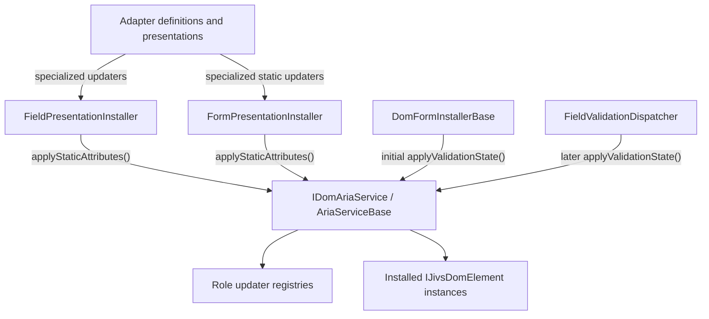

The installers are installation-time consumers. They request static updater composition and record the specialized validation-state updater on each installed element.

After all collected elements have been installed, `DomFormInstallerBase` initializes dynamic ARIA through `applyValidationState()` for each distinct non-null field represented in the field collector lists. `FieldValidationDispatcher` invokes the same operation after later validation changes.

### Managed Accessibility Attributes

This table defines the attributes written by the standard ARIA updaters. Later sections explain target discovery and special cases without repeating these assignment rules.

| Attribute | Applied during | Target element | Purpose | Presence and value | Comments |
| --- | --- | --- | --- | --- | --- |
| `role="status"` | Installation — static | Validation Summary | Makes summary updates advisory live-region content. | Assigned when `role` is absent. | Implies `aria-live="polite"` and `aria-atomic="true"`. An existing role is preserved. |
| `aria-atomic="true"` | Installation — static | Validation Summary | Requests announcement of the complete summary when its content changes. | Assigned when `aria-atomic` is absent. | Assigned explicitly even though `role="status"` implies it. An existing value is preserved. |
| `aria-hidden="true"` | Installation — static | Required Indicator | Prevents the visual indicator from duplicating the required state communicated by the editor. | Assigned when `aria-hidden` is absent. | The Required Indicator presentation controls visual state but does not assign this attribute. |
| `role="radiogroup"` | Installation — static | Radio-group editor anchor | Identifies the container as representing one radio-group value and makes it the target for group-level ARIA state. | Assigned by the specialized updater supplied by `InputRadioGroupAdapterDefinition` when `role` is absent. | An existing role is preserved. The developer remains responsible for the group’s accessible name. |
| `id="{generatedId}"` | Installation — static | Field Error Display or dedicated ARIA error-message element | Supplies the target required by `aria-errormessage` when the developer did not provide an ID. | Assigned when the element lacks a nonempty ID. | Uses the `error` or `ariaerror` suffix. A developer-supplied ID is preserved. |
| `required` | Validation-state synchronization — dynamic | Native `input`, `select`, or `textarea` supporting required semantics | Uses the control’s native required behavior and accessibility semantics. | Present when `valueHost.required` is `true`; removed otherwise. | Determined by field configuration rather than `ValueHostValidationState`. `aria-required` is not also assigned. |
| `aria-required="true"` | Validation-state synchronization — dynamic | ARIA editor target without equivalent native required semantics | Communicates that the represented value is required. | Present when `valueHost.required` is `true`; removed otherwise. | Used on the standard radio-group anchor. |
| `aria-invalid="true"` | Validation-state synchronization — dynamic | Installed editor anchor | Communicates that the editor’s current value is invalid. | Present when `state.isValid === false`; removed otherwise. | Applied even when no eligible error-message element exists. |
| `aria-errormessage="{id}"` | Validation-state synchronization — dynamic | Installed editor anchor | Associates an invalid editor with its separate error-message element. | Present while invalid when an eligible error-message ID is available; removed otherwise and whenever valid. | A radio group uses its group anchor rather than duplicating the attribute on descendant radio inputs. |

Static updaters assign their attributes only when the attribute is absent. Developer-supplied values are preserved.

Validation-state updaters fully own the dynamic attributes they manage. They set or remove those attributes according to current Jivs configuration and validation state, even when authored markup initially supplied them.

### Error-Message Containment and Selection

`aria-errormessage` always references an element separate from the editor. That element must have a unique ID, contain the error-message text, and remain available to assistive technology.

Jivs supports two alternatives:

| Error-message element | When to use it | Content owner |
| --- | --- | --- |
| Accessible Field Error Display | The visible display remains in the accessibility tree whenever it contains an error. | Field Error Display presentation |
| Dedicated ARIA error-message element | The visible display may be hidden by a popup, tooltip, `display: none`, `visibility: hidden`, or `aria-hidden="true"`. | Registered ARIA validation-state updater |

#### Selection Method

`AriaServiceBase.applyValidationState()` calls the subclass implementation of:

```ts
protected abstract findElements(
    root: HTMLElement,
    valueHost: IFieldValueHost
): IFieldAriaElementAnchors;
```

The returned object identifies the selected error-message element and its content owner:

```ts
interface IFieldAriaElementAnchors {
    readonly editorAnchor:
        IJivsDomElement | null;

    readonly errorMessageElement:
        IJivsDomElement | null;

    readonly errorMessageRole:
        ElementRole.error |
        ElementRole.ariaError |
        null;
}
```

`errorMessageRole` identifies content ownership:

- `ElementRole.error` means a field presentation owns the element's content.
- `ElementRole.ariaError` means the registered ARIA validation-state updater owns the element's plain-text content.
- `null` means no eligible error-message element was selected.

The anchors determine which element is passed to each updater. Updaters do not receive the complete anchors object.

The concrete implementation supplied by `jivs-simpledom` is `SimpleDomAriaService`. Its `findElements()` method performs fresh queries below `root` using the field's Element Identifier.

For the error-message element, `SimpleDomAriaService.findElements()` applies this precedence:

1. Select the field's `data-jivs-role="error"` element when it declares `data-aria-errormessage="true"`. Return `ElementRole.error`.
2. Otherwise, select the field's `data-jivs-role="aria-error"` element. Return `ElementRole.ariaError`.
3. When neither exists, return `null` for the error-message element and role.

Selection occurs during every `applyValidationState()` operation. The service does not retain the selected element between calls.

The editor cannot serve as its own error-message element. The absence of an eligible error-message element does not prevent required or invalid state from being applied to the editor.

#### Accessible Field Error Display

A Field Error Display signals that it is eligible to serve as the error-message element according to the DOM implementation’s discovery convention.

In SimpleDom:

```html
<div
    id="first-name-errors"
    data-field="FirstName"
    data-jivs-role="error"
    data-aria-errormessage="true">
</div>
```

The Field Error Display presentation owns this element's content. A registered static updater may assign its missing ID, and the editor's validation-state updater may reference that ID. ARIA validation-state processing never writes or clears the display's content.

#### Dedicated ARIA Error-Message Element

When the visible Field Error Display is not eligible, the developer supplies a dedicated element:

```html
<span
    id="first-name-aria-errors"
    data-field="FirstName"
    data-jivs-role="aria-error"
    class="jivs-visually-hidden">
</span>
```

The dedicated element:

- has no field presentation;
- remains in the accessibility tree;
- is visually hidden by the published `jivs-visually-hidden` class;
- receives plain-text error content from its registered ARIA validation-state updater;
- is cleared by that updater when the field becomes valid.

The published class hides the element visually without removing it from the accessibility tree:

```css
.jivs-visually-hidden {
    position: absolute;
    width: 1px;
    height: 1px;
    padding: 0;
    margin: -1px;
    overflow: hidden;
    clip: rect(0, 0, 0, 0);
    white-space: nowrap;
    border: 0;
}
```

SimpleDom presentation creation and presentation dispatch exclude the `aria-error` role. `FieldPresentationInstaller` still processes the element so its static and validation-state ARIA updaters can be installed.

The registered `aria-error` validation-state updater writes:

```ts
element.textContent = state.isValid
    ? ""
    : issuesFoundFormatter.buildAsText(
        state.issuesFound,
        false,
        "; "
    );
```

The semicolon-and-space delimiter is supplied explicitly instead of using the formatter's default bullet delimiter.

The developer may supply the selected element's ID. When it is absent, the registered static updater assigns one of these values:

```text
{containerIdentifier}_{elementIdentifier}_error
{containerIdentifier}_{elementIdentifier}_ariaerror
```

The updater gets the Element Identifier from `valueHost.getElementIdentifier()`. It follows the `IFieldValueHost` reference to its associated `ValueHostsManager` and obtains the Container Identifier from `ValueHostsManager.getContainerIdentifier()`.

The updater encodes both identifier values as needed for use within a DOM ID rather than treating raw query-selector syntax as ID text.

### ARIA Implementation Inventory

The ARIA implementation requires the following new public contracts and classes.

| Type or class | Package | Kind | Purpose |
| --- | --- | --- | --- |
| `IDomAriaStaticElementUpdater` | `jivs-dom` | Interface | Defines installation-time accessibility work for one element. |
| `IDomAriaValidationStateElementUpdater` | `jivs-dom` | Interface | Defines validation-state accessibility work for one field element. |
| `IDomAriaService` | `jivs-dom` | Interface | Defines updater registration, static application, and validation-state orchestration. |
| `IFieldAriaElementAnchors` | `jivs-dom` | Interface | Returns the editor and selected error-message anchors from field discovery. |
| `FieldPresentationInstallOptions` | `jivs-dom` | Interface | Supplies presentation selection and specialized ARIA updaters to `IFieldPresentationInstaller`. |
| `AriaServiceBase` | `jivs-dom` | Abstract class | Implements registries, composition, static application, and validation-state orchestration. |
| `ValidationSummaryAriaStaticElementUpdater` | `jivs-dom` | Exported class | Applies the standard static Validation Summary semantics. |
| `RequiredIndicatorAriaStaticElementUpdater` | `jivs-dom` | Exported class | Applies the standard static Required Indicator semantics. |
| `ErrorMessageIdAriaStaticElementUpdater` | `jivs-dom` | Exported class | Assigns generated IDs to Field Error Display and `aria-error` elements. |
| `RadioGroupAriaStaticElementUpdater` | `jivs-dom` | Exported class | Applies the static `radiogroup` role required by the built-in radio-group editor. |
| `NativeEditorAriaValidationStateElementUpdater` | `jivs-dom` | Exported class | Applies required and validation state to native editors. |
| `AriaRequiredEditorValidationStateElementUpdater` | `jivs-dom` | Exported class | Applies ARIA required and validation state to editors without equivalent native semantics. |
| `AriaErrorTextValidationStateElementUpdater` | `jivs-dom` | Exported class | Writes and clears plain-text error content in the dedicated `aria-error` element. |
| `SimpleDomAriaService` | `jivs-simpledom` | Concrete class | Implements `findElements()` for SimpleDom markup conventions. |

All seven concrete updater classes are publicly exported. Applications may instantiate them directly, return them from specialized-updater getters, or register them for additional roles.

The following existing contracts and classes require ARIA-related changes.

| Type or class | Required change |
| --- | --- |
| `ElementRole` | Add `ariaError = "aria-error"`. |
| `IJivsDomElement` | Add the `jivsAriaValidationStateUpdater` installation and completion property. |
| `IEditorAdapterDefinition` | Add optional static and validation-state ARIA updater getters. |
| `IFieldPresentation` | Add optional static and validation-state ARIA updater getters. |
| `IFormPresentation` | Add the optional static ARIA updater getter. |
| `IFieldPresentationInstaller` | Replace the presentation-name parameter with `FieldPresentationInstallOptions`. |
| `FieldPresentationInstaller` | Perform presentation and ARIA installation independently and store the validation-state updater. |
| `FormPresentationInstaller` | Apply static ARIA and use `jivsAriaValidationStateUpdater` as its completion guard. |
| `EditorInstaller` | Pass the Editor Adapter Definition's specialized updaters to `FieldPresentationInstaller`. |
| `InputRadioGroupAdapterDefinition` | Remove `IDomAriaEditorDefinition` and `findAriaEditors()`; return the radio-group updater instances through the new getters. |
| `FieldValidationDispatcher` | Call `applyValidationState()` after applying field presentations. |
| `DomServices` and `IJivsDomServices` | Expose the nullable `ariaService` child service and provide the standard service during default construction. |
| `DomFormInstallerBase` | Apply initial validation-state ARIA for each distinct non-null field represented in the field collector lists after all collected elements have been installed. |

There are no `IDomAriaEditorDefinition`, `IDomAriaPresentation`, or `IDomAriaFieldPresentation` types.

### Public Service Contract

#### Static Updater

```ts
interface IDomAriaStaticElementUpdater {
    readonly alsoRunRoleUpdater: boolean;

    applyStaticAttributes(
        element: IJivsDomElement,
        role: ElementRole | string,
        valueHost?: IFieldValueHost
    ): void;
}
```

`valueHost` is supplied for field roles and omitted for form roles.

#### Validation-State Updater

```ts
interface IDomAriaValidationStateElementUpdater {
    readonly alsoRunRoleUpdater: boolean;

    applyValidationState(
        element: IJivsDomElement,
        role: ElementRole | string,
        valueHost: IFieldValueHost,
        state: ValueHostValidationState,
        errorMessageId?: string
    ): void;
}
```

`errorMessageId` is the existing ID of the selected, ARIA-installed error-message element. Editor updaters consume it when managing `aria-errormessage`.

#### ARIA Service

```ts
interface IDomAriaService {
    registerStaticUpdater(
        role: ElementRole | string,
        updater: IDomAriaStaticElementUpdater
    ): void;

    registerValidationStateUpdater(
        role: ElementRole | string,
        updater:
            IDomAriaValidationStateElementUpdater
    ): void;

    applyStaticAttributes(
        element: IJivsDomElement,
        role: ElementRole | string,
        valueHost: IFieldValueHost | undefined,
        specializedUpdater:
            IDomAriaStaticElementUpdater | null
    ): void;

    applyValidationState(
        root: HTMLElement,
        valueHost: IFieldValueHost,
        state: ValueHostValidationState
    ): void;
}
```

`registerStaticUpdater()` and `registerValidationStateUpdater()` maintain separate role registries.

Registration and lookup normalize role values with:

```ts
role.trim().toLowerCase()
```

The normalized role is passed to the updater.

Registration rejects a role that is empty after trimming. An unregistered normalized role remains valid: it has no role updater, but a specialized updater may still run.

A role may have zero or one registered updater of each kind. Registering another updater for the same normalized role silently replaces the previous registration. There are no unregister operations.

Role lookup occurs during each operation:

- Replacing a static role updater affects future installations.
- Replacing a validation-state role updater affects installed elements on their next validation-state application.

### Updater Composition and Lifetime

A specialized updater is supplied by an Editor Adapter Definition or presentation.

Composition follows these rules:

- When no specialized updater is supplied, the registered role updater runs when available.
- When a specialized updater is supplied and `alsoRunRoleUpdater` is `true`, the registered role updater runs first and the specialized updater runs second.
- When `alsoRunRoleUpdater` is `false`, only the specialized updater runs.
- `alsoRunRoleUpdater` is ignored when the updater itself was obtained from the role registry.
- If the role updater throws, the specialized updater is not invoked.

All updater instances are immutable after construction.

They may expose immutable configuration established during construction, but they do not retain elements, ValueHosts, validation states, roots, or other operation-specific data.

Registration methods accept updater instances rather than creator functions. Editor Adapter Definitions and presentations may return shared updater instances.

### Specialized-Updater Providers

The existing Editor Adapter Definition and presentation contracts expose optional updater getters directly:

```ts
interface IEditorAdapterDefinition {
    // Existing members.

    getStaticAriaElementUpdater():
        IDomAriaStaticElementUpdater | null;

    getValidationStateAriaElementUpdater():
        IDomAriaValidationStateElementUpdater | null;
}

interface IFieldPresentation {
    // Existing members.

    getStaticAriaElementUpdater():
        IDomAriaStaticElementUpdater | null;

    getValidationStateAriaElementUpdater():
        IDomAriaValidationStateElementUpdater | null;
}

interface IFormPresentation {
    // Existing members.

    getStaticAriaElementUpdater():
        IDomAriaStaticElementUpdater | null;
}
```

A getter returning `null` means that the provider supplies no specialized updater of that kind.

Specialized-updater ownership is:

- For `ElementRole.editor`, the Editor Adapter Definition is the sole specialized-updater provider.
- `EditorInstaller` passes the definition's returned updater or explicit `null` to `FieldPresentationInstaller`.
- An editor presentation is never consulted for editor ARIA updaters.
- For non-editor field roles, `FieldPresentationInstaller` obtains specialized updaters from the installed presentation when the caller does not explicitly supply them.
- `ElementRole.ariaError` has no presentation and therefore relies on its registered role updaters.
- Form presentations may supply only static ARIA updaters. Form roles do not use the field validation-state updater contract.

### Installed Element State

`IJivsDomElement` stores the specialized validation-state updater selected during installation:

```ts
interface IJivsDomElement extends HTMLElement {
    jivsAriaValidationStateUpdater?:
        IDomAriaValidationStateElementUpdater | null;

    // Existing installed capabilities.
}
```

The property has three states:

| Value | Meaning |
| --- | --- |
| `undefined` | ARIA installation did not complete. Validation-state processing skips the element. |
| `null` | ARIA installation completed without a specialized updater. The registered role updater remains eligible. |
| Updater instance | ARIA installation completed with a specialized updater. Its `alsoRunRoleUpdater` value controls composition. |

The property is also the completion guard for the element's complete ARIA installation. Static updaters are applied immediately and are not stored.

If static application throws, the property remains `undefined`. A later installation attempt may retry, so static updaters must be idempotent.

When `DomServices.ariaService` is `null`, installers skip ARIA work and do not assign the property.

### Field Presentation Installation

```ts
interface IFieldPresentationInstaller {
    install(
        valueHost: IFieldValueHost,
        element: IJivsDomElement,
        role: ElementRole | string,
        options?: FieldPresentationInstallOptions
    ): IFieldPresentation | null;
}

interface FieldPresentationInstallOptions {
    presentationName?: string | null;

    staticAriaUpdater?:
        IDomAriaStaticElementUpdater | null;

    validationStateAriaUpdater?:
        IDomAriaValidationStateElementUpdater | null;
}
```

The ARIA option values mean:

| Value | Meaning |
| --- | --- |
| `undefined` | Obtain the specialized updater from the installed presentation's optional ARIA getter. |
| `null` | The caller explicitly supplies no specialized updater. |
| Updater instance | Use the caller-supplied specialized updater. |

`FieldPresentationInstaller.install()` performs presentation and ARIA work independently:

1. Resolve, create, initially apply, and store the presentation when presentation installation is required.
2. Resolve the specialized ARIA updaters from the options or installed presentation.
3. Apply static ARIA through `IDomAriaService.applyStaticAttributes()`.
4. Store the specialized validation-state updater or `null`.

A presentation result of `null` does not prevent ARIA installation.

If ARIA installation fails after presentation installation succeeds, the presentation remains stored and `jivsAriaValidationStateUpdater` remains `undefined` so installation can be retried.

`EditorInstaller` always calls `FieldPresentationInstaller` during a new editor installation, even when the editor has no presentation. Presentation and ARIA installation are independent.

### Form Presentation Installation

`FormPresentationInstaller` also completes presentation work independently from static ARIA installation.

For each form-role element whose `jivsAriaValidationStateUpdater` is `undefined`, it:

1. Gets the specialized static updater from the installed form presentation, when supplied.
2. Calls `IDomAriaService.applyStaticAttributes()` with `valueHost` set to `undefined`.
3. Sets `jivsAriaValidationStateUpdater` to `null` only after static application succeeds.

Form roles use the same installed-element property as their ARIA completion guard, but they do not participate in `applyValidationState()`.

### ElementRole

The standard role vocabulary includes:

```ts
enum ElementRole {
    // Existing members.
    ariaError = "aria-error"
}
```

`ElementRole.ariaError` identifies the dedicated, visually hidden error-message element owned entirely by ARIA processing. It does not support a presentation.

### AriaServiceBase

`jivs-dom` exports `AriaServiceBase` as the reusable service implementation and extension point:

```ts
abstract class AriaServiceBase
    implements IDomAriaService {

    // Implements the public service operations.

    protected abstract findElements(
        root: HTMLElement,
        valueHost: IFieldValueHost
    ): IFieldAriaElementAnchors;
}
```

`AriaServiceBase`:

- owns the static and validation-state role registries;
- implements role normalization, registration, and replacement;
- implements updater composition;
- implements static application;
- orchestrates validation-state application;
- retrieves the selected error-message element's existing ID;
- performs no role-specific attribute or content mutation itself.

`SimpleDomAriaService` implements `findElements()` using SimpleDom attributes and selectors. It contains no role-specific ARIA mutation logic.

The service does not retain `root`, the `IFieldValueHost`, a `ValueHostsManager`, a discovered DOM element, or an element collection after an operation returns.

### Validation-State Synchronization

`AriaServiceBase.applyValidationState()` performs these operations:

1. Calls `findElements()`.
2. Determines independently whether the selected editor and error-message elements completed ARIA installation.
3. Skips any selected element whose `jivsAriaValidationStateUpdater` remains `undefined`.
4. When the error-message element completed ARIA installation, reads its existing, nonempty ID and applies its registered and specialized validation-state updaters.
5. When the editor completed ARIA installation, applies its registered and specialized validation-state updaters.

The error-message element is processed before the editor.

The editor receives the error-message ID only when the error-message element completed ARIA installation. Otherwise, it receives `undefined`.

The ID is established during static installation and is not generated during validation-state processing.

If an ARIA-installed error-message element lacks a usable ID, processing continues with `errorMessageId` set to `undefined`. The editor updater omits `aria-errormessage` but may still apply required and invalid state.

Required state comes from `IFieldValueHost.required`, not from `ValueHostValidationState`.

### Initial and Later Validation-State Application

`DomFormInstallerBase` performs the initial validation-state application after installing all collected elements. It calls the ARIA service once for each distinct non-null `IFieldValueHost` represented in the editor and field-presentation collector lists:

```ts
ariaService.applyValidationState(
    root,
    valueHost,
    valueHost.currentValidationState
);
```

This initial call occurs after presentation initialization.

For later validation changes, `FieldValidationDispatcher` resolves `root`, invokes the installed field presentations, and then calls:

```ts
domServices.ariaService?.applyValidationState(
    root,
    valueHost,
    state
);
```

This order ensures that presentation-owned error content is current before ARIA validation-state processing establishes the editor relationship.

When `ValueHostsManager.getContainerIdentifier()` supplies an identifier, the dispatcher resolves it to an `HTMLElement`. Otherwise, `root` is `document.body`.

When a configured Container Identifier cannot be resolved, the dispatcher logs the failure and performs no presentation or ARIA work. It does not fall back to `document.body`, where it could affect a matching field belonging to another form.

### Built-in Updater Implementations

All built-in updater classes are exported from `jivs-dom`.

#### Static Updaters

| Class | Standard use | Behavior |
| --- | --- | --- |
| `ValidationSummaryAriaStaticElementUpdater` | Registered for `ElementRole.summary` | Assigns missing `role="status"` and `aria-atomic="true"`. |
| `RequiredIndicatorAriaStaticElementUpdater` | Registered for `ElementRole.required` | Assigns missing `aria-hidden="true"`. |
| `ErrorMessageIdAriaStaticElementUpdater` | Registered for `ElementRole.error` and `ElementRole.ariaError` | Assigns a missing generated ID using the suffix selected from the normalized role. |
| `RadioGroupAriaStaticElementUpdater` | Returned by `InputRadioGroupAdapterDefinition` | Assigns missing `role="radiogroup"` to the editor anchor. |

One immutable `ErrorMessageIdAriaStaticElementUpdater` instance may be registered under both error roles.

#### Validation-State Updaters

| Class | Standard use | Behavior |
| --- | --- | --- |
| `NativeEditorAriaValidationStateElementUpdater` | Registered for `ElementRole.editor` | Synchronizes native `required`, `aria-invalid`, and `aria-errormessage`. Does not assign `aria-required`. |
| `AriaRequiredEditorValidationStateElementUpdater` | Returned by adapter definitions for editors without equivalent native required semantics | Synchronizes `aria-required`, `aria-invalid`, and `aria-errormessage`. Not registered by default. |
| `AriaErrorTextValidationStateElementUpdater` | Registered for `ElementRole.ariaError` | Writes selected field error messages as plain text and clears the content when appropriate. |

There is no registered validation-state updater for `ElementRole.error`. Its presentation owns state-dependent content. A presentation may supply a specialized updater when its markup requires additional accessibility behavior.

### InputRadioGroupAdapterDefinition

`InputRadioGroupAdapterDefinition` supplies:

- a `RadioGroupAriaStaticElementUpdater` that assigns `role="radiogroup"` to the installation anchor only when `role` is absent;
- an `AriaRequiredEditorValidationStateElementUpdater` with `alsoRunRoleUpdater: false`.

The containing anchor receives group-level required, invalid, and error-message relationship state. Descendant radio inputs do not receive duplicate group-level ARIA state.

The developer remains responsible for the radio group's accessible name.

### Failure Handling and Custom Implementations

Updater and discovery operations throw normally.

`AriaServiceBase` does not catch or log their exceptions:

- A registered-updater failure stops processing before the specialized updater for that element.
- `DomFormInstallerBase` owns installation logging and rethrows installation failures.
- Runtime validation dispatch follows the dispatcher's established failure policy.

`jivs-simpledom` supplies `SimpleDomAriaService` because it owns the `data-field`, `data-jivs-role`, and ARIA marker conventions.

An application using `jivs-dom` directly can subclass `AriaServiceBase` and implement `findElements()` for its own markup while retaining the standard registry and orchestration behavior.

An application may instead replace the complete `IDomAriaService` when it requires different coordination or policy.

The following implementation details remain deferred to later sections:

- concrete `EditorInstaller` ownership and construction;
- `DomServices` default construction and registration of built-in updater instances;
- final TypeScript documentation comments and the complete package export inventory.

## Dispatchers and Callback Attachment

DOM dispatchers connect the four `ValueHostsManagerConfig` callbacks to capabilities installed on DOM elements.

| Callback | Dispatcher | Installed capability |
| --- | --- | --- |
| `onTextValueChanged` | `TextValueDispatcher` | `jivsTextValueAdapter` |
| `onValueChanged` | `ValueDispatcher` | `jivsValueAdapter` |
| `onValueHostValidationStateChanged` | `FieldValidationDispatcher` | `jivsFieldPresentation` and field ARIA |
| `onValidationStateChanged` | `FormValidationDispatcher` | `jivsFormPresentation` |

Each dispatcher is created for one callback attachment. It retains its `IJivsDomServices` and may retain creator options and discovery policy. It must not retain a `ValueHostsManager`, DOM elements, element collections, or DOM subtrees.

### Dispatcher Contracts

Each dispatcher contract preserves every parameter supplied by its corresponding Jivs callback.

```ts
interface ITextValueDispatcher {
    dispatch(
        valueHost: IFieldValueHost,
        oldTextValue: string | undefined
    ): void;
}

interface IValueDispatcher {
    dispatch(
        valueHost: IFieldValueHost,
        oldValue: unknown
    ): void;
}

interface IFieldValidationDispatcher {
    dispatch(
        valueHost: IFieldValueHost,
        state: ValueHostValidationState
    ): void;
}

interface IFormValidationDispatcher {
    dispatch(
        valueHostsManager: IValueHostsManager,
        state: ValidationState
    ): void;
}
```

The standard Text Value and Native Value dispatchers obtain the new current value from the supplied `IFieldValueHost`. The old value remains available to custom dispatchers and overrides.

### Shared Dispatcher Bases

`jivs-dom` supplies abstract bases that implement root resolution, consumer iteration, failure handling, and access to DOM services. Concrete subclasses implement markup-specific consumer discovery.

```ts
abstract class FieldDispatcherBase {
    protected constructor(
        protected readonly domServices:
            IJivsDomServices
    ) {
    }

    protected forEachConsumer(
        valueHost: IFieldValueHost,
        operation: (
            element: IJivsDomElement
        ) => void
    ): HTMLElement | null;

    protected abstract findConsumers(
        root: HTMLElement,
        valueHost: IFieldValueHost
    ): Iterable<IJivsDomElement>;
}

abstract class FormDispatcherBase {
    protected constructor(
        protected readonly domServices:
            IJivsDomServices
    ) {
    }

    protected forEachConsumer(
        valueHostsManager: IValueHostsManager,
        operation: (
            element: IJivsDomElement
        ) => void
    ): HTMLElement | null;

    protected abstract findConsumers(
        root: HTMLElement,
        valueHostsManager: IValueHostsManager
    ): Iterable<IJivsDomElement>;
}
```

The base operation:

1. Resolves the manager’s DOM root.
2. Abandons dispatch when a configured Container Identifier cannot be resolved.
3. Calls `findConsumers()` for the current dispatch.
4. Processes every returned consumer in discovery order.
5. Does not retain the discovered elements after returning.
6. Returns the resolved root when successful so field validation can perform ARIA processing after presentation.

Root resolution is defined with element resolution and installation coordination.

### Text Value Dispatcher

```ts
abstract class TextValueDispatcher
    extends FieldDispatcherBase
    implements ITextValueDispatcher {

    public dispatch(
        valueHost: IFieldValueHost,
        oldTextValue: string | undefined
    ): void;
}
```

`dispatch()` obtains the new current Text Value through:

```ts
valueHost.getTextValue()
```

For each discovered consumer, it reads `jivsTextValueAdapter`. An adapter instance receives the current Text Value through `writeTextValue()`. Both `undefined` and `null` are skipped.

The standard implementation does not use `oldTextValue`. It remains part of the contract so subclasses and direct interface implementations receive the complete callback information.

Dispatch does not create or install an adapter.

### Native Value Dispatcher

```ts
abstract class ValueDispatcher
    extends FieldDispatcherBase
    implements IValueDispatcher {

    public dispatch(
        valueHost: IFieldValueHost,
        oldValue: unknown
    ): void;
}
```

`dispatch()` obtains the new current Native Value through:

```ts
valueHost.getValue()
```

For each discovered consumer, it reads `jivsValueAdapter`. An adapter instance receives the current Native Value through `writeValue()`. Both `undefined` and `null` are skipped.

The standard implementation does not use `oldValue`. It remains part of the contract so subclasses and direct interface implementations receive the complete callback information.

Dispatch does not create or install an adapter.

### Field Validation Dispatcher

```ts
abstract class FieldValidationDispatcher
    extends FieldDispatcherBase
    implements IFieldValidationDispatcher {

    public dispatch(
        valueHost: IFieldValueHost,
        state: ValueHostValidationState
    ): void;
}
```

For each discovered consumer, `dispatch()` reads `jivsFieldPresentation`. A presentation instance receives the supplied ValueHost and state through `apply()`. Both `undefined` and `null` are skipped.

After all discovered field presentations have been processed, the dispatcher calls:

```ts
this.domServices.ariaService
    ?.applyValidationState(
        root,
        valueHost,
        state
    );
```

ARIA runs after every field presentation so presentation-owned error content is current before the editor’s error-message relationship is synchronized.

### Form Validation Dispatcher

```ts
abstract class FormValidationDispatcher
    extends FormDispatcherBase
    implements IFormValidationDispatcher {

    public dispatch(
        valueHostsManager: IValueHostsManager,
        state: ValidationState
    ): void;
}
```

For each discovered consumer, `dispatch()` reads `jivsFormPresentation`. A presentation instance receives the supplied manager and complete state through `apply()`. Both `undefined` and `null` are skipped.

The dispatcher does not interpret validation groups. Group routing belongs to the installed form presentation.

Form dispatch does not invoke `IDomAriaService`. Form-role ARIA is static and is applied during installation.

### Fresh Consumer Discovery

Every dispatch calls `findConsumers()` again. Dispatchers do not cache consumer elements.

Consequently:

- removed elements cease receiving updates;
- replacement elements participate after they are installed;
- newly added and installed elements participate without reattaching the dispatcher;
- one dispatcher cannot preserve an obsolete DOM subtree.

The dispatcher reads each installed capability from the element at the time of dispatch. Replacing an installed adapter or presentation therefore affects the next dispatch.

### Failure Handling

Dispatcher failures are logged through:

```ts
this.domServices
    .jivsServices
    .loggingService
```

They do not propagate into Jivs or interrupt the end-user interaction.

A missing consumer or missing installed capability is a normal no-op and does not require an error log.

If an installed adapter or presentation throws:

1. the dispatcher logs the consumer failure;
2. processing continues with the next discovered consumer.

If root resolution or `findConsumers()` throws, the dispatcher logs the operation failure and abandons that dispatch.

When a configured Container Identifier cannot be resolved, the dispatcher logs the failure and abandons dispatch. It does not fall back to `document.body`.

If `IDomAriaService.applyValidationState()` throws, the field dispatcher logs the failure and returns without propagating it.

This policy applies to dispatcher-owned behavior. An exception thrown by an application callback composed ahead of the dispatcher remains observable and prevents DOM dispatch for that callback invocation.

Logs identify the dispatcher operation, ValueHost or manager context, and failing capability when available. They do not include field values or error-message content.

### Dispatcher Creators

A Dispatcher Creator constructs one dispatcher for one callback attachment:

```ts
type DispatcherCreator<TDispatcher> = (
    domServices: IJivsDomServices,
    options?: unknown
) => TDispatcher;
```

`IJivsDomServices` gives the new dispatcher access to the complete `jivs-dom` service scope and to its parent `IJivsServices`.

The options argument is opaque to `IDomDispatcherService`. It is passed unchanged to the registered creator:

- it is not inspected;
- it is not cloned;
- it is not merged;
- it is not retained separately;
- omission is passed as `undefined`.

A concrete package may provide typed wrappers when it wants strongly typed creator options.

### Dispatcher Service

`IDomDispatcherService` coordinates creator registration and callback attachment:

```ts
interface IDomDispatcherService {
    registerTextValueChangedDispatcher(
        creator:
            DispatcherCreator<ITextValueDispatcher>
    ): void;

    registerValueChangedDispatcher(
        creator:
            DispatcherCreator<IValueDispatcher>
    ): void;

    registerValueHostValidationStateChangedDispatcher(
        creator:
            DispatcherCreator<
                IFieldValidationDispatcher
            >
    ): void;

    registerValidationStateChangedDispatcher(
        creator:
            DispatcherCreator<
                IFormValidationDispatcher
            >
    ): void;

    attachTextValueChanged(
        config: ValueHostsManagerConfig,
        options?: unknown
    ): ITextValueDispatcher | null;

    attachValueChanged(
        config: ValueHostsManagerConfig,
        options?: unknown
    ): IValueDispatcher | null;

    attachValueHostValidationStateChanged(
        config: ValueHostsManagerConfig,
        options?: unknown
    ): IFieldValidationDispatcher | null;

    attachValidationStateChanged(
        config: ValueHostsManagerConfig,
        options?: unknown
    ): IFormValidationDispatcher | null;
}
```

`DomDispatcherService` is the standard implementation.

Each dispatcher category has zero or one registered creator. Registering another creator for the same category replaces the earlier creator for future attachments. Already attached dispatchers are unaffected.

`IJivsDomServices` exposes the replaceable service:

```ts
domServices.dispatchers
```

The standard `jivs-dom` service does not assume an element-discovery convention. `jivs-simpledom` registers creators that construct its concrete discovery-aware dispatchers.

### Missing Creator

When an attachment method has no registered creator for its category, it:

1. logs that no dispatcher can be attached;
2. leaves the existing configuration callback unchanged;
3. returns `null`.

A missing creator is not an exception because applications may intentionally omit any of the four integrations.

### Callback Attachment

Each attachment method:

1. obtains the registered creator;
2. creates one dispatcher with `IJivsDomServices` and the supplied options;
3. captures the callback currently assigned to the corresponding configuration property;
4. assigns a composed callback;
5. returns the created dispatcher.

The composed callback first invokes the existing callback and then invokes the dispatcher.

Conceptually:

```ts
const previous =
    config.onTextValueChanged;

const dispatcher =
    creator(
        this.domServices,
        options
    );

config.onTextValueChanged =
    function (...args): void {
        previous?.apply(this, args);
        dispatcher.dispatch(...args);
    };

return dispatcher;
```

Both calls receive every argument supplied by Jivs.

The existing callback receives its original dynamic `this` value. Its return value is ignored.

The dispatcher is invoked as an object method, preserving the dispatcher instance as its `this` value.

If the existing callback throws, the exception propagates and DOM dispatch does not run.

### Attachment Lifetime

The composed callback retains the dispatcher instance. No separate dispatcher registry or disposal contract is required.

When the configuration, manager, and callback become unreachable, the dispatcher can also be collected.

Attaching different dispatcher categories to the same configuration is valid. Attaching the same category more than once is unsupported caller misuse. The service does not track or detect duplicate attachment; another attachment naturally composes another callback and may cause duplicate DOM dispatch.

Attachment changes only the `ValueHostsManagerConfig`. It does not discover or install elements.

Because callbacks must be attached before constructing the `ValueHostsManager`, some initialization callbacks may occur before DOM installation. Those dispatches safely find no installed consumers. `DomFormInstallerBase` performs initial presentation and ARIA application, and `ValueHostsManager.broadcastState()` can republish current callback state when required.

## Form Installation Coordination

Creating an `IValueHostsManager` establishes the Jivs fields and their validation state. It does not locate DOM elements, connect editors to those fields, install validation presentations, or synchronize the DOM with validation state that may already exist.

Form installation bridges that gap.

The application calls one public `install()` operation after creating the manager. A concrete form installer identifies the field and form elements represented by its markup. Shared collectors normalize those discoveries and align field elements with their `IFieldValueHost`. `DomFormInstallerBase` then invokes the editor and presentation installers and performs the initial validation-state ARIA pass.

This separates two responsibilities:

* `jivs-dom` owns collection, field alignment, installation coordination, and initial ARIA synchronization.
* A concrete package or application owns the markup-specific rules used to discover elements.

`jivs-simpledom` supplies a screen-scraping implementation. An application may instead create a form-specific subclass that explicitly identifies every applicable element.

Installation is repeatable. The same coordinator supports initial installation, partial installation, and reinstallation after DOM replacement.

A typical application follows this sequence:

```ts
const jivsServices = createJivsServices('en-US');
const domServices = /* Section 12 retrieval API */;

const rules = new PersonFormRules(jivsServices);
const config = rules.configure();

domServices.dispatchers.attachTextValueChanged(config);
domServices.dispatchers.attachValueChanged(config);
domServices.dispatchers.attachValueHostValidationStateChanged(config);
domServices.dispatchers.attachValidationStateChanged(config);

const valueHostsManager = new ValueHostsManager(config);
const formInstaller = new SimpleDomFormInstaller(domServices);

formInstaller.install(valueHostsManager);
```

Section 12 will replace the provisional `domServices` line after defining how `IJivsDomServices` is installed into and retrieved from `IJivsServices`.

### Architecture

`IDomFormInstaller` defines the public operation used by the application. `DomFormInstallerBase` implements the coordination algorithm.

A concrete subclass supplies only the two markup-specific discovery methods. Those methods populate the collectors created by the base class. The base class consumes the collected records and performs the installation work.

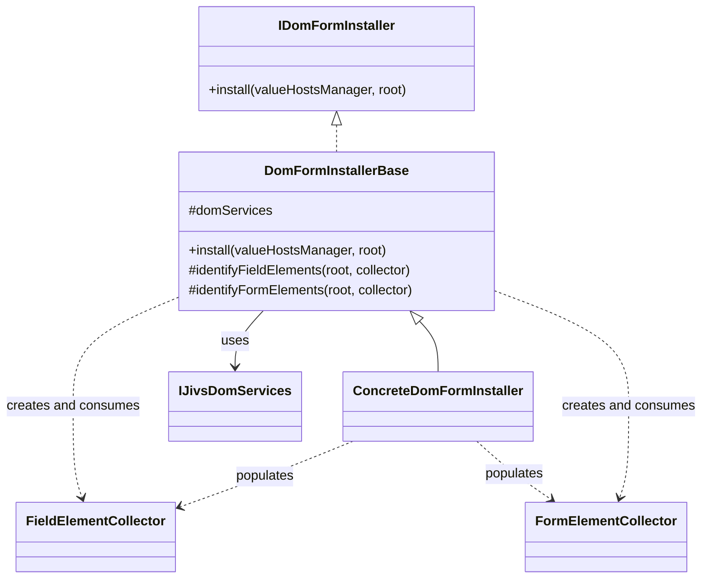

`ConcreteDomFormInstaller` represents either `SimpleDomFormInstaller` or an application-defined subclass.

### Coordination After Discovery

The architecture continues after the concrete subclass finishes populating both collectors. `DomFormInstallerBase` consumes their records and coordinates the specialized installers and ARIA service.

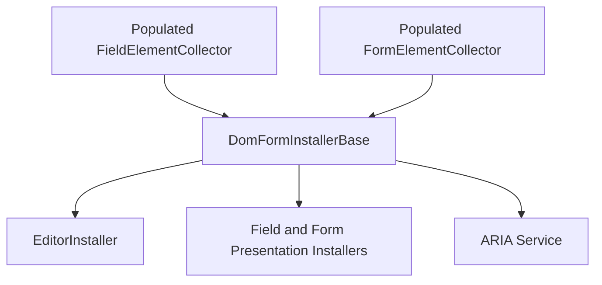

The concrete subclass does not invoke these installers itself.

### Form Installation Implementation Inventory

| Type or class                          | Package          | Kind           | Purpose                                                                                             |
| -------------------------------------- | ---------------- | -------------- | --------------------------------------------------------------------------------------------------- |
| `IDomFormInstaller`                    | `jivs-dom`       | Interface      | Defines the public operation that installs one manager into a DOM region.                           |
| `DomFormInstallerBase`                 | `jivs-dom`       | Abstract class | Coordinates discovery, element installation, and initial validation-state ARIA.                     |
| `FieldElementCollector`                | `jivs-dom`       | Class          | Aligns discovered field elements with FieldValueHosts and collects normalized installation records. |
| `FormElementCollector`                 | `jivs-dom`       | Class          | Collects normalized form-presentation installation records.                                         |
| `EditorElementInstallation`            | `jivs-dom`       | Interface      | Describes one discovered editor and its resolved field and options.                                 |
| `FieldPresentationElementInstallation` | `jivs-dom`       | Interface      | Describes one discovered presentation-only field element.                                           |
| `FormElementInstallation`              | `jivs-dom`       | Interface      | Describes one discovered form-presentation element.                                                 |
| `SimpleDomFormInstaller`               | `jivs-simpledom` | Concrete class | Discovers elements using the SimpleDom markup convention.                                           |

The three installation-record interfaces and both collectors are public. Applications may use the collectors without using `DomFormInstallerBase`.

### Supported Field-Discovery Approaches

Field discovery must associate each discovered element with an `IFieldValueHost`. The collectors support two approaches.

#### Element Identifier Alignment

A screen-scraping implementation first discovers the DOM element. It then obtains the Element Identifier from the markup and passes it to the field collector.

The collector resolves the field through:

```ts
valueHostsManager.getFieldByElementIdentifier(elementIdentifier);
```

`jivs-simpledom` uses this approach because the DOM is the source of the discovered elements.

#### Direct FieldValueHost Alignment

Application-specific code may already know which field belongs to an element. It may pass that `IFieldValueHost` directly to the collector.

The collector uses the supplied field without verifying that it belongs to the manager used to construct the collector.

Both approaches produce the same normalized installation records.

### FieldElementCollector

`FieldElementCollector` is the translation boundary between markup-specific field discovery and installation coordination.

Concrete discovery finds an element and calls `addEditor()` or `addPresentation()`. It supplies either an Element Identifier or an already-known `IFieldValueHost`. The collector resolves any required field alignment and stores the result in the appropriate collection.

The collector does not install elements. Its consumer processes the collected records after discovery completes.

Its per-installation workflow is:

1. Receive a discovered element and its installation characteristics.
2. Resolve an Element Identifier when one was supplied.
3. Retain the supplied or resolved `IFieldValueHost`.
4. Normalize the discovery into an editor or presentation-only record.
5. Add the record to the appropriate public read-only collection.

#### Field Installation Records

```ts
interface EditorElementInstallation {
    element: IJivsDomElement | null;
    fieldValueHost: IFieldValueHost | null;
    elementIdentifier: string | null;
    editorOptions?: EditorInstallOptions;
}

interface FieldPresentationElementInstallation {
    element: IJivsDomElement | null;
    fieldValueHost: IFieldValueHost | null;
    elementIdentifier: string | null;
    role: ElementRole | string;
    presentationOnlyOptions?: FieldPresentationInstallOptions;
}
```

While the collector is active, every added record has a non-null `element`.

When discovery supplies an Element Identifier, `elementIdentifier` retains that string whether or not a matching field is found.

When discovery supplies an `IFieldValueHost` directly, `elementIdentifier` is `null`.

Editor records contain `EditorInstallOptions`. Editor Adapter Definitions remain responsible for supplying any specialized editor ARIA updaters.

Presentation-only records contain `FieldPresentationInstallOptions`. Their name distinguishes them from the presentation work that `EditorInstaller` performs for an editor.

#### FieldElementCollector Contract

```ts
class FieldElementCollector {
    constructor(domServices: IJivsDomServices, valueHostsManager: IValueHostsManager);

    readonly editors: readonly EditorElementInstallation[];
    readonly presentations: readonly FieldPresentationElementInstallation[];

    addEditor(
        element: IJivsDomElement,
        elementIdentifier: string,
        options?: EditorInstallOptions
    ): void;

    addEditor(
        element: IJivsDomElement,
        fieldValueHost: IFieldValueHost,
        options?: EditorInstallOptions
    ): void;

    addPresentation(
        element: IJivsDomElement,
        elementIdentifier: string,
        role: ElementRole | string,
        options?: FieldPresentationInstallOptions
    ): void;

    addPresentation(
        element: IJivsDomElement,
        fieldValueHost: IFieldValueHost,
        role: ElementRole | string,
        options?: FieldPresentationInstallOptions
    ): void;

    dispose(): void;
}
```

A screen-scraping implementation may add an editor by Element Identifier:

```ts
collector.addEditor(editorElement, elementIdentifier, editorOptions);
```

Application-specific discovery may add an element using a field it already obtained:

```ts
collector.addPresentation(
    errorElement,
    fieldValueHost,
    ElementRole.error,
    presentationOptions
);
```

#### Element Identifier Resolution

The collector owns a per-instance cache:

```ts
Map<string, IFieldValueHost | null>
```

Resolution is lazy. The first occurrence of an Element Identifier calls:

```ts
valueHostsManager.getFieldByElementIdentifier(elementIdentifier);
```

The returned `IFieldValueHost` or `null` is cached. Later occurrences of the same identifier reuse that result.

Caching `null` is intentional. It avoids repeated manager searches and repeated log entries for multiple elements that refer to the same missing field.

A missing field is logged at Warning level once for that Element Identifier. The collector still adds every applicable record with:

```ts
fieldValueHost: null
```

The public collections therefore preserve the complete discovery result. Consumers decide how to handle unresolved records. `DomFormInstallerBase` skips them during installation.

#### Collection and Disposal Behavior

The collector preserves every added record without duplicate detection.

The same DOM element may legitimately participate in more than one role. Installation completion and duplicate-call behavior remain the responsibility of the individual element installers.

The collector owns installation records that reference DOM elements and FieldValueHosts. Its consumer is responsible for calling `dispose()` when finished with those records.

At minimum, `dispose()` nulls every retained `element` and `fieldValueHost` property. Other disposal mechanics are implementation details.

`DomFormInstallerBase` is responsible for disposing the collectors it creates. An application using a collector independently assumes that responsibility itself.

### FormElementCollector

`FormElementCollector` performs the corresponding normalization for form-presentation elements.

Form elements are associated with the complete `IValueHostsManager`, so they require no field alignment. Concrete discovery supplies the element, its role, and any form-presentation options. The collector retains a normalized record for later installation.

The collector does not install presentations.

#### Form Installation Record

```ts
interface FormElementInstallation {
    element: IJivsDomElement | null;
    role: ElementRole | string;
    presentationOptions?: FormPresentationInstallOptions;
}
```

While the collector is active, every added record has a non-null `element`.

#### FormElementCollector Contract

```ts
class FormElementCollector {
    constructor(domServices: IJivsDomServices);

    readonly presentations: readonly FormElementInstallation[];

    addPresentation(
        element: IJivsDomElement,
        role: ElementRole | string,
        options?: FormPresentationInstallOptions
    ): void;

    dispose(): void;
}
```

The collector does not require an `IValueHostsManager`. The manager is supplied later when `DomFormInstallerBase` invokes `IFormPresentationInstaller`.

It preserves every added record without duplicate detection.

Its consumer is responsible for calling `dispose()` when finished. At minimum, disposal nulls every retained `element` property.

### IDomFormInstaller and DomFormInstallerBase

`IDomFormInstaller` is the application-facing entry point.

```ts
interface IDomFormInstaller {
    install(valueHostsManager: IValueHostsManager, root?: HTMLElement): void;
}
```

A form is the logical DOM region managed by one `IValueHostsManager`. It does not need to be represented by an HTML `<form>` element.

The application calls `install()` after constructing the manager. It may omit `root` for full installation or supply a root for a partial DOM region.

`DomFormInstallerBase` implements this public operation. A subclass must supply the markup-specific portion by implementing `identifyFieldElements()` and `identifyFormElements()`.

```ts
abstract class DomFormInstallerBase implements IDomFormInstaller {
    protected constructor(protected readonly domServices: IJivsDomServices) {
    }

    public install(valueHostsManager: IValueHostsManager, root?: HTMLElement): void;

    protected abstract identifyFieldElements(
        root: HTMLElement,
        collector: FieldElementCollector
    ): void;

    protected abstract identifyFormElements(
        root: HTMLElement,
        collector: FormElementCollector
    ): void;
}
```

The public and protected responsibilities are distinct:

* `install()` owns root resolution, collector construction, installer invocation, initial ARIA synchronization, and collector disposal.
* `identifyFieldElements()` finds field elements and adds them to the field collector.
* `identifyFormElements()` finds form-presentation elements and adds them to the form collector.

A subclass does not invoke the editor or presentation installers itself.

`DomFormInstallerBase` directly creates the standard collectors for every installation call. Collector factories and protected collector-creation hooks are not required.

The base retains only `domServices`. It does not retain a manager, root, collectors, installation records, or installation state between calls.

One installer instance may therefore be reused for multiple managers and repeated full or partial installations.

`IJivsDomServices` does not expose or retain an `IDomFormInstaller`. Applications construct the appropriate concrete installer explicitly and supply its `IJivsDomServices`.

### Developer Participation Workflow

From the developer’s perspective, the public call and subclass responsibilities form this workflow:

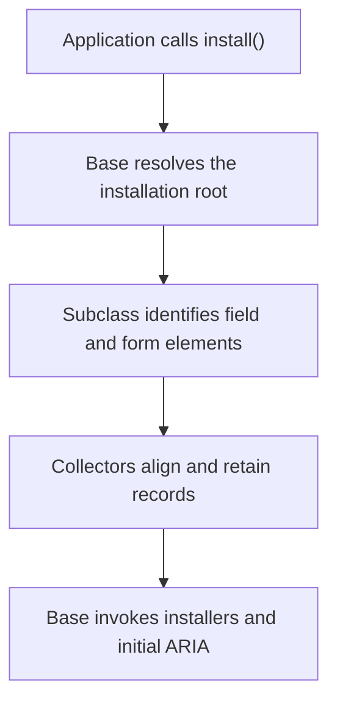

`jivs-simpledom` supplies `SimpleDomFormInstaller`, whose discovery methods interpret the SimpleDom attribute convention.

An application using `jivs-dom` directly may instead create a form-specific subclass. Such a subclass may explicitly locate each element and call the collector methods with either an Element Identifier or a known `IFieldValueHost`.

### Installation Workflow

The complete installation order is:

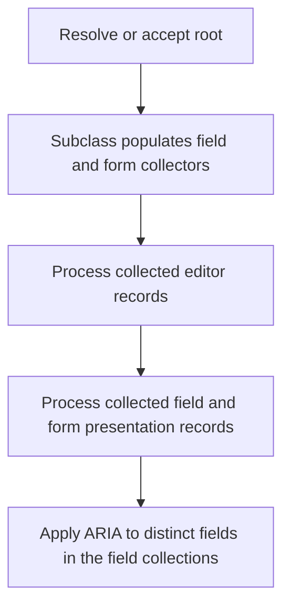

`install()` performs these operations:

1. Uses the supplied root when present.
2. Otherwise calls `domServices.resolveContainerElement(valueHostsManager)`.
3. Logs and throws when the configured container cannot be resolved.
4. Constructs a new `FieldElementCollector`.
5. Constructs a new `FormElementCollector`.
6. Calls both concrete discovery methods.
7. Processes the collected editor records.
8. Processes the collected presentation-only field records.
9. Processes the collected form-presentation records.
10. Obtains each distinct, non-null `IFieldValueHost` represented in the field collector’s two lists.
11. Applies current validation-state ARIA for those fields.
12. Disposes both collectors after consuming their records.

Both discovery methods must return successfully before element installation begins.

The supplied root participates in concrete discovery. Discovery examines both the root itself and its descendants.

The first three installation categories have no dependency on one another. Their fixed order makes the implementation deterministic. Initial validation-state ARIA begins only after all element installation completes successfully.

### Invoking the Element Installers

For each usable editor record, the coordinator calls:

```ts
domServices.editorInstaller.install(
    record.fieldValueHost,
    record.element,
    record.editorOptions
);
```

A usable editor record has a non-null `element` and `fieldValueHost`.

`EditorInstaller` also performs the editor’s field-presentation and static ARIA installation.

For each usable presentation-only field record, the coordinator calls:

```ts
domServices.fieldPresentationInstaller.install(
    record.fieldValueHost,
    record.element,
    record.role,
    record.presentationOnlyOptions
);
```

A usable presentation-only record has a non-null `element` and `fieldValueHost`.

For each usable form-presentation record, the coordinator calls:

```ts
domServices.formPresentationInstaller.install(
    valueHostsManager,
    record.element,
    record.role,
    record.presentationOptions
);
```

A usable form-presentation record has a non-null `element`.

Field records whose `fieldValueHost` is `null` remain available from the collector but are skipped by the coordinator.

The coordinator performs no duplicate detection. Each individual installer owns its element-level completed-installation guard.

### Initial Validation-State ARIA

Field and form presentation installers initialize their presentations from current validation state during their own installation work:

```ts
fieldPresentation.apply(
    valueHost,
    valueHost.currentValidationState
);
```

```ts
formPresentation.apply(
    valueHostsManager,
    valueHostsManager.currentValidationState(group)
);
```

These calls allow each newly installed visual presentation to immediately reflect validation state that already exists.

The presentation installers also perform static ARIA installation. They do not perform the final field-level validation-state ARIA pass.

After every collected element has been processed, `DomFormInstallerBase` obtains each distinct, non-null `IFieldValueHost` represented in the editor and presentation-only collections. It then calls:

```ts
ariaService.applyValidationState(
    root,
    valueHost,
    valueHost.currentValidationState
);
```

This synchronizes all newly installed ARIA consumers for that field after its editor and other field elements are ready.

The same root used for discovery limits the ARIA search. When the caller supplies a partial root, that root must contain all related elements needed for each collected field.

Later validation-state changes are handled by `FieldValidationDispatcher`. The form installer performs only the initial synchronization.

The form installer does not call `broadcastState()`.

### Installation Effects

The complete installation process produces these effects:

| Installation effect                                                   | Responsible coordinator                                 | Current state consumed                            |
| --------------------------------------------------------------------- | ------------------------------------------------------- | ------------------------------------------------- |
| Select the Editor Adapter Definition and installation anchor          | `EditorInstaller`                                       | No                                                |
| Create Text Value and Native Value adapters                           | `EditorInstaller`                                       | No                                                |
| Attach DOM-to-Jivs event handling                                     | `EditorInstaller`                                       | No                                                |
| Initialize the editor’s field presentation                            | `EditorInstaller`, through `FieldPresentationInstaller` | `valueHost.currentValidationState`                |
| Initialize a presentation-only field element                          | `FieldPresentationInstaller`                            | `valueHost.currentValidationState`                |
| Initialize a form presentation                                        | `FormPresentationInstaller`                             | `valueHostsManager.currentValidationState(group)` |
| Apply static field ARIA and retain its validation-state updater       | `FieldPresentationInstaller`                            | No                                                |
| Apply static form ARIA                                                | `FormPresentationInstaller`                             | No                                                |
| Apply initial validation-state ARIA for each distinct collected field | `DomFormInstallerBase`, through `IDomAriaService`       | `valueHost.currentValidationState`                |
| Record completed installation on each element                         | The applicable editor or presentation installer         | No                                                |

### Failure Handling

An unmatched Element Identifier is not an installation failure. The field collector logs it, retains the corresponding records with `fieldValueHost: null`, and allows discovery to continue.

Other failures stop installation immediately.

A failure from container resolution, concrete discovery, field resolution, collector processing, an individual installer, or initial ARIA processing is logged through:

```ts
this.domServices.jivsServices.loggingService
```

The original error is then rethrown.

If either discovery method throws, no collected element is installed during that call because installation begins only after both discovery methods return successfully.

Successful installation work is not rolled back. Element-owned completion state remains assigned for operations that completed before a later failure.

A subsequent installation call may retry safely. Completed elements become no-ops, while incomplete elements are attempted again.

The collectors must still be disposed when installation exits because of a failure.

### Required Setup Order

Applications use the DOM services in this order:

1. Configure `DomServices`, registrations, and Dispatcher Creators.
2. Attach dispatcher callbacks to `ValueHostsManagerConfig`.
3. Construct the `ValueHostsManager`.
4. Construct or obtain the concrete `IDomFormInstaller`.
5. Call `install(valueHostsManager, root?)`.
6. Perform any application-specific `broadcastState()` call separately.

Dispatcher attachment does not discover or install DOM elements.

### Repeated and Partial Installation

Calling `install()` again is supported.

When no root override is supplied, the coordinator resolves the manager’s configured container and processes the complete region.

When a root override is supplied, discovery, element installation, and initial ARIA processing are limited to that root and its descendants. The root itself participates in discovery.

The override does not need to equal the manager’s configured container. The caller owns its correctness. The coordinator does not validate that it belongs to the configured container.

The collectors and their records belong only to the current installation call. The form installer disposes them after consuming their records.

### DOM Replacement

DOM replacement requires no uninstall or cleanup operation for detached elements.

After replacing a DOM region, the application calls:

```ts
installer.install(valueHostsManager, replacementRoot);
```

Detached elements take their installed adapters, presentations, completion state, and event handlers with them. Services and installers do not retain those elements through the collectors.

Unchanged elements remain protected by their completed-installation state. Replacement elements begin without that state and are installed normally.

Existing dispatchers require no reattachment because they perform fresh consumer discovery during every dispatch.

## DomServices and Module Installation

### Conceptual Role

`IJivsDomServices` is the root service contract for `jivs-dom`. It provides the shared DOM services, factories, installers, and element-resolution operations used by dispatchers, form installers, presentations, and ARIA processing.

The service object belongs to one `IJivsServices` instance. It does not belong to a `ValueHostsManager` or form and does not retain managers, fields, DOM elements, element collections, or DOM subtrees.

Applications do not construct a concrete service supplied by `jivs-dom`. Instead:

* `jivs-dom` supplies `IJivsDomServices` and the abstract `JivsDomServiceBase`;
* `jivs-simpledom` supplies `SimpleDomServices`;
* an application using another markup convention derives its own service class from `JivsDomServiceBase`.

There is no concrete `DomServices` class.

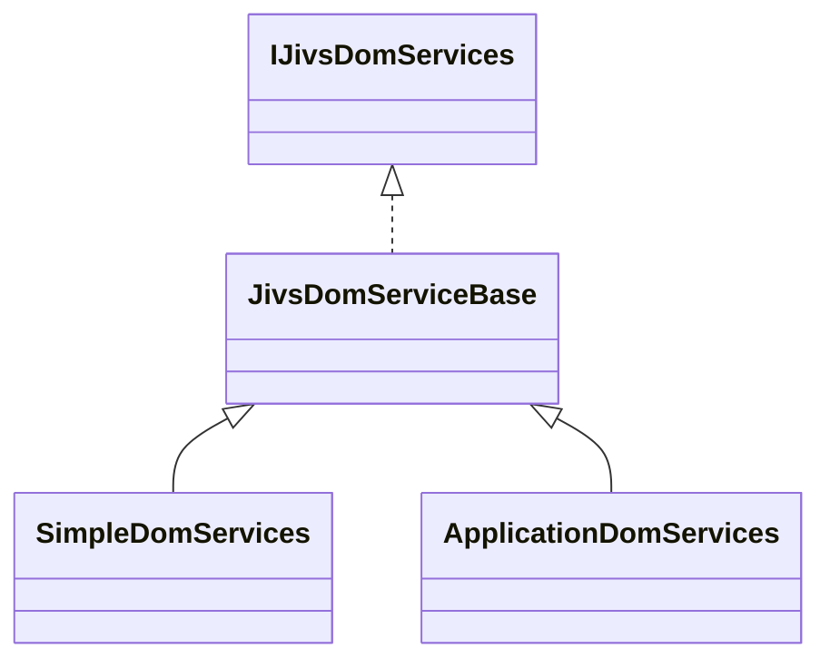

`SimpleDomServices` is the ready-to-use implementation supplied with Jivs. An application-defined subclass uses the reusable `jivs-dom` implementations while supplying the behavior that depends on its own markup and discovery convention.

### Relationship with JivsServices

`IJivsDomServices` participates in the existing Jivs service architecture. It includes the contracts implemented by `ServiceBase` and `ServiceWithAccessorBase`.

Conceptually:

```ts
interface IJivsDomServices
    extends IService, IServicesAccessor {
    // DOM child services and element-resolution methods.
}

abstract class JivsDomServiceBase
    extends ServiceWithAccessorBase
    implements IJivsDomServices {
}
```

The inherited property is:

```ts
services: IJivsServices;
```

There is no separate `jivsServices` property.

The DOM service object may be created before its associated `JivsServices`. Assigning it to the `domServices` property of `JivsServices` supplies the inherited `services` reference using the established `IServicesAccessor` behavior.

`JivsDomServiceBase` does not accept an `IJivsServices` constructor parameter. Its constructor establishes no form-specific or element-specific state.

### Service Collection

`IJivsDomServices` exposes the following replaceable child services and factories:

```ts
interface IJivsDomServices
    extends IService, IServicesAccessor {

    dispatchers: IDomDispatcherService;

    editorAdapterDefinitionFactory:
        IEditorAdapterDefinitionFactory;

    fieldPresentationFactory:
        IFieldPresentationFactory;

    formPresentationFactory:
        IFormPresentationFactory;

    editorInstaller:
        IEditorInstaller;

    fieldPresentationInstaller:
        IFieldPresentationInstaller;

    formPresentationInstaller:
        IFormPresentationInstaller;

    ariaService:
        IDomAriaService | null;

    issuesFoundFormatter:
        IIssuesFoundFormatterService;

    resolveContainerElement(
        valueHostsManager: IValueHostsManager
    ): HTMLElement | null;

    resolveFieldElement(
        root: HTMLElement | null,
        valueHost: IFieldValueHost,
        role: ElementRole | string,
        elementIdentifierTemplate?: string
    ): HTMLElement | null;
}
```

`IJivsDomServices` does not expose:

* an `IDomFormInstaller`;
* an element-resolver service;
* separate Text Value or Native Value installers;
* form-specific installation state.

Applications construct the appropriate concrete `IDomFormInstaller` themselves.

### Lazy Child-Service Construction

The `JivsDomServiceBase` instance is the installed DOM service object. Its child-service properties are created lazily.

Each property getter:

1. returns the currently assigned implementation when one exists;
2. otherwise calls the corresponding protected creation method;
3. retains and returns the created implementation.

Each setter replaces the implementation used by future operations.

The non-nullable properties reject `null` and `undefined`. `ariaService` is intentionally nullable because assigning `null` disables Jivs-managed ARIA behavior.

The `ariaService` backing state distinguishes:

| State            | Meaning                                 |
| ---------------- | --------------------------------------- |
| `undefined`      | The property has not yet been resolved. |
| `null`           | ARIA support is explicitly disabled.    |
| Service instance | The resolved ARIA service.              |

Replacing a child service affects later operations that retrieve that property. It does not alter adapters, presentations, callbacks, or other behavior already installed on DOM elements.

Replacing a factory affects later creations. It does not replace objects already created by the earlier factory.

### Protected Creation Methods

`JivsDomServiceBase` supplies a protected creation method for each lazy child property.

When `jivs-dom` has a complete markup-independent implementation, the base class provides a concrete creation method. When the required implementation depends on a DOM convention, the base class requires the concrete service subclass to supply it.

The intended ownership is:

| Property                     | Default ownership                                                                                                    |
| ---------------------------- | -------------------------------------------------------------------------------------------------------------------- |
| `dispatchers`                | `JivsDomServiceBase` creates `DomDispatcherService`; the subclass supplies its Dispatcher Creators.                  |
| `editorAdapterFactory`       | `JivsDomServiceBase` creates and populates the standard factory from the editor definitions supplied by `jivs-dom`.  |
| `fieldPresentationFactory`   | `JivsDomServiceBase` creates and populates the standard factory from the field presentations supplied by `jivs-dom`. |
| `formPresentationFactory`    | `JivsDomServiceBase` creates and populates the standard factory from the form presentations supplied by `jivs-dom`.  |
| `editorInstaller`            | `JivsDomServiceBase` creates the concrete `EditorInstaller`.                                                         |
| `fieldPresentationInstaller` | `JivsDomServiceBase` creates the concrete `FieldPresentationInstaller`.                                              |
| `formPresentationInstaller`  | `JivsDomServiceBase` creates the concrete `FormPresentationInstaller`.                                               |
| `ariaService`                | The concrete service subclass supplies the discovery-aware implementation.                                           |
| `issuesFoundFormatter`       | `JivsDomServiceBase` creates `IssuesFoundFormatterService`.                                                          |

The protected methods remain override points even when the base class supplies a standard implementation. Applications may alternatively replace the resulting public property.

### Dispatcher Service Construction

`DomDispatcherService` is markup-independent. It owns Dispatcher Creator registration, callback composition, missing-creator handling, and creation of one dispatcher for each callback attachment.

`JivsDomServiceBase` therefore creates the standard `DomDispatcherService`. It does not create concrete dispatchers because their consumer discovery depends on the selected DOM convention.

The concrete DOM service subclass supplies creators for:

* Text Value dispatch;
* Native Value dispatch;
* field validation dispatch;
* form validation dispatch.

Conceptually, the base construction performs:

```ts
protected createDispatcherService():
    IDomDispatcherService {

    const result =
        new DomDispatcherService(this);

    result.registerTextValueChangedDispatcher(
        this.createTextValueDispatcher
    );

    result.registerValueChangedDispatcher(
        this.createValueDispatcher
    );

    result.registerValueHostValidationStateChangedDispatcher(
        this.createFieldValidationDispatcher
    );

    result.registerValidationStateChangedDispatcher(
        this.createFormValidationDispatcher
    );

    return result;
}
```

The exact protected creator signatures must preserve the established `DispatcherCreator<TDispatcher>` contract:

```ts
type DispatcherCreator<TDispatcher> = (
    domServices: IJivsDomServices,
    options?: unknown
) => TDispatcher;
```

`SimpleDomServices` supplies creators that construct the four SimpleDom dispatcher classes. An application-defined service subclass supplies creators for its own discovery-aware dispatchers.

A separate `SimpleDomDispatcherService` subclass is not required.

### Factory Ownership

The three public factories are owned by the DOM service collection because applications need access to their registration APIs.

#### Editor Adapter Factory

`editorAdapterFactory` contains the registered `IEditorAdapterDefinition` objects.

The standard creation method constructs `EditorAdapterFactory` and registers the built-in definitions supplied by `jivs-dom`, including:

* ordinary input definitions;
* `CheckboxAdapterDefinition`;
* `InputRadioGroupAdapterDefinition`;
* `TextAreaAdapterDefinition`;
* `SelectAdapterDefinition`;
* `FileInputAdapterDefinition`.

The registrations are markup-independent. They recognize native editor behavior rather than SimpleDom attributes.

Applications may register additional definitions or replace built-in adapter keys through the public factory. A service subclass may override the protected factory-creation method when it needs a different initial registry.

#### Field Presentation Factory

`fieldPresentationFactory` contains field-presentation creators and role defaults.

The standard creation method constructs the concrete field presentation factory and registers the presentations supplied by `jivs-dom`. It also establishes the standard role defaults defined by the field-presentation architecture.

Applications may add or replace registrations after retrieving the factory.

#### Form Presentation Factory

`formPresentationFactory` contains form-presentation creators and role defaults.

The standard creation method constructs the concrete form presentation factory and registers the form presentations supplied by `jivs-dom`. It establishes the standard Validation Summary default and leaves the submit role without a default, as defined by the form-presentation architecture.

Applications may add or replace registrations after retrieving the factory.

### Installer Ownership and Construction

The three specialized element installers have complete, markup-independent implementations in `jivs-dom`. `JivsDomServiceBase` therefore creates their concrete implementations.

#### Field Presentation Installer

The default property value is a concrete `FieldPresentationInstaller`.

It uses the current DOM service collection to obtain:

* `fieldPresentationFactory`;
* `ariaService`;
* `services.loggingService`.

It does not retain a field, element, presentation, or validation state between calls.

#### Form Presentation Installer

The default property value is a concrete `FormPresentationInstaller`.

It uses the current DOM service collection to obtain:

* `formPresentationFactory`;
* `ariaService`;
* `services.loggingService`.

It does not retain a manager, element, presentation, or validation state between calls.

#### Editor Installer

The default property value is a concrete `EditorInstaller`.

`JivsDomServiceBase` owns its construction because all editor-installation coordination is defined by `jivs-dom`. The concrete DOM convention discovers the editor and supplies its installation options; it does not replace the coordination algorithm.

`EditorInstaller` uses the current DOM service collection to obtain:

* `editorAdapterFactory`;
* `fieldPresentationInstaller`;
* `services.loggingService`.

Retaining `IJivsDomServices` rather than captured child-service instances allows later replacement of the factory or field presentation installer to affect subsequent editor installations.

Conceptually:

```ts
protected createEditorInstaller():
    IEditorInstaller {

    return new EditorInstaller(this);
}
```

`EditorInstaller` does not perform element discovery and does not interpret SimpleDom attributes.

### ARIA Service Construction

ARIA discovery depends on the DOM convention. `JivsDomServiceBase` therefore cannot construct a complete default `IDomAriaService`.

Its protected ARIA creation method is abstract and returns:

```ts
IDomAriaService | null
```

`SimpleDomServices` returns `SimpleDomAriaService`.

An application-defined service subclass returns its own `AriaServiceBase` descendant or another complete `IDomAriaService` implementation. It may return `null` when the convention intentionally disables Jivs-managed ARIA behavior.

The standard ARIA updater classes remain owned by `jivs-dom`. The concrete ARIA service registers the applicable standard updater instances during its construction.

### Issues Found Formatter Construction

`JivsDomServiceBase` creates `IssuesFoundFormatterService` as the default `issuesFoundFormatter`.

The formatter is markup-independent and requires no SimpleDom behavior. Presentations, ARIA updaters, and applications obtain it through the DOM service collection.

A replacement affects later formatting operations. Existing generated HTML and text are not revised.

### Element Resolution

Element resolution belongs directly to `IJivsDomServices`:

```ts
interface IJivsDomServices {
    resolveContainerElement(
        valueHostsManager: IValueHostsManager
    ): HTMLElement | null;

    resolveFieldElement(
        root: HTMLElement | null,
        valueHost: IFieldValueHost,
        role: ElementRole | string,
        elementIdentifierTemplate?: string
    ): HTMLElement | null;
}
```

These methods are implemented by `JivsDomServiceBase`. A subclass overrides them when its markup convention requires different resolution.

There is no `IDomElementResolver`.

#### Container Resolution

`resolveContainerElement()` obtains the Container Identifier from the supplied manager.

When no Container Identifier is configured, it returns:

```ts
document.body
```

Otherwise, the Container Identifier is passed to `document.querySelector()`. It must therefore be a valid selector that identifies an `HTMLElement`.

A valid selector with no match returns `null`. An invalid selector throws normally. When multiple elements match, the first match is returned without duplicate detection.

The method does not fall back to `document.body` when a configured selector has no match.

#### Field Element Resolution

When `root` is `null`, `resolveFieldElement()` obtains the field’s manager through `valueHost.valueHostsManager` and calls `resolveContainerElement()`.

If container resolution returns `null`, field resolution also returns `null`.

The `JivsDomServiceBase` implementation uses the supplied `elementIdentifierTemplate`, or the role-independent `{0}` template when none is supplied:

```ts
const selector =
    valueHost.getElementIdentifier(
        elementIdentifierTemplate ?? "{0}"
    );
```

The resulting Element Identifier must be a valid selector.

The supplied root participates in resolution. The method first tests the root itself and then searches its descendants:

```ts
if (root.matches(selector)) {
    return root;
}

return root.querySelector<HTMLElement>(
    selector
);
```

A valid selector with no match returns `null` without logging. Individual field roles are optional, and a partial root may legitimately exclude most fields.

When multiple elements match, the first match is returned without duplicate detection. Selector uniqueness is the developer’s responsibility.

The base implementation does not interpret `role`. A subclass may use it to select a role-specific identifier template or selector convention.

An explicitly supplied `elementIdentifierTemplate` overrides the subclass’s normal role-derived template and is passed to `valueHost.getElementIdentifier()`.

### SimpleDomServices

`SimpleDomServices` extends `JivsDomServiceBase`.

It supplies the convention-dependent parts of the service graph:

* the four SimpleDom Dispatcher Creators;
* `SimpleDomAriaService`;
* role-based field-element resolution using the SimpleDom attribute convention.

It inherits the standard:

* editor adapter factory and built-in definitions;
* field presentation factory;
* form presentation factory;
* editor installer;
* field presentation installer;
* form presentation installer;
* Issues Found formatter;
* container-selector resolution.

`SimpleDomServices` does not create or retain a `SimpleDomFormInstaller`. The application constructs that installer explicitly:

```ts
const formInstaller =
    new SimpleDomFormInstaller(domServices);
```

### Installation into JivsServices

The DOM module augments `IJivsServices` with:

```ts
interface IJivsServices {
    domServices: IJivsDomServices;
}
```

The service is installed using the existing Jivs module-service mechanism. Assignment of the service to `JivsServices` also assigns its inherited `services` accessor.

Because `JivsDomServiceBase` is abstract, `@plblum/jivs-dom` does not install an instance of that class.

`@plblum/jivs-simpledom` installs `SimpleDomServices` as the standard concrete `domServices` implementation. An application using another convention installs its own `JivsDomServiceBase` descendant instead.

The installed DOM service object is available through:

```ts
const domServices =
    jivsServices.domServices;
```

Its child services remain lazy and are created when their properties are first requested.

### Package Initialization Responsibilities

`@plblum/jivs-dom` is responsible for:

* declaring the `IJivsServices.domServices` module augmentation;
* exporting `IJivsDomServices`;
* exporting `JivsDomServiceBase`;
* exporting the reusable module-service installation support;
* exporting the standard child-service, factory, installer, dispatcher, adapter, presentation, formatter, and ARIA types;
* supplying all markup-independent default construction.

`@plblum/jivs-simpledom` is responsible for:

* exporting `SimpleDomServices`;
* installing `SimpleDomServices` as the standard concrete DOM service;
* supplying the four SimpleDom Dispatcher Creators;
* supplying `SimpleDomAriaService`;
* supplying SimpleDom role-based field-element resolution;
* exporting `SimpleDomFormInstaller`.

An application using `jivs-dom` without SimpleDom is responsible for:

* deriving a concrete service from `JivsDomServiceBase`;
* supplying its discovery-aware dispatchers;
* supplying its ARIA service or explicitly disabling ARIA;
* overriding field-element resolution when its convention needs role-specific behavior;
* installing its concrete service into `JivsServices`;
* constructing its concrete form installer.

### Disposal

`JivsDomServiceBase` participates in the existing `ServiceBase.dispose()` lifecycle.

Its disposal implementation releases references to child services and factories that were created or assigned. It does not search the DOM, remove event handlers from installed elements, or dispose form-specific state.

Installed DOM elements retain their installed behavior until they are removed or become unreachable.

The exact child-disposal policy should follow the established Jivs service conventions: the service collection must not unexpectedly dispose a replacement object that may be owned elsewhere.

### Required Consistency Changes

The following settled sections require narrow terminology changes after this section is approved:

* references to `DomServices` as the concrete root type become `IJivsDomServices` or `JivsDomServiceBase`, according to context;
* `domServices.jivsServices.loggingService` becomes `domServices.services.loggingService`;
* references to default `DomServices` construction are replaced by the abstract-base and concrete-service model;
* the provisional service-retrieval line in Section 11 becomes `jivsServices.domServices`.

No installer, dispatcher, presentation, ARIA, or form-installation behavior changes as a result.

## Package Boundaries and Implementation Guide

### Package Responsibilities

The first implementation introduces three workspaces:

| Workspace                   | Published | Responsibility                                                                                                                               |
| --------------------------- | --------: | -------------------------------------------------------------------------------------------------------------------------------------------- |
| `packages/jivs-dom`         |       Yes | Reusable DOM contracts, services, adapters, installers, dispatchers, presentations, ARIA support, formatting, and framework-independent CSS. |
| `packages/jivs-simpledom`   |       Yes | SimpleDom attributes, discovery, concrete services, dispatchers, ARIA discovery, form installation, and SimpleDom-specific CSS.              |
| `packages/jivs-dom-website` |        No | Runnable demonstrations, manual browser verification, learning examples, and package integration coverage.                                   |

The dependency direction is:

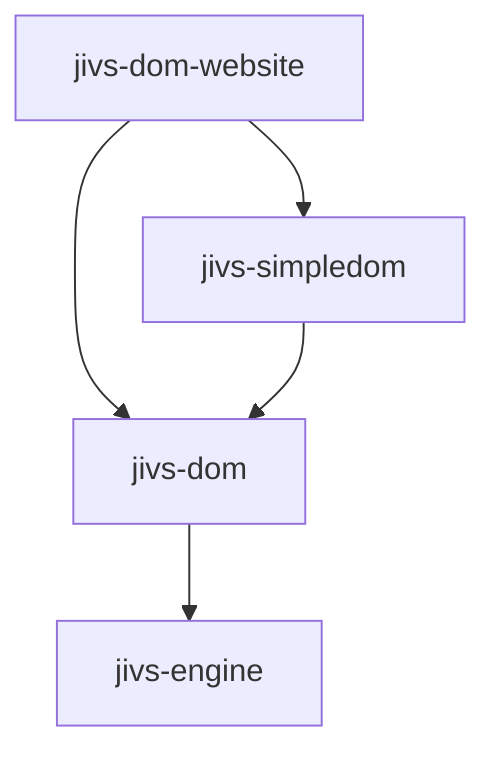

`jivs-dom` must not depend on `jivs-simpledom`.

The website consumes the published package surfaces. It must not import sibling-package source files through relative paths. This makes the website an integration check for package exports, generated JavaScript, declaration files, and published CSS assets.

### Website Strategy

The initial implementation should use one website rather than separate websites for `jivs-dom` and `jivs-simpledom`.

The website should contain:

* a home page linking to the demonstrations;
* SimpleDom demonstrations representing the normal developer experience;
* selected direct `jivs-dom` demonstrations showing customization without SimpleDom;
* pages focused on editors, field presentation, form presentation, ARIA, DOM replacement, and multiple managers.

A second website should be introduced only when a future framework integration requires its own build system or runtime. Angular, React, and Vue examples should not determine the architecture of the initial DOM website.

### Vite Website

`packages/jivs-dom-website` should be a private Vite application using plain HTML, CSS, and TypeScript.

Vite is appropriate because it provides:

* a Node-based development server;
* direct TypeScript module loading during development;
* linked-package support in a monorepo;
* multiple HTML entry points;
* a static production build;
* no required UI framework.

The website package should be marked:

```json
{
    "private": true
}
```

It must not participate in NPM publishing.

Its scripts should provide the equivalent of:

```json
{
    "scripts": {
        "dev": "vite",
        "build": "tsc --noEmit && vite build",
        "preview": "vite preview"
    }
}
```

The exact TypeScript command should follow the repository’s existing project-reference or package-build convention.

The website’s internal package dependencies should use the same version and workspace-linking convention already used elsewhere in the repository:

```json
{
    "dependencies": {
        "@plblum/jivs-engine": "...",
        "@plblum/jivs-dom": "...",
        "@plblum/jivs-simpledom": "..."
    },
    "devDependencies": {
        "typescript": "...",
        "vite": "..."
    }
}
```

Version values should not introduce a new workspace dependency convention solely for the website.

### Website Organization

A multi-page structure keeps each demonstration independent and makes its HTML easy to inspect:

| Location                                | Purpose                                                   |
| --------------------------------------- | --------------------------------------------------------- |
| `index.html`                            | Demonstration index and package introduction.             |
| `examples/basic/index.html`             | Basic SimpleDom form.                                     |
| `examples/presentations/index.html`     | Field and form presentations.                             |
| `examples/aria/index.html`              | ARIA attributes and dedicated error-message elements.     |
| `examples/replacement/index.html`       | Partial DOM replacement and reinstallation.               |
| `examples/multiple-managers/index.html` | Container Identifier isolation.                           |
| `examples/custom-dom/index.html`        | Direct `jivs-dom` use without SimpleDom.                  |
| `src/shared/`                           | Website-only layout, logging, and demonstration helpers.  |
| `src/examples/`                         | TypeScript entry modules for individual demonstrations.   |
| `public/`                               | Static website assets that are not produced by a package. |

Each demonstration page should load one small TypeScript entry module. Shared website code must remain presentation or demonstration infrastructure rather than becoming an undocumented library implementation.

The Vite production configuration must list every demonstration HTML file as a build input. The resulting `dist` directory is a deployable static website.

### Consuming Workspace Packages

The website should import only public package entry points:

```ts
import {
    ValueHostsManager
} from "@plblum/jivs-engine";

import {
    ElementRole
} from "@plblum/jivs-dom";

import {
    SimpleDomFormInstaller
} from "@plblum/jivs-simpledom";
```

CSS should also use explicit public exports when possible:

```ts
import "@plblum/jivs-dom/styles.css";
import "@plblum/jivs-simpledom/styles.css";
```

The corresponding package `exports` maps must expose those CSS files.

Avoid Vite aliases that point directly into sibling `src` directories. Such aliases can make development convenient while bypassing the package entry points that consumers actually receive.

When the repository’s normal package build produces JavaScript before consumption, the website build must run after its dependent libraries. During active development, the repository may use its existing watch orchestration to rebuild those packages while Vite serves the website.

### Website Runtime

The initial website requires no application server.

Node.js runs:

* the Vite development server;
* the Vite production build;
* the local production preview server.

The generated site is static and can later be hosted by GitHub Pages or another static host.

A custom Node server should be added only when a demonstration genuinely requires server behavior, such as server-side validation or round-trip examples. That server should remain demonstration infrastructure and should not become a runtime dependency of `jivs-dom` or `jivs-simpledom`.

### TypeScript DOM Configuration

The TypeScript configurations for `jivs-dom`, `jivs-simpledom`, and the website must include browser declarations.

Their effective compiler options must include the appropriate ECMAScript library together with:

```json
{
    "lib": [
        "ES2022",
        "DOM",
        "DOM.Iterable"
    ]
}
```

The exact ECMAScript version should follow the repository’s current target rather than adopting `ES2022` merely from this example.

Node-only packages should not acquire DOM declarations through the root configuration unless they already intentionally include them. DOM libraries can extend the shared configuration and add the browser libraries locally.

### Jest DOM Environment

`jivs-dom` and `jivs-simpledom` should continue using Jest and the repository’s existing TypeScript transformation.

Each DOM package adds a development dependency on:

```text
jest-environment-jsdom
```

Its major version should match the installed Jest major version.

The effective Jest configuration for those packages sets:

```ts
testEnvironment: "jsdom"
```

The configuration may also establish a stable document URL:

```ts
testEnvironmentOptions: {
    url: "http://localhost/"
}
```

The existing Node test environment should remain in effect for `jivs-engine` and other packages that do not require browser globals.

Do not change the entire monorepo to JSDOM merely because the new packages require it.

### Jest Configuration Reuse

If the repository has a shared Jest configuration, the DOM packages should extend it and override only their environment-specific settings.

Conceptually:

```ts
export default {
    ...sharedJestConfig,
    testEnvironment: "jsdom",
    testEnvironmentOptions: {
        url: "http://localhost/"
    },
    setupFilesAfterEnv: [
        "<rootDir>/test/setupTests.ts"
    ]
};
```

The exact module syntax and transform settings must match the existing Jest and `ts-jest` configuration.

The DOM packages should not establish a second, competing TypeScript-to-Jest pipeline.

### DOM Test Setup

JSDOM supplies `document`, `HTMLElement`, native element classes, selectors, attributes, and DOM events.

Tests should construct actual simulated elements:

```ts
const input = document.createElement("input");
input.type = "text";
input.value = "New value";

document.body.append(input);

input.dispatchEvent(
    new Event("change", {
        bubbles: true
    })
);
```

Do not replace standard DOM elements, selector behavior, or event bubbling with handwritten mocks.

A shared package-local setup file may reset document state after each test:

```ts
afterEach(() => {
    document.head.replaceChildren();
    document.body.replaceChildren();
});
```

Tests must also reset or recreate mutable service registrations that are not owned by the removed elements.

Each test should normally create its own:

* `JivsServices`;
* DOM services;
* `ValueHostsManager`;
* elements;
* adapter and presentation registrations that differ from defaults.

This prevents registration replacement or installed element state from leaking between tests.

### What JSDOM Tests Should Verify

JSDOM unit tests should verify observable logic, including:

* `resolveContainerElement()` and `resolveFieldElement()`;
* root-self matching before descendant matching;
* valid selectors with no matches;
* invalid-selector propagation;
* installed `IJivsDomElement` properties;
* adapter-definition selection and priority;
* adapter read and write behavior;
* actual DOM event submission to an `IFieldValueHost`;
* bubbling behavior for composite editors;
* presentation-created content and CSS classes;
* ARIA attributes and dedicated error-message text;
* dispatcher consumer discovery on every invocation;
* behavior after removal or replacement of elements;
* full and partial form installation;
* installation idempotency;
* collector disposal;
* generated error-message HTML.

Queries should be made through normal DOM APIs such as:

```ts
element.matches(selector);
element.querySelector(selector);
root.querySelectorAll(selector);
```

Events should use the same event names, bubbling settings, and target relationships expected in the browser.

### JSDOM Limitations

JSDOM is not a rendering engine.

Unit tests should not use it to prove:

* visual layout;
* computed element dimensions;
* popup positioning;
* actual screen-reader announcements;
* browser focus behavior in every browser;
* complete native constraint-validation behavior;
* CSS appearance;
* browser-specific file-input security behavior.

CSS-related unit tests may verify that code assigns or removes the expected classes and attributes. They should not claim that the resulting page is visually correct.

The demonstration website supplies manual browser verification during the initial implementation.

A later browser integration suite may use Playwright when behavior depends on layout, focus, native browser controls, or complete page interaction. Playwright is not required to begin implementation of the DOM packages.

### Test Organization

Each DOM package should keep tests near its established package test location and group them by public responsibility.

Recommended `jivs-dom` test areas include:

* installed element state;
* adapter factory;
* individual native adapter definitions;
* editor installer;
* field presentation factory and installer;
* form presentation factory and installer;
* Issues Found formatter;
* ARIA updater classes;
* dispatcher service and callback composition;
* dispatcher base failure behavior;
* element resolution;
* field and form collectors;
* `JivsDomServiceBase`.

Recommended `jivs-simpledom` test areas include:

* attribute parsing;
* role discovery;
* collector population;
* SimpleDom dispatcher discovery;
* `SimpleDomAriaService`;
* `SimpleDomServices`;
* `SimpleDomFormInstaller`;
* repeated and partial installation;
* installation after DOM replacement.

Tests for `jivs-dom` must not use SimpleDom attributes unless the test is verifying that generic behavior ignores them.

### Public Exports

`@plblum/jivs-dom` should export its public contracts, abstract bases, concrete reusable implementations, option and installation-record interfaces, standard editor definitions, presentations, ARIA updaters, formatter, and CSS entry point.

`@plblum/jivs-simpledom` should export:

* SimpleDom attribute-name constants;
* `SimpleDomServices`;
* `SimpleDomFormInstaller`;
* concrete SimpleDom dispatcher classes;
* `SimpleDomAriaService`;
* public SimpleDom option types;
* its CSS entry point.

Internal selector-building helpers and package-registration implementation details do not need public exports unless applications require them to implement documented customization.

The website exports nothing.

### CSS and Published Assets

`@plblum/jivs-dom` publishes its framework-independent CSS, including:

* standard presentation classes;
* validation-state classes;
* Required Indicator classes;
* Field Error Display classes;
* `jivs-visually-hidden`.

`@plblum/jivs-simpledom` publishes CSS that depends on its attributes or markup convention.

Both packages must:

* copy their CSS into the package output;
* include the CSS in the NPM `files` list;
* expose stable CSS subpaths through `package.json`;
* verify the packed package rather than relying only on repository-local imports.

The website may add demonstration layout and navigation CSS, but it must not silently provide CSS required by the published libraries.

### Root Commands

The root package should provide convenient commands using the repository’s existing workspace or Lerna convention.

The intended capabilities are:

| Command capability | Result                                                      |
| ------------------ | ----------------------------------------------------------- |
| Build DOM packages | Builds `jivs-dom` and `jivs-simpledom` in dependency order. |
| Test DOM packages  | Runs their JSDOM Jest suites.                               |
| Start DOM website  | Builds or watches dependencies and starts Vite.             |
| Build DOM website  | Builds dependencies and then produces the static website.   |
| Test all           | Includes both new package test suites.                      |
| Build all          | Includes both libraries and the website.                    |

Exact command text should be based on the current root scripts and task orchestration rather than introducing a second monorepo command style.

### Publishing Order

When engine changes are required, the publishing order is:

1. `@plblum/jivs-engine`
2. `@plblum/jivs-dom`
3. `@plblum/jivs-simpledom`

The website is not published to NPM. Its static build is deployed separately.

`jivs-dom` declares its engine dependency according to the repository’s existing dependency policy. `jivs-simpledom` declares dependencies on both `jivs-engine` and `jivs-dom` when it imports their public APIs directly.

### Starter-Code and Documentation Migration

Reusable DOM behavior moves from starter code into the published packages.

The migration must identify:

* starter code replaced by `jivs-dom`;
* starter code replaced by `jivs-simpledom`;
* submission-related code that remains outside both packages;
* Learning Jivs examples that should import the new packages;
* CSS references that must use the published assets;
* obsolete SimpleDom initialization functions.

The demonstration website becomes the executable source for current examples. Documentation may quote or link to those examples, but duplicate implementations should not remain authoritative in both starter code and the website.

### Implementation Checklist

1. Apply the required `jivs-engine` API changes.
2. Create `packages/jivs-dom`.
3. Add DOM TypeScript libraries and package-scoped JSDOM Jest configuration.
4. Implement and test the installed-element contracts.
5. Implement and test adapters, factories, and installers.
6. Implement and test presentations, formatting, and ARIA updaters.
7. Implement and test dispatchers and callback attachment.
8. Implement and test form installation coordination.
9. Create `packages/jivs-simpledom`.
10. Implement and test SimpleDom services, discovery, dispatchers, ARIA, and form installation.
11. Publish and test CSS package assets.
12. Create the private `packages/jivs-dom-website` Vite workspace.
13. Add the demonstration index and focused example pages.
14. Build the website exclusively through public package exports.
15. Migrate applicable starter code and Learning Jivs examples.
16. Run package tests, package builds, packing verification, and the website production build.
17. Publish in dependency order.
18. Deploy the static demonstration website separately.
