# Jivs-DOM Implementation Design

## Purpose and Scope

This document is the implementation blueprint for adding DOM support to the Jivs repository. It defines the architecture, public API, concrete types, and package responsibilities needed to implement:

* `@plblum/jivs-dom`
* `@plblum/jivs-simpledom`
* demonstration websites that exercise and explain those packages

`jivs-dom` provides reusable integration between Jivs and browser DOM elements. It supplies editor adapters, installation services, dispatchers, validation presentations, accessibility support, error-message formatting, and related CSS without imposing a particular HTML markup convention.

`jivs-simpledom` is a concrete implementation built on `jivs-dom`. It uses a defined set of HTML attributes to discover elements, associate them with Jivs objects, select presentations, and install the required DOM behavior.

The document also identifies changes required in `jivs-engine` to support these packages.

This is a coding blueprint rather than a history of the design process or an end-user learning guide. It uses exact API names and signatures where decisions have been completed. Any remaining conceptual APIs are identified as unresolved and must be finalized before their implementation sections are considered complete.

Repository placement, demonstration website organization, and testing responsibilities are included where they affect the implementation design. Detailed development commands, migration sequencing, publishing procedures, and end-user documentation remain outside its scope.

## Architectural Overview

### Relationship with jivs-engine

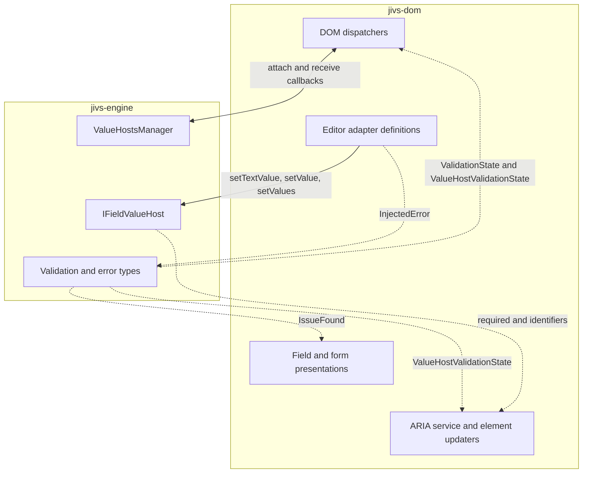
```mermaid
flowchart TB
    subgraph DOM["jivs-dom"]
        direction TB

        DISPATCHERS["DOM dispatchers"]
        EDITORS["Editor adapter definitions"]
        PRESENTATIONS["Field and form presentations"]
        ARIA["ARIA service and element updaters"]

        DISPATCHERS ~~~ EDITORS
        PRESENTATIONS ~~~ ARIA
    end

    subgraph ENGINE["jivs-engine"]
        direction TB

        CONFIG["ValueHostsManager"]
        FIELD["IFieldValueHost"]
        TYPES["Validation and error types"]

        CONFIG ~~~ FIELD ~~~ TYPES
    end

    DISPATCHERS <-->|"attach and receive callbacks"| CONFIG
    EDITORS -->|"setTextValue, setValue, setValues"| FIELD

    TYPES -.->|"ValidationState and ValueHostValidationState"| DISPATCHERS
    TYPES -.->|"IssueFound"| PRESENTATIONS
    TYPES -.->|"ValueHostValidationState"| ARIA
    FIELD -.->|"required and identifiers"| ARIA
    EDITORS -.->|"InjectedError"| TYPES
```

The principal `jivs-engine` integration points are:

| Jivs API                                                    | Use within `jivs-dom`                                                                                                                                                               |
| ----------------------------------------------------------- | ----------------------------------------------------------------------------------------------------------------------------------------------------------------------------------- |
| `ValueHostsManager.onTextValueChanged`                | Notifies a Text Value dispatcher. The dispatcher obtains the current Text Value from the supplied `IFieldValueHost` and writes it through installed `ITextValueAdapter` objects. |
| `ValueHostsManager.onValueChanged`                    | Notifies a Native Value dispatcher. The dispatcher obtains the current Native Value from the supplied `IValueHost` and writes it through installed `IValueAdapter` objects.      |
| `ValueHostsManager.onValueHostValidationStateChanged` | Supplies the `ValueHostValidationState` used by installed field presentations and field-level ARIA behavior.                                                                        |
| `ValueHostsManager.onValidationStateChanged`          | Supplies the `ValidationState` used by installed form presentations.                                                                                                                |
| `IFieldValueHost.setTextValue()`                            | Accepts textual editor input and lets Jivs perform its configured parsing and validation.                                                                                           |
| `IFieldValueHost.setValue()`                                | Accepts a Native Value from an editor that exposes non-textual or structured data.                                                                                                  |
| `IFieldValueHost.setValues()`                               | Accepts related Text and Native Values when parsing is performed outside Jivs. It can also receive an `InjectedError` when that parsing fails.                                      |
| `IFieldValueHost.getElementIdentifier()`                    | Supplies the application-defined identifier used by a DOM convention to associate the field with its elements.                                                                      |
| `ValidationState`                                           | Describes validation across the `ValueHostsManager` and drives form presentation.                                                                                                   |
| `ValueHostValidationState`                                  | Describes validation for one ValueHost and drives field presentation.                                                                                                               |
| `IssueFound`                                                | Supplies the validation messages and metadata consumed by error displays, summaries, and DOM-oriented message formatting.                                                           |
| `InjectedError`                                             | Allows an editor adapter definition that performs external parsing to report a parsing failure through Jivs validation.                                                             |
| `ValueHostsManager.broadcastState()`                        | Republishes current Text Values, field validation state, and form validation state when initialization did not produce the usual change callbacks.                                  |

### Editor Element Installation

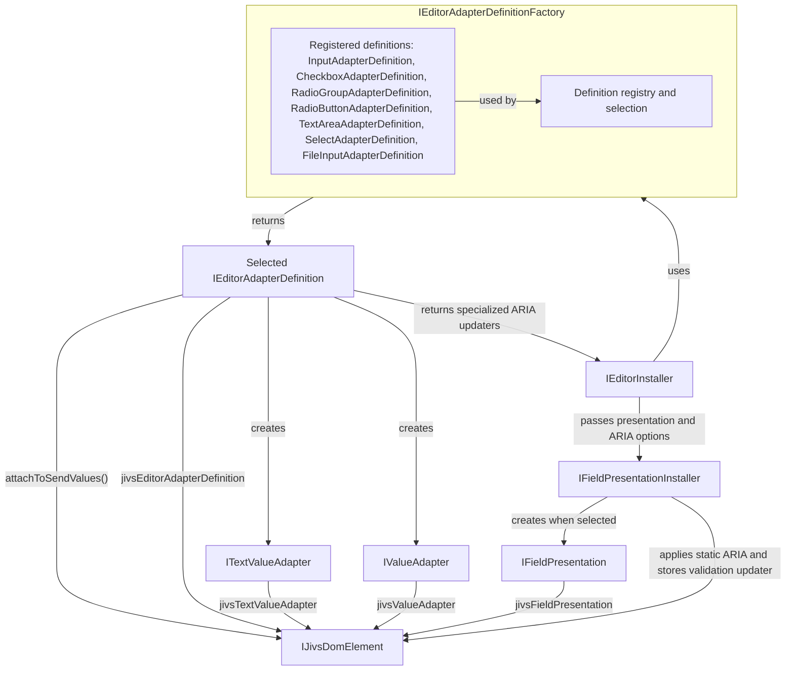
```mermaid
flowchart TB
    INSTALLER["IEditorInstaller"]
    DEFINITION["Selected IEditorAdapterDefinition"]
    PRESENTATION_INSTALLER["IFieldPresentationInstaller"]

    subgraph FACTORY["IEditorAdapterDefinitionFactory"]
        direction LR

        REGISTERED["Registered definitions: InputAdapterDefinition, CheckboxAdapterDefinition, RadioGroupAdapterDefinition, RadioButtonAdapterDefinition, TextAreaAdapterDefinition, SelectAdapterDefinition, FileInputAdapterDefinition"]
        FACTORY_API["Definition registry and selection"]

        REGISTERED -->|"used by"| FACTORY_API
    end

    ELEMENT["IJivsDomElement"]
    TEXT_ADAPTER["ITextValueAdapter"]
    VALUE_ADAPTER["IValueAdapter"]
    PRESENTATION["IFieldPresentation"]

    INSTALLER -->|"uses"| FACTORY
    FACTORY -->|"returns"| DEFINITION

    DEFINITION -->|"creates"| TEXT_ADAPTER
    DEFINITION -->|"creates"| VALUE_ADAPTER
    DEFINITION -->|"attachToSendValues()"| ELEMENT
    DEFINITION -->|"returns specialized ARIA updaters"| INSTALLER

    DEFINITION -->|"jivsEditorAdapterDefinition"| ELEMENT
    TEXT_ADAPTER -->|"jivsTextValueAdapter"| ELEMENT
    VALUE_ADAPTER -->|"jivsValueAdapter"| ELEMENT

    INSTALLER -->|"passes presentation and ARIA options"| PRESENTATION_INSTALLER
    PRESENTATION_INSTALLER -->|"creates when selected"| PRESENTATION
    PRESENTATION -->|"jivsFieldPresentation"| ELEMENT
    PRESENTATION_INSTALLER -->|"applies static ARIA and stores validation updater"| ELEMENT
```

### Editor Callback Flows

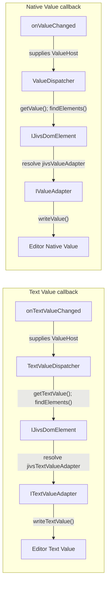
```mermaid
flowchart LR
    subgraph TEXT["Text Value callback"]
        direction TB

        TEXT_CALLBACK["onTextValueChanged"]
        TEXT_DISPATCHER["TextValueDispatcher"]
        TEXT_ELEMENT["IJivsDomElement"]
        TEXT_ADAPTER["ITextValueAdapter"]
        TEXT_EDITOR["Editor Text Value"]

        TEXT_CALLBACK -->|"supplies ValueHost"| TEXT_DISPATCHER
        TEXT_DISPATCHER -->|"getTextValue(); findElements()"| TEXT_ELEMENT
        TEXT_ELEMENT -->|"resolve jivsTextValueAdapter"| TEXT_ADAPTER
        TEXT_ADAPTER -->|"writeTextValue()"| TEXT_EDITOR
    end

    subgraph VALUE["Native Value callback"]
        direction TB

        VALUE_CALLBACK["onValueChanged"]
        VALUE_DISPATCHER["ValueDispatcher"]
        VALUE_ELEMENT["IJivsDomElement"]
        VALUE_ADAPTER["IValueAdapter"]
        VALUE_EDITOR["Editor Native Value"]

        VALUE_CALLBACK -->|"supplies ValueHost"| VALUE_DISPATCHER
        VALUE_DISPATCHER -->|"getValue(); findElements()"| VALUE_ELEMENT
        VALUE_ELEMENT -->|"resolve jivsValueAdapter"| VALUE_ADAPTER
        VALUE_ADAPTER -->|"writeValue()"| VALUE_EDITOR
    end
```

### Presentation Installation

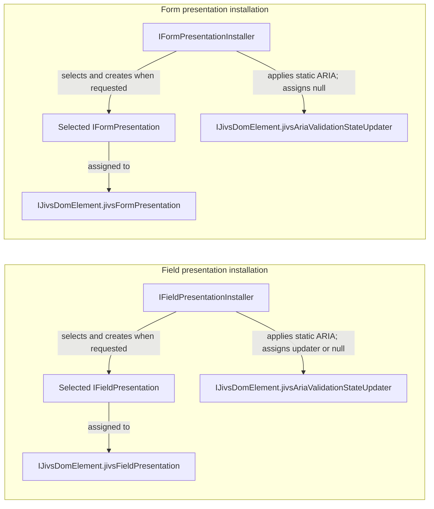
```mermaid
flowchart LR
    subgraph FIELD["Field presentation installation"]
        direction TB

        FIELD_INSTALLER["IFieldPresentationInstaller"]
        FIELD_PRESENTATION["Selected IFieldPresentation"]
        FIELD_PRESENTATION_STATE["IJivsDomElement.jivsFieldPresentation"]
        FIELD_ARIA_STATE["IJivsDomElement.jivsAriaValidationStateUpdater"]

        FIELD_INSTALLER -->|"selects and creates when requested"| FIELD_PRESENTATION
        FIELD_PRESENTATION -->|"assigned to"| FIELD_PRESENTATION_STATE
        FIELD_INSTALLER -->|"applies static ARIA; assigns updater or null"| FIELD_ARIA_STATE
    end

    subgraph FORM["Form presentation installation"]
        direction TB

        FORM_INSTALLER["IFormPresentationInstaller"]
        FORM_PRESENTATION["Selected IFormPresentation"]
        FORM_PRESENTATION_STATE["IJivsDomElement.jivsFormPresentation"]
        FORM_ARIA_STATE["IJivsDomElement.jivsAriaValidationStateUpdater"]

        FORM_INSTALLER -->|"selects and creates when requested"| FORM_PRESENTATION
        FORM_PRESENTATION -->|"assigned to"| FORM_PRESENTATION_STATE
        FORM_INSTALLER -->|"applies static ARIA; assigns null"| FORM_ARIA_STATE
    end
```

### Field Presentation Flow

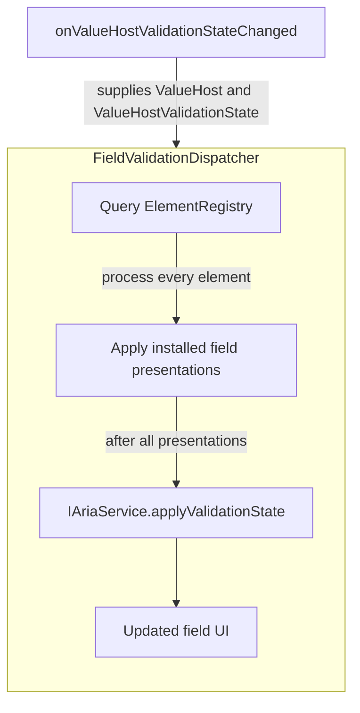
```mermaid
flowchart TB
    CALLBACK["onValueHostValidationStateChanged"]

    subgraph DISPATCHER["FieldValidationDispatcher"]
        direction TB

        FIND["Query ElementRegistry"]
        APPLY["Apply installed field presentations"]
        ARIA["IAriaService.applyValidationState"]
        FIELD_UI["Updated field UI"]

        FIND -->|"process every element"| APPLY
        APPLY -->|"after all presentations"| ARIA
        ARIA --> FIELD_UI
    end


    CALLBACK -->|"supplies ValueHost and ValueHostValidationState"| DISPATCHER

```

### Form Presentation Flow

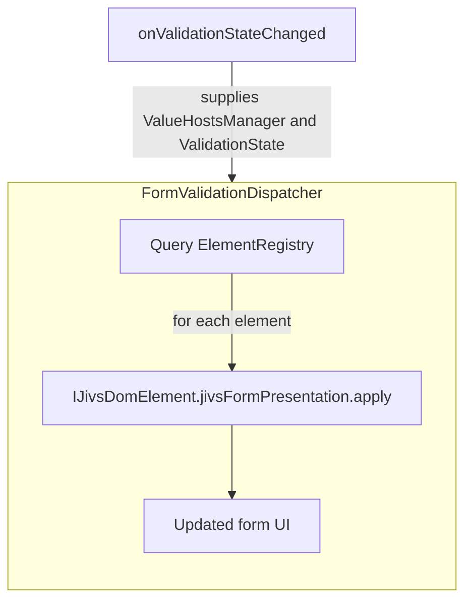
```mermaid
flowchart TB
    CALLBACK["onValidationStateChanged"]

    subgraph DISPATCHER["FormValidationDispatcher"]
        direction TB

        FIND["Query ElementRegistry"]
        APPLY["IJivsDomElement.jivsFormPresentation.apply"]
        FORM_UI["Updated form UI"]

        FIND -->|"for each element"| APPLY
        APPLY --> FORM_UI
    end

    CALLBACK -->|"supplies ValueHostsManager and ValidationState"| DISPATCHER
```
## Core Design Principles

* DOM elements own element-specific installation state. Installed adapter definitions, adapters, and presentations are exposed through the `IJivsDomElement` contract.

* Registered adapter definitions are shared and immutable. They do not retain element-specific, ValueHost-specific, or installation-specific state.

* Adapters and presentations are created for individual elements. They may retain state belonging to that element but do not retain a `ValueHostsManager`.

* Shared services do not retain forms, elements, element collections, or DOM subtrees. Form-specific element references belong to the `ElementRegistry` stored in `ValueHostsManager` metadata.

* Dispatchers are created for a specific callback attachment. They retain their DOM services but obtain elements through purpose-specific `ElementRegistry` queries during every dispatch.

* The four callback capabilities remain independent: Text Value changes, Native Value changes, field validation changes, and form validation changes can be attached and replaced separately.

* Editor installation is idempotent after successful completion. Later calls that resolve to the same installation anchor do not modify the anchor or attach additional event handlers.

* Public behavior is replaceable through interfaces, service properties, factories, and registration methods. Applications can supply custom widgets, presentations, dispatchers, discovery conventions, accessibility behavior, and message formatting without changing `jivs-dom` internals.

* Where reusable behavior requires markup-specific element discovery, `jivs-dom` exposes protected abstract methods for a concrete DOM convention to implement. `jivs-simpledom` supplies the standard implementation delivered with Jivs, while `jivs-dom` remains independent of SimpleDom attributes and selectors.

## Required Jivs Engine Support
### Manager Metadata

`IValueHostsManager` and `ValueHostsManager` provide a string-keyed metadata dictionary:

```ts
getMetadataValue(key: string): unknown;

setMetadataValue(key: string, value: unknown): void;
```

DOM services use metadata for the manager's `ElementRegistry` and the standard dispatcher-attachment flag.

During `ValueHostsManager.dispose()`, each metadata value that exposes a `dispose()` method is disposed. Other metadata values require no disposal behavior.

### Element Identifier Matching

`ValueHostsManager.getFieldByElementIdentifier()` compares Element Identifiers case-insensitively. This applies whether the identifier was configured explicitly, assigned later, or falls back to the field name.

Fields whose Element Identifiers differ only by casing are not supported as distinct fields.

### Container Identifier

A page may contain more than one `ValueHostsManager`, each responsible for a different form or region of the DOM. Field identifiers, presentation roles, and other selector characteristics may be repeated between those regions.

A manager's Element Collector begins with its containing DOM region. Without that boundary, a screen-scraping Collector could register elements belonging to another `ValueHostsManager`.

The manager therefore needs an optional identifier for its containing DOM region. `FormInstaller` resolves that container before invoking the Collector.

`ValueHostsManagerConfig` adds:

```ts
interface ValueHostsManagerConfig {
    containerIdentifier?: string | null;
}
```

`IValueHostsManager` and `ValueHostsManager` expose that identifier through:

```ts
getContainerIdentifier(
    template?: string
): string | null;
```

When `containerIdentifier` contains a nonempty string, `getContainerIdentifier()` returns it. When a template is supplied, the method replaces `{0}` with the configured identifier.

When the configuration value is absent, `null`, or empty, the method returns `null`. Unlike `IFieldValueHost.getElementIdentifier()`, it does not fall back to a ValueHost name.

`FormInstaller` uses the result to determine the Collector root:

* When the result is `null`, collection begins at `document.body`.
* When an identifier is returned, DOM services resolve the corresponding container element.
* When a configured identifier does not resolve to an `HTMLElement`, container resolution logs a warning and falls back to `document.body`.

The engine stores the identifier but does not interpret it. A concrete DOM convention decides whether it represents selector syntax or another lookup mechanism.

### Current Validation State

Form presentation installation requires access to the manager’s current validation state without running validation or invoking validation callbacks. Validation groups make this state group-specific.

#### Validation-State Group

`ValidationState` gains an optional `group` property:

```ts
interface ValidationState {
    group?: string;
    isValid: boolean;
    doNotSave: boolean;
    issuesFound: IssueFound[] | null;
    asyncProcessing: boolean;
}
```

The property identifies the validation group used to construct the state. When no group was supplied, it remains `undefined`.

`ValueHostValidationState` continues to extend `ValidationState`. It therefore also includes `group`:

```ts
interface ValueHostValidationState
    extends ValidationState {

    status: ValidationStatus;

    // Existing field-specific members.
}
```

A `ValueHostValidationState` retains the group supplied through `ValidateOptions.group` when its field was validated.

The standard explicit wildcard group is `"*"`. Omitting the group remains valid and produces `undefined`. Group comparison uses the existing `groupsMatch()` behavior, under which `null`, `undefined`, `""`, and `"*"` all mean that group matching is unrestricted.

#### Manager Current-State Method

`IValueHostsManager` exposes the current manager state as a method because the requested group affects the result:

```ts
interface IValueHostsManager {
    currentValidationState(
        group?: string
    ): ValidationState;
}
```

`currentValidationState(group)` returns a state calculated for the requested group:

* `isValid`, `doNotSave`, `issuesFound`, and `asyncProcessing` include only the Value Hosts and validation results applicable to that group;
* the returned state carries the requested group in `state.group`;
* omitting the argument returns the unrestricted manager state;
* calling the method does not run validation;
* calling the method does not invoke validation callbacks.

This allows a newly installed Validation Summary or submit-control presentation to receive the correct existing state:

```ts
presentation.apply(
    valueHostsManager,
    valueHostsManager.currentValidationState(
        options.group
    )
);
```

#### Group-Specific Caching

Constructing a manager `ValidationState` requires calculating several aggregate values and collecting the applicable issues. The result is therefore cached.

The cache must associate each state with the group for which it was created. A state created for one specific group must never satisfy a request for another group.

Group keys follow the same case-insensitive semantics used by validation-group matching. Wildcard forms represent the unrestricted state.

Whenever engine activity changes validation information that could affect a manager state, all cached manager states are invalidated. Clearing the complete cache is required because one change may affect:

* a specifically grouped state;
* the unrestricted state;
* another state whose applicable validators overlap that group.

The next call to `currentValidationState(group)` reconstructs and caches the missing state for that group. Repeated calls for the same group return the cached instance until invalidation.

#### State Construction

The existing protected state-construction behavior remains the source of the calculated values:

```ts
protected createValidationState(
    options?: ValidateOptions
): ValidationState {
    return {
        group: options?.group,
        isValid:
            this.calculateIsValid(options),
        doNotSave:
            this.calculateDoNotSave(options),
        issuesFound:
            this.getIssuesFound(options?.group),
        asyncProcessing:
            this.calculateAsyncProcessing(options)
    };
}
```

Normal validation processing continues to create one `ValidationState` instance and deliver that same instance to every validation-state listener.

Cache invalidation and state calculation must be separated sufficiently for `currentValidationState(group)` to populate one missing cache entry without invalidating valid entries for other groups. This may be implemented with a private calculation helper shared by `createValidationState()` and `currentValidationState()`, while normal state-changing engine paths invalidate the cache before creating and notifying their new state.

This support allows `jivs-dom` to initialize and update grouped form presentations without rerunning validation and without independently reconstructing manager validation state.

## The Installed DOM Element

`IJivsDomElement` is the stateful installation surface shared by installers, dispatchers, and the ARIA service. It augments an ordinary `HTMLElement` with the Jivs behavior installed for that element.

It is a TypeScript contract, not a new runtime element class:

```ts
interface IJivsDomElement extends HTMLElement {
    jivsEditorAdapterDefinition?:
        IEditorAdapterDefinition;

    jivsTextValueAdapter?:
        ITextValueAdapter | null;

    jivsValueAdapter?:
        IValueAdapter | null;

    jivsFieldPresentation?:
        IFieldPresentation | null;

    jivsAriaValidationStateUpdater?:
        IAriaValidationStateUpdater | null;

    jivsFormPresentation?:
        IFormPresentation | null;

    jivsFormPresentationGroup?: string;
}
```

### Adapter Definition State

`jivsEditorAdapterDefinition` has two states:

| Value                         | Meaning                                                                                                   |
| ----------------------------- | --------------------------------------------------------------------------------------------------------- |
| `undefined`                   | Editor installation has not completed on this element.                                                    |
| `IEditorAdapterDefinition` | Editor installation completed on this element using this definition. Later installation calls are no-ops. |

`IEditorInstaller` assigns the definition only after installing the anchor’s adapter capabilities, DOM-to-Jivs event handling, field presentation, and ARIA behavior. The property therefore identifies both the installed definition and successful completion of editor installation.

The installed definition is shared and immutable. It describes the widget behavior but does not contain state belonging to this element.

### Adapter State

`jivsTextValueAdapter` and `jivsValueAdapter` each have three states:

| Value            | Meaning                                                                                                       |
| ---------------- | ------------------------------------------------------------------------------------------------------------- |
| `undefined`      | The capability has not been examined. An installer may attempt to create it.                                  |
| Adapter instance | The capability is installed and available to its dispatcher.                                                  |
| `null`           | The capability was examined but is unavailable for this widget. Installation does not retry it automatically. |

Text Value and Native Value capabilities are independent. An element may provide either adapter, both adapters, or neither adapter.

### Presentation State

`jivsFieldPresentation` and `jivsFormPresentation` also have three states:

| Value                 | Meaning                                                                                               |
| --------------------- | ----------------------------------------------------------------------------------------------------- |
| `undefined`           | Presentation installation has not been attempted.                                                     |
| Presentation instance | The presentation is installed and available to its dispatcher.                                        |
| `null`                | The element has no presentation because it was disabled or no form-role default was configured.       |

A no-op presentation is still a presentation instance. `null` specifically records the decision that the element has no presentation.

For a field presentation, `null` results from explicit disabling. For a form presentation, it can also result when neither an explicit presentation name nor a role default is available.

`jivsFormPresentationGroup` stores the routing group bound to an installed form presentation. It remains `undefined` when form presentation installation has not completed or resolves to `null`.

The presentation installer methods return nullable results consistent with these states:

```ts
interface FieldPresentationInstallOptions {
    presentationName?: string | null;
}

interface IFieldPresentationInstaller {
    install(
        valueHost: IFieldValueHost,
        element: IJivsDomElement,
        role: ElementRole | string,
        options?: FieldPresentationInstallOptions
    ): IFieldPresentation | null;
}

interface FormPresentationInstallOptions {
    presentationName?: string | null;
    group?: string;
}

interface IFormPresentationInstaller {
    install(
        valueHostsManager: IValueHostsManager,
        element: IJivsDomElement,
        role: ElementRole | string,
        options?: FormPresentationInstallOptions
    ): IFormPresentation | null;
}
```

### ARIA State

`jivsAriaValidationStateUpdater` records whether ARIA installation completed for the element and retains any specialized validation-state updater selected during installation:

| Value            | Meaning                                                                                                                         |
| ---------------- | ------------------------------------------------------------------------------------------------------------------------------- |
| `undefined`      | ARIA installation did not complete. Validation-state processing skips the element.                                              |
| `null`           | ARIA installation completed without a specialized validation-state updater. The registered role updater remains eligible.       |
| Updater instance | ARIA installation completed with a specialized validation-state updater. Its `alsoRunRoleUpdater` value controls composition.    |

Static updaters run during installation and are not retained. The property is assigned only after static ARIA work succeeds. A failure therefore leaves it `undefined` so a later installation attempt can retry.

Field-role elements may store an updater instance or `null`. Form-role elements do not use field validation-state updaters and store `null` solely as their ARIA completion marker.

When `DomServices.ariaService` is `null`, installers skip ARIA work and leave this property `undefined`.

### Element Lifetime

Adapter and presentation instances belong to the element on which they are installed. For editor installation, that element is the installation anchor resolved by the selected editor adapter definition and may differ from the element originally supplied to `IEditorInstaller.install()`.

Replacing an installation anchor removes its installed Jivs behavior with it. The replacement element must be installed before dispatchers can use it.

Replacing any installed element also removes its ARIA completion state. Static ARIA work and validation-state updater selection must be performed for the replacement element.

Dispatchers and the ARIA service read these public properties but never create missing capabilities during dispatch. Presentation and adapter properties are skipped when `undefined` or `null`. ARIA validation-state processing skips `jivsAriaValidationStateUpdater` only when it is `undefined`; `null` still permits the registered role updater to run.

Applications may replace installed adapter and presentation instances through these public properties. The definition recorded by a completed editor installation remains assigned for the lifetime of the anchor.

## Editor Architecture

### Editor Adapter Contracts

An Editor Adapter gives a specific editor widget the value-transfer functions needed by `jivs-dom`. Different widget behaviors require different adapter implementations. Initial implementations will support input, textarea, and select elements, with specialized implementations where their value semantics differ.

Applications do not register adapters directly. They register an `IEditorAdapterDefinition` with `IEditorAdapterDefinitionFactory`. The factory maintains and selects from those definitions. After a definition is selected for an element, the definition directly instantiates the appropriate adapters. There is no separate adapter registry or adapter lookup.

Editor adapters support two directions of communication:

* The write methods support Jivs-to-DOM callbacks. `onTextValueChanged` ultimately calls `writeTextValue()`, while `onValueChanged` ultimately calls `writeValue()`.
* The read methods support DOM-to-Jivs event handling. An `IEditorAdapterDefinition` attaches the editor’s change events and uses the installed adapter to obtain the current value before sending it to the `IFieldValueHost`.

> Without the DOM-to-Jivs event-handling requirement, the read methods would not be part of these adapter contracts. They exist so adapter definitions can reuse the same widget-specific value access used by callback dispatchers in the opposite direction.

Text Value and Native Value support remain separate capabilities. An adapter definition may create a Text Value adapter, a Native Value adapter, or both:

```ts
interface ITextValueAdapter {
    readTextValue(): string | undefined;

    writeTextValue(
        textValue: string | undefined
    ): void;
}

interface IValueAdapter {
    readValue(): unknown;

    writeValue(
        value: unknown
    ): void;
}
```

> Text Value adapters preserve the `string | undefined` contract of `IFieldValueHost.getTextValue()` and `IFieldValueHost.setTextValue()`. A concrete adapter is responsible for translating `undefined` when its DOM widget cannot represent it directly.

Each adapter instance belongs to one element. The standard base classes give concrete implementations strongly typed access to that element while preserving normal class behavior:

```ts
abstract class TextValueAdapterBase<
    TElement extends HTMLElement = HTMLElement
> implements ITextValueAdapter {

    public constructor(
        protected readonly element: TElement
    ) {
    }

    public abstract readTextValue():
        string | undefined;

    public abstract writeTextValue(
        textValue: string | undefined
    ): void;
}

abstract class ValueAdapterBase<
    TElement extends HTMLElement = HTMLElement
> implements IValueAdapter {

    public constructor(
        protected readonly element: TElement
    ) {
    }

    public abstract readValue(): unknown;

    public abstract writeValue(
        value: unknown
    ): void;
}
```

Concrete adapters select the element type appropriate to their widget:

```ts
class InputTextValueAdapter
    extends TextValueAdapterBase<HTMLInputElement> {

    public readTextValue(): string {
        return this.element.value;
    }

    public writeTextValue(
        textValue: string | undefined
    ): void {
        this.element.value = textValue ?? "";
    }
}
```

Within adapter methods, `this` is the adapter instance. The associated DOM element is available through `this.element`.

The selected adapter definition constructs each adapter with the installation anchor and returns an instance ready for immediate use. No separate binding operation is required.

Adapters may retain additional element-specific state as class members. They do not retain an `IFieldValueHost` or `IValueHostsManager`.
### Editor Adapter Definitions

An editor adapter definition keeps the behaviors for one widget model together. Without this coordinating type, widget recognition, installation-anchor selection, Jivs-to-DOM value transfer, and DOM-to-Jivs event handling could be implemented independently and disagree about how the editor represents its value.

It operates around two element instances, albeit they may be the same instance.
- Anchor is the element that retains the IJivsDomElement structure.
- Editor is the element that retains the actual value.


A definition is responsible for:

* recognizing fields and elements that use its widget model;
* resolving the element that serves as the anchor;
* directly constructing the Text Value and Native Value adapters;
* attaching DOM event handlers that send edited values to the `IFieldValueHost`;
* identifying the default field presentation associated with the widget, when applicable;
* optionally supplying specialized static and validation-state ARIA updaters for the widget.

```ts
interface IEditorAdapterDefinition {
    readonly adapterKey: string;
    readonly priority: number;

    readonly recommendedFieldPresentationName?:
        string | null;

    domServices: IJivsDomServices;

    matches(
        valueHost: IFieldValueHost,
        candidateElement: HTMLElement
    ): boolean;

    identifyAnchor(
        valueHost: IFieldValueHost,
        element: HTMLElement
    ): IJivsDomElement;

    identifyEditor(valueHost: IFieldValueHost, 
        anchor: IJivsDomElement): HTMLElement;

    createTextValueAdapter(
        valueHost: IFieldValueHost,
        editor: HTMLElement, anchor: IJivsDomElement
    ): ITextValueAdapter | null;

    createValueAdapter(
        valueHost: IFieldValueHost,
        editor: HTMLElement, anchor: IJivsDomElement
    ): IValueAdapter | null;

    getStaticAriaUpdater():
        IAriaStaticUpdater | null;

    getValidationStateAriaUpdater():
        IAriaValidationStateUpdater | null;

    attachToSendValues(
        valueHost: IFieldValueHost,
        editor: HTMLElement, anchor: IJivsDomElement,
        options: EditorInstallOptions
    ): void;
}
```

The `IFieldValueHost` provides installation-time context to each operation. Neither the definition nor its returned adapters or ARIA updaters retain it.

A getter returning `null` means that the definition supplies no specialized updater of that kind. Returned updater instances are immutable and may be shared by every editor installed through the definition.

#### Definition Selection

`IEditorAdapterDefinitionFactory` registers and selects editor adapter definitions. It does not register, create, or look up adapter instances. Once the factory selects a definition, the definition resolves the installation anchor and directly instantiates the adapters appropriate to that anchor.

```ts
interface IEditorAdapterDefinitionFactory {
    register(
        definition: IEditorAdapterDefinition
    ): void;

    getDefinition(
        adapterKey: string
    ): IEditorAdapterDefinition | null;

    findDefinition(
        valueHost: IFieldValueHost,
        element: HTMLElement
    ): IEditorAdapterDefinition | null;
}
```

The factory preregisters all adapter definitions supplied with jivs-dom. They are given a low priority to allow easy overrides. It maintains an internal list of registrations ordered by priority in descending order for searching.

`getDefinition()` performs explicit selection by `adapterKey`. It does not use `priority` or call `matches()`.

`findDefinition()` performs automatic selection:

1. It evaluates definitions in descending numeric `priority` order.
2. It preserves registration order among definitions having the same priority.
3. It calls `matches(valueHost, element)` until the first definition returns `true`.
4. It returns `null` when no definition matches.

Priorities from `0` through `100` are the documented normal range, with larger values examined first. Negative values and values greater than `100` remain valid so applications are not prevented from placing definitions before or after the standard range.

`adapterKey` uniquely identifies a registered definition. Registering another definition with an existing key logs the replacement and uses the new definition for future explicit and automatic selection. Anchors already installed with the earlier definition retain it.

`matches()` is a read-only predicate. It must not modify or retain either argument.

#### Resolving the Anchor Element

The element passed into these functions may not be the right one to hold IJivsDomElement, the "Anchor".
The `identifyAnchor()` function allows the adapter definition to determine the most appropriate element to hold the IJivsDomElement structure.
Most of the time, the supplied element is the correct anchor, but this may not always be the case.

The use case to override is a radio button group. The caller will supply one radio button element,
but the AdapterDefinition will fix it to a specific radio button element representing the group,
such as the first.

Anchor resolution occurs before the installer examines `jivsEditorAdapterDefinition` or performs any installation mutations. Once an anchor is resolved, the installer passes that anchor to the adapter creation, event attachment, and presentation installation operations.

#### Resolving the Editor Element
The Editor element is the actual element used for user interactions or contains the data value.
It is often the same as the Anchor. The identifyEditor() function resolves the editor element based
on the anchor element.

Use cases where Editor differs from Anchor:
- Containing tag contains the actual HTML form control or editor widget.

#### Completed Installation State

`IJivsDomElement.jivsEditorAdapterDefinition` records that editor installation completed successfully on the anchor.

The definition does not assign this property. `IEditorInstaller` assigns it after installing the adapters, event handlers, and presentation.

When anchor resolution returns an element whose `jivsEditorAdapterDefinition` is already assigned, the installer returns without calling the definition’s adapter creation or event attachment methods.

The property therefore serves both as the installed definition and as the completed-installation marker. No additional symbol or event-attachment marker is used.

#### Adapter Creation

The adapter creation methods are independent:

* An omitted method indicates that the definition never supports that capability.
* A returned adapter installs that capability on the anchor.
* A returned `null` records that the capability is unavailable for this particular installation.

The definition directly constructs the adapter. There is no adapter-instance registry or secondary factory lookup.

#### Base Implementation

`EditorAdapterDefinitionBase` implements shared definition behavior, default anchor resolution, diagnostic logging, and the standard DOM-to-Jivs submission paths.

Its constructor initializes the immutable definition properties:

```ts
abstract class EditorAdapterDefinitionBase
    implements IEditorAdapterDefinition {

    protected constructor(
        public readonly adapterKey: string,
        public readonly priority: number,
        public readonly recommendedFieldPresentationName?:
            string | null
    ) {
    }

    public abstract matches(
        valueHost: IFieldValueHost,
        element: HTMLElement
    ): boolean;

    public identifyAnchor(
        valueHost: IFieldValueHost,
        element: HTMLElement
    ): IJivsDomElement {
        return element;
    }
    public identifyEditor(valueHost: IFieldValueHost, anchor: IJivsDomElement): HTMLElement
    {
        return anchor;
    }

    public attachToSendValues(
        valueHost: IFieldValueHost,
        editor: HTMLElement, anchor: IJivsDomElement,
        options: EditorInstallOptions
    ): void {
        // Log the start of event attachment at Debug level.

        this.attachToSendValuesCore(
            valueHost,
            editor,
            anchor,
            options
        );

        // Log successful completion at Debug level.
    }

    protected abstract attachToSendValuesCore(
        valueHost: IFieldValueHost,
        editor: HTMLElement,
        anchor: IJivsDomElement,
        options: EditorInstallOptions
    ): void;
}
```

Concrete definitions override `attachToSendValuesCore()`, not `attachToSendValues()`. They choose and attach the DOM events appropriate to their widgets, while the public method provides consistent logging.

Definitions for ordinary editors inherit `identifyAnchor()`. Definitions for composite editors override it.

#### Diagnostic Logging

`attachToSendValues()` has access to `valueHost.services.loggingService`. It logs at `LoggingLevel.Debug` so normal applications do not receive installation noise unless diagnostic logging is enabled.

Useful entries include:

* attachment started, identifying the ValueHost and `adapterKey`;
* attachment completed successfully;
* a concrete definition intentionally attached no handler;
* a required installed adapter was unavailable when an event fired.

Concrete definitions may add Debug entries describing their selected event strategy, such as attaching `change` alone or attaching both `input` and `change`.

Logs should identify the ValueHost, adapter key, and relevant event names. They should not include the editor’s actual value because it may contain private application data.

#### Protected Submission Helpers

The base class provides protected methods for the standard event-handler paths. Concrete definitions attach events and invoke the appropriate helper.

##### Send a Text Value

```ts
protected sendTextValue(
    valueHost: IFieldValueHost,
    editor: HTMLElement,
    anchor: IJivsDomElement,
    duringEdit: boolean
): void;
```

This helper:

1. obtains `anchor.jivsTextValueAdapter`;
2. returns after a Debug log when the adapter is `undefined` or `null`;
3. calls `readTextValue()`;
4. calls `valueHost.setTextValue()` with the result;
5. sets `validate: true`;
6. includes `duringEdit: true` only for an intermediate-edit event.

Conceptually:

```ts
valueHost.setTextValue(
    adapter.readTextValue(),
    {
        validate: true,
        duringEdit: duringEdit || undefined
    }
);
```

##### Send a Native Value

```ts
protected sendNativeValue(
    valueHost: IFieldValueHost,
    editor: HTMLElement, 
    anchor: IJivsDomElement
): void;
```

This helper:

1. obtains `anchor.jivsValueAdapter`;
2. returns after a Debug log when the adapter is `undefined` or `null`;
3. calls `readValue()`;
4. calls `valueHost.setValue()` with the result;
5. sets `validate: true`.

Conceptually:

```ts
valueHost.setValue(
    adapter.readValue(),
    {
        validate: true
    }
);
```

##### Send an Externally Parsed Text Value

Applications may need to parse editor text outside Jivs while still preserving both the Native Value and Text Value in the `IFieldValueHost`. `ParsedTextEditorAdapterDefinition` adds this submission path.

```ts
abstract class ParsedTextEditorAdapterDefinition
    extends EditorAdapterDefinitionBase {

    protected abstract parseTextValue(
        textValue: string | undefined,
        valueHost: IFieldValueHost,
        editor: HTMLElement, 
        anchor: IJivsDomElement
    ): {
        nativeValue: unknown | undefined;
        injectedError?: InjectedError;
    };

    protected sendParsedTextValue(
        valueHost: IFieldValueHost,
        editor: HTMLElement, 
        anchor: IJivsDomElement,
        duringEdit: boolean
    ): void;
}
```

`sendParsedTextValue()`:

1. obtains `anchor.jivsTextValueAdapter`;
2. returns after a Debug log when the adapter is `undefined` or `null`;
3. obtains the current Text Value through `readTextValue()`;
4. passes it to `parseTextValue()`;
5. calls `valueHost.setValues()` with both values;
6. supplies any returned `InjectedError`;
7. sets `validate: true`;
8. includes `duringEdit: true` only for an intermediate-edit event.

Conceptually:

```ts
const textValue = adapter.readTextValue();

const result = this.parseTextValue(
    textValue,
    valueHost,
    editor,
    anchor
);

valueHost.setValues(
    result.nativeValue,
    textValue,
    {
        validate: true,
        duringEdit: duringEdit || undefined,
        injectedError: result.injectedError
    }
);
```

The helper methods do not catch errors from adapters, parsing, or the `IFieldValueHost`. Logging may record the failure, but the original exception remains observable.

#### Built-in Definitions

`jivs-dom` supplies these concrete descendants of `EditorAdapterDefinitionBase`:

* `InputAdapterDefinition` for ordinary input types other than checkbox, radio, and file, with adapter keys in `input:type` format;
* `CheckboxAdapterDefinition` for checkbox inputs with `adapterKey="input:checkbox"`;
* `RadioButtonsAdapterDefinition` for radio buttons with `adapterKey="input:radio"`.
It resolves all siblings as a group;
* `TextAreaAdapterDefinition` for textarea elements with `adapterKey="textarea"`;
* `SelectAdapterDefinition` for select elements with `adapterKey="select"`;
* `FileInputAdapterDefinition` for file inputs with `adapterKey="input:file"`.

Each class supplies its matching rules, directly creates its adapters, and attaches its widget-specific events. The concrete definitions inherit diagnostic logging and the standard ValueHost submission helpers.

These are basically the same idea as above, however the editor is contained within another element.
They have a different anchor and editor.
* `WrappedInputAdapterDefinition` for ordinary input types other than checkbox, radio, and file, with adapter keys in `wrapper:input:type` format;
* `WrappedCheckboxAdapterDefinition` for checkbox inputs with `adapterKey="wrapper:input:checkbox"`;
* `WrappedRadioButtonsAdapterDefinition` for radio buttons with `adapterKey="wrapper:input:radio"`.
It resolves all siblings as a group;
* `WrappedTextAreaAdapterDefinition` for textarea elements with `adapterKey="wrapper:textarea"`;
* `WrappedSelectAdapterDefinition` for select elements with `adapterKey="wrapper:select"`;
* `WrappedFileInputAdapterDefinition` for file inputs with `adapterKey="wrapper:input:file"`.

`ParsedTextEditorAdapterDefinition` is an abstract extension point for applications that parse editor text outside Jivs. It is not one of the built-in native HTML definitions.

A registered definition instance is shared by every element that selects it. It remains immutable after registration and does not retain element-specific, ValueHost-specific, or installation-specific state.

### Editor Installation

An editor element needs several related behaviors installed consistently:

- one adapter definition must be selected;
- one installation anchor must be resolved;
- the definition’s Text Value and Native Value capabilities must be examined;
- its DOM-to-Jivs event handlers must be attached;
- its field presentation and ARIA behavior must be installed independently;
- the completed installation must be recorded on the anchor element.

`IEditorInstaller` coordinates these operations for one supplied element and `IFieldValueHost`. It does not discover editor elements or interpret SimpleDom attributes.

```ts
interface IEditorInstaller {
    install(
        valueHost: IFieldValueHost,
        element: IJivsDomElement,
        options?: EditorInstallOptions
    ): IJivsDomElement;
}

interface EditorInstallOptions {
    adapterKey?: string | null;
    presentationName?: string | null;
    duringEdit?: boolean;
}
```

SimpleDom discovers editor elements, interprets their attributes, and calls `install()` with the resulting options. Applications may also call `install()` directly.

There is no separate operation that merely binds an adapter key. Supplying an explicit adapter key is part of complete editor installation.

#### Selecting a Definition and Resolving the Anchor and Editor

The installer must first obtain the definition because that definition determines how to resolve the installation anchor:

1. If `options.adapterKey` is a string, obtain the definition through `editorAdapterFactory.getDefinition()`.
2. Otherwise, call `editorAdapterFactory.findDefinition(valueHost, element)`.
3. If no definition can be selected, log the failure and throw.
4. Call `definition.identifyAnchor(valueHost, element)` to obtain the anchor.
5. Call `definition.identifyEditor(valueHost, anchor)` to obtain the editor.

An explicit adapter key bypasses priority-based matching. An unregistered explicit key is an installation failure.

For ordinary editors, the supplied element is also the anchor. A definition for a composite editor may return another element. For example, a radio definition may return the radio-group member on which that group was already installed.

After resolving the anchor, every remaining installation decision and mutation uses the anchor rather than the originally supplied element.

#### Completed-Installation Guard

The installer next examines:

```ts
anchor.jivsEditorAdapterDefinition
```

If it is already assigned, `install()` returns the anchor immediately. The existing value means that installation for the anchor completed successfully.

The no-op is unconditional. The installer does not compare the current `valueHost`, definition, adapter key, presentation name, `duringEdit` setting, or any other argument with those used by the completed installation.

Consequently, the first successful installation establishes the permanent configuration for that anchor’s DOM lifetime. Replacing the anchor element creates a new installation lifetime.

For a composite editor, resolving several supplied elements to the same installed anchor makes later calls no-ops. This allows a DOM scrape to call `install()` for every discovered element without installing the composite editor more than once.

#### Installing Adapter Capabilities

When the anchor has not completed installation, the installer examines its two adapter properties independently.

For `anchor.jivsTextValueAdapter`:

* `undefined` causes the installer to call `definition.createTextValueAdapter()` when the definition supplies that method;
* an omitted creation method produces `null`;
* the returned adapter or `null` is assigned to the anchor;
* an existing adapter instance or `null` is preserved.

The same rules apply independently to `anchor.jivsValueAdapter` and `definition.createValueAdapter()`.

This preserves the three-state contract:

| State            | Installer behavior                              |
| ---------------- | ----------------------------------------------- |
| `undefined`      | Examine and install the capability.             |
| Adapter instance | Preserve the installed implementation.          |
| `null`           | Preserve the decision that it is not available. |

A definition may install either adapter, both adapters, or neither adapter.

#### Attaching DOM-to-Jivs Behavior

After examining the adapter capabilities, the installer calls:

```ts
definition.attachToSendValues(
    valueHost,
    editor,
    anchor,
    options
);
```

A completed installation never reaches this call again because the installer has already returned upon finding `anchor.jivsEditorAdapterDefinition`.

`duringEdit` controls intermediate Text Value handling:

* `undefined` or `false` installs only the definition’s completed-edit behavior;
* `true` permits the definition to attach an intermediate-edit event, such as `input`;
* intermediate Text Value and parsed Text Value events pass `duringEdit: true` to Jivs;
* Native Value submission does not support `duringEdit`, so native-only definitions ignore this option.

The option determines which DOM triggers are attached. It is not passed to callers as an unrestricted `FieldValueHostSetValueOptions` object.

The standard submission helpers always request validation. `EditorInstallOptions` does not expose Jivs options such as `validate`, `reset`, `skipIfUnchanged`, `injectedError`, `ensureEnabled`, `overrideDisabled`, `skipValueChangedCallback`, `disableParser`, or `disableFormatter`.

#### Installing the Editor Presentation

The editor installer always invokes `IFieldPresentationInstaller` for `ElementRole.editor` during a new editor installation.

It resolves the presentation name in this order:

1. If `options.presentationName` is a string or `null`, use it.
2. Otherwise, if `definition.recommendedFieldPresentationName` is a string or `null`, use it.
3. Otherwise, pass `undefined` so the presentation installer can apply its universal editor fallback.

The values have distinct meanings:

| Value       | Meaning                                                  |
| ----------- | -------------------------------------------------------- |
| String      | Request that named presentation.                         |
| `null`      | Explicitly disable presentation for the editor.          |
| `undefined` | Allow the next fallback policy to select a presentation. |

It then calls:

```ts
fieldPresentationInstaller.install(
    valueHost,
    anchor,
    ElementRole.editor,
    {
        presentationName:
            resolvedPresentationName
    }
);
```

`IDomJivsEditor.jivsPresentation` will retain the selected instance of FieldPresentation.

`IFieldPresentationInstaller` uses `IDomJivsEditor.jivsFieldPresentation` in several ways:
- When undefined, it allows installation to proceed. Upon conclusion, `jivsFieldPresentation` should no longer be undefined.
- When assigned to a `FieldPresentation`, that is the one that the `FieldValidationDispatcher` will use.
- When null, it indicates no `FieldPresentation` is available, but installation has completed.

`IFieldPresentationInstaller` takes no action when `IDomJivsEditor.jivsFieldPresentation` is not undefined.

#### Recording Completed Installation

`anchor.jivsEditorAdapterDefinition` is assigned only after the installation operations complete successfully:

```ts
anchor.jivsEditorAdapterDefinition = definition;
```

This assignment records completed installation. Once assigned, a later call resolving to the same anchor is an immediate no-op.

Conceptually:

```ts
public install(
    valueHost: IFieldValueHost,
    element: IJivsDomElement,
    options: EditorInstallOptions = {}
): IJivsDomElement {
    const definition = this.selectDefinition(
        valueHost,
        element,
        options.adapterKey
    );

    const anchor = definition.identifyAnchor(
        valueHost,
        element
    );

    if (anchor.jivsEditorAdapterDefinition !== undefined) {
        return anchor;
    }
    const editor = definition.identifyEditor(valueHost, anchor);

    if (anchor.jivsTextValueAdapter === undefined) {
        anchor.jivsTextValueAdapter =
            definition.createTextValueAdapter?.(
                valueHost,
                editor,
                anchor
            ) ?? null;
    }

    if (anchor.jivsValueAdapter === undefined) {
        anchor.jivsValueAdapter =
            definition.createValueAdapter?.(
                valueHost,
                editor,
                anchor
            ) ?? null;
    }

    definition.attachToSendValues(
        valueHost,
        editor,
        anchor,
        options
    );

    const presentationName =
        options.presentationName !== undefined
            ? options.presentationName
            : definition.recommendedFieldPresentationName;

    this.fieldPresentationInstaller.install(
        valueHost,
        anchor,
        ElementRole.editor,
        {
            presentationName,
        }
    );

    anchor.jivsEditorAdapterDefinition = definition;
    return anchor;
}
```

#### Installation Sequence

The complete installation sequence is:

1. Select the adapter definition for the supplied element.
2. Ask that definition to resolve the Anchor.
3. Return immediately if the anchor already has `jivsEditorAdapterDefinition`.
4. Ask the definition to resolve the Editor.
5. Examine and install the anchor’s Text Value adapter capability.
6. Examine and install the anchor’s Native Value adapter capability.
7. Attach the definition’s DOM-to-Jivs event handling to the anchor.
8. Resolve the editor presentation name.
9. Ask `IFieldPresentationInstaller` to complete presentation.
10. Assign the definition to `anchor.jivsEditorAdapterDefinition`, recording successful completion.
11. Return the installation anchor.

Once installation completes, subsequent calls may repeat definition selection and anchor resolution, but they return without modifying the anchor or attaching additional event handlers.

The installer may write Debug-level entries describing definition selection, anchor resolution, adapter creation, unavailable capabilities, completed-installation no-ops, presentation selection, and installation completion. Installation failures are logged before being thrown.

### Built-in Native Editor Definitions

Native HTML editors expose superficially similar APIs, but several have materially different value and event behavior. The built-in definitions provide those differences without requiring application code to configure common HTML controls individually.

All initial built-in definitions use the Text Value path. They read strings from the DOM and let Jivs perform parsing, formatting, and validation. Native Value adapters remain available for application-defined widgets whose primary value is not textual.

| Editor case              | Registered definition              | Text Value adapter                | Default event behavior                              |
| ------------------------ | ---------------------------------- | --------------------------------- | --------------------------------------------------- |
| Ordinary `input`         | `InputAdapterDefinition`           | `InputTextValueAdapter`           | `change`, plus `input` when `duringEdit` is enabled |
| Checkbox `input`         | `CheckboxAdapterDefinition`        | `CheckboxTextValueAdapter`        | `change`                                            |
| Native input radio buttons | `RadioButtonsAdapterDefinition` | `RadioButtonTextValueAdapter` | One bubbling `change` handler on the group anchor   |
| `textarea`               | `TextAreaAdapterDefinition`        | `TextAreaTextValueAdapter`        | `change`, plus `input` when `duringEdit` is enabled |
| Single-value `select`    | `SelectAdapterDefinition`          | `SelectTextValueAdapter`          | `change`                                            |
| File `input`             | `FileInputAdapterDefinition`       | `FileInputTextValueAdapter`       | `change`                                            |

None of these definitions creates an `IValueAdapter`. During installation, `jivsValueAdapter` is therefore set to `null`.

These are variants for native editors found inside of a wrapping element that together they represent the editor. 
They use the wrapper as the Anchor which will manage presentation. They internally use those above to manage the editor.
- `WrapperInputAdapterDefinition`
- `WrapperCheckboxAdapterDefinition`
- `WrapperRadioButtonsAdapterDefinition`
- `WrapperTextAreaAdapterDefinition`
- `WrapperSelectAdapterDefinition`
- `WrapperFileInputAdapterDefinition`

#### Input Definition Registration

Each supported ordinary input type has its own adapter key and registered definition. This allows an application to override one input case without changing the others.

The factory registers a separate `InputAdapterDefinition` instance for each supported type:

```text
input:text
input:search
input:tel
input:url
input:email
input:password
input:number
input:range
input:date
input:month
input:week
input:time
input:datetime-local
input:color
```

The input type is passed to the definition’s constructor. Unless an adapter key is supplied explicitly, the constructor derives it using the standard `input:type` pattern.

We also have Wrapper-based versions, like WrapperInputAdapterDefinition. Their adapter keys are those from above prefixed with "wrapper:", such as "wrapper:input:text" and "wrapper:input:month".

Conceptually, built-in registration is:

```ts
const inputTypes = [
    "text",
    "search",
    "tel",
    "url",
    "email",
    "password",
    "number",
    "range",
    "date",
    "month",
    "week",
    "time",
    "datetime-local",
    "color"
];

for (const inputType of inputTypes) {
    editorAdapterFactory.register(
        new InputAdapterDefinition(inputType)
    );
}
```

`InputAdapterDefinition.matches()` requires an `HTMLInputElement` whose normalized `type` equals the definition’s configured input type. The type distinguishes registered definitions but does not change their adapter or event implementation.

All these definitions create `InputTextValueAdapter`. The adapter is type-agnostic: it reads and writes `HTMLInputElement.value`. Numeric, date, time, color, and other specialized browser input types do not cause `jivs-dom` to parse their values or adopt the browser’s interpretation as a Native Value.

#### Input Adapter Definition

`InputAdapterDefinition` illustrates the expected shape of a concrete definition:

```ts
class InputAdapterDefinition
    extends EditorAdapterDefinitionBase {

    private readonly inputType: string;

    public constructor(
        inputType: string,
        adapterKey?: string,
        priority: number = 0,
        recommendedFieldPresentationName?:
            string | null
    ) {
        const normalizedInputType =
            inputType.toLowerCase();

        super(
            adapterKey ??
                `input:${normalizedInputType}`,
            priority,
            recommendedFieldPresentationName
        );

        this.inputType = normalizedInputType;
    }

    public matches(
        _valueHost: IFieldValueHost,
        element: HTMLElement
    ): boolean {
        return element instanceof HTMLInputElement
            && element.type === this.inputType;
    }

    public createTextValueAdapter(
        _valueHost: IFieldValueHost,
        editor: HTMLElement,
        anchor: IJivsDomElement
    ): ITextValueAdapter {
        return new InputTextValueAdapter(
            this.requireInputElement(editor)
        );
    }

    protected attachToSendValuesCore(
        valueHost: IFieldValueHost,
        editor: HTMLElement,
        anchor: IJivsDomElement,
        options: EditorInstallOptions
    ): void {
        const input =
            this.requireInputElement(editor);

        input.addEventListener(
            "change",
            () => this.sendTextValue(
                valueHost,
                editor, anchor,
                false
            )
        );

        if (options.duringEdit) {
            input.addEventListener(
                "input",
                () => this.sendTextValue(
                    valueHost,
                    editor, anchor,
                    true
                )
            );
        }
    }

    private requireInputElement(
        element: IJivsDomElement
    ): HTMLInputElement {
        if (
            !(element instanceof HTMLInputElement)
            || element.type !== this.inputType
        ) {
            throw new Error(
                `Adapter definition '${this.adapterKey}' `
                + `requires input type '${this.inputType}'.`
            );
        }

        return element;
    }
}
```

The definition does not implement `createValueAdapter()`. The editor installer therefore records `null` in `jivsValueAdapter`.

`attachToSendValuesCore()` attaches the completed-edit `change` event in every installation. It additionally attaches the intermediate `input` event when `duringEdit` is enabled. The inherited public `attachToSendValues()` method provides diagnostic logging around this implementation.

#### Checkbox Adapter Definition

Checkboxes use a separate `CheckboxAdapterDefinition` registered with `adapterKey="input:checkbox"`. The ordinary `InputAdapterDefinition` does not select or configure checkboxes.

A checkbox remains on the Text Value path because `jivs-dom` cannot assume that the field’s Native Value is Boolean. The Text Value is passed through the field’s configured parser, which determines the appropriate Native Value type.

`CheckboxTextValueAdapter` maps the checked state to the checkbox element’s string value:

```ts
class CheckboxTextValueAdapter
    extends TextValueAdapterBase<HTMLInputElement> {

    public readTextValue(): string {
        return this.element.checked
            ? this.element.value
            : "";
    }

    public writeTextValue(
        textValue: string | undefined
    ): void {
        this.element.checked =
            textValue === this.element.value;
    }
}
```

This mapping is reciprocal:

* a checked checkbox reads as `element.value`;
* an unchecked checkbox reads as an empty string;
* writing `element.value` checks the checkbox;
* writing another string or `undefined` clears it.

Applications remain free to use a Native Value for checkboxes. For example, an application can register a higher-priority definition whose `matches()` requires both an `input[type="checkbox"]` and a Boolean field data type. That definition can create an `IValueAdapter` backed by `HTMLInputElement.checked` and submit through `setValue()`.

#### Native Input Radio Buttons

A native radio button group uses several `HTMLInputElement` instances to represent one Text Value. The 
RadioButtonsAdapterDefinition resolves the anchor as the first of the group, allowing the Editor Installer to supply
any of the buttons in the group, and it will find the first by matching for the same type and name attributes.

`RadioButtonsAdapterDefinition` uses a companion TextValueAdapter, `RadioButtonsTextValueAdapter` to interact with the same group of radiobuttons to read and write values.

##### Input Radio-Group Text Value Adapter

`InputRadioGroupTextValueAdapter` retains the installation anchor. It queries the anchor’s current descendants for `input[type="radio"]` whenever it reads or writes the Text Value.

```ts
class RadioButtonsTextValueAdapter
    implements ITextValueAdapter {

    public constructor(
        private readonly anchor: IJivsDomElement
    ) {
    }

    public readTextValue():
        string | undefined {

        for (const radio of this.getRadios()) {
            if (radio.checked) {
                return radio.value;
            }
        }

        return undefined;
    }

    public writeTextValue(
        textValue: string | undefined
    ): void {
        let matched = false;

        for (const radio of this.getRadios()) {
            const shouldCheck =
                !matched &&
                textValue !== undefined &&
                radio.value === textValue;

            radio.checked = shouldCheck;

            if (shouldCheck) {
                matched = true;
            }
        }
    }

    private getRadios():
        HTMLInputElement[] {

        return Array.from(
            this.anchor.querySelectorAll<HTMLInputElement>(
                'input[type="radio"]'
            )
        );
    }
}
```

The implementation establishes these rules:

| Situation                           | Result                                                        |
| ----------------------------------- | ------------------------------------------------------------- |
| No radio is checked                 | `readTextValue()` returns `undefined`.                        |
| More than one radio is checked      | The first checked radio in DOM order supplies the Text Value. |
| `writeTextValue(undefined)`         | Every radio is unchecked.                                     |
| The string matches one radio        | That radio is checked and all others are unchecked.           |
| The string matches duplicate values | Only the first matching radio in DOM order is checked.        |
| The string matches no radio         | Every radio is unchecked.                                     |
| The string is `""`                  | The first radio whose value is `""` is checked.               |

The adapter does not retain the discovered radio elements. Radios added or removed after installation therefore participate in the next read or write automatically.

#### Wrappers around Native Editors
Often the presentation can be enhanced by placing styles on a containing tag. 
Example:
```html
<div class="container">
    <input type="text" class="editor" />
</div>
```

The WrapperEditorAdapterDefinitionBase class supports these use cases.

It defines the anchor and editor elements separately:
- Anchor: The container element gets the IJivsDomElement structure. This is used for presentation.
- Editor: The actual editor element. This is used by TextValueAdapter and ValueAdapter. It is also where the attachToSendValues() code adds its event handlers.

```ts
export abstract class WrapperEditorAdapterDefinitionBase<TEditor extends HTMLElement = HTMLElement>
    extends EditorAdapterDefinitionBase
{
    protected constructor(adapterKey: string, priority: number,
        wrapperSelector?: string | null, recommendedFieldPresentationName?: string | null)
    {
        super(adapterKey, priority, recommendedFieldPresentationName);

        this._wrapperSelector = wrapperSelector !== undefined
            ? wrapperSelector
            : this.defaultWrapperSelector();
    }

    public get wrapperSelector(): string | null {}

    protected defaultWrapperSelector(): string | null {}

    protected abstract get editorSelector(): string;

    protected get childEditorDefinitionAdapter(): IEditorAdapterDefinition {}

    protected abstract createChildEditorDefinitionAdapter(): IEditorAdapterDefinition;

    public override matches(valueHost: IFieldValueHost, candidateElement: HTMLElement): boolean
    {
        if (this.wrapperSelector !== null && !candidateElement.matches(this.wrapperSelector))
            return false;

        if (candidateElement.childElementCount === 0)
            return false;

        let editor = this.findEditorElement(candidateElement);
        return editor !== null && this.childEditorDefinitionAdapter.matches(valueHost, editor);
    }

    public override identifyEditor(valueHost: IFieldValueHost, anchor: IJivsDomElement): HTMLElement
    {
        let editor = this.findEditorElement(anchor);
        if (!editor)
        {
            throw new Error(msg);
        }
        return editor;
    }

    protected findEditorElement(container: HTMLElement): TEditor | null
    {
        return container.querySelector<TEditor>(this.editorSelector);
    }

    public override createTextValueAdapter(valueHost: IFieldValueHost, editor: HTMLElement, anchor: IJivsDomElement): ITextValueAdapter | null
    {
        return this.childEditorDefinitionAdapter.createTextValueAdapter(valueHost, editor, anchor);
    }
    public override createValueAdapter(valueHost: IFieldValueHost, editor: HTMLElement, anchor: IJivsDomElement | null): IValueAdapter | null
    {
        return this.childEditorDefinitionAdapter.createValueAdapter(valueHost, editor, anchor);
    }

    public override attachToSendValues(valueHost: IFieldValueHost, editor: HTMLElement, anchor: IJivsDomElement, options?: EditorInstallOptions): void
    {
        this.childEditorDefinitionAdapter.attachToSendValues(valueHost, editor, anchor, options ?? {});
    }

}
```

WrapperEditorAdapterDefinitionBase uses another EditorAdapterDefinition to handle the specifics needed
by the editor. That child definition is usually the one we built for when the editor is not within the container.
Thus we get the benefits of the TextValueAdapter, ValueAdapter and attachToSendValues() function from that
existing class.

Even though we use a child Definition adapter, any TextValueAdapter and ValueAdapter instance it creates
is still stored in properties of the anchor's IDomJivsElement structure. This allows the Dispatchers
to direct to anchors all of the time, while the TextValueAdapter internally has the editor element
from which to work.

##### Performance improved by assigning wrapperSelector property
The matches() function defaults to using anchorElement.querySelector(editorSelector) 
to locate the descendant editor. That is not very performant for large DOM trees
especially when matches is run against a list of Adapter definitions.
To improve performance, consider using a wrapperSelector to quickly filter 
out non-matching wrappers before performing a descendant search.

Example:
```html
<div class="wrapper">
    <input type="text" class="editor" />
</div>
```
In this example, the div has the class "wrapper" and the descendant editor has the class "editor".
The wrapperSelector could be "div.wrapper" and the editorSelector could be "input[type="text"].editor".

#### Excluded and Deferred Elements

The initial built-in definitions do not support:

* `select[multiple]`, pending a Jivs collection-value contract;
* `contenteditable`, which remains an application-defined widget scenario;
* radio inputs without an enclosing radio-group installation anchor;
* button, submit, reset, and image inputs, as they are not editors;
* `button`, `output`, `meter`, and `progress` elements, as they are not editors;
* reading file contents.

Action and display elements are not editors. File support is limited to the browser-exposed string available from `HTMLInputElement.value`.

## Field Presentation Architecture

### Field Presentation Contracts

A field presentation translates one field’s current validation state into changes to one widget. Each installed presentation is an element-bound object that may retain presentation-specific state.

Presentation installation occurs after the `ValueHostsManager` and its `IFieldValueHost` instances have been created. This allows installation to apply the field’s current validation state immediately, regardless of whether preliminary validation has already run.

`FieldValidationDispatcher` locates each relevant element, reads its installed `jivsFieldPresentation`, and invokes `apply()`. 

Although `ValueHostValidationState` includes the group that caused validation, `FieldValidationDispatcher` does not perform group routing. A field presentation is already scoped to one `IFieldValueHost` and reflects that field's current state regardless of which validation group produced it.

FieldPresention adapters also can supply their own ARIA guidance as they may have a presentation that does not support our defaults.

#### Field Presentation Interface and Base Class

```ts
interface IFieldPresentation {
    init(): void;
    apply(
        valueHost: IFieldValueHost,
        state: ValueHostValidationState
    ): void;

    getStaticAriaUpdater():
        IAriaStaticUpdater | null;

    getValidationStateAriaUpdater():
        IAriaValidationStateUpdater | null;
}

abstract class FieldPresentationBase<
    TElement extends HTMLElement = HTMLElement
> implements IFieldPresentation {

    public constructor(
        element: TElement, anchor: IJivsDomElement
    ) {
    }

    public init(): void {}

    public abstract apply(
        valueHost: IFieldValueHost,
        state: ValueHostValidationState
    ): void;

    public getStaticAriaUpdater(): IAriaStaticUpdater | null
    {
        return null;
    }

    public getValidationStateAriaUpdater(): IAriaValidationStateUpdater | null
    {
        return null;
    }    
    protected get presentationElement(): HTMLElement
    {
        return this.resolvePresentationElement(this.element);
    }

    protected resolvePresentationElement(element: TElement): HTMLElement
    {
        return element;
    }
}
```

An `IFieldPresentation` instance may retain its own state. Within `apply()`, `this` is the presentation instance; the target DOM element is available through `this.element` when the presentation derives from `FieldPresentationBase`.

The presentation retains its element but does not retain the `IFieldValueHost` or its validation state. Those values are supplied to each `apply()` call.

Applications may implement `IFieldPresentation` directly or derive from `FieldPresentationBase`.

The optional ARIA getters allow a presentation whose generated HTML requires specialized accessibility behavior to supply immutable updater instances. A getter returning `null` means that the presentation supplies no specialized updater of that kind. The presentation itself does not mutate ARIA attributes through these getters.

#### Field Presentation Factory

The field presentation factory creates element-bound presentation instances from registered presentation names. It is consumed by the Field Presentation Installer.

```ts
export interface IPresentationFactory<TResult>
{
    /**
     * Registers a presentation creator function under the specified presentation name.
     * Replaces any previously registered creator function for the same presentation name.
     * 
     * @param presentationName The name of the presentation to register.
     * @param creator The function that creates a presentation instance for the given element.
     */
    register(presentationName: string, creator: PresentationCreator<TResult>): void;

    /**
     * Provides lazy registration by requesting the user to add with factor.register() when the 
     * supplied function is called. It is initially wired to deliver the FieldPresentations supplied
     * by the framework with default presentation names.
     */
    lazyRegistration(registrationFunction: (factory: IPresentationFactory<TResult>) => void): void;

    /**
     * Sets the default presentation name for a given role.
     * 
     * @param role The role for which to set the default presentation name.
     * @param presentationName The default presentation name to associate with the role.
     */
    setDefaultPresentationName(role: ElementRole | string, presentationName: string): void;

    /**
     * Creates a presentation instance for the given element, role, and optional presentation name.
     * 
     * @param element The DOM element for which to create the presentation.
     * @param role The role of the element for which to create the presentation.
     * @param presentationName The optional presentation name to use for creating the presentation.
     * When supplied, it overrides the default presentation name set for the role.
     */
    create(element: IJivsDomElement, role: ElementRole | string, presentationName?: string | null): TResult;
}
type PresentationCreator<TResult> = (
    element: IJivsDomElement
) => TResult;
```

```ts
class FieldPresentationFactory implements IPresentationFactory<IFieldPresentation> {

}
```

Presentation names and roles are open-ended strings. The built-in `ElementRole` values provide the standard role vocabulary, while applications may register presentations and defaults for custom roles.

`register()` associates a presentation name with a creator. Registering the same name again replaces its creator for future installations. Presentations already installed on elements are unaffected.

`setDefaultPresentationName()` associates a role with the presentation name used when `create()` receives no explicit name. For editors, `IEditorInstaller` first considers `EditorInstallOptions.presentationName`, then `IEditorAdapterDefinition.recommendedFieldPresentationName`. Only when neither supplies a value does it pass `undefined`, allowing the factory to use the default registered for `ElementRole.editor`.

Assigning another default for the same role replaces the earlier string. The method does not require the named presentation to be registered at that time, allowing defaults and creators to be configured in either order.

The factory does not provide an operation for removing a role default after it has been assigned.

`create()` resolves the presentation name as follows:

1. When `presentationName` is supplied, use it directly.
2. Otherwise, obtain the default presentation name registered for `role`.
3. Resolve the creator registered under that name.
4. Invoke the creator with `element`
5. Return the resulting IFieldPresentation instance.

If an explicit name is not registered, or an omitted name has no role default, the factory logs the failure and throws. A role default that identifies an unregistered presentation also logs and throws when creation is attempted.

Each successful call creates a new presentation instance for the supplied element. The factory does not retain created presentations or DOM elements.

`DomServices` exposes the replaceable factory used by the installer:

```ts
domServices.fieldPresentationFactory
```

This public access allows applications to register their presentations and replace built-in registrations or role defaults during setup.

Because the factory uses logging, it requires a reference to DomServices which has a reference to JivsServices.loggingService.

#### Field Presentation Installer

```ts
interface IFieldPresentationInstaller {
    install(
        valueHost: IFieldValueHost,
        element: IJivsDomElement,
        role: ElementRole | string,
        options?: FieldPresentationInstallOptions
    ): IFieldPresentation | null;
}

interface FieldPresentationInstallOptions {
    presentationName?: string | null;
}
```

The three possible `options.presentationName` values have distinct meanings:

| Value       | Meaning                                                  |
| ----------- | -------------------------------------------------------- |
| String      | Create the presentation registered under that name.      |
| `undefined` | Use the default presentation name registered for `role`. |
| `null`      | Explicitly disable field presentation for this element.  |

Presentation installation is idempotent through `IJivsDomElement.jivsFieldPresentation`:

| Existing property value | Installer behavior                                      |
| ----------------------- | ------------------------------------------------------- |
| `undefined`             | Perform presentation installation.                      |
| Presentation instance   | Preserve the existing instance without applying it.     |
| `null`                  | Preserve `null` without attempting presentation resolution. |

When presentation installation is required and `options.presentationName` is `null`, the installer assigns `null` to `element.jivsFieldPresentation` without calling the factory.

Otherwise, when the presentation property is `undefined`, the installer:

1. Calls `fieldPresentationFactory.create()` with the element, role, and requested presentation name.
2. Executes init()
3. Applies the current field state:

    ```ts
    presentation.apply(
        valueHost,
        valueHost.currentValidationState
    );
    ```

4. Assigns the successfully initialized presentation to `element.jivsFieldPresentation`.

Using `currentValidationState` allows presentation installation to occur before or after an application calls:

```ts
valueHost.validate({
    preliminary: true
});
```

When validation has not run, `currentValidationState` supplies the field’s initial neutral state. When validation has already run, the newly installed presentation immediately reflects the resulting state.

A later validation callback may apply the same state again. Presentation implementations must therefore tolerate repeated `apply()` calls.

If factory resolution, presentation creation, or the initial `apply()` call throws, installation logs and propagates the failure. The presentation property remains `undefined`, identifying that installation did not complete successfully.

Replacing the DOM element creates a new installation lifetime. The replacement element begins with both `jivsFieldPresentation` and `jivsAriaValidationStateUpdater` set to `undefined` and must be installed separately.

### Built-in Field Presentations
`jivs-dom` supplies field presentations for common validation visualizations. Applications can replace their registrations, select another presentation explicitly, or derive from the exported base classes.

Presentation code owns visual content and CSS state. The initial presentation CSS will be supplied in one file:

```text
assets/jivs-dom.css
```

#### Presentations for non-error roles

Editors, labels, required indicators, and field containers all benefit from these values supplied by the apply function:

- ValueHostValidationState.isValid - when false, indicates invalid.
- ValueHostValidationState.status = ValidationStatus.Valid - indicates "validated"
- ValueHostValidationState.corrected = true - indicates "corrected"
- FieldValueHost.required = true - indicates "required"

The IsValidFieldPresentationBase class is built to handle these 4 states. It offers style sheet class name properties for each, plus one for the presentation itself.
- invalidClass - isValid=false
- validatedClass - ValidationStatus.Valid
- correctedClass - corrected = true
- requiredClass - required = true
- presentationClass - for the Presentation object.

IsValidFieldPresentationBase is built around changing the style sheet classes of the presentation element. Each time apply() is called, it removes then adds to build a class list.
- presentationClass is always added if assigned
- requiredClass is always added if assigned and required = true
- The remaining 3 are applied using a rule to select at most one of them:
    - isValid=false always picks invalidClass. The rest are ignored
    - corrected=true + correctedClass assigned uses correctedClass. validatedClass is ignored.
    - ValidationState.Valid + validatedClass assigned uses validatedClass

jivs-dom.css supplies these style sheet class names to use with the class properties on IsValidFieldPresentationBase:
- `.jivs-invalid`
- `.jivs-validated`
- `.jivs-corrected`
- `.jivs-indicator` (for required indicator)

Implementations of IsValidFieldPresentationBase have these responsibilities:
- Provide the value for presentationClass through defaultPresentationClass(). This name must be specific to the presentation.
- Provide either the default value or null for not used for each of the invalidClass, validatedClass, correctedClass, and requiredClass in their respective default() functions.
- Update jivs-dom.css with any specific implementation for those style classes they're using.

WrappedIsValidFieldPresentationBase inherits IsValidFieldPresentationBase to cover a use case where you have an Editor within a containing tag called the "Wrapper", where the wrapper element is consider part of the editor widget.

```ts
<tag class='editorwrapper'>
   <input />
</tag>
```
It directs presentation to the wrapper element, not the editor element, which means the style class names are assigned to the wrapper.

|FieldPresentation|Target|PresentationName|Other CSS|
|-----------------|------|----------------|---------|
|IsValidFieldPresentationBase|n/a|n/a|invalidClass|
|TextInputPresentation|Input editors|jivs-editor-input|invalidClass|
|CheckboxPresentation|Input type='checkbox'|jivs-editor-checkbox|invalidClass|
|RadioButtonsPresentation|Input type='radio'|jivs-editor-radiobuttons|invalidClass|
|FileInputPresentation|Input type='file'|jivs-editor-file-input|invalidClass|
|TextAreaPresentation|textarea|jivs-editor-textarea|invalidClass|
|SelectPresentation|select|jivs-editor-select|invalidClass|
|WrappedIsValidFieldPresentationBase|n/a|n/a|invalidClass|
|WrappedTextInputPresentation|Input editors|jivs-editor-input|invalidClass|
|WrappedCheckboxPresentation|Input type='checkbox'|jivs-editor-checkbox|invalidClass|
|WrappedRadioButtonsPresentation|Input type='radio'|jivs-editor-radiobuttons|invalidClass|
|WrappedFileInputPresentation|Input type='file'|jivs-editor-file-input|invalidClass|
|WrappedTextAreaPresentation|textarea|jivs-editor-textarea|invalidClass|
|WrappedSelectPresentation|select|jivs-editor-select|invalidClass|
|LabelPresentation|role=label|jivs-label|invalidClass|
|RequiredIndicatorPresentation|role=required|jivs-indicator|requiredClass|
|FieldContainerPresentation|role=container|jivs-field-container|invalidClass|


#### Error Display Presentations

##### Shared Issue-Display Construction

Field Error Displays and the Validation Summary need substantially the same HTML-construction machinery. Shared base behavior should support:

* selecting an HTML template;
* resolving template tokens;
* obtaining localized presentation text;
* generating Issue Found message HTML;
* assigning the resulting HTML;
* exposing issue state through CSS classes.

Field and form presentations then supply their different contexts:

* a Field Error Display can supply `{Label}`;
* a Validation Summary can supply `{Count}`.

The exact inheritance and helper-class structure remains to be designed.

##### Complete HTML Templates

Rather than prescribing separate header, message, and footer markup, the presentation should allow the application to supply the complete HTML within the generated container.

Two templates are anticipated:

* the normal template, including the multiple-issue case;
* an optional single-issue template.

When the single-issue template is blank or absent, the normal template is used.

Templates may establish any required HTML structure, CSS classes, and inline presentation details. Tokens use the existing PascalCase convention. Anticipated tokens include:

```text
{HeaderHtml}
{IssuesFound}
{FooterHtml}
{Label}
{Count}
```

Additional tokens may be introduced when the detailed design identifies a concrete need.

The complete template is structural HTML controlled by the developer. Human-readable static text used by the presentation must be localizable through `ErrorMessagesService`.

##### Token Content and Encoding

`{Label}` is plain dynamic text and must be HTML-encoded before insertion.

`{Count}` is a generated numeric value and can be inserted directly.

`{IssuesFound}` is deliberately inserted as HTML. Its error messages and dynamic token values have already passed through the existing message-generation and encoding pipeline. The resulting HTML may contain intentional markup. For example:

```text
The {Label} is required.
```

may become:

```html
The <span class="labelstyle">Book</span> is required.
```


##### Error Display Architecture

The error-display foundation separates four responsibilities:

* validation-state handling and common CSS state;
* construction of Issue Found content;
* event-driven opening and closing;
* coordination between popup-capable presentations.

Inline error displays use only the first two responsibilities. Triggered and popup presentations add triggers, transition state, delays, and manager-wide popup coordination.

##### Types and Responsibilities

| Type | Responsibility |
|---|---|
| `IIssuesFoundDisplay` | Creates the Issue Found content placed into an element selected by the presentation. |
| `ErrorMessageDisplayPresentationBase` | Common Field Presentation base for `ElementRole.error`. Owns the injected `IIssuesFoundDisplay`, initializes common CSS, and routes validation state to `applyIssuesFound()` or `removeIssuesFound()`. |
| `InlineErrorMessageDisplayPresentation` | Places Issue Found content directly into the installed presentation element. It does not use triggers. |
| `IErrorMessageDisplayController` | Defines the `open()`, `close()`, and `toggle()` operations invoked by triggers and popup coordination. |
| `IErrorMessageDisplayTriggerContext` | Supplies one operation with its anchor, DOM services, Field Value Host, and controller. |
| `ErrorMessageDisplayTriggerContext` | Standard context implementation. It can release its retained references through `dispose()`. |
| `IErrorMessageDisplayTrigger` | Installs event handlers or another triggering mechanism through `install(context)`. |
| `EditorTriggerBase` | Base for triggers that locate editor anchors and attach handlers through their `EditorAdapterDefinition`. It owns the trigger’s opening and closing delays. |
| `EditorFocusTrigger` | Opens on `focusin` and closes on `focusout`. |
| `TriggerState` | Identifies whether a controller is `closed`, `opening`, `open`, or `closing`. |
| `TriggeredErrorMessageDisplayPresentationBase` | Implements `IErrorMessageDisplayController`, owns triggers, transition state, and the pending timer, and delegates actual presentation work to `openCore()` and `closeCore()`. |
| `IPopupService` | Coordinates controllers belonging to one `ValueHostsManager`. It supports controller registration, one-popup-at-a-time opening, forced closure, and disposal. |
| `PopupService` | Standard manager-owned implementation of `IPopupService`. |

No concrete popup presentation is defined at this stage. It will inherit `TriggeredErrorMessageDisplayPresentationBase` and provide the generated popup structure, content target, positioning, and core open/close behavior.

##### Type Relationships

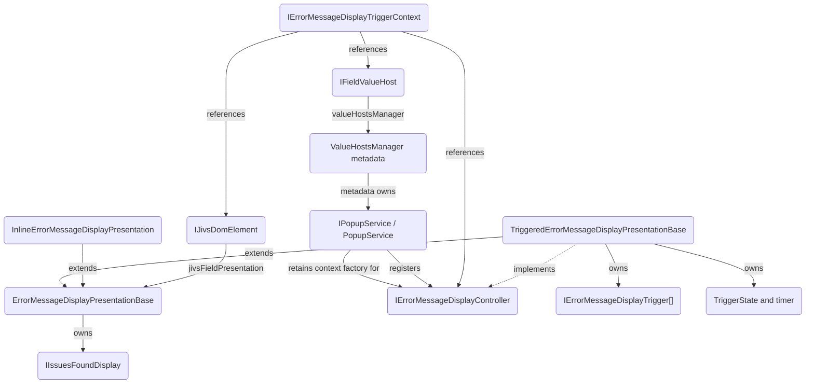
```mermaid
flowchart TB
    ANCHOR("IJivsDomElement")
    BASE("ErrorMessageDisplayPresentationBase")
    INLINE("InlineErrorMessageDisplayPresentation")
    TRIGGERED("TriggeredErrorMessageDisplayPresentationBase")
    DISPLAY("IIssuesFoundDisplay")

    CONTROLLER("IErrorMessageDisplayController")
    TRIGGERS("IErrorMessageDisplayTrigger[]")
    CONTEXT("IErrorMessageDisplayTriggerContext")
    STATE("TriggerState and timer")

    VALUE_HOST("IFieldValueHost")
    MANAGER("ValueHostsManager metadata")
    POPUP_SERVICE("IPopupService / PopupService")

    ANCHOR -->|"jivsFieldPresentation"| BASE
    INLINE -->|"extends"| BASE
    TRIGGERED -->|"extends"| BASE
    BASE -->|"owns"| DISPLAY

    TRIGGERED -.->|"implements"| CONTROLLER
    TRIGGERED -->|"owns"| TRIGGERS
    TRIGGERED -->|"owns"| STATE
    CONTEXT -->|"references"| CONTROLLER
    CONTEXT -->|"references"| ANCHOR
    CONTEXT -->|"references"| VALUE_HOST

    VALUE_HOST -->|"valueHostsManager"| MANAGER
    MANAGER -->|"metadata owns"| POPUP_SERVICE
    POPUP_SERVICE -->|"registers"| CONTROLLER
    POPUP_SERVICE -->|"retains context factory for"| CONTROLLER
```

##### Common Error Display Processing

`ErrorMessageDisplayPresentationBase` receives:

* the installed presentation element;
* its `IJivsDomElement` anchor;
* a fresh `IIssuesFoundDisplay`;
* the presentation and Issue Found CSS class names.

Initialization occurs during the first `apply()` call because the Field Value Host and its DOM services are then available.

Common initialization:

1. Adds `jivs-error-message-display`.
2. Supplies DOM services to the injected `IIssuesFoundDisplay`.
3. Allows subclasses to perform additional one-time initialization.

Each `apply()` call first removes the earlier Issue Found state. When `state.issuesFound` contains entries, it invokes `applyIssuesFound()`. Otherwise, it leaves the presentation without its Issue Found state.

The common base manages the `jivs-has-issues` class but does not assume where Issue Found content belongs. An inline presentation uses the installed element. A popup presentation may use a generated popup content element.

##### Inline Error Messages

`InlineErrorMessageDisplayPresentation` uses the installed presentation element as its content target.

When issues exist, it:

1. Applies the common Issue Found CSS state.
2. Passes the element and issues to `IIssuesFoundDisplay.apply()`.

When issues are removed, it:

1. Removes the common Issue Found CSS state.
2. Clears the element’s content.

Inline presentations do not install triggers or participate in popup coordination.

##### Trigger Collaboration

A trigger receives an `IErrorMessageDisplayTriggerContext` through:

```ts
install(context: IErrorMessageDisplayTriggerContext): void;
```

The context provides:

```ts
interface IErrorMessageDisplayTriggerContext
{
    readonly anchorElement: IJivsDomElement;
    readonly domServices: IJivsDomServices;
    readonly valueHost: IFieldValueHost;
    readonly controller: IErrorMessageDisplayController;

    dispose(): void;
}
```

The context’s `anchorElement` is the anchor for the error-display presentation. It is not necessarily an editor anchor.

Editor triggers use `IJivsDomServices.resolveFieldElement()` to obtain the editor anchors associated with the Field Value Host. For each editor anchor, they call its `EditorAdapterDefinition.attachEventHandler()` operation. The adapter definition resolves the actual editor widget and maps the requested DOM event name when necessary.

Triggers associated with other roles may install ordinary DOM event listeners directly.

`EditorFocusTrigger` installs:

* `focusin` to request opening;
* `focusout` to request closing.

`focusin` and `focusout` are used because they bubble and therefore support composite editor widgets more reliably than `focus` and `blur`.

##### Trigger-Owned Delays

Each trigger owns the delays appropriate to the interaction it installs.

For example, an editor-focus trigger may delay opening so that quickly tabbing through a field does not display a popup. It may delay closing long enough to allow focus or pointer movement into the popup.

A trigger passes its delays to the controller:

```ts
context.controller.open(context, openDelay);
context.controller.close(context, closeDelay);
```

The controller operations return `void`. They represent transition requests rather than a promise that the eventual core operation will succeed.

A zero delay requests immediate processing. It is also used when validation or popup coordination must force closure and cancel pending activity.

##### Trigger State

```ts
enum TriggerState
{
    closed,
    opening,
    open,
    closing
}
```

`TriggeredErrorMessageDisplayPresentationBase` owns one `TriggerState` value and at most one pending timer.

| Current state | Request | Behavior |
|---|---|---|
| `closed` | `open()` | Opens immediately or enters `opening` and schedules opening. |
| `closed` | `close()` | No action. |
| `opening` | `open()` | Leaves the existing opening request unchanged. |
| `opening` | `close()` | Cancels the opening timer and becomes `closed`. |
| `open` | `open()` | No action. |
| `open` | `close()` | Closes immediately or enters `closing` and schedules closure. |
| `closing` | `close()` with a delay | Leaves the existing closing request unchanged. |
| `closing` | `close()` with zero delay | Cancels the delayed closure and attempts closure immediately. |
| `closing` | `open()` | Cancels the closing timer and restores `open` without calling `openCore()` again. |

A delayed timer clears its stored handle before invoking other code. Before and after each potentially reentrant operation, the controller verifies that the expected transitional state remains active.

This protects a newer transition when DOM work synchronously raises another focus, pointer, or application event.

##### Core Operations

Subclasses implement:

```ts
protected abstract openCore(
    context: IErrorMessageDisplayTriggerContext
): boolean;

protected abstract closeCore(
    context: IErrorMessageDisplayTriggerContext
): boolean;
```

These operations are synchronous.

`openCore()` returns `true` when the presentation was opened successfully. The controller then enters `TriggerState.open`. A failure returns it to `TriggerState.closed`.

`closeCore()` returns `true` when the presentation was closed successfully. The controller then enters `TriggerState.closed`. A failure returns it to `TriggerState.open`.

The future popup presentation will use these methods to manage generated popup elements, content, positioning, and the `jivs-open` CSS class.

##### Opening Workflow

Immediately before `openCore()` executes, the controller asks the manager’s popup service to prepare it for opening.

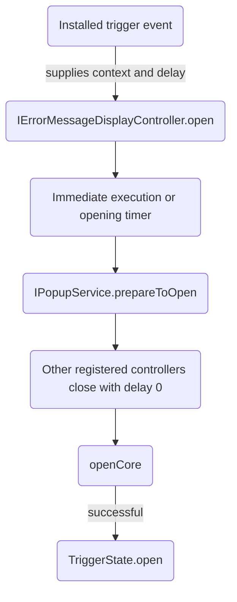
```mermaid
flowchart TB
    EVENT("Installed trigger event")
    REQUEST("IErrorMessageDisplayController.open")
    DELAY("Immediate execution or opening timer")
    SERVICE("IPopupService.prepareToOpen")
    OTHERS("Other registered controllers close with delay 0")
    CORE("openCore")
    OPEN("TriggerState.open")

    EVENT -->|"supplies context and delay"| REQUEST
    REQUEST --> DELAY
    DELAY --> SERVICE
    SERVICE --> OTHERS
    OTHERS --> CORE
    CORE -->|"successful"| OPEN
```

Popup coordination occurs when the opening delay expires, not when the delayed opening is initially requested. This allows the currently visible popup to remain available until the replacement is actually ready to open.

##### Popup Service

One `PopupService` belongs to one `ValueHostsManager` and is retained in manager metadata. `IJivsDomServices` remains stateless and provides access to the manager-specific service through `getPopupService()`.

The service retains:

```ts
Map<IErrorMessageDisplayController, TriggerContextFactory>
```

The controller is the registration identity. Registering the same controller again replaces its earlier context factory.

The factory creates a fresh context when the service must force that controller closed. A context instance is not retained in the registration.

`prepareToOpen(controller)` invokes:

```ts
otherController.close(context, 0);
```

for every registered controller except the controller preparing to open. This closes visible popups and cancels popups whose delayed opening has not yet completed.

`closePopups()` performs the same forced closure for every registered controller. It is the developer-facing operation for dismissing popup presentations associated with the manager.

`dispose()` closes the registered popups and clears the controller/factory map so the service no longer retains presentations or Field Value Hosts through their context factories.

##### Context Lifetimes

Trigger contexts have two distinct lifetimes.

An installation context is passed to each trigger during initialization. Installed event-handler closures capture that context, so it remains alive for the lifetime of those handlers. It cannot be disposed while those handlers remain installed.

A temporary context is created for operations such as:

* validation-driven forced closure;
* `IPopupService.prepareToOpen()`;
* `IPopupService.closePopups()`.

These operations call `close(context, 0)` synchronously. Their temporary contexts can therefore be disposed immediately afterward, releasing their anchor, DOM service, Field Value Host, and controller references.

Trigger detachment is not currently part of the presentation contract. If detachment is introduced later, it must remove installed handlers before disposing their captured installation context.

##### Validation-Driven Closure

When a later validation state contains no issues, `TriggeredErrorMessageDisplayPresentationBase.apply()` forces closure:

```ts
this.close(context, 0);
```

This operation does not depend on the presentation already being `open`.

It also handles a presentation in `opening` state by canceling its opening timer and establishing `closed`. This prevents a delayed popup from appearing after its issues have been removed.

##### CSS State

The error-display foundation uses these standard CSS responsibilities:

| CSS class | Purpose |
|---|---|
| `jivs-error-message-display` | Identifies every Error Message Display presentation. |
| Presentation-specific class | Identifies the concrete inline or popup presentation. |
| `jivs-has-issues` | Indicates that validation supplied one or more issues. |
| `jivs-open` | Indicates that a triggered presentation is open. |

The common base owns the general error-display and Issue Found classes. Concrete presentations own their presentation-specific class and the visual meaning of `jivs-open`.

##### Remaining Popup Design

The remaining design work concerns the concrete popup presentation built on `TriggeredErrorMessageDisplayPresentationBase`.

The intended developer experience is that the application supplies a single installation element:

```html
<span
    data-jivs-role="error"
    data-jivs-presentation="...">
</span>
```

The popup presentation should construct and manage the complete popup widget. The application should not need to create or register its internal parts separately.

The following aspects remain unresolved:

* whether the presentation generates its own icon or other visible popup trigger;
* the popup’s internal structure, including any header, content container, footer, and presentation-specific elements;
* which generated element is supplied to `IIssuesFoundDisplay` as its content target;
* whether the popup is created as a descendant, sibling, or separately positioned element associated with the installation element;
* whether popup elements are created during installation or lazily when first opened;
* which generated elements, identifiers, and other resources the presentation retains;
* how the popup is positioned relative to its anchor;
* which pointer and focus event handlers belong to the popup itself;
* which open and close delays those handlers use;
* how popup-specific CSS classes, icons, and other visual assets are configured.

These decisions must also establish ownership and lifecycle rules for the generated elements. Once created, the popup structure is expected to remain presentation-owned state until the presentation is disposed, unless the concrete popup design identifies a reason to recreate it.


## Form Presentation Architecture

### Form Presentation Contracts

A form presentation translates the `ValueHostsManager` validation state into changes to one form-level element. Typical elements include Validation Summaries and submit controls.

Form presentations are separate from field presentations because they receive an `IValueHostsManager` and `ValidationState` rather than an individual `IFieldValueHost` and `ValueHostValidationState`.

`FormValidationDispatcher` locates each relevant element, reads its installed `IJivsDomElement.jivsFormPresentation`, and invokes `apply()` with the callback’s `IValueHostsManager` and complete `ValidationState`.

#### Form Presentation Interface and Base Class

```ts
interface IFormPresentation {
    init(): void;
    apply(
        valueHostsManager: IValueHostsManager,
        state: ValidationState
    ): void;

    getStaticAriaUpdater():
        IAriaStaticUpdater | null;
}

abstract class FormPresentationBase<
    TElement extends IJivsDomElement =
        IJivsDomElement
> implements IFormPresentation {

    public respondToWildcardGroup: boolean =
        false;

    public constructor(
        element: TElement, anchor: IJivsDomElement
    ) {
    }
    public init(): void {}

    public apply(
        valueHostsManager: IValueHostsManager,
        state: ValidationState
    ): void {
        const presentationGroup =
            this.element.jivsFormPresentationGroup;

        const presentationIsWildcard =
            this.isWildcardGroup(
                presentationGroup
            );

        const stateIsWildcard =
            this.isWildcardGroup(
                state.group
            );

        if (
            !presentationIsWildcard
            && stateIsWildcard
        ) {
            if (!this.respondToWildcardGroup) {
                return;
            }

            this.applyCore(
                valueHostsManager,
                valueHostsManager
                    .currentValidationState(
                        presentationGroup
                    )
            );
            return;
        }

        if (
            presentationIsWildcard
            !== stateIsWildcard
        ) {
            return;
        }

        if (
            !groupsMatch(
                presentationGroup,
                state.group
            )
        ) {
            return;
        }

        this.applyCore(
            valueHostsManager,
            state
        );
    }

    protected abstract applyCore(
        valueHostsManager: IValueHostsManager,
        state: ValidationState
    ): void;

    private isWildcardGroup(
        group: string | null | undefined
    ): boolean {
        return group === null
            || group === undefined
            || group === ""
            || group === "*";
    }

    protected get presentationElement(): HTMLElement
    {
        return this.resolvePresentationElement(this.element);
    }

    protected resolvePresentationElement(element: TElement): HTMLElement
    {
        return element;
    }    
}
```

An `IFormPresentation` instance may retain presentation-specific state belonging to its element. The base class retains its element but does not retain the `IValueHostsManager` or a validation state. Those values are supplied to every `apply()` call.

`FormPresentationBase.apply()` owns the standard group-routing behavior. Derived presentations implement `applyCore()` to update their element after the base class has determined that the state applies.

Group routing is intentionally asymmetric:

| Presentation group                                  | Validation-state group | Result                                                                              |
| --------------------------------------------------- | ---------------------- | ----------------------------------------------------------------------------------- |
| Same normalized group                               | Same group             | Call `applyCore()` with the supplied state.                                         |
| Specific group                                      | Wildcard               | Ignore unless `respondToWildcardGroup` is `true`.                                   |
| Specific group with `respondToWildcardGroup = true` | Wildcard               | Obtain the current state for the presentation’s group and pass it to `applyCore()`. |
| Wildcard                                            | Specific group         | Ignore.                                                                             |
| Different specific groups                           | Different groups       | Ignore.                                                                             |

In jivs-engine, the `groupsMatch()` function provides the established case-insensitive comparison. `null`, `undefined`, `""`, and `"*"` are treated as wildcard forms when determining the routing case.

When wildcard response is enabled for a group-specific presentation, the base class obtains:

```ts
valueHostsManager.currentValidationState(
    presentationGroup
);
```

The resulting group-specific state is passed intact to `applyCore()`. The base class does not create a replacement `ValidationState` or copy selected properties from the wildcard state.

`respondToWildcardGroup` defaults to `false`. It is presentation configuration rather than an installation option. A registered presentation creator may set this property, along with any other configurable presentation properties, before returning the instance. An application that needs different configurations registers different presentation names.

Applications may implement `IFormPresentation` directly instead of deriving from `FormPresentationBase`. A direct implementation receives every state supplied by the dispatcher and is responsible for its own group-routing policy.

The optional ARIA getter allows a form presentation whose generated HTML requires specialized accessibility behavior to supply an immutable static updater. A getter returning `null` means that the presentation supplies no specialized updater. Form presentations do not supply field validation-state updaters.

### Form Presentation Factory

Form presentations use a factory separate from the field presentation factory.

```ts
class FormPresentationFactory implements IPresentationFactory<IFormPresentation> {

}
```

Presentation names and roles are open-ended strings. The standard form roles are `ElementRole.summary` and `ElementRole.submit`.

`register()` associates a presentation name with a creator. Registering the same name again replaces its creator for future installations. Presentations already installed on elements are unaffected.

A creator constructs and configures the presentation before returning it. Configuration such as `respondToWildcardGroup` is therefore associated with the registered presentation name rather than supplied through `FormPresentationInstallOptions`.

`setDefaultPresentationName()` associates a role with the presentation name used when `create()` receives no explicit name. Assigning another default for the same role replaces the earlier string. The method does not require the presentation to be registered at that time, allowing defaults and creators to be configured in either order.

The factory does not provide an operation for removing a role default after it has been assigned.

`create()` resolves the presentation as follows:

1. When `presentationName` is supplied, use it directly.
2. Otherwise, obtain the default presentation name registered for `role`.
3. If the role has no default, return `null`.
4. Resolve the creator registered under the selected name.
5. Invoke the creator with `element` and return the resulting `IFormPresentation`.

An explicit name that is not registered logs and throws. A role default that identifies an unregistered presentation also logs and throws. In contrast, omitting the name when the role has no configured default is an expected no-presentation case and returns `null` without error.

Each successful call creates a new presentation instance for the supplied element. The factory does not retain created presentations or DOM elements.

`DomServices` exposes the replaceable form presentation factory:

```ts
domServices.formPresentationFactory
```

This factory has registrations and role defaults independent of `fieldPresentationFactory`.

### Form Presentation Installer

```ts
interface FormPresentationInstallOptions {
    presentationName?: string | null;
    group?: string;
}

interface IFormPresentationInstaller {
    install(
        valueHostsManager: IValueHostsManager,
        element: IJivsDomElement,
        role: ElementRole | string,
        options?: FormPresentationInstallOptions
    ): IFormPresentation | null;
}
```

The possible `options.presentationName` values have these meanings:

| Value       | Meaning                                                            |
| ----------- | ------------------------------------------------------------------ |
| String      | Create the presentation registered under that name.                |
| `undefined` | Use the default presentation registered for `role`, if one exists. |
| `null`      | Explicitly disable form presentation for this element.             |

`options.group` selects the validation group represented by the presentation. The value is preserved exactly as supplied:

| Supplied value | Stored value                 |
| -------------- | ---------------------------- |
| Omitted        | `undefined`                  |
| `"*"`          | `"*"`                        |
| `""`           | `""`                         |
| Named group    | Original spelling and casing |

The installer does not normalize the stored value. Group comparison and current-state caching apply the established group semantics when the value is used.

Presentation installation is idempotent through `IJivsDomElement.jivsFormPresentation`:

| Existing property value | Installer behavior                                             |
| ----------------------- | -------------------------------------------------------------- |
| `undefined`             | Perform presentation installation.                            |
| Presentation instance   | Preserve the existing instance and its installed group.       |
| `null`                  | Preserve `null` without attempting presentation resolution.   |

The first completed presentation installation permanently binds both the presentation and its group to the element. Later installation calls ignore newly supplied presentation and group options.

When presentation installation is required and `options.presentationName` is `null`, the installer assigns `null` to `element.jivsFormPresentation` without calling the factory. `jivsFormPresentationGroup` remains `undefined`.

Otherwise, when presentation installation is required, the installer calls `formPresentationFactory.create()`. If the factory returns `null` because neither an explicit name nor a role default exists, the installer assigns `null` to `element.jivsFormPresentation`. The group remains unassigned.

When the factory creates a presentation, the installer performs these steps:

1. Assigns the requested group to `element.jivsFormPresentationGroup`.
2. Obtains the manager’s current validation state for that group.
3. Executes init().
4. Calls the presentation’s initial `apply()`.
5. Assigns the successfully initialized presentation to `element.jivsFormPresentation`.

Conceptually:

```ts
let presentation =
    element.jivsFormPresentation;

if (presentation === undefined) {
    if (options?.presentationName === null) {
        presentation = null;
        element.jivsFormPresentation = null;
    }
    else {
        presentation =
            formPresentationFactory.create(
                element,
                role,
                options?.presentationName
            );

        if (presentation === null) {
            element.jivsFormPresentation = null;
        }
        else {
            const group = options?.group;

            element.jivsFormPresentationGroup =
                group;

            try {
                presentation.apply(
                    valueHostsManager,
                    valueHostsManager
                        .currentValidationState(
                            group
                        )
                );

                element.jivsFormPresentation =
                    presentation;
            }
            catch (error) {
                delete element
                    .jivsFormPresentationGroup;

                throw error;
            }
        }
    }
}
```

Assigning the group before the initial `apply()` allows `FormPresentationBase` to read it from the element while performing routing.

The initial call does not invoke validation or notify validation callbacks. `currentValidationState(group)` returns the ValueHostsManager’s cached current state for that group or creates it when no cached state exists.

A later validation callback may apply the same effective state again. Form presentations must therefore tolerate repeated `apply()` calls.

If factory resolution, presentation creation, or the initial `apply()` call throws, installation logs and propagates the failure. Both `jivsFormPresentation` and `jivsFormPresentationGroup` remain `undefined`, identifying that installation did not complete successfully.

Replacing the DOM element creates a new installation lifetime. The replacement element begins with both form-presentation properties and `jivsAriaValidationStateUpdater` set to `undefined` and must be installed separately.

### Form Validation Dispatcher

`FormValidationDispatcher` does not evaluate validation groups. Group-routing policy belongs to each form presentation.

For every discovered form-level element, the dispatcher:

1. Reads `element.jivsFormPresentation`.
2. Skips the element when the property is `undefined` or `null`.
3. Calls the installed presentation with the callback’s `IValueHostsManager` and complete `ValidationState`.

Conceptually:

```ts
const presentation =
    element.jivsFormPresentation;

if (presentation) {
    presentation.apply(
        valueHostsManager,
        state
    );
}
```

The dispatcher does not compare group names, call `groupsMatch()`, filter `state.issuesFound`, replace the state, or obtain another state from the manager.

Presentations derived from `FormPresentationBase` receive the standard routing behavior described earlier. Direct `IFormPresentation` implementations determine for themselves whether and how to respond.

The dispatcher does not call `IAriaService`. Form roles use static ARIA only, which `FormPresentationInstaller` applies during installation. Dynamic validation-state ARIA uses the field-specific updater contract and does not apply to form roles.

### SimpleDom Form Presentation Selection

`jivs-simpledom` discovers both `data-jivs-role="summary"` and `data-jivs-role="submit"` elements whether or not they declare `data-jivs-presentation`.

When `data-jivs-presentation` is present, its value supplies `FormPresentationInstallOptions.presentationName`. When it is absent, SimpleDom leaves that option `undefined` so the form presentation factory can use the role-specific default.

The `data-jivs-group` attribute supplies `FormPresentationInstallOptions.group`. When the attribute is absent, the group is `undefined`. SimpleDom preserves the supplied attribute value without normalizing its casing or wildcard form.

Both Validation Summaries and submit-role elements use the same selection rules:

* an explicit presentation name takes precedence;
* otherwise, the form presentation factory consults the default for that role;
* when the role has no default, installation records `jivsFormPresentation = null`; registered static ARIA for the role may still modify the element.

## Built-in Form Presentations
> PENDING: Detailed implementation design for the built-in Validation Summary and submit presentations is deferred.

The built-in configuration:

* registers `validationSummary` and assigns it as the default presentation for `ElementRole.summary`;
* registers `disableSubmit` as an available presentation;
* does not assign a default presentation for `ElementRole.submit`.

Consequently, a Validation Summary receives the standard summary presentation unless it requests another one. A submit-role element without an explicit or application-configured default receives no presentation; it changes only when applicable static ARIA behavior has been registered. Submit-role elements are not limited to buttons, and additional submit presentations may implement other approaches.

The built-in `validationSummary` registration leaves `respondToWildcardGroup` at its default value of `false`. Applications that want a group-specific summary to respond when wildcard validation occurs can register another presentation name whose creator enables the property.

Applications may register additional form presentations and may assign their own default for either role. The detailed HTML, interaction, group-display policy, and CSS design of the initial Validation Summary and submit presentations remain part of the focused presentation-design work.


## Issues Found Formatter Service

`jivs-dom` provides reusable formatting of `IssueFound` objects through `IIssuesFoundFormatterService`. The service produces either prepared HTML for DOM presentations or plain text for elements such as native browser tooltips and ARIA-only content.

This service is distinct from the jivs-engine `ErrorMessagesService`. The engine service prepares an issue’s message, including message-token resolution. The DOM service formats already-prepared messages for presentation.

### Service Contract

```ts
interface IIssuesFoundFormatterService {
    buildAsHtml(
        valueHostsManager: IValueHostsManager,
        issues: IssueFound[],
        useSummaryMessage?: boolean, 
        limit?: number
    ): string;

    buildAsText(
        valueHostsManager: IValueHostsManager,
        issues: IssueFound[],
        useSummaryMessage?: boolean,
        separator?: string, 
        limit?: number
    ): string;
}
```

When `useSummaryMessage` is `false` or omitted, the formatter uses `IssueFound.errorMessage`. When it is `true`, the formatter uses `IssueFound.summaryMessage` when supplied and otherwise falls back to `IssueFound.errorMessage`.

When `limit` is assigned to 1 or higher, this limits the total number of issues to include.

The interface does not prescribe an HTML structure, issue ordering, filtering policy, metadata attributes, text separator, or internal conversion technique. Applications may replace the service with an implementation that constructs its content differently.

`DomServices` exposes the replaceable service:

```ts
domServices.issuesFoundFormatter
```

### Abstract Base Class

`IssuesFoundFormatterServiceBase` provides reusable utilities without prescribing how a subclass implements the two public build operations.

```ts
abstract class IssuesFoundFormatterServiceBase
    implements IIssuesFoundFormatterService {

    public abstract buildAsHtml(
        valueHostsManager: IValueHostsManager,
        issues: IssueFound[],
        useSummaryMessage?: boolean, 
        limit?: number
    ): string;

    public abstract buildAsText(
        valueHostsManager: IValueHostsManager,
        issues: IssueFound[],
        useSummaryMessage?: boolean,
        separator?: string, 
        limit?: number
    ): string;

    public static htmlToText(
        html: string
    ): string;

    protected orderIssuesFound(
        issues: IssueFound[]
    ): IssueFound[];

    protected buildIssueAsHtml(
        tagName: keyof HTMLElementTagNameMap,
        issue: IssueFound,
        useSummaryMessage: boolean
    ): string;

    protected buildErrorCodeAttribute(
        issue: IssueFound,
        attributeName?: string
    ): string;

    protected buildSeverityAttribute(
        issue: IssueFound,
        attributeName?: string
    ): string;
    protected buildValueHostAttribute(
        issue: IssueFound,
        attributeName?: string
    ): string;
    protected retrieveMessage(
        issue: IssueFound,
        useSummaryMessage: boolean
    ): string;

    protected retrieveSeverityName(
        severity:
            ValidationSeverity | undefined
    ): string;
}
```

Applications may derive from this class and use any combination of its utilities. They may instead implement `IIssuesFoundFormatterService` directly when the base behavior is not useful.

The base class retains no formatting state and does not modify supplied `IssueFound` objects or arrays.

#### Issue Ordering

`orderIssuesFound()` provides an override point for subclasses that need a particular issue order. The base implementation returns the supplied array unchanged.

An override must not reorder or otherwise modify the supplied array. When changing the order, it returns a separate array:

```ts
protected orderIssuesFound(
    issues: IssueFound[]
): IssueFound[] {
    return [...issues].sort(
        this.compareIssues
    );
}
```

The standard formatter calls `orderIssuesFound()` before generating either HTML or text. A subclass can therefore retain the standard output behavior while replacing only its ordering policy.

#### Message Retrieval

`retrieveMessage()` implements the established `useSummaryMessage` behavior:

* `false` selects `errorMessage`;
* `true` selects `summaryMessage` and falls back to `errorMessage`.

#### Metadata Attributes

`buildErrorCodeAttribute()` returns an attribute for the IssueFound.errorCode property.
 It is complete HTML attribute without leading whitespace. Its default attribute name is `data-errorcode`.

```html
data-errorcode="RequireText"
```

The method uses the `encodeHtml()` function supplied by jivs-engine to encode the attribute value. `jivs-dom` does not duplicate or re-export that function.

When `IssueFound.errorCode` is missing, the attribute value is an empty string:

```html
data-errorcode=""
```

A caller may supply another attribute name while retaining the prescribed value handling.

`buildSeverityAttribute()` returns an attribute for the IssueFound.severity property.
Its default name is `data-severity`, and it delegates value selection to `retrieveSeverityName()`.

```html
data-severity="warning"
```

`retrieveSeverityName()` returns:

| Source severity              | Result      |
| ---------------------------- | ----------- |
| Missing                      | `"error"`   |
| `ValidationSeverity.Error`   | `"error"`   |
| `ValidationSeverity.Warning` | `"warning"` |
| `ValidationSeverity.Severe`  | `"severe"`  |

The lookup used by `retrieveSeverityName()` is a module-private readonly `severityNames` array. Subclasses can override the method without receiving a mutable lookup array.

`buildValueHostAttribute()` returns an attribute based on IssueFound.valueHostName.
It looks up the FieldValueHost and uses its Element Identifer.
Its default attribute name is `data-identifier`.

```html
data-identifier="FirstName"
```

The value is html encoded.

#### One-Issue HTML

`buildIssueAsHtml()` combines the two metadata attributes with the selected message. The attribute builders return complete attribute strings without leading whitespace; `buildIssueAsHtml()` joins them using single spaces.

For example:

```html
<span data-errorcode="RequireText" data-severity="error">The First name requires a value.</span>
```

The selected message is inserted as prepared HTML rather than encoded as plain text. This preserves markup produced during message-token resolution, such as:

```html
The <span class="token label">First name</span> is invalid.
```

The established message-token resolver is responsible for HTML-encoding replacement values before adding token markup. The formatter separately passes `errorCode` through the engine’s `encodeHtml()` function because the value is inserted into an HTML attribute.

#### HTML-to-Text Conversion

`htmlToText()` is a public static utility that converts arbitrary prepared HTML into plain text. It assigns the HTML to a detached DOM element and returns the element’s `textContent`, or an empty string when `textContent` is `null`.

For example:

```html
The <span class="token label">First name</span> is invalid.
```

becomes:

```text
The First name is invalid.
```

The utility can be used without creating a formatter instance:

```ts
IssuesFoundFormatterServiceBase.htmlToText(
    html
);
```

### Standard Implementation

`IssuesFoundFormatterService` is the default implementation:

```ts
class IssuesFoundFormatterService
    extends IssuesFoundFormatterServiceBase
```

It calls `orderIssuesFound()` and then formats every returned issue without additional filtering or deduplication. Because the base ordering implementation returns the supplied array unchanged, the standard formatter preserves the original issue order.

The standard implementation leaves the supplied array and `IssueFound` objects unchanged.

#### Standard HTML Output

`buildAsHtml()` uses these structures:

| Issue count | Result                                       |
| ----------- | -------------------------------------------- |
| Zero        | An empty string                              |
| One         | One `<span>` containing the selected message |
| Multiple    | A `<ul>` containing one `<li>` per issue     |

Every generated `<span>` or `<li>` includes both standard metadata attributes.

One issue produces:

```html
<span
    data-errorcode="RequireText"
    data-severity="error">
    The First name requires a value.
</span>
```

Multiple issues produce:

```html
<ul>
    <li
        data-errorcode="RequireText"
        data-severity="error">
        The First name requires a value.
    </li>
    <li
        data-errorcode="UnusualValue"
        data-severity="warning">
        This value is unusual.
    </li>
</ul>
```

The metadata belongs to each issue element rather than the enclosing `<ul>`.

#### Standard Text Output

`buildAsText()` calls `orderIssuesFound()`, retrieves each returned issue’s selected message, converts it through `htmlToText()`, and joins the resulting strings.

The default separator is:

```text
 • 
```

A caller may supply another plain-text separator, including an empty string:

```ts
issuesFoundFormatter.buildAsText(
    issues,
    false,
    "\n"
);
```

The separator is already plain text and is not passed through `htmlToText()`. An empty issue array produces an empty string.

## ARIA Service

ARIA Service applies accessibility attributes and content to relevant editor, error-message, field-presentation, and form-presentation elements.

ARIA support is an optional, replaceable `DomServices` child service. Setting `DomServices.ariaService` to `null` disables all Jivs-managed ARIA work. `FormInstaller` and validation dispatchers skip ARIA processing, and `FormInstaller` does not assign an ARIA completion value to an element. Jivs does not provide a late-assignment or replay lifecycle for assigning an ARIA service after `DomServices` construction.

The ARIA service coordinates accessibility work but contains very little element-specific behavior. Immutable updater objects perform the work required by a role, editor widget, or presentation.

Its responsibilities include:

- fixed accessibility semantics established during installation;
- required state obtained from the `IFieldValueHost`;
- validation state applied after field presentations have run;
- the relationship between an editor and its separate error-message element;
- role-based composition of standard and specialized accessibility behavior.

The standard service manages an editor or another element representing it, a separate error-message element, a Validation Summary, a Required Indicator, and editor-specific structures such as a radio-group container.

Labels, general field containers, and buttons do not have standard Jivs-managed ARIA behavior. The developer remains responsible for their accessibility, including accessible names and relationships Jivs cannot infer.

Editor Adapter Definitions and presentations may supply specialized updater objects for markup or widget requirements. ARIA processing remains independent of visual presentation: presentations own visual content and styling, while ARIA updaters own the accessibility attributes and dedicated ARIA content described here.

The module does not attempt to detect whether assistive technology is active.

### Updater Concept

An updater is an immutable object that applies one category of accessibility behavior to an element. It receives the target element and all operation-specific data as method parameters. It does not retain the element, ValueHost, validation state, registry, or other operation-specific state.

There are two updater kinds:

- A Static Updater establishes fixed semantics during installation, such as `role`, `aria-hidden`, or an error-message element ID.
- A Validation State Updater synchronizes changing semantics or content, such as required state, invalid state, `aria-errormessage`, or dedicated plain-text error content.

An element may receive behavior from two sources:

- The `AriaService` registry supplies at most one updater registered for the element’s role.
- An Editor Adapter Definition or presentation may supply one specialized updater for its widget or generated markup.

Field presentations may supply both updater kinds. Form presentations supply only Static Updaters.

A specialized updater uses `alsoRunRoleUpdater` to determine whether the updater registered for the role runs first. `AriaService` coordinates this composition but delegates all role-specific and widget-specific mutation to the updater objects.

#### Updater Interactions

| Updater kind | Source | When | Operation |
| --- | --- | --- | --- |
| Static | `AriaService` | `install()` | Selects and executes the registered and specialized Static Updaters. |
| Validation State | `AriaService` | `install()` | Selects and retains the specialized updater, then applies the field’s current validation state. |
| Validation State | `FieldValidationDispatcher` | `applyValidationState()` | Executes the registered and retained specialized updaters for a later validation-state change. |

### Architecture

ARIA installation is coordinated by the concrete `AriaService`. It uses the populated `IElementRegistry` as its source of element, role, and field information. It does not discover elements through a subclass or query the DOM.

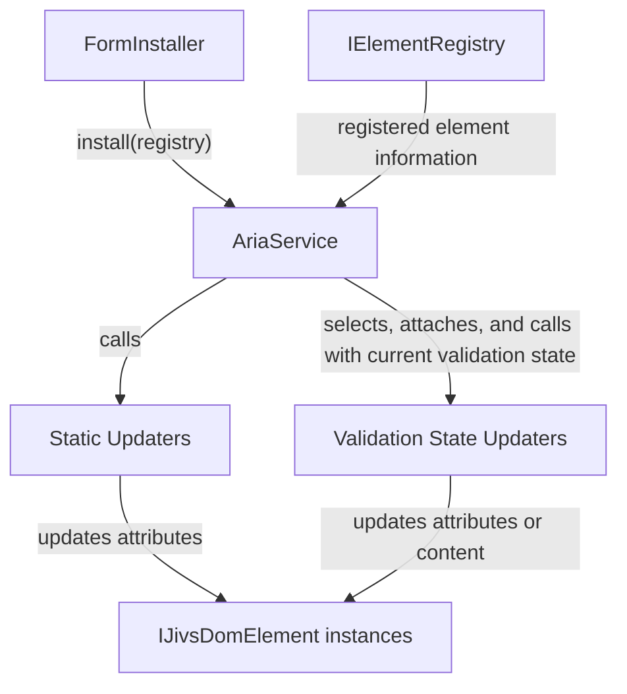
```mermaid
flowchart TB
    FormInstaller["FormInstaller"]
    Registry["IElementRegistry"]
    AriaService["AriaService"]
    StaticUpdaters["Static Updaters"]
    ValidationUpdaters["Validation State Updaters"]
    Elements["IJivsDomElement instances"]

    FormInstaller -->|"install(registry)"| AriaService
    Registry -->|"registered element information"| AriaService
    AriaService -->|"calls"| StaticUpdaters
    AriaService -->|"selects, attaches, and calls with current validation state"| ValidationUpdaters
    StaticUpdaters -->|"updates attributes"| Elements
    ValidationUpdaters -->|"updates attributes or content"| Elements
```

`FormInstaller` calls `AriaService.install()` after the registered elements and their presentations have been installed. The service uses each applicable field or form registry record to select and execute its Static Updaters.

For applicable field elements, the service also selects the Validation State Updater, retains it in `IJivsDomElement.jivsAriaValidationStateUpdater`, and calls it with the field’s current validation state. Form elements do not receive Validation State Updaters.

Later field validation-state changes enter through `FieldValidationDispatcher`.

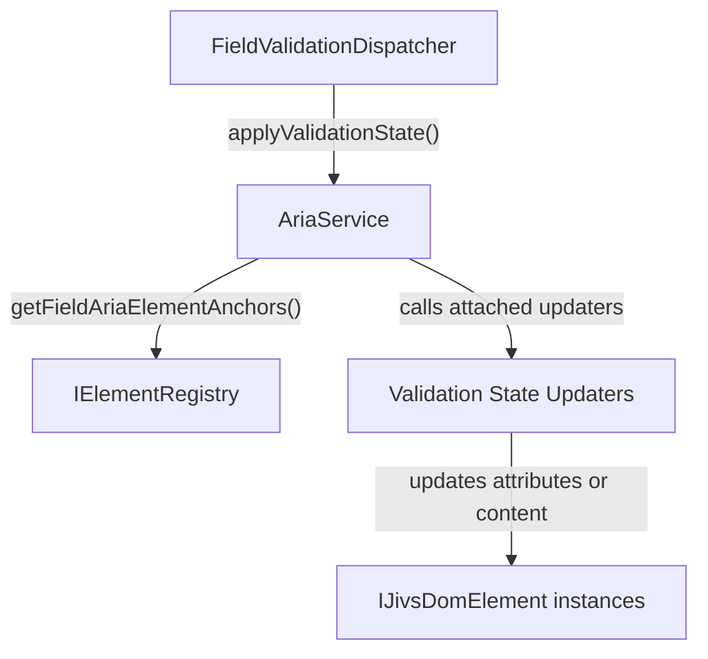
```mermaid
flowchart TB
    Dispatcher["FieldValidationDispatcher"]
    AriaService["AriaService"]
    Registry["IElementRegistry"]
    Updaters["Validation State Updaters"]
    Elements["IJivsDomElement instances"]

    Dispatcher -->|"applyValidationState()"| AriaService
    AriaService -->|"getFieldAriaElementAnchors()"| Registry
    AriaService -->|"calls attached updaters"| Updaters
    Updaters -->|"updates attributes or content"| Elements
```

After applying the installed field presentations, `FieldValidationDispatcher` calls `AriaService.applyValidationState()`. The service obtains the field’s editor and selected error-message elements through `IElementRegistry.getFieldAriaElementAnchors()`. It then invokes the Validation State Updater retained on each applicable element.

### Managed Accessibility Attributes

This table defines the attributes written by the standard ARIA updaters. Later sections explain element selection and special cases without repeating these assignment rules.

| Attribute | Applied during | Target element | Purpose | Presence and value | Comments |
| --- | --- | --- | --- | --- | --- |
| `role="status"` | Installation — static | Validation Summary | Makes summary updates advisory live-region content. | Assigned when `role` is absent. | Implies `aria-live="polite"` and `aria-atomic="true"`. An existing role is preserved. |
| `aria-atomic="true"` | Installation — static | Validation Summary | Requests announcement of the complete summary when its content changes. | Assigned when `aria-atomic` is absent. | Assigned explicitly even though `role="status"` implies it. An existing value is preserved. |
| `aria-hidden="true"` | Installation — static | Required Indicator | Prevents the visual indicator from duplicating the required state communicated by the editor. | Assigned when `aria-hidden` is absent. | The Required Indicator presentation controls visual state but does not assign this attribute. |
| `role="radiogroup"` | Installation — static | Radio-group editor anchor | Identifies the container as representing one radio-group value and makes it the target for group-level ARIA state. | Assigned by the specialized updater supplied by `RadioGroupAdapterDefinition` when `role` is absent. | An existing role is preserved. The developer remains responsible for the group’s accessible name. |
| `id="{generatedId}"` | Installation — static | Field Error Display or dedicated ARIA error-message element | Supplies the target required by `aria-errormessage` when the developer did not provide an ID. | Assigned when the element lacks a nonempty ID. | Uses the `error` or `ariaerror` suffix. A developer-supplied ID is preserved. |
| `required` | Validation-state synchronization — dynamic | Native `input`, `select`, or `textarea` supporting required semantics | Uses the control’s native required behavior and accessibility semantics. | Present when `valueHost.required` is `true`; removed otherwise. | Determined by field configuration rather than `ValueHostValidationState`. `aria-required` is not also assigned. |
| `aria-required="true"` | Validation-state synchronization — dynamic | ARIA editor target without equivalent native required semantics | Communicates that the represented value is required. | Present when `valueHost.required` is `true`; removed otherwise. | Used on the standard radio-group anchor. |
| `aria-invalid="true"` | Validation-state synchronization — dynamic | Installed editor anchor | Communicates that the editor’s current value is invalid. | Present when `state.isValid === false`; removed otherwise. | Applied even when no eligible error-message element exists. |
| `aria-errormessage="{id}"` | Validation-state synchronization — dynamic | Installed editor anchor | Associates an invalid editor with its separate error-message element. | Present while invalid when an eligible error-message ID is available; removed otherwise and whenever valid. | A radio group uses its group anchor rather than duplicating the attribute on descendant radio inputs. |

Static Updaters assign their attributes only when the attribute is absent. Developer-supplied values are preserved.

Validation State Updaters fully own the dynamic attributes they manage. They set or remove those attributes according to current Jivs configuration and validation state, even when authored markup initially supplied them.

### Error-Message Containment and Selection

`aria-errormessage` always references an element separate from the editor. That element must have a unique ID, contain the error-message text, and remain available to assistive technology.

Jivs supports two alternatives:

| Error-message element | When to use it | Content owner |
| --- | --- | --- |
| Accessible Field Error Display | The visible display remains in the accessibility tree whenever it contains an error. | Field Error Display presentation |
| Dedicated ARIA error-message element | The visible display may be hidden by a popup, tooltip, `display: none`, `visibility: hidden`, or `aria-hidden="true"`. | Registered ARIA validation-state updater |

#### Selection Method

`AriaService` uses:

```ts
IElementRegistry.getFieldAriaElementAnchors(
    elementIdentifier: string
): IFieldAriaElementAnchors;
```

The returned object identifies the editor anchor, the selected error-message element, and its content owner:

```ts
interface IFieldAriaElementAnchors {
    readonly editorAnchor:
        IJivsDomElement | null;

    readonly errorMessageElement:
        IJivsDomElement | null;

    readonly errorMessageRole:
        ElementRole.error |
        ElementRole.ariaError |
        null;
}
```

`errorMessageRole` identifies content ownership:

- `ElementRole.error` means a field presentation owns the element's content.
- `ElementRole.ariaError` means the registered ARIA validation-state updater owns the element's plain-text content.
- `null` means no eligible error-message element was selected.

The anchors determine which element is passed to each updater. Updaters do not receive the complete anchors object.

`IElementRegistry.getFieldAriaElementAnchors()` applies this precedence:

1. Select the field’s editor anchor from its `ElementRole.editor` record.
2. Select the field’s `ElementRole.ariaError` element when one exists.
3. Otherwise, select the field’s `ElementRole.error` element.
4. When neither error-message role exists, return `null` for the error-message element and role.

`AriaService.install()` uses these anchors while installing ARIA behavior. `AriaService.applyValidationState()` obtains them again when applying a later validation state. The service does not retain the selected elements between calls.

The editor cannot serve as its own error-message element. The absence of an eligible error-message element does not prevent required or invalid state from being applied to the editor.

#### Accessible Field Error Display

A Field Error Display registered with `ElementRole.error` may serve as the error-message element.

In SimpleDom:

```html
<div
    id="first-name-errors"
    data-field="FirstName"
    data-jivs-role="error">
</div>
```

The Field Error Display presentation owns this element's content. A registered static updater may assign its missing ID, and the editor's validation-state updater may reference that ID. ARIA validation-state processing never writes or clears the display's content.

#### Dedicated ARIA Error-Message Element

When the visible Field Error Display is not eligible, the developer supplies a dedicated element:

```html
<span
    id="first-name-aria-errors"
    data-field="FirstName"
    data-jivs-role="aria-error"
    class="jivs-visually-hidden">
</span>
```

The dedicated element:

- has no field presentation;
- remains in the accessibility tree;
- is visually hidden by the published `jivs-visually-hidden` class;
- receives plain-text error content from its registered ARIA validation-state updater;
- is cleared by that updater when the field becomes valid.

The published class hides the element visually without removing it from the accessibility tree:

```css
.jivs-visually-hidden {
    position: absolute;
    width: 1px;
    height: 1px;
    padding: 0;
    margin: -1px;
    overflow: hidden;
    clip: rect(0, 0, 0, 0);
    white-space: nowrap;
    border: 0;
}
```

SimpleDom presentation creation and presentation dispatch exclude the `aria-error` role. The element remains registered in `IElementRegistry`, allowing `AriaService.install()` to install its static and validation-state ARIA updaters.

The registered `aria-error` validation-state updater writes:

```ts
element.textContent = state.isValid
    ? ""
    : issuesFoundFormatter.buildAsText(
        state.issuesFound,
        false,
        "; "
    );
```

The semicolon-and-space delimiter is supplied explicitly instead of using the formatter's default bullet delimiter.

The developer may supply the selected element's ID. When it is absent, the registered static updater assigns:

```text
error_{elementIdentifier}_{random numbers}
```

The updater gets the Element Identifier from `valueHost.getElementIdentifier()`. It follows the `IFieldValueHost` reference to its associated `ValueHostsManager` and obtains the Container Identifier from `ValueHostsManager.getContainerIdentifier()`.

The updater encodes both identifier values as needed for use within a DOM ID rather than treating raw query-selector syntax as ID text.

### ARIA Implementation Inventory

The ARIA implementation requires the following public contracts and classes.

| Type or class | Purpose |
| --- | --- |
| `IAriaStaticUpdater` | Defines installation-time accessibility work for one field or form element. |
| `IAriaValidationStateUpdater` | Defines validation-state accessibility work for one field element. Its application method does not receive the element’s role. |
| `IAriaService` | Defines updater registration, registry-based installation, static application, and field validation-state orchestration. |
| `IFieldAriaElementAnchors` | Identifies the editor and selected error-message elements returned by `IElementRegistry.getFieldAriaElementAnchors()`. |
| `AriaService` | Implements updater registries, composition, registry-based installation, static application, and validation-state orchestration. |
| `EditorAriaStaticUpdater` | Applies aria-required if FieldValueHost.required = true |
| `ValidationSummaryAriaStaticUpdater` | Applies the standard static Validation Summary semantics. |
| `RequiredIndicatorAriaStaticUpdater` | Makes the required indicator widget have aria-hidden because the editor will establish aria-required. |
| `RadioGroupAriaStaticUpdater` | Applies the static `radiogroup` role required by the built-in radio-group editor. |
| `EditorAriaValidationStateUpdater` | Applies validation state to editors that support the aria
attributes on the element passed in. |
| `AriaRequiredEditorValidationStateUpdater` | Applies ARIA required and validation state to editors without equivalent native semantics. |
| `HiddenErrorMessagesAriaValidationStateUpdater` | Writes and clears plain-text error content in the dedicated `aria-error` element. |

### Public Service Contract

#### Static Updater

```ts
interface IAriaStaticUpdater {
    applyStaticAttributes(
        element: IJivsDomElement,
        role: ElementRole | string,
        valueHost?: IFieldValueHost
    ): void;
}
```

`valueHost` is supplied for field roles and omitted for form roles.

#### Validation-State Updater

```ts
interface IAriaValidationStateUpdater {
    applyValidationState(
        element: IJivsDomElement,
        valueHost: IFieldValueHost,
        state: ValueHostValidationState,
        errorMessageId?: string
    ): void;
}
```

`errorMessageId` is the existing ID of the selected, ARIA-installed error-message element. Editor updaters consume it when managing `aria-errormessage`. It is established during installation on IJivsDomElement.jivsErrorMessageId.

The element’s role is not passed to `applyValidationState()`. It comes from IJivsDomElement.jivsElementRole. `AriaService` uses the role while selecting and composing the updaters that apply to the element.

#### IAriaService interface

```ts
interface IAriaService {
    registerStaticUpdater(
        role: ElementRole | string,
        updater: IAriaStaticUpdater
    ): void;

    registerValidationStateUpdater(
        role: ElementRole | string,
        updater: IAriaValidationStateUpdater
    ): void;


    install(registry: IElementRegistry): void;

    applyStaticAttributes(
        element: IJivsDomElement,
        valueHost: IFieldValueHost | undefined
    ): void;

    applyValidationState(
        element: IJivsDomElement,
        valueHost: IFieldValueHost,
    ): void;
}
```

`registerStaticUpdater()` and `registerValidationStateUpdater()` maintain separate role registries.

Registration and lookup normalize role values with:

```ts
role.trim().toLowerCase()
```

The normalized role is used for registry lookup and is passed to Static Updaters.

Registration rejects a role that is empty after trimming. An unregistered normalized role remains valid: it has no role updater, but a specialized updater may still run.

A role may have zero or one registered updater of each kind. Registering another updater for the same normalized role silently replaces the previous registration. There are no unregister operations.

Role lookup occurs during each applicable operation:

- Replacing a Static Updater affects future `install()` operations.
- Replacing a Validation State Updater affects installed field elements on their next validation-state application.

### Updater Composition and Lifetime

Updaters may be supplied by an Editor Adapter Definition, field presentation, or form presentation as a way to override the role-specific default. Form presentations supply only Static Updaters.

Composition follows these rules:

- When no specialized updater is supplied, the registered role updater runs when available.
- If the role updater throws, the specialized updater is not invoked.

All updater instances are immutable after construction.

They may expose immutable configuration established during construction, but they do not retain elements, ValueHosts, validation states, or other operation-specific data.

Registration methods accept updater instances rather than creator functions. Editor Adapter Definitions and presentations may return shared updater instances.

### Specialized-Updater Providers

Editor Adapter Definition and presentation contracts expose optional updater getters directly:

```ts
interface IEditorAdapterDefinition {
    // Existing members.

    getStaticAriaUpdater():
        IAriaStaticUpdater | null;

    getValidationStateAriaUpdater():
        IAriaValidationStateUpdater | null;
}

interface IFieldPresentation {
    // Existing members.

    getStaticAriaUpdater():
        IAriaStaticUpdater | null;

    getValidationStateAriaUpdater():
        IAriaValidationStateUpdater | null;
}

interface IFormPresentation {
    // Existing members.

    getStaticAriaUpdater():
        IAriaStaticUpdater | null;
}
```

A getter returning `null` means that the provider supplies no specialized updater of that kind.

Specialized-updater ownership is:

- For `ElementRole.editor`, the Editor Adapter Definition is the sole specialized-updater provider.
- `AriaService.install()` obtains the definition from the editor anchor’s `jivsEditorAdapterDefinition` property.
- An editor presentation is never consulted for editor ARIA updaters.
- For non-editor field roles, `AriaService.install()` obtains specialized updaters from the installed field presentation’s `jivsFieldPresentation` property.
- `FieldPresentationInstallOptions` participates only in selecting the field presentation. It does not supply ARIA updaters.
- `ElementRole.ariaError` has no presentation and therefore relies on the default updaters registered with `AriaService`.
- Form presentations may supply only Static Updaters. Form roles do not use the field Validation State Updater contract.
- `AriaService.install()` obtains a form presentation’s Static Updater from the element’s `jivsFormPresentation` property.

### Installed Element State

`IJivsDomElement` stores the specialized Validation State Updater selected during ARIA installation:

```ts
interface IJivsDomElement extends HTMLElement {
    jivsAriaValidationStateUpdater?:
        IAriaValidationStateUpdater | null;
    jivsErrorMessageId?: string;
    // Existing installed capabilities.
}
```

The `jivsAriaValidationStateUpdater` property has three states:

| Value | Meaning |
| --- | --- |
| `undefined` | ARIA installation did not complete. Validation-state processing skips the element. |
| `null` | ARIA installation completed without a specialized updater. The Validation State Updater registered for the role remains eligible. |
| Updater instance | ARIA installation completed with a specialized updater. |

The `jivsAriaValidationStateUpdater` property is also the completion guard for the element's complete ARIA installation. Static Updaters are applied immediately and are not stored.

The `jivsErrorMessageId` property is used by Validation State Updaters for editors to setup the aria-errormessage attribute

#### Resolving ErrorMessageId for the editors aria-errormessage attribute
Each editor requires aria-errormessage attribute to specify the id 
of the container of the error messages. It is used by the editor's validation state updater. The AriaService.install() function resolves the ID prior to executing that updater.
- Only gets setup when both editor and an error message element are present
- The ID is stored in IJivsDomElement.jivsErrorMessageId.
- The ID is retrieved from the error message element. If that attribute is not present, one will be generated and assigned to it by AriaService.install().
- The ID is a parameter to AriaValidationStateUpdater.applyValidationState. Editor implementations are expected to consume it.


### ElementRole

The standard role vocabulary includes:

```ts
enum ElementRole {
    // Existing members.
    ariaError = "aria-error"
}
```

`ElementRole.ariaError` identifies the dedicated, visually hidden error-message element owned entirely by ARIA processing. It does not support a field presentation.

### AriaService

`jivs-dom` exports the concrete `AriaService` implementation.

`AriaService`:

- owns the Static and Validation State Updater role registries;
- implements role normalization, registration, and replacement;
- implements updater composition;
- installs ARIA behavior from a populated `IElementRegistry`;
- applies Static Updaters to eligible field and form elements;
- selects and retains specialized Validation State Updaters on eligible field elements;
- applies initial and later validation states;
- obtains field ARIA anchors through `IElementRegistry.getFieldAriaElementAnchors()`;
- retrieves the selected error-message element’s existing ID;
- performs no role-specific attribute or content mutation itself.

`AriaService` does not query the DOM or require a SimpleDom-specific subclass. Alternative DOM conventions populate `IElementRegistry` differently while using the same service implementation.

The service does not retain an `IElementRegistry`, `IFieldValueHost`, `ValueHostsManager`, or discovered DOM element after an operation returns.

### Validation-State Synchronization

`AriaService.applyValidationState()` performs these operations:

1. Resolves the ValidationState Updater, using the first found here:
    - Editor adapter definition (not available on non-editor roles): 
        jivsEditorAdapterDefinition.getValidationStateAriaElementUpdater()
    - Field presentation: 
        jivsFieldPresentation.getValidationStateAriaElementUpdater()
    - AriaServices' default updaters based on role:
        jivsElementRole
2. Executes the updater's applyValidationState or logs a warning when not found.
3. Returns the updater or null.
### Resolving ErrorMessageId for the editors aria-errormessage attribute
Each editor requires aria-errormessage attribute to specify the id 
of the container of the error messages. It is used by the editor's validation state updater. The AriaService.install() function resolves the ID prior to executing that updater.
- Only gets setup when both editor and an error message element are present
- The ID is stored in IJivsDomElement.jivsErrorMessageId.
- The ID is retrieved from the error message element. If that attribute is not present, one will be generated and assigned to it by AriaService.install().
- The ID is a parameter to AriaValidationStateUpdater.applyValidationState. Editor implementations are expected to consume it.

### Built-in Updater Implementations

All built-in updater classes are exported from `jivs-dom`.

#### Static Updaters

| Class | Standard use | Behavior |
| --- | --- | --- |
| `EditorAriaStaticUpdater` | Registered for `ElementRole.editor` | Assigns `aria-required` when FieldValueHost.required is true. |
| `ValidationSummaryAriaStaticUpdater` | Registered for `ElementRole.summary` | Assigns missing `role="status"` and `aria-atomic="true"`. |
| `RequiredIndicatorAriaStaticUpdater` | Registered for `ElementRole.required` | Assigns missing `aria-hidden="true"`. |
| `RadioGroupAriaStaticUpdater` | Returned by `RadioGroupAdapterDefinition` | Assigns missing `role="radiogroup"` to the editor anchor. |


#### Validation State Updaters

| Class | Standard use | Behavior |
| --- | --- | --- |
| `EditorAriaValidationStateUpdater` | Registered for `ElementRole.editor` | Synchronizes `aria-invalid`, and `aria-errormessage`. It does not assign `aria-required`, which is handled by EditorAriaStaticUpdater. |
| `AriaRequiredEditorValidationStateUpdater` | Returned by adapter definitions for editors without equivalent native required semantics | Synchronizes `aria-required`, `aria-invalid`, and `aria-errormessage`. It is not registered by default. |
| `HiddenErrorMessagesAriaValidationStateUpdater` | Registered for `ElementRole.ariaError` | Writes selected field error messages as plain text and clears the content when appropriate. |

There is no Validation State Updater registered for `ElementRole.error`. Its field presentation owns state-dependent content. A field presentation may supply a specialized updater when its generated markup requires additional accessibility behavior.

### RadioGroupAdapterDefinition

`RadioGroupAdapterDefinition` supplies:

- a `RadioGroupAriaStaticUpdater` that assigns `role="radiogroup"` to the installation anchor only when `role` is absent;
- an `AriaRequiredEditorValidationStateUpdater`.

The containing anchor receives group-level required, invalid, and error-message relationship state. Descendant radio inputs do not receive duplicate group-level ARIA state.

The developer remains responsible for the radio group's accessible name.

### Failure Handling and Custom Implementations

`AriaService` does not suppress exceptions from updater or registry operations. They propagate to the caller, whose established failure policy applies.

- A registered updater failure stops processing before the specialized updater for that element.
- A Static Updater failure leaves `jivsAriaValidationStateUpdater` as `undefined`, allowing a later installation attempt to retry.
- Installation failures follow `FormInstaller` failure handling.
- Runtime validation failures follow `FieldValidationDispatcher` failure handling.

Applications customize role behavior by registering different default updaters with `AriaService`. Editor Adapter Definitions and presentations may provide specialized updaters for individual installed elements.

Alternative DOM conventions are handled by the `ElementCollector` and `IElementRegistry`. They do not require an `AriaService` subclass.

An application may replace the complete `IAriaService` implementation when it requires different ARIA coordination or policy.


ARIA Service applies ARIA attributes to relevant editor and error message widgets.

ARIA support is an optional, replaceable `DomServices` child service. Setting `DomServices.ariaService` to `null` disables all Jivs-managed ARIA work. Installers and validation dispatchers skip ARIA processing, and installers do not assign an ARIA completion value to an element. Jivs does not provide a late-assignment or replay lifecycle for assigning an ARIA service after `DomServices` construction.

The ARIA service coordinates accessibility work but contains very little element-specific behavior. Immutable updater objects perform the work required by a role, editor widget, or presentation.

Its responsibilities include:

- fixed accessibility semantics established during installation;
- required state obtained from the `IFieldValueHost`;
- validation state applied after field presentations have run;
- the relationship between an editor and its separate error-message element;
- role-based composition of standard and specialized accessibility behavior.

The standard service manages an editor or another element representing it, a separate error-message element, a Validation Summary, a Required Indicator, and editor-specific structures such as a radio-group container.

Labels, general field containers, and buttons do not have standard Jivs-managed ARIA behavior. The developer remains responsible for their accessibility, including accessible names and relationships Jivs cannot infer.

Editor Adapter Definitions and presentations may supply specialized updater objects for markup or widget requirements. ARIA processing remains independent of visual presentation: presentations own visual content and styling, while ARIA updaters own the accessibility attributes and dedicated ARIA content described here.

The module does not attempt to detect whether assistive technology is active.


## Dispatchers and Callback Attachment

DOM dispatchers connect the four `ValueHostsManager` callbacks to capabilities installed on DOM elements.

| Callback | Dispatcher | Installed capability |
| --- | --- | --- |
| `onTextValueChanged` | `TextValueDispatcher` | `jivsTextValueAdapter` |
| `onValueChanged` | `ValueDispatcher` | `jivsValueAdapter` |
| `onValueHostValidationStateChanged` | `FieldValidationDispatcher` | `jivsFieldPresentation` and field ARIA |
| `onValidationStateChanged` | `FormValidationDispatcher` | `jivsFormPresentation` |

Each dispatcher is created for one callback attachment. It retains its `IJivsDomServices` and may retain creator options and discovery policy. It must not retain a `ValueHostsManager`, DOM elements, element collections, or DOM subtrees.

### Dispatcher Contracts

Each dispatcher contract preserves every parameter supplied by its corresponding Jivs callback.

```ts
interface ITextValueDispatcher {
    dispatch(
        valueHost: IFieldValueHost,
        oldTextValue: string | undefined
    ): void;
}

interface IValueDispatcher {
    dispatch(
        valueHost: IFieldValueHost,
        oldValue: unknown
    ): void;
}

interface IFieldValidationDispatcher {
    dispatch(
        valueHost: IFieldValueHost,
        state: ValueHostValidationState
    ): void;
}

interface IFormValidationDispatcher {
    dispatch(
        valueHostsManager: IValueHostsManager,
        state: ValidationState
    ): void;
}
```

The standard Text Value and Native Value dispatchers obtain the new current value from the supplied `IFieldValueHost`. The old value remains available to custom dispatchers and overrides.

### Shared Dispatcher Bases

`jivs-dom` supplies abstract bases that implement root resolution, element iteration, failure handling, and access to DOM services. Concrete subclasses implement markup-specific element discovery.

```ts
abstract class FieldDispatcherBase {
    protected constructor(
        protected readonly domServices:
            IJivsDomServices
    ) {
    }

    protected forEachElement(
        valueHost: IFieldValueHost,
        operation: (
            element: IJivsDomElement
        ) => void
    ): HTMLElement | null;

    protected abstract findElements(
        root: HTMLElement,
        valueHost: IFieldValueHost
    ): Iterable<IJivsDomElement>;
}

abstract class FormDispatcherBase {
    protected constructor(
        protected readonly domServices:
            IJivsDomServices
    ) {
    }

    protected forEachElement(
        valueHostsManager: IValueHostsManager,
        operation: (
            element: IJivsDomElement
        ) => void
    ): HTMLElement | null;

    protected abstract findElements(
        root: HTMLElement,
        valueHostsManager: IValueHostsManager
    ): Iterable<IJivsDomElement>;
}
```

The base operation:

1. Resolves the manager’s DOM root.
2. Abandons dispatch when a configured Container Identifier cannot be resolved.
3. Calls `findElements()` for the current dispatch.
4. Processes every returned element in discovery order.
5. Does not retain the discovered elements after returning.
6. Returns the resolved root when successful so field validation can perform ARIA processing after presentation.

Root resolution is defined with element resolution and installation coordination.

### Text Value Dispatcher

```ts
abstract class TextValueDispatcherBase
    extends FieldDispatcherBase
    implements ITextValueDispatcher {

    public dispatch(
        valueHost: IFieldValueHost,
        oldTextValue: string | undefined
    ): void;
}
```

`dispatch()` obtains the new current Text Value through:

```ts
valueHost.getTextValue()
```

For each discovered element, it reads `jivsTextValueAdapter`. An adapter instance receives the current Text Value through `writeTextValue()`. Both `undefined` and `null` are skipped.

The standard implementation does not use `oldTextValue`. It remains part of the contract so subclasses and direct interface implementations receive the complete callback information.

Dispatch does not create or install an adapter.

### Native Value Dispatcher

```ts
abstract class ValueDispatcherBase
    extends FieldDispatcherBase
    implements IValueDispatcher {

    public dispatch(
        valueHost: IFieldValueHost,
        oldValue: unknown
    ): void;
}
```

`dispatch()` obtains the new current Native Value through:

```ts
valueHost.getValue()
```

For each discovered element, it reads `jivsValueAdapter`. An adapter instance receives the current Native Value through `writeValue()`. Both `undefined` and `null` are skipped.

The standard implementation does not use `oldValue`. It remains part of the contract so subclasses and direct interface implementations receive the complete callback information.

Dispatch does not create or install an adapter.

### Field Validation Dispatcher

```ts
abstract class FieldValidationDispatcherBase
    extends FieldDispatcherBase
    implements IFieldValidationDispatcher {

    public dispatch(
        valueHost: IFieldValueHost,
        state: ValueHostValidationState
    ): void;
}
```

For each discovered element, `dispatch()` reads `jivsFieldPresentation`. A presentation instance receives the supplied ValueHost and state through `apply()`. Both `undefined` and `null` are skipped.

After all discovered field presentations have been processed, the dispatcher calls:

```ts
this.domServices.ariaService
    ?.applyValidationState(
        valueHost,
        state
    );
```

ARIA runs after every field presentation so presentation-owned error content is current before the editor’s error-message relationship is synchronized.

### Form Validation Dispatcher

```ts
abstract class FormValidationDispatcherBase
    extends FormDispatcherBase
    implements IFormValidationDispatcher {

    public dispatch(
        valueHostsManager: IValueHostsManager,
        state: ValidationState
    ): void;
}
```

For each discovered element, `dispatch()` reads `jivsFormPresentation`. A presentation instance receives the supplied manager and complete state through `apply()`. Both `undefined` and `null` are skipped.

The dispatcher does not interpret validation groups. Group routing belongs to the installed form presentation.

Form dispatch does not invoke `IAriaService`. Form-role ARIA is static and is applied during installation.

### Registry Queries and Refresh

Every dispatch queries the manager's current `ElementRegistry`. Dispatchers do not retain the returned arrays or their elements.

The Registry is refreshed by calling `FormInstaller.install()` again. That operation clears retained references and completely recollects the form before dispatch resumes. Newly added or replacement elements do not participate until installation has repopulated the Registry.

### Failure Handling

Dispatcher failures are logged through:

```ts
this.domServices
    .services
    .loggingService
```

They do not propagate into Jivs or interrupt the end-user interaction.

A missing element or missing installed capability is a normal no-op and does not require an error log.

If an installed adapter or presentation throws:

1. the dispatcher logs the element failure;
2. processing continues with the next discovered element.

If Registry acquisition or a Registry query throws, the dispatcher logs the operation failure and abandons that dispatch.

When a configured Container Identifier cannot be resolved, the dispatcher logs the failure and abandons dispatch. It does not fall back to `document.body`.

If `IAriaService.applyValidationState()` throws, the field dispatcher logs the failure and returns without propagating it.

This policy applies to dispatcher-owned behavior. An exception thrown by an application callback composed ahead of the dispatcher remains observable and prevents DOM dispatch for that callback invocation.

Logs identify the dispatcher operation, ValueHost or manager context, and failing capability when available. They do not include field values or error-message content.

### Dispatcher Creators

There can be one or more dispatchers supported in each dispatcher category.
The DispatcherService allows supplying different values based on a selector string name.
The select can be omitted to work with just one.

Standard dispatchers are markup-independent because their element queries belong to `IElementRegistry`. Selectors remain available for applications that register alternative dispatcher behavior.

A Dispatcher Creator constructs one dispatcher for one callback attachment:

```ts
type DispatcherCreator<TDispatcher> = (
    selector?: string
) => TDispatcher;
```

`IJivsDomServices` gives the new dispatcher access to the complete `jivs-dom` service scope and to its parent `IJivsServices`.

The `variantIdentifier` argument allows the developer to ask for different Dispatchers,
making the creator into a factory.

### Dispatcher Service

`IDispatcherService` coordinates creator registration and callback attachment:

```ts
interface IDispatcherService {
    registerTextValueChangedDispatcher(
        creator:
            DispatcherCreator<ITextValueDispatcher>, selector?: string
    ): void;

    registerValueChangedDispatcher(
        creator:
            DispatcherCreator<IValueDispatcher>, selector?: string
    ): void;

    registerValueHostValidationStateChangedDispatcher(
        creator:
            DispatcherCreator<
                IFieldValidationDispatcher
            >, selector?: string
    ): void;

    registerValidationStateChangedDispatcher(
        creator:
            DispatcherCreator<
                IFormValidationDispatcher
            >, selector?: string
    ): void;

    attach(valueHostsManager: IValueHostsManager, addTextValueAdapter?: boolean, addValueAdapter?: boolean): void

    attachTextValueChanged(
        valueHostsManager: IValueHostsManager,
        selector?: string
    ): ITextValueDispatcher | null;

    attachValueChanged(
        valueHostsManager: IValueHostsManager,
        selector?: string
    ): IValueDispatcher | null;

    attachValueHostValidationStateChanged(
        valueHostsManager: IValueHostsManager,
        selector?: string
    ): IFieldValidationDispatcher | null;

    attachValidationStateChanged(
        valueHostsManager: IValueHostsManager,
        selector?: string
    ): IFormValidationDispatcher | null;
}
```

`DispatcherService` is the standard implementation.

This class can serve as a factory or a one instance per dispatcher category.
Use the select parameter to offer difference dispatchers.
Omit it to use just one.

`IJivsDomServices` exposes the replaceable service:

```ts
domServices.dispatchers
```

`JivsDomServiceBase` registers creators for the standard Registry-backed dispatchers. Applications may replace those registrations.

### Missing Creator

When an attachment method has no registered creator for its category, it:

1. logs that no dispatcher can be attached;
2. leaves the existing callback unchanged;
3. returns `null`.

A missing creator is not an exception because applications may intentionally omit any of the four integrations.

### Callback Attachment

Each attachment method:

1. obtains the registered creator;
2. creates one dispatcher with `IJivsDomServices` and the supplied options;
3. captures the callback currently assigned to the corresponding ValueHostsManager property;
4. assigns a composed callback;
5. returns the created dispatcher.

The composed callback first invokes the existing callback and then invokes the dispatcher.

Conceptually:

```ts
const previous =
    vhm.onTextValueChanged;

const dispatcher =
    creator(selector);

vhm.onTextValueChanged =
    function (...args): void {
        previous?.apply(this, args);
        dispatcher.dispatch(...args);
    };

return dispatcher;
```

Both calls receive every argument supplied by Jivs.

The existing callback receives its original dynamic `this` value. Its return value is ignored.

The dispatcher is invoked as an object method, preserving the dispatcher instance as its `this` value.

If the existing callback throws, the exception propagates and DOM dispatch does not run.

### Attachment Lifetime

The composed callback retains the dispatcher instance. No separate dispatcher registry or disposal contract is required.

When the manager and callback become unreachable, the dispatcher can also be collected.

Attaching different dispatcher categories to the same ValueHostsManager is valid. Attaching the same category more than once is unsupported caller misuse. The service does not track or detect duplicate attachment; another attachment naturally composes another callback and may cause duplicate DOM dispatch.

Attachment changes only the `ValueHostsManager`. It does not discover or install elements.

## Form Installation Coordination

### Overview

The DOM installation architecture separates discovery, retained form data, element installation, ARIA installation, and callback attachment:

- `ElementCollector` discovers participating DOM elements and interprets the application's markup convention.
- `ElementRegistry` stores normalized records for one `ValueHostsManager`.
- `FormInstaller` installs editors and presentations and coordinates the complete installation sequence.
- `AriaService` enumerates the Registry to install static and validation-state ARIA updaters.
- `DispatcherService` attaches manager callbacks independently of the instance `FormInstaller`.
- The static `FormInstaller.install()` utility combines installation and dispatcher attachment for normal application setup.

The normal setup is deliberately concise:

```ts
const services = createJivsServices('en-US');
const rules = new PersonFormRules(services);
const valueHostsManager = new ValueHostsManager(rules.configure());

FormInstaller.install(valueHostsManager, new PersonFormElementCollector());

const model = getPerson();
const reader = new ModelReader(valueHostsManager, model, {});
reader.readFromModel();
```

The static operation attaches validation dispatchers and Text Value dispatching by default. Native Value dispatching remains disabled unless requested. Applications requiring separate control may instead construct `FormInstaller` and call `DispatcherService.attach()` independently. There is no expectation that the application retain the Collector or installer afterward.


The static operation is the recommended convenience API. The same work can be controlled separately when needed:

```ts
const collector = new PersonFormElementCollector();
const installer = new FormInstaller(valueHostsManager, collector);
installer.install();

valueHostsManager.services.domServices.dispatchers.attach(
    valueHostsManager,
    true,
    false
);
```
### ElementRegistry

#### Purpose and Ownership

`ElementRegistry` stores the DOM elements collected for one `ValueHostsManager`. It owns normalized records, Element Identifier resolution, a case-insensitive identifier index, delayed editor-anchor assignment, purpose-specific queries, insertion-order enumeration, and reference release.

It does not query the DOM, interpret markup, select participating elements, install capabilities, attach dispatchers, or log unmatched identifiers.

One Registry belongs to one manager. It is stored in manager metadata and is disposed when the manager is disposed.

#### Record Categories

```ts
interface IEditorElementRegistryRecord {
    readonly kind: 'field';
    readonly role: 'editor';
    readonly elementIdentifier: string;
    readonly fieldValueHost: IFieldValueHost | null;
    readonly element: IJivsDomElement | null;
    readonly anchorElement: IJivsDomElement;
    readonly editorOptions: EditorInstallOptions | null;
}

interface IFieldElementRegistryRecord {
    readonly kind: 'field';
    readonly role: ElementRole | string;
    readonly elementIdentifier: string;
    readonly fieldValueHost: IFieldValueHost | null;
    readonly element: IJivsDomElement;
    readonly presentationOptions: FieldPresentationInstallOptions | null;
}

interface IFormElementRegistryRecord {
    readonly kind: 'form';
    readonly role: ElementRole | string;
    readonly elementIdentifier: null;
    readonly fieldValueHost: null;
    readonly element: IJivsDomElement;
    readonly presentationOptions: FormPresentationInstallOptions | null;
}

type ElementRegistryRecord =
    | IEditorElementRegistryRecord
    | IFieldElementRegistryRecord
    | IFormElementRegistryRecord;
```

For an editor, `element` is the original top-level widget supplied by the Collector. `anchorElement` is initially `null` and is assigned after `EditorInstaller` selects the installation anchor.

Field records represent labels, containers, error displays, required indicators, dedicated `aria-error` elements, and other field roles. A field record does not imply that it has a Field Presentation. An `aria-error` record never has one.

All public properties are read-only. Private mutable implementations permit the Registry to assign anchors and release references.

A collected element has one Jivs role and appears in at most one record. Identifier and role are not a unique key: several field elements may use the same combination. Multiple editors for one identifier are unsupported, but not defensively rejected.

#### Storage and Identifier Index

The Registry retains a master insertion-order array:

```ts
private readonly records: ElementRegistryRecord[] = [];
```

It also maintains:

```ts
interface ElementIdentifierRegistryEntry {
    readonly fieldValueHost: IFieldValueHost | null;
    readonly records: (IEditorElementRegistryRecord | IFieldElementRegistryRecord)[];
}

private readonly entriesByElementIdentifier =
    new Map<string, ElementIdentifierRegistryEntry>();
```

Entry record lists reference the same objects as the master array. Form records appear only in the master array. Both structures preserve Collector order.

Keys use `elementIdentifier.toLowerCase()`. The original identifier remains on the record. The first occurrence calls `valueHostsManager.getFieldByElementIdentifier()` and caches the returned field or `null`. Later records reuse that resolution.

`ValueHostsManager.getFieldByElementIdentifier()` must also compare case-insensitively. Fields cannot be distinguished solely by Element Identifier casing.

#### Iterable Contract and Commands

`IElementRegistry` is directly iterable:

```ts
interface IElementRegistry extends Iterable<ElementRegistryRecord> {
    // Registry commands and purpose-specific queries.
}
```

The Collector populates it through:

```ts
addEditor(element: IJivsDomElement, elementIdentifier: string, options?: EditorInstallOptions): void;

addField(element: IJivsDomElement, elementIdentifier: string, role: ElementRole | string, options?: FieldPresentationInstallOptions): void;

addForm(element: IJivsDomElement, role: ElementRole | string, options?: FormPresentationInstallOptions): void;
```

Only an Element Identifier is accepted for editor and field records. The Registry resolves the FieldValueHost and retains unmatched records with `fieldValueHost: null`. It performs no duplicate detection.

#### Delayed Editor Anchor Assignment

`IElementRegistry` exposes:

```ts
setEditorAnchorElement(record: IEditorElementRegistryRecord, anchorElement: IJivsDomElement): void;
```

`FormInstaller` supplies the exact record after calling `EditorInstaller`.

This changes `IEditorInstaller.install()` to return the selected anchor:

```ts
install(
    valueHost: IFieldValueHost,
    element: IJivsDomElement,
    options?: EditorInstallOptions
): IJivsDomElement;
```

The standard implementation returns the anchor on every successful path, including an idempotent early return. Custom implementations, mocks, tests, and API documentation must adopt the new return type.

#### Purpose-Specific Queries

```ts
getTextValueAdapterElements(elementIdentifier: string): IJivsDomElement[];

getValueAdapterElements(elementIdentifier: string): IJivsDomElement[];

getFieldPresentationElements(elementIdentifier: string): IJivsDomElement[];

getFormPresentationElements(): IJivsDomElement[];

getElementsByRole(role: ElementRole | string, elementIdentifier: string | null): IJivsDomElement[];
```

Results preserve Registry order. Adapter queries return installed editor anchors. The field-presentation query includes editor anchors with Field Presentations and excludes `aria-error` elements. Dispatchers still check the installed property before invoking it.

ARIA uses:

```ts
interface IFieldAriaElementAnchors {
    editorAnchor: IJivsDomElement | null;
    errorMessageElement: IJivsDomElement | null;
    errorMessageRole: ElementRole.error | ElementRole.ariaError | null;
}

getFieldAriaElementAnchors(elementIdentifier: string): IFieldAriaElementAnchors;
```

The query selects the first editor anchor. It prefers the first `aria-error` record and otherwise selects the first `error` record. It returns the selected role for updater selection.

The index also supplies distinct resolved fields in first-Identifier order:

```ts
getResolvedElementIdentifiers(): IFieldValueHost[];
```

#### Clear and Dispose

`clear()` nulls retained element, anchor, FieldValueHost, and options references, then clears the master array and identifier index. It retains the manager and remains reusable.

`dispose()` performs the same release and then releases the manager and other owned references. The Registry is unusable afterward.

### Registry Access Through JivsDomServices

`IJivsDomServices` provides:

```ts
getElementRegistry(valueHostsManager: IValueHostsManager): IElementRegistry;
```

`JivsDomServiceBase` provides:

```ts
protected createElementRegistry(valueHostsManager: IValueHostsManager): IElementRegistry;
```

The public method returns the Registry stored in manager metadata or creates, stores, and returns the default. DOM services remain stateless with respect to forms and do not retain a Collector or FormInstaller.

### ElementCollector

`ElementCollector` discovers elements and supplies records directly to the Registry. It owns markup interpretation but does not resolve fields, install capabilities, attach dispatchers, apply ARIA, clear the Registry, retain form runtime state, or log.

```ts
interface IElementCollector {
    collect(root: HTMLElement, registry: IElementRegistry): void;
}

abstract class ElementCollectorBase implements IElementCollector {
    public abstract collect(root: HTMLElement, registry: IElementRegistry): void;
}
```

Subclasses call `registry.addEditor()`, `addField()`, and `addForm()` directly. The base class does not hide the Registry behind equivalent wrapper methods.

Constructor dependencies may describe discovery policy, but a Collector must not retain the root, manager, Registry, or collected elements after returning. Normal usage creates it with the installation operation and does not retain it.

`jivs-simpledom` supplies a Collector that screen-scrapes the complete resolved container and interprets SimpleDom attributes. It may add both a visible `error` element and a dedicated `aria-error` element.

The Collector has no logging dependency. It may throw; `FormInstaller` logs and rethrows. An unmatched identifier is not a Collector failure.

### FormInstaller

#### Contract and Workflow

```ts
class FormInstaller {
    public constructor(
        private readonly valueHostsManager: IValueHostsManager,
        private readonly collector: IElementCollector
    );

    public install(): void;
}
```

The installer obtains DOM services from `valueHostsManager.services.domServices`. It accepts no root override and resolves the container through `domServices.resolveContainerElement(valueHostsManager)`. When a configured identifier does not resolve to an `HTMLElement`, that resolver logs a warning and falls back to `document.body`.

`install()`:

1. Obtains or creates the manager's Registry.
2. Clears the Registry.
3. Resolves the container.
4. Invokes the Collector.
5. Enumerates the Registry once for editor and presentation installation.
6. Records each returned editor anchor.
7. Asks `AriaService` to enumerate the completed Registry and install ARIA.
8. Applies initial dynamic ARIA once per resolved field.

The editor and presentation work uses one insertion-order pass. ARIA installation is a separate operation after anchors and presentations are ready.

Editor records with a non-null element and field are passed to `EditorInstaller` and their returned anchors are recorded.

Presentation-capable field records with a non-null element and field are passed to `FieldPresentationInstaller`. `ElementRole.ariaError` is excluded. A dedicated `aria-error` element participates only in ARIA processing.

Form records with non-null elements are passed to `FormPresentationInstaller`.

When an editor or field record has a null FieldValueHost, `FormInstaller` logs a warning containing the identifier, kind, role, and element, skips that installation, and continues.

#### ARIA Installation

After editor and presentation installation:

```ts
domServices.ariaService?.install(elementRegistry);
```

`AriaService` enumerates the Registry. For each applicable element it executes the selected static updater immediately, then assigns the selected validation-state updater or `null` to `jivsAriaValidationStateUpdater`.

ARIA uses the editor's resolved anchor. Field and Form Presentation Installers do not execute static ARIA updaters or assign the validation-state updater property. A dedicated `aria-error` element is installed entirely through this path.

Initial dynamic ARIA follows:

```ts
for (const fieldValueHost of elementRegistry.getResolvedElementIdentifiers()) {
    domServices.ariaService?.applyValidationState(
        fieldValueHost,
        fieldValueHost.currentValidationState
    );
}
```

Later, `FieldValidationDispatcher` applies Field Presentations and calls `AriaService.applyValidationState()`. The service obtains selected elements from the Registry and executes their installed updaters.

#### Failure and Repeated Installation

Collector, installer, or ARIA installation failures are logged and rethrown. Installation stops without rollback, and the Registry is not cleared a second time.

A later `install()` clears and completely recollects the Registry, reprocesses all records through idempotent installers, reinstalls incomplete ARIA behavior, and reapplies initial dynamic ARIA. No separate `refresh()` operation is defined.

### Consolidated Static Installation

```ts
public static install(
    valueHostsManager: IValueHostsManager,
    collector: IElementCollector,
    useTextValue = true,
    useValue = false
): void;
```

The static operation constructs and runs an instance installer, then calls:

```ts
valueHostsManager.services.domServices.dispatchers.attach(
    valueHostsManager,
    useTextValue,
    useValue
);
```

Installation completes before callback attachment. Attachment completes before `ModelReader.readFromModel()` so initial Text Values can reach installed editors. If instance installation throws, dispatchers are not attached.

`DispatcherService.attach()` always attaches field and form validation-state dispatching. Its Boolean parameters opt into Text Value and Native Value dispatching. It owns one `dispatchersAttached` flag in manager metadata; later standard calls are no-ops. The first call determines the optional dispatchers.

Individual attachment methods remain public. Mixing them with standard `attach()` may produce duplicate category attachment and remains the caller's responsibility. The service does not inspect callback chains; existing callbacks run before the DOM dispatcher.


## DomServices and Module Installation

### Conceptual Role

`IJivsDomServices` is the root service contract for `jivs-dom`. It provides the shared DOM services, factories, installers, and element-resolution operations used by dispatchers, form installers, presentations, and ARIA processing.

The service object belongs to one `IJivsServices` instance. It does not belong to a `ValueHostsManager` or form and does not retain managers, fields, DOM elements, element collections, or DOM subtrees.

Applications do not construct a concrete service supplied by `jivs-dom`. Instead:

* `jivs-dom` supplies `IJivsDomServices` and `JivsDomService`;
* `jivs-simpledom` supplies `SimpleDomServices` which is a subclass of JivsDomService;


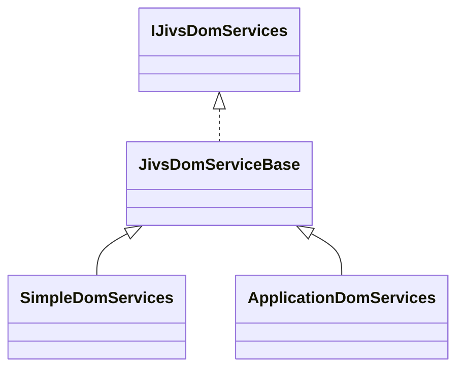
```mermaid
classDiagram
    class IJivsDomServices
    class JivsDomServiceBase
    class SimpleDomServices
    class ApplicationDomServices

    IJivsDomServices <|.. JivsDomServiceBase
    JivsDomServiceBase <|-- SimpleDomServices
    JivsDomServiceBase <|-- ApplicationDomServices
```

`SimpleDomServices` is the ready-to-use implementation supplied with Jivs. An application-defined subclass uses the reusable `jivs-dom` implementations while supplying the behavior that depends on its own markup and discovery convention.

### Relationship with JivsServices

`IJivsDomServices` participates in the existing Jivs service architecture. It includes the contracts implemented by `ServiceBase` and `ServiceWithAccessorBase`.

Conceptually:

```ts
interface IJivsDomServices
    extends IService, IServicesAccessor {
    // DOM child services and element-resolution methods.
}

abstract class JivsDomServiceBase
    extends ServiceWithAccessorBase
    implements IJivsDomServices {
}
```

The inherited property is:

```ts
services: IJivsServices;
```

There is no separate `jivsServices` property.

The DOM service object may be created before its associated `JivsServices`. Assigning it to the `domServices` property of `JivsServices` supplies the inherited `services` reference using the established `IServicesAccessor` behavior.

`JivsDomServiceBase` does not accept an `IJivsServices` constructor parameter. Its constructor establishes no form-specific or element-specific state.

#### Hooking JivsDomServices as a property on JivsServices
Uses the ModuleServicesInstaller and its guidance to expose a new property on IJivsServices interface:
```ts
declare module "@plblum/jivs-engine/build/Interfaces/JivsServices"
{
    export interface IJivsServices
    {
        domServices: IJivsDomServices;
    }
}

class JivsDomServicesInstaller
    extends ModuleServicesInstaller<IJivsDomServices> { }
const jivsDomServicesInstaller = new JivsDomServicesInstaller();
```
The consumer app must execute include the file with JivsDomServicesInstaller through an import
in the create_JivsServices() function like this:
```ts
import { JivsDomServicesInstaller } from '@plblum/jivs-dom/build/Services/JivsDomServicesInstaller';
new JivsDomServicesInstaller();  // install the buildersFactory service property on JivsServices
```

### Service Collection

`IJivsDomServices` exposes the following replaceable child services and factories:

```ts
interface IJivsDomServices
    extends IService, IServicesAccessor {

    dispatchers: IDispatcherService;

    editorAdapterDefinitionFactory:
        IEditorAdapterDefinitionFactory;

    fieldPresentationFactory:
        IPresentationFactory<IFieldPresentation>;

    formPresentationFactory:
        IPresentationFactory<IFormPresentation>;

    editorInstaller:
        IEditorInstaller;

    fieldPresentationInstaller:
        IFieldPresentationInstaller;

    formPresentationInstaller:
        IFormPresentationInstaller;

    ariaService:
        IAriaService | null;

    issuesFoundFormatter:
        IIssuesFoundFormatterService;

    getElementRegistry(
        valueHostsManager: IValueHostsManager
    ): IElementRegistry;

    getPopupService(valueHostManager: IValueHostManager): IPopupService;

    resolveContainerElement(
        valueHostsManager: IValueHostsManager
    ): HTMLElement | null;

    resolveFieldElement(
        valueHost: IFieldValueHost,
        role: ElementRole | string
    ): HTMLElement | null;
}
```

`IJivsDomServices` does not expose or retain:

* a `FormInstaller`;
* an `ElementCollector`;
* separate Text Value or Native Value installers;
* form-specific installation state outside manager metadata.

Applications construct the appropriate Collector and call `FormInstaller` explicitly or through its static convenience operation.

### Lazy Child-Service Construction

The `JivsDomServiceBase` instance is the installed DOM service object. Its child-service properties are created lazily.

Each property getter:

1. returns the currently assigned implementation when one exists;
2. otherwise calls the corresponding protected creation method;
3. retains and returns the created implementation.

Each setter replaces the implementation used by future operations.

The non-nullable properties reject `null` and `undefined`. `ariaService` is intentionally nullable because assigning `null` disables Jivs-managed ARIA behavior.

The `ariaService` backing state distinguishes:

| State            | Meaning                                 |
| ---------------- | --------------------------------------- |
| `undefined`      | The property has not yet been resolved. |
| `null`           | ARIA support is explicitly disabled.    |
| Service instance | The resolved ARIA service.              |

Replacing a child service affects later operations that retrieve that property. It does not alter adapters, presentations, callbacks, or other behavior already installed on DOM elements.

Replacing a factory affects later creations. It does not replace objects already created by the earlier factory.

### Protected Creation Methods

`JivsDomServiceBase` supplies a protected creation method for each lazy child property.

When `jivs-dom` has a complete markup-independent implementation, the base class provides a concrete creation method. When the required implementation depends on a DOM convention, the base class requires the concrete service subclass to supply it.

The intended ownership is:

| Property                     | Default ownership                                                                                                    |
| ---------------------------- | -------------------------------------------------------------------------------------------------------------------- |
| `dispatchers`                | `JivsDomServiceBase` creates `DispatcherService` and registers the standard Registry-backed Dispatcher Creators. |
| `editorAdapterFactory`       | `JivsDomServiceBase` creates and populates the standard factory from the editor definitions supplied by `jivs-dom`.  |
| `fieldPresentationFactory`   | `JivsDomServiceBase` creates and populates the standard factory from the field presentations supplied by `jivs-dom`. |
| `formPresentationFactory`    | `JivsDomServiceBase` creates and populates the standard factory from the form presentations supplied by `jivs-dom`.  |
| `editorInstaller`            | `JivsDomServiceBase` creates the concrete `EditorInstaller`.                                                         |
| `fieldPresentationInstaller` | `JivsDomServiceBase` creates the concrete `FieldPresentationInstaller`.                                              |
| `formPresentationInstaller`  | `JivsDomServiceBase` creates the concrete `FormPresentationInstaller`.                                               |
| `ariaService`                | The concrete service subclass supplies the discovery-aware implementation.                                           |
| `issuesFoundFormatter`       | `JivsDomServiceBase` creates `IssuesFoundFormatterService`.                                                          |
| Element Registry             | `getElementRegistry()` creates the default Registry through `createDefaultElementRegistry()` and stores it in manager metadata. |

The protected methods remain override points even when the base class supplies a standard implementation. Applications may alternatively replace the resulting public property.

### Dispatcher Service Construction

`DispatcherService` is markup-independent. It owns Dispatcher Creator registration, callback composition, missing-creator handling, and creation of one dispatcher for each callback attachment.

`JivsDomServiceBase` therefore creates the standard `DispatcherService` and registers creators for:

* Text Value dispatch;
* Native Value dispatch;
* field validation dispatch;
* form validation dispatch.

Conceptually, the base construction performs:

```ts
protected createDispatcherService():
    IDispatcherService {

    const result =
        new DispatcherService(this);

    result.registerTextValueChangedDispatcher(
        this.createTextValueDispatcher
    );

    result.registerValueChangedDispatcher(
        this.createValueDispatcher
    );

    result.registerValueHostValidationStateChangedDispatcher(
        this.createFieldValidationDispatcher
    );

    result.registerValidationStateChangedDispatcher(
        this.createFormValidationDispatcher
    );

    return result;
}
```

The exact protected creator signatures must preserve the established `DispatcherCreator<TDispatcher>` contract:

```ts
type DispatcherCreator<TDispatcher> = (
    domServices: IJivsDomServices,
    options?: unknown
) => TDispatcher;
```

The standard dispatchers query `IElementRegistry` and do not depend on a markup convention. An application may replace individual creator registrations when it needs different dispatch behavior.

A separate `SimpleDispatcherService` subclass is not required.

### Factory Ownership

The three public factories are owned by the DOM service collection because applications need access to their registration APIs.

#### Editor Adapter Factory

`editorAdapterFactory` contains the registered `IEditorAdapterDefinition` objects.

The standard creation method constructs `EditorAdapterFactory` and registers the built-in definitions supplied by `jivs-dom`, including:

* ordinary input definitions;
* `CheckboxAdapterDefinition`;
* `RadioGroupAdapterDefinition`;
* `TextAreaAdapterDefinition`;
* `SelectAdapterDefinition`;
* `FileInputAdapterDefinition`.

The registrations are markup-independent. They recognize native editor behavior rather than SimpleDom attributes.

Applications may register additional definitions or replace built-in adapter keys through the public factory. A service subclass may override the protected factory-creation method when it needs a different initial registry.

#### Field Presentation Factory

`fieldPresentationFactory` contains field-presentation creators and role defaults.

The standard creation method constructs the concrete field presentation factory and registers the presentations supplied by `jivs-dom`. It also establishes the standard role defaults defined by the field-presentation architecture.

Applications may add or replace registrations after retrieving the factory.

#### Form Presentation Factory

`formPresentationFactory` contains form-presentation creators and role defaults.

The standard creation method constructs the concrete form presentation factory and registers the form presentations supplied by `jivs-dom`. It establishes the standard Validation Summary default and leaves the submit role without a default, as defined by the form-presentation architecture.

Applications may add or replace registrations after retrieving the factory.

### Installer Ownership and Construction

The three specialized element installers have complete, markup-independent implementations in `jivs-dom`. `JivsDomServiceBase` therefore creates their concrete implementations.

#### Field Presentation Installer

The default property value is a concrete `FieldPresentationInstaller`.

It uses the current DOM service collection to obtain:

* `fieldPresentationFactory`;
* `ariaService`;
* `services.loggingService`.

It does not retain a field, element, presentation, or validation state between calls.

#### Form Presentation Installer

The default property value is a concrete `FormPresentationInstaller`.

It uses the current DOM service collection to obtain:

* `formPresentationFactory`;
* `ariaService`;
* `services.loggingService`.

It does not retain a manager, element, presentation, or validation state between calls.

#### Editor Installer

The default property value is a concrete `EditorInstaller`.

`JivsDomServiceBase` owns its construction because all editor-installation coordination is defined by `jivs-dom`. The concrete DOM convention discovers the editor and supplies its installation options; it does not replace the coordination algorithm.

`EditorInstaller` uses the current DOM service collection to obtain:

* `editorAdapterFactory`;
* `fieldPresentationInstaller`;
* `services.loggingService`.

Retaining `IJivsDomServices` rather than captured child-service instances allows later replacement of the factory or field presentation installer to affect subsequent editor installations.

Conceptually:

```ts
protected createEditorInstaller():
    IEditorInstaller {

    return new EditorInstaller(this);
}
```

`EditorInstaller` does not perform element discovery and does not interpret SimpleDom attributes.

### ARIA Service Construction

The AriaService is optional. It can be null to disable it. 
It starts out null and requires the user to assign new AriaService to domService.ariaService during initialization to enable it.

### Issues Found Formatter Construction

`JivsDomServiceBase` creates `IssuesFoundFormatterService` as the default `issuesFoundFormatter`.

The formatter is markup-independent and requires no SimpleDom behavior. Presentations, ARIA updaters, and applications obtain it through the DOM service collection.

A replacement affects later formatting operations. Existing generated HTML and text are not revised.

### Element Resolution

Element resolution belongs directly to `IJivsDomServices`:

```ts
interface IJivsDomServices {
    resolveContainerElement(
        valueHostsManager: IValueHostsManager
    ): HTMLElement | null;

    resolveFieldElement(
        valueHost: IFieldValueHost,
        role: ElementRole | string
    ): HTMLElement | null;
}
```

These methods are implemented by `JivsDomServiceBase`. A subclass overrides them when its markup convention requires different resolution.

#### Container Resolution

`resolveContainerElement()` obtains the Container Identifier from the supplied manager.

When no Container Identifier is configured, it returns:

```ts
document.body
```

Otherwise, the Container Identifier is passed to `document.querySelector()`. It must therefore be a valid selector that identifies an `HTMLElement`.

A valid selector with no match returns `null`. An invalid selector throws normally. When multiple elements match, the first match is returned without duplicate detection.

The method does not fall back to `document.body` when a configured selector has no match.

#### Field Element Resolution

When `root` is `null`, `resolveFieldElement()` obtains the field’s manager through `valueHost.valueHostsManager` and calls `resolveContainerElement()`.

If container resolution returns `null`, field resolution also returns `null`.

The `JivsDomServiceBase` implementation uses the supplied `elementIdentifierTemplate`, or the role-independent `{0}` template when none is supplied:

```ts
const selector =
    valueHost.getElementIdentifier(
        elementIdentifierTemplate ?? "{0}"
    );
```

The resulting Element Identifier must be a valid selector.

The supplied root participates in resolution. The method first tests the root itself and then searches its descendants:

```ts
if (root.matches(selector)) {
    return root;
}

return root.querySelector<HTMLElement>(
    selector
);
```

A valid selector with no match returns `null` without logging. Individual field roles are optional, and a partial root may legitimately exclude most fields.

When multiple elements match, the first match is returned without duplicate detection. Selector uniqueness is the developer’s responsibility.

The base implementation does not interpret `role`. A subclass may use it to select a role-specific identifier template or selector convention.

An explicitly supplied `elementIdentifierTemplate` overrides the subclass’s normal role-derived template and is passed to `valueHost.getElementIdentifier()`.

### SimpleDomServices

`SimpleDomServices` extends `JivsDomServiceBase` and remains the ready-to-use DOM service collection installed by `jivs-simpledom`.

Registry-backed dispatchers and ARIA processing are markup-independent and are inherited from `jivs-dom`. SimpleDom's markup-specific discovery belongs to its exported Element Collector, which interprets SimpleDom attributes and populates the supplied Registry.

`SimpleDomServices` does not create or retain a Collector or FormInstaller.

### Installation into JivsServices

The DOM module augments `IJivsServices` with:

```ts
interface IJivsServices {
    domServices: IJivsDomServices;
}
```

The service is installed using the existing Jivs module-service mechanism. Assignment of the service to `JivsServices` also assigns its inherited `services` accessor.

Because `JivsDomServiceBase` is abstract, `@plblum/jivs-dom` does not install an instance of that class.

`@plblum/jivs-simpledom` installs `SimpleDomServices` as the standard concrete `domServices` implementation. An application using another convention installs its own `JivsDomServiceBase` descendant instead.

The installed DOM service object is available through:

```ts
const domServices =
    jivsServices.domServices;
```

Its child services remain lazy and are created when their properties are first requested.

### Package Initialization Responsibilities

`@plblum/jivs-dom` is responsible for:

* declaring the `IJivsServices.domServices` module augmentation;
* exporting `IJivsDomServices`;
* exporting `JivsDomServiceBase`;
* exporting the reusable module-service installation support;
* exporting the standard child-service, factory, installer, dispatcher, adapter, presentation, formatter, and ARIA types;
* supplying all markup-independent default construction.

`@plblum/jivs-simpledom` is responsible for:

* exporting `SimpleDomServices`;
* installing `SimpleDomServices` as the standard concrete DOM service;
* exporting the SimpleDom Element Collector;
* interpreting SimpleDom attributes during complete form collection.

An application using `jivs-dom` without SimpleDom is responsible for:

* deriving a concrete service from `JivsDomServiceBase`;
* supplying an Element Collector for each form;
* calling `FormInstaller`.

### Disposal

`JivsDomServiceBase` participates in the existing `ServiceBase.dispose()` lifecycle.

Its disposal implementation releases references to child services and factories that were created or assigned. It does not search the DOM, remove event handlers from installed elements, or dispose form-specific state.

Form-specific Registry state is stored in `ValueHostsManager` metadata. Manager disposal calls `dispose()` on the Registry, which releases its retained elements, anchors, FieldValueHosts, options, and manager reference.

Installed DOM elements retain their installed behavior until they are removed or become unreachable.

The exact child-disposal policy should follow the established Jivs service conventions: the service collection must not unexpectedly dispose a replacement object that may be owned elsewhere.

### Required Consistency Changes

The following settled sections require narrow terminology changes after this section is approved:

* references to `DomServices` as the concrete root type become `IJivsDomServices` or `JivsDomServiceBase`, according to context;
* `domServices.jivsServices.loggingService` becomes `domServices.services.loggingService`;
* references to default `DomServices` construction are replaced by the abstract-base and concrete-service model;
* the provisional service-retrieval line in Section 11 becomes `jivsServices.domServices`.

No installer, dispatcher, presentation, ARIA, or form-installation behavior changes as a result.

## Package Boundaries and Implementation Guide

### Package Responsibilities

The first implementation introduces three workspaces:

| Workspace                   | Published | Responsibility                                                                                                                               |
| --------------------------- | --------: | -------------------------------------------------------------------------------------------------------------------------------------------- |
| `packages/jivs-dom`         |       Yes | Reusable DOM contracts, services, adapters, installers, dispatchers, presentations, ARIA support, formatting, and framework-independent CSS. |
| `packages/jivs-simpledom`   |       Yes | SimpleDom attributes, its screen-scraping Element Collector, concrete services, and SimpleDom-specific CSS.                                  |
| `packages/jivs-dom-website` |        No | Runnable demonstrations, manual browser verification, learning examples, and package integration coverage.                                   |

The dependency direction is:

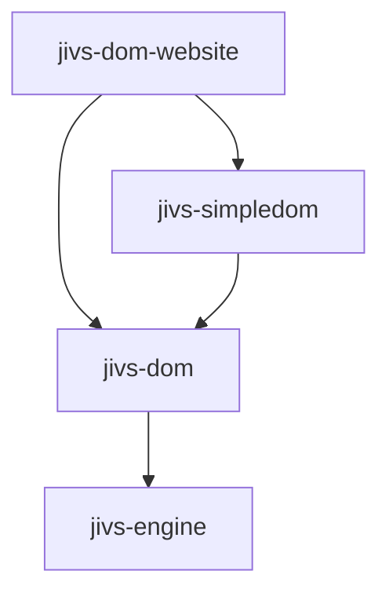
```mermaid
flowchart TB
    WEBSITE["jivs-dom-website"]
    SIMPLEDOM["jivs-simpledom"]
    DOM["jivs-dom"]
    ENGINE["jivs-engine"]

    WEBSITE --> SIMPLEDOM
    WEBSITE --> DOM
    SIMPLEDOM --> DOM
    DOM --> ENGINE
```

`jivs-dom` must not depend on `jivs-simpledom`.

The website consumes the published package surfaces. It must not import sibling-package source files through relative paths. This makes the website an integration check for package exports, generated JavaScript, declaration files, and published CSS assets.

### Website Strategy

The initial implementation should use one website rather than separate websites for `jivs-dom` and `jivs-simpledom`.

The website should contain:

* a home page linking to the demonstrations;
* SimpleDom demonstrations representing the normal developer experience;
* selected direct `jivs-dom` demonstrations showing customization without SimpleDom;
* pages focused on editors, field presentation, form presentation, ARIA, DOM replacement, and multiple managers.

A second website should be introduced only when a future framework integration requires its own build system or runtime. Angular, React, and Vue examples should not determine the architecture of the initial DOM website.

### Vite Website

`packages/jivs-dom-website` should be a private Vite application using plain HTML, CSS, and TypeScript.

Vite is appropriate because it provides:

* a Node-based development server;
* direct TypeScript module loading during development;
* linked-package support in a monorepo;
* multiple HTML entry points;
* a static production build;
* no required UI framework.

The website package should be marked:

```json
{
    "private": true
}
```

It must not participate in NPM publishing.

Its scripts should provide the equivalent of:

```json
{
    "scripts": {
        "dev": "vite",
        "build": "tsc --noEmit && vite build",
        "preview": "vite preview"
    }
}
```

The exact TypeScript command should follow the repository’s existing project-reference or package-build convention.

The website’s internal package dependencies should use the same version and workspace-linking convention already used elsewhere in the repository:

```json
{
    "dependencies": {
        "@plblum/jivs-engine": "...",
        "@plblum/jivs-dom": "...",
        "@plblum/jivs-simpledom": "..."
    },
    "devDependencies": {
        "typescript": "...",
        "vite": "..."
    }
}
```

Version values should not introduce a new workspace dependency convention solely for the website.

### Website Organization

A multi-page structure keeps each demonstration independent and makes its HTML easy to inspect:

| Location                                | Purpose                                                   |
| --------------------------------------- | --------------------------------------------------------- |
| `index.html`                            | Demonstration index and package introduction.             |
| `examples/basic/index.html`             | Basic SimpleDom form.                                     |
| `examples/presentations/index.html`     | Field and form presentations.                             |
| `examples/aria/index.html`              | ARIA attributes and dedicated error-message elements.     |
| `examples/replacement/index.html`       | Partial DOM replacement and reinstallation.               |
| `examples/multiple-managers/index.html` | Container Identifier isolation.                           |
| `examples/custom-dom/index.html`        | Direct `jivs-dom` use without SimpleDom.                  |
| `src/shared/`                           | Website-only layout, logging, and demonstration helpers.  |
| `src/examples/`                         | TypeScript entry modules for individual demonstrations.   |
| `public/`                               | Static website assets that are not produced by a package. |

Each demonstration page should load one small TypeScript entry module. Shared website code must remain presentation or demonstration infrastructure rather than becoming an undocumented library implementation.

The Vite production configuration must list every demonstration HTML file as a build input. The resulting `dist` directory is a deployable static website.

### Consuming Workspace Packages

The website should import only public package entry points:

```ts
import {
    ValueHostsManager
} from "@plblum/jivs-engine";

import {
    ElementRole,
    FormInstaller
} from "@plblum/jivs-dom";

import {
    SimpleDomElementCollector
} from "@plblum/jivs-simpledom";
```

CSS should also use explicit public exports when possible:

```ts
import "@plblum/jivs-dom/styles.css";
import "@plblum/jivs-simpledom/styles.css";
```

The corresponding package `exports` maps must expose those CSS files.

Avoid Vite aliases that point directly into sibling `src` directories. Such aliases can make development convenient while bypassing the package entry points that elements actually receive.

When the repository’s normal package build produces JavaScript before consumption, the website build must run after its dependent libraries. During active development, the repository may use its existing watch orchestration to rebuild those packages while Vite serves the website.

### Website Runtime

The initial website requires no application server.

Node.js runs:

* the Vite development server;
* the Vite production build;
* the local production preview server.

The generated site is static and can later be hosted by GitHub Pages or another static host.

A custom Node server should be added only when a demonstration genuinely requires server behavior, such as server-side validation or round-trip examples. That server should remain demonstration infrastructure and should not become a runtime dependency of `jivs-dom` or `jivs-simpledom`.

### TypeScript DOM Configuration

The TypeScript configurations for `jivs-dom`, `jivs-simpledom`, and the website must include browser declarations.

Their effective compiler options must include the appropriate ECMAScript library together with:

```json
{
    "lib": [
        "ES2022",
        "DOM",
        "DOM.Iterable"
    ]
}
```

The exact ECMAScript version should follow the repository’s current target rather than adopting `ES2022` merely from this example.

Node-only packages should not acquire DOM declarations through the root configuration unless they already intentionally include them. DOM libraries can extend the shared configuration and add the browser libraries locally.

### Jest DOM Environment

`jivs-dom` and `jivs-simpledom` should continue using Jest and the repository’s existing TypeScript transformation.

Each DOM package adds a development dependency on:

```text
jest-environment-jsdom
```

Its major version should match the installed Jest major version.

The effective Jest configuration for those packages sets:

```ts
testEnvironment: "jsdom"
```

The configuration may also establish a stable document URL:

```ts
testEnvironmentOptions: {
    url: "http://localhost/"
}
```

The existing Node test environment should remain in effect for `jivs-engine` and other packages that do not require browser globals.

Do not change the entire monorepo to JSDOM merely because the new packages require it.

### Jest Configuration Reuse

If the repository has a shared Jest configuration, the DOM packages should extend it and override only their environment-specific settings.

Conceptually:

```ts
export default {
    ...sharedJestConfig,
    testEnvironment: "jsdom",
    testEnvironmentOptions: {
        url: "http://localhost/"
    },
    setupFilesAfterEnv: [
        "<rootDir>/test/setupTests.ts"
    ]
};
```

The exact module syntax and transform settings must match the existing Jest and `ts-jest` configuration.

The DOM packages should not establish a second, competing TypeScript-to-Jest pipeline.

### DOM Test Setup

JSDOM supplies `document`, `HTMLElement`, native element classes, selectors, attributes, and DOM events.

Tests should construct actual simulated elements:

```ts
const input = document.createElement("input");
input.type = "text";
input.value = "New value";

document.body.append(input);

input.dispatchEvent(
    new Event("change", {
        bubbles: true
    })
);
```

Do not replace standard DOM elements, selector behavior, or event bubbling with handwritten mocks.

A shared package-local setup file may reset document state after each test:

```ts
afterEach(() => {
    document.head.replaceChildren();
    document.body.replaceChildren();
});
```

Tests must also reset or recreate mutable service registrations that are not owned by the removed elements.

Each test should normally create its own:

* `JivsServices`;
* DOM services;
* `ValueHostsManager`;
* elements;
* adapter and presentation registrations that differ from defaults.

This prevents registration replacement or installed element state from leaking between tests.

### What JSDOM Tests Should Verify

JSDOM unit tests should verify observable logic, including:

* `resolveContainerElement()` and `resolveFieldElement()`;
* root-self matching before descendant matching;
* valid selectors with no matches;
* invalid-selector propagation;
* Element Registry population, indexing, queries, clearing, and disposal;
* case-insensitive Element Identifier matching;
* delayed editor-anchor assignment;
* installed `IJivsDomElement` properties;
* adapter-definition selection and priority;
* adapter read and write behavior;
* actual DOM event submission to an `IFieldValueHost`;
* bubbling behavior for composite editors;
* presentation-created content and CSS classes;
* ARIA attributes and dedicated error-message text;
* dispatcher Registry queries on every invocation;
* behavior after Registry recollection for removed or replacement elements;
* complete form installation;
* installation idempotency;
* Collector statelessness;
* ARIA error-host precedence;
* standard dispatcher attachment idempotence;
* generated error-message HTML.

Queries should be made through normal DOM APIs such as:

```ts
element.matches(selector);
element.querySelector(selector);
root.querySelectorAll(selector);
```

Events should use the same event names, bubbling settings, and target relationships expected in the browser.

### JSDOM Limitations

JSDOM is not a rendering engine.

Unit tests should not use it to prove:

* visual layout;
* computed element dimensions;
* popup positioning;
* actual screen-reader announcements;
* browser focus behavior in every browser;
* complete native constraint-validation behavior;
* CSS appearance;
* browser-specific file-input security behavior.

CSS-related unit tests may verify that code assigns or removes the expected classes and attributes. They should not claim that the resulting page is visually correct.

The demonstration website supplies manual browser verification during the initial implementation.

A later browser integration suite may use Playwright when behavior depends on layout, focus, native browser controls, or complete page interaction. Playwright is not required to begin implementation of the DOM packages.

### Test Organization

Each DOM package should keep tests near its established package test location and group them by public responsibility.

Recommended `jivs-dom` test areas include:

* installed element state;
* adapter factory;
* individual native adapter definitions;
* editor installer;
* field presentation factory and installer;
* form presentation factory and installer;
* Issues Found formatter;
* ARIA updater classes;
* dispatcher service and callback composition;
* dispatcher base failure behavior;
* Element Registry;
* Element Collector base;
* Form Installer;
* `JivsDomServiceBase`.

Recommended `jivs-simpledom` test areas include:

* attribute parsing;
* role discovery;
* `SimpleDomElementCollector` population;
* `SimpleDomServices`;
* repeated complete installation;
* installation after DOM replacement.

Tests for `jivs-dom` must not use SimpleDom attributes unless the test is verifying that generic behavior ignores them.

### Public Exports

`@plblum/jivs-dom` should export its public contracts, abstract bases, concrete reusable implementations, option and Registry-record interfaces, `ElementRegistry`, `ElementCollectorBase`, `FormInstaller`, standard editor definitions, presentations, ARIA updaters, formatter, and CSS entry point.

`@plblum/jivs-simpledom` should export:

* SimpleDom attribute-name constants;
* `SimpleDomServices`;
* `SimpleDomElementCollector`;
* public SimpleDom option types;
* its CSS entry point.

Internal selector-building helpers and package-registration implementation details do not need public exports unless applications require them to implement documented customization.

The website exports nothing.

### CSS and Published Assets

`@plblum/jivs-dom` publishes its framework-independent CSS, including:

* standard presentation classes;
* validation-state classes;
* Required Indicator classes;
* Field Error Display classes;
* `jivs-visually-hidden`.

`@plblum/jivs-simpledom` publishes CSS that depends on its attributes or markup convention.

Both packages must:

* copy their CSS into the package output;
* include the CSS in the NPM `files` list;
* expose stable CSS subpaths through `package.json`;
* verify the packed package rather than relying only on repository-local imports.

The website may add demonstration layout and navigation CSS, but it must not silently provide CSS required by the published libraries.

### Root Commands

The root package should provide convenient commands using the repository’s existing workspace or Lerna convention.

The intended capabilities are:

| Command capability | Result                                                      |
| ------------------ | ----------------------------------------------------------- |
| Build DOM packages | Builds `jivs-dom` and `jivs-simpledom` in dependency order. |
| Test DOM packages  | Runs their JSDOM Jest suites.                               |
| Start DOM website  | Builds or watches dependencies and starts Vite.             |
| Build DOM website  | Builds dependencies and then produces the static website.   |
| Test all           | Includes both new package test suites.                      |
| Build all          | Includes both libraries and the website.                    |

Exact command text should be based on the current root scripts and task orchestration rather than introducing a second monorepo command style.

### Publishing Order

When engine changes are required, the publishing order is:

1. `@plblum/jivs-engine`
2. `@plblum/jivs-dom`
3. `@plblum/jivs-simpledom`

The website is not published to NPM. Its static build is deployed separately.

`jivs-dom` declares its engine dependency according to the repository’s existing dependency policy. `jivs-simpledom` declares dependencies on both `jivs-engine` and `jivs-dom` when it imports their public APIs directly.

### Starter-Code and Documentation Migration

Reusable DOM behavior moves from starter code into the published packages.

The migration must identify:

* starter code replaced by `jivs-dom`;
* starter code replaced by `jivs-simpledom`;
* submission-related code that remains outside both packages;
* Learning Jivs examples that should import the new packages;
* CSS references that must use the published assets;
* obsolete SimpleDom initialization functions.

The demonstration website becomes the executable source for current examples. Documentation may quote or link to those examples, but duplicate implementations should not remain authoritative in both starter code and the website.

### Implementation Checklist

1. Apply the required `jivs-engine` API changes.
2. Create `packages/jivs-dom`.
3. Add DOM TypeScript libraries and package-scoped JSDOM Jest configuration.
4. Implement and test the installed-element contracts.
5. Implement and test dispatchers, adapters, factories, and callback attachment.
6. Implement and test presentations, formatting, and ARIA updaters.
7. Implement and test Element Registry queries.
8. Implement and test Element Collector and Form Installer coordination.
9. Create `packages/jivs-simpledom`.
10. Implement and test SimpleDom services and its screen-scraping Element Collector.
11. Publish and test CSS package assets.
12. Create the private `packages/jivs-dom-website` Vite workspace.
13. Add the demonstration index and focused example pages.
14. Build the website exclusively through public package exports.
15. Migrate applicable starter code and Learning Jivs examples.
16. Run package tests, package builds, packing verification, and the website production build.
17. Publish in dependency order.
18. Deploy the static demonstration website separately.
