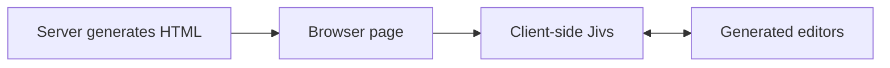
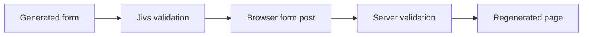
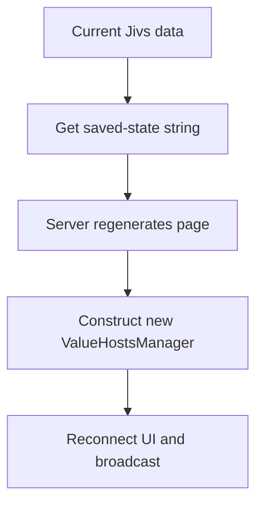
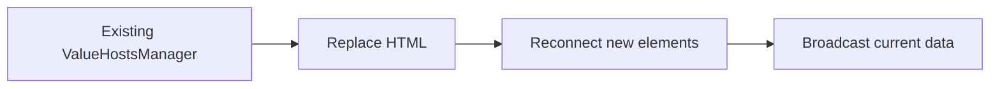

# Proposed Outline: Using Jivs with Server-Generated Pages

## Introduction

* Identify the intended reader: applications where the server generates complete pages or HTML fragments.
* Use ecosystem-neutral examples, including ASP.NET MVC, Web Forms, Laravel Blade, Django templates, Spring MVC, Ruby on Rails, and Express or NestJS template applications.
* Establish that Jivs remains entirely client-side.
* Explain that the generated page needs JavaScript to create Jivs and connect it to the generated HTML.
* Emphasize that most client-side setup is the same for every Jivs application. This guide packages that setup into server-page workflows and concentrates on the places where server-generated pages differ from pages maintained entirely on the client.
* Assume that readers may have entered the Learning Guide here. Provide enough orientation to understand the workflows, while linking to the existing documents for complete instruction.

Include a small boundary diagram:



Briefly introduce the four workflows:

* Load the initial server-generated page.
* Submit through a conventional form post.
* Post back for another server operation without submitting the form.
* Replace some of the page’s HTML through client-side code.

*How about we clearly state the differentiators: the ValueHostsManager has a full lifecycle in client oriented code. It may be recreated and its DOM elements need to be reattached within the lifecycle when on server pages.*

## Choose How Jivs Connects to Your Page

Orient readers to the three UI responsibilities that every workflow depends upon:

* Identify which `FieldValueHost` belongs to each editor.
* Move values between editors and their `FieldValueHosts`.
* Field and form elements change presentation based on validation state. *(I don't like "Present" as a verb because it can mean "show".)*

Explain the available implementation choices:

* Applications may provide their own UI integration code.
* `jivs-DOM_helpers.ts` supplies starter functions for connecting standard HTML editors to Jivs.
* Jivs SimpleDom supplies a convention-based approach to locating elements and presenting validation.
* Future Jivs DOM tooling may replace either example without changing the underlying Jivs workflows.

Provide only enough Jivs SimpleDom orientation to make later examples understandable:

* `data-field` identifies the field associated with an element.
* `data-jivs-role` identifies the element’s UI role.
* `data-jivs-presentation` selects a Presentation Function.
* These attributes belong to Jivs SimpleDom, not to Jivs value management itself.

Point readers to:

* `Using_the_ValueHostsManager_within_the_Client.md`;
* `Home.md`;
* `Presentation_Quick_Start.md`;
* `The_Jivs_SimpleDom_Approach.md`.

## Prepare the Server-Generated Page

Explain the design-time work needed to make the generated page usable by the selected UI integration approach.

### Prepare the Generated Markup

* Generate identifiers or semantic attributes that the client-side integration can use to locate editors and presentation elements.
* Prefer identifiers that remain stable when the server regenerates the page.
* When using Jivs SimpleDom, generate the appropriate `data-field`, `data-jivs-role`, and `data-jivs-presentation` attributes.
* Treat Jivs SimpleDom as the concrete example, not as a requirement.
* Ensure that the required Jivs scripts and the page’s initialization script are included.

### Prepare the Rules

* Configure each field’s `elementIdentifier` to support the application’s editor lookup strategy.
* Configure `propertyName` when a field will exchange values with a Model through `ModelReader` or `ModelWriter`.
* Explain that `elementIdentifier` is application-defined. It may represent an HTML `id`, a semantic identifier, or another value understood by the UI integration.
* Point readers to `Intro_to_Creating_a_ValueHostsManager.md` for the complete Rules configuration treatment.

## Common Client Setup

Explain that these are ordinary Jivs client responsibilities shared by all four workflows. Only a few steps within the individual workflows differ for server-generated pages.

1. Create `JivsServices`.
2. Create and configure the Rules object.
3. Assign the required `ValueHostsManager` callbacks.
4. Create the `ValueHostsManager`.
5. Establish the starting values.
6. Connect editors to their `FieldValueHosts`.
7. Connect validation presentation.

Identify the principal callbacks involved:

* `onTextValueChanged` when Jivs is responsible for supplying Text Values to editors;
* `onValueHostValidationStateChanged` for field validation presentation;
* `onValidationStateChanged` for form validation presentation.

Keep responsibilities separate from their implementations:

* application-owned UI code is valid;
* `jivs-DOM_helpers.ts` supplies starter editor wiring;
* Jivs SimpleDom supplies one validation-presentation approach;
* future Jivs DOM tooling can replace either example.

Do not introduce saved-state broadcasting here. It belongs only to workflows that reconstruct UI consumers for existing Jivs data.

## Workflow 1: Load the Initial Page

Introduce this as the first construction of the form. There is no prior Jivs state to preserve. The primary decision is where the initial field values are located.

### Values Rendered into HTML Controls

Introduce this as the familiar server-page approach: the server places values directly into `input`, `select`, and `textarea` elements.

* Query the generated controls on the client.
* Use each control’s identifying information to resolve its `FieldValueHost`.
* Supply the control’s Text Value through:

```ts
fieldValueHost.setTextValue(textValue, {
    validate: false,
    reset: true
});
```

* Explain the available ElementIdentifier strategies.
* Use Jivs SimpleDom’s alignment between `elementIdentifier` and `data-field` as the concrete example.
* Include a minimal client-side scraping example.
* Clarify that the values are read from the generated controls in the browser, not extracted on the server by Jivs.

### Values Supplied Through a Model

Introduce this for pages where the server supplies a Model through injected page data, an API call, or another JavaScript-accessible source.

* Configure `propertyName` for `ModelReader`.
* Configure `elementIdentifier` for UI lookup.
* Assign `onTextValueChanged` before loading the Model.
* Use `ModelReader` to populate Jivs.
* Allow Jivs-formatted Text Values to flow to the generated controls through `onTextValueChanged`.
* Link to `Initializing_the_Client_Form.md` for the complete treatment.

### Complete the Page Setup

* Attach editor-to-Jivs event handlers.
* Attach field and form validation presentation.
* Initialize Required Indicators or equivalent static presentation.
* Confirm that the form is ready for editing.

## Workflow 2: Submit Through a Conventional Form Post

Introduce this for applications that allow the browser to submit the generated form and replace the current page with the server’s response.



### Before Allowing the Post

* Run Jivs validation.
* Stop the browser submission when `doNotSave` is `true`.
* Otherwise, allow the browser to post the controls normally.
* The server receives its usual form-posted values.
* Link to the relevant client-validation portion of `Submitting_the_Client_Form.md`.
* Do not present that document’s JavaScript-managed response workflow as the primary example for this workflow.

### When the Server Accepts the Form

* The previous page and its `ValueHostsManager` are gone.
* Continue with the server application’s normal success behavior.
* No Jivs state needs to be retained.

### When the Server Regenerates the Form with Errors

Introduce this as a new page constructed from the server’s returned values and validation errors. It is not the saved-state workflow.

* Initialize the new page and a new `ValueHostsManager` from the values rendered into the returned controls or supplied through a returned Model.
* Make the server’s validation errors available to the page’s JavaScript.
* Convert non-Jivs server errors into `IssueFound` objects.
* Add them to the new manager:

```ts
vhm.addExternalIssuesFound(issuesFound, false);
```

* Explain why `false` is required for server-supplied validation.
* Link to `Integrating_Non_Jivs_Server_Validation.md`.

Add a brief alternative for Node.js server-rendered applications that also run Jivs on the server:

* Transfer a Jivs Validation Payload to the returned page.
* Use `fromValidationPayload()` to restore the server-generated Jivs validation results.

## Workflow 3: Post Back Without Submitting the Form

Introduce this for a server operation that regenerates the page but is not an attempt to submit the user’s completed form. The application wants the new page to continue with the existing values and validation state.



### Before the Postback

* Call `getCapturedState()`.
* Retain the opaque string through the round trip.
* Do not prescribe its transport or storage.
* Treat the contents as internal Jivs data.

### When the Page Returns

* Obtain the saved-state string.
* Assign it to `ValueHostsManagerConfig.capturedState`.
* Construct the new manager.
* Understand that construction restores the saved data internally without notifying UI consumers.
* Reconnect editor event handlers and validation presentation.
* Call the working `broadcastState()` operation to send the current Text Values and validation state outward through the configured callbacks.

Explain that `broadcastState()`:

* does not restore or change the manager’s internal state;
* does not run validation;
* invokes the existing notification paths so newly connected UI consumers can represent the current data;
* is the current working API name and may be reconsidered.

### When the Server Intentionally Changes Values

* Begin with the state restored through the constructor.
* Apply intentionally changed server values through:

```ts
fieldValueHost.setTextValue(textValue, {
    validate: false,
    reset: true
});
```

* Alternatively, apply returned Model values through the Model workflow.
* Leave all other restored fields untouched.
* Call `broadcastState()` after the final values and UI wiring are ready.

Present comparison with the restored Text Value as a favorable generic approach:

* Compare the generated control value with `fieldValueHost.getTextValue()`.
* Call `setTextValue()` when the new value differs.

Explain its limitations:

* formatting or normalization may make equivalent values appear different;
* generated values may be stale;
* control-specific representations may not compare cleanly;
* a difference does not inherently prove that the server intended to replace the value.

When those limitations are unacceptable, the server response must identify which values it intentionally changed.

### Reestablish Element Relationships

* Prefer stable ElementIdentifiers when possible.
* Call `setElementIdentifier()` when regenerated identifiers have changed.
* Use stable semantic attributes such as Jivs SimpleDom’s `data-field`.
* Allow another application-specific mapping strategy.

## Workflow 4: Replace HTML Through Client-Side Code

Introduce this for AJAX or other client-side code that replaces some or all of the form’s DOM elements without loading a new browser page.

State the simplifying requirement prominently:

> Keep the existing `ValueHostsManager` alive when client-side code replaces HTML.

Store the manager in application-level client state rather than in the DOM fragment being replaced.



### Determine the Source of Values

Help readers recognize the three supported directions:

* Existing Jivs Text Values remain authoritative and move to the replacement controls.
* Intentional values rendered into the replacement controls move into Jivs.
* Returned Model values move into Jivs and then into the controls.

For replacement controls that are intended to supply values:

* compare the rendered Text Values with the current FieldValueHost Text Values when that comparison is appropriate;
* call `setTextValue(..., { validate: false, reset: true })` for accepted replacements;
* apply the same comparison limitations described in the postback workflow.

### Restore Editor Event Handling

* Rerun the application’s editor connection code after inserting the replacement HTML.
* Show the protected functions in `jivs-DOM_helpers.ts`.
* Explain that already-connected elements are left alone while new elements receive handlers.

### Restore Validation Presentation

* Rerun the application’s presentation initialization.
* Show Jivs SimpleDom’s idempotent attachment as the example.
* Explain that the same initialization functions can be used for the original page and after DOM replacement.

### Broadcast the Current Data

After values, editor handling, and validation presentation are ready:

* call `broadcastState()`;
* allow current Text Values to flow through `onTextValueChanged`;
* allow current field validation state to flow through `onValueHostValidationStateChanged`;
* allow current form validation state to flow through `onValidationStateChanged`.

## Custom Editors

Include a short note for editors whose UI value is not represented as text.

* Standard `input`, `select`, and `textarea` controls exchange Text Values through `setTextValue()` and `onTextValueChanged`.
* Native Value widgets exchange values through `setValue()` and `getValue()`.
* Reconstruct Native Value widgets through application-specific, non-notifying UI updates.
* `broadcastState()` does not invoke `onValueChanged`, avoiding a feedback loop in which a widget update is interpreted as a new value supplied to Jivs.

## Closing Navigation

Link readers to:

* `Intro_to_Creating_a_ValueHostsManager.md`;
* `Using_the_ValueHostsManager_within_the_Client.md`;
* `Initializing_the_Client_Form.md`;
* `Submitting_the_Client_Form.md`;
* `Integrating_Non_Jivs_Server_Validation.md`;
* `Home.md`;
* `Presentation_Quick_Start.md`;
* `The_Jivs_SimpleDom_Approach.md`.

--- 
Here is the proposed division. The key structural choice is that **Page Load becomes the baseline workflow**. The other workflow documents explain what changes from that baseline.

## `Home.md`

Displayed title: **Using Jivs with Server-Generated Pages**

Purpose: landing page and orientation.

Contents:

* Intended readers and ecosystem-neutral examples.
* Jivs remains client-side.
* Server-generated page boundary diagram.
* The distinguishing lifecycle problem:

  * the `ValueHostsManager` may be reconstructed when the browser receives a new page;
  * DOM elements may be replaced while the manager remains alive;
  * reconstructed UI elements must be reconnected to Jivs.
* Brief introduction and navigation to the four workflows.
* **Choose How Jivs Connects to Your Page**

  * application-owned integration;
  * `jivs-DOM_helpers.ts`;
  * Jivs SimpleDom;
  * short orientation to its attributes;
  * links to the existing client and presentation documents.
* **Prepare the Server-Generated Page**

  * generated markup;
  * stable identifiers or semantic attributes;
  * `elementIdentifier`;
  * `propertyName` when Models are used;
  * required scripts and initialization entry point.
* **Common Client Setup**

  * short checklist with links, not repeated training.
* Brief recognition of standard Text Value editors versus custom Native Value editors.
* Workflow chooser and links.

This document does not teach any complete workflow.

## `Server_pages_workflow_page_load.md`

Displayed title: **Server Pages Workflow: Page Load**

Purpose: establish the baseline construction of a server-generated page.

Contents:

* Recognition: this is the first construction of the form, with no prior Jivs state.
* Lifecycle diagram.
* Two sources for initial values:

  * values rendered into HTML controls;
  * values supplied through a Model.
* Reading Text Values from generated controls.
* Resolving the corresponding `FieldValueHost`.
* Calling `setTextValue(..., { validate: false, reset: true })`.
* Using `ModelReader` when values arrive through a Model.
* Complete setup order:

  * create services and Rules;
  * configure callbacks;
  * create the manager;
  * establish values;
  * connect editor events;
  * connect validation presentation;
  * initialize static presentation such as Required Indicators.
* A minimal complete example using Jivs SimpleDom conventions.
* Notes showing where application-owned UI integration can replace SimpleDom.
* Links to:

  * `Initializing_the_Client_Form.md`;
  * `Using_the_ValueHostsManager_within_the_Client.md`;
  * the presentation guide.

The remaining workflow documents can refer to this as “the normal Page Load setup.”

## `Server_pages_workflow_page_save.md`

Displayed title: **Server Pages Workflow: Page Save**

Purpose: conventional browser form submission and a server-generated response.

Contents:

* Recognition: the user is attempting to save the completed form.
* Page Save lifecycle diagram.
* Before allowing the post:

  * run Jivs validation;
  * stop when `doNotSave` is `true`;
  * otherwise allow the normal form post.
* Server success:

  * the previous page and manager are gone;
  * continue with normal server success behavior.
* Server validation failure:

  * regenerate the form;
  * construct a new manager using the Page Load workflow;
  * initialize it from returned control or Model values;
  * make server validation errors available to JavaScript;
  * convert non-Jivs errors to `IssueFound`;
  * call `addExternalIssuesFound(issuesFound, false)`.
* Explain why saved state is not used for this workflow.
* Brief Node.js alternative using a Jivs Validation Payload and `fromValidationPayload()`.
* Links to:

  * `Submitting_the_Client_Form.md`;
  * `Integrating_Non_Jivs_Server_Validation.md`;
  * `Using_Jivs_for_Server_Side_Validation.md`.

## `Server_pages_workflow_round_trip.md`

Displayed title: **Server Pages Workflow: Round Trip**

Purpose: preserve an existing form while the server regenerates the page for an operation other than Page Save.

Contents:

* Recognition and distinction from Page Save.
* Briefly identify “postback” as the familiar ASP.NET Web Forms term.
* Saved-state lifecycle diagram.
* Before the round trip:

  * call `getCapturedState()`;
  * retain the opaque string through the application’s chosen transport.
* When the page returns:

  * supply the string through `ValueHostsManagerConfig.capturedState`;
  * construct the manager;
  * perform the normal Page Load wiring;
  * apply intentional server changes;
  * call `broadcastState()`.
* Explain what `broadcastState()` does and does not do.
* Determine whether generated values replace restored values.
* Present Text Value comparison as a favorable generic approach.
* Explain the comparison limitations.
* Reestablish ElementIdentifiers when necessary.
* Preserve stable semantic relationships where possible.
* Focused code showing the complete save/reconstruct/reconnect/broadcast sequence.

This is the workflow with the most genuinely new Jivs behavior.

## `Server_pages_workflow_elements_replaced.md`

Displayed title: **Server Pages Workflow: Elements Replaced**

Purpose: reconnect Jivs after AJAX or other client-side code replaces HTML elements.

Contents:

* Recognition: the browser page remains alive, but some interacting DOM elements are replaced.
* Prominent requirement that the existing `ValueHostsManager` must survive.
* Replacement lifecycle diagram.
* Determine the authoritative values:

  * current Jivs Text Values;
  * intentional values in replacement controls;
  * returned Model values.
* Apply accepted replacement values to Jivs.
* Reconnect editor event handlers.
* Demonstrate the protected `jivs-DOM_helpers.ts` functions.
* Reconnect validation presentation.
* Demonstrate Jivs SimpleDom’s idempotent attachment.
* Call `broadcastState()` after consumers are ready.
* Reconstruct custom Native Value widgets without invoking `onValueChanged`.
* Link to the presentation documents and the normal Page Load workflow.

## Navigation pattern

Each workflow document should end with:

* a link back to `Home.md`;
* links to directly relevant existing Learning documents;
* a next-workflow link only when it is a natural continuation.

