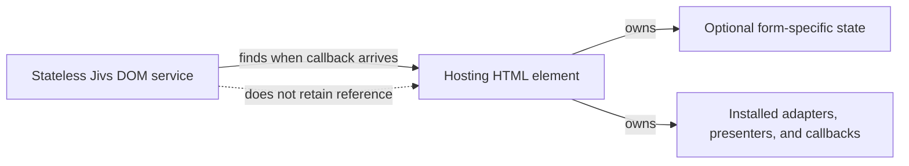
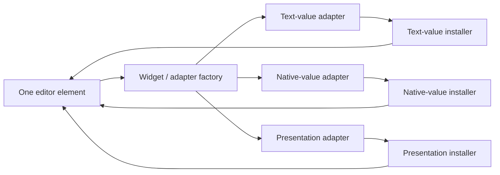

This worksheet will be transformed into ideas for the Jivs-dom module.

# S01 Brain dump
- Jivs-dom is a stand-alone package that focuses on using Jivs within a DOM user interface.
- It expands upon the Jivs-SimpleDOM work in /starter_code/jivs-simpledom.ts and documented in /docs/LearningJivs
- We may migrate these files from starter_code into jivs-dom package: jivs-DOM_Helpers.ts, jivs-simpledom.ts, jivs-simpledom.css (also requires updating the LearningJivs doc references)
- Needs at least two actual "packages": the npm package jivs-dom and a website that demonstrates it in operation. jest testing for jivs-dom is part of the jivs-dom package. The website is designed for end-user exploration and learning.
- It is possible that we actually have jivs-dom and jivs-simpledom separate. jivs-dom starts from jivs-DOM_Helpers.ts and is code that can be used even when building a UI without jivs-simpleDOM approach. Not sure. Both projects could be very light and harmless to keep together.
- We should explore that workproduct.ts file of jivs-angular. It attempted to do the same for Angular. It likely will be overhauled, both to update to recent Angular and to consume jivs-dom for some of its work. That is out of scope for this planning. The point is workproduct.ts should give some ideas to what features we'll offer in jivs-simpledom.
- Note that jivs-simpleDom will change. It will be formalized. Up to now, we needed it to offer training via Learning Jivs. Yet its likely a sustainable pattern. We may radically alter it too. Nobody is using this codebase yet.

## S02 Jivs-dom's version of jivs-DOM_helpers.ts
- The entire file's concepts are likely to find a home here, even if we rename and restructure things. Its conceivable that we'll have a class or service with these tools. If its a service, it will get attached to JivsServices.
- This code has no idea about the custom attributes used by Jivs-simpledom. It handles activities on HTML elements that are known.
- It is likely that we'll have coverage of these concepts:
    - attach element to jivs to send the value into jivs, like attachJivsToFormControl(), but as a factory where we can add support for other widgets
    - presentation features adapted from jivs-simpledom, but without its use of attributes. Again a factory where we can support other widgets. These handle the ValueHostsManager.onValidationStateChanged and onValueHostValidationStateChanged callbacks.
    - attach element to jivs to send the value from jivs into the element. This would handle the ValueHostsManager.onTextValueChanged and onValueChanged callbacks. Again, a factory to handle other widgets
- We may want to use a custom attribute to hold an object or function that handles: presentation, textvaluechanged, valuechanged. Only when these are attached will the element support the feature. Our dispatcher functions for the callbacks will know nothing beyond the DOM element so it can find that attribute value and consume it.
    - The attach element to jvis to send the value into jivs is a one-time use, because it attaches the "on changed" event handler of the widget.
    - if so, we need a way to install them, and that installation will use the factory to get the object or function to use.
    - For any non-standard DOM editor element, we'll need a way to recognize the actual widget by name perhaps so we can handle default hookups of these objects/functions. The use of jivs-simpledom's own data-jivs-presentation attribute can be optional with defaults. Yet inside of this core code, we are unaware of the attributes for jivs-simple dom.
- Widget presentations will be created for the same ideas we have in jivs-simpledom.
- We'll offer CSS for them and potentially offer a popup UI for error messages using CSS, unlike how we've approached Jivs-simpledom to date.
- We want jivs-simpledom to be ready for live web sites, mostly by offering good css and presentations.
- The same code used for presentations may be reused in React, Angular, Vue, etc, but only if its reasonable to do that. If not, those other frameworks should eventually offer the same UI approaches.

## S03 Peter's architecture philosophies
- See top-level readme.
- OOP with single responsibilities, strongly testable, replaceable through dependency injection, factories, and interfaces.
- Love to let the user customize! Give them an abstract base class and our concrete implementation.

## S04 What is the current design for UI?
- Read through /docs/LearningJivs

## S05 Embedding my thoughts into the document
I will annotate the content with:
PLB: my comments. (Peter L Blum = PLB)

# S06 Planning document

The documentation and the project architecture suggest three separate products:

1. **`jivs-dom`**: the reusable DOM integration, dispatching, installation, presentation, and error-message toolkit.
2. **`jivs-simpledom`**: an easy attribute-based convention that subclasses or composes the `jivs-dom` dispatchers and installers.
3. **Demo website**: a separate consumer that teaches and exercises the packages.

`jivs-dom` users should be able to build a complete Jivs UI without adopting any `jivs-simpledom` attributes. They may write their own element discovery and installation code, while using the standard Jivs DOM presenters, CSS, adapters, and error-message tools.

The important boundary is not “generic code versus all presentation.” It is:

```text
jivs-dom       = reusable DOM behavior and presentation tools
jivs-simpledom = one way to discover and install that behavior
```
PLB: Correct

## S07 Stateless objects and element-owned state

The services and most objects in `jivs-dom` should be stateless. They should not retain references to forms, editors, presenters, or other elements. When a callback arrives, the object resolves the relevant element and works with it immediately.

The DOM is the stateful surface. Installation places the needed callback or presentation object on the element, using a DOM property, symbol, or another element-owned mechanism. A dispatcher later finds the element and invokes what was installed. It should not maintain a parallel object graph that keeps element references alive.

This supports:

- dynamically replaced HTML
- multiple forms on one page
- stateless services registered in `JivsServices`
- isolated testing
- framework integrations that control element lifetimes

If a form-specific object is necessary, it can be generated and attached to a hosting element such as the `<form>`. That object is then owned by the DOM lifecycle rather than by a global service.

PLB: Correct. Please add a mermaid diagram here for what was just described.



## S08 Core value synchronization

### S09 Element resolution

Element lookup should be replaceable because applications may use IDs, names, selectors, generated identifiers, or `FieldValueHost.getElementIdentifier()`.

```ts
interface IDomElementResolver {
    getElement(
        valueHost: IFieldValueHost,
        role: string,
        pattern?: string
    ): HTMLElement | null;
}
```
PLB: Correct. We favor the Element Identifier approach due to its ability to host any string they need to look for an element they choose.

The default resolver can use `getElementById()` and the element identifier supplied by the `FieldValueHost`. It should not assume that every application uses the same locator.

PLB: While valid, its less likely to use getElementById because other values whether name, element type, or custom attribute (data-lookup=) are better tools. I want to encourage looking for elements by characteristics, not ids. So the default resolver will use querySelector() and we recommend query syntax for Element Identifiers.

The Element Identifier supplies the query syntax, while `role` tells the resolver what kind of associated element is being requested. The same field may have an editor, label, error display, required indicator, or another consumer. The default resolver should therefore use `querySelector()` and combine the Element Identifier with role-specific criteria rather than assuming that an identifier identifies the only relevant element.

`jivs-dom` will define the standard roles as a string-valued enum, analogous to Jivs `LookupKey` values:

```ts
enum ElementRole {
    editor = 'editor',
    label = 'label',
    container = 'container',
    required = 'required',
    error = 'error',
    summary = 'summary',
    submit = 'submit'
}
```

This gives developers discoverable values such as `ElementRole.editor` while still producing strings usable by factories, query selectors, and SimpleDom attributes. The role vocabulary is standard, while custom roles may remain possible for application-specific presenters.

### S10 Editor adapters and installers

An editor may support several independent connections to Jivs. Text values are used by `setTextValue()` and `onTextValueChanged`; native values are used by the corresponding value APIs and `onValueChanged`. These capabilities should have separate interfaces rather than one adapter with a growing collection of optional methods.

```ts
interface IDomTextValueAdapter<TElement extends HTMLElement = HTMLElement> {
    readTextValue(element: TElement): string;

    writeTextValue(
        element: TElement,
        textValue: string
    ): void;
}

interface IDomValueAdapter<TElement extends HTMLElement = HTMLElement> {
    readValue(element: TElement): unknown;

    writeValue(
        element: TElement,
        value: unknown
    ): void;
}
```

Radio buttons are a supported grouped-editor case. A radio installer receives one representative radio element and assigns the adapters only to that element. The adapter uses the representative element's `name` attribute to find its companion radios and operate on the group. The dispatcher always resolves the representative element; it does not independently search for other group members.

Radio groups require three independently replaceable capabilities:

- a field-presentation adapter that may apply the validation presentation to every radio in the group, allowing a surrounding container to respond with CSS `:has()`;
- a Jivs-to-DOM text-value adapter that selects the radio matching the current Text Value;
- a DOM-to-Jivs input adapter that listens for group changes and sends the selected radio's value to `FieldValueHost.setTextValue()`.

The same representative-element principle can support other multi-element widgets. The widget must provide one clearly identifiable installation anchor; its adapter owns the knowledge of how to find and operate on companion elements.

For native radio groups, the default companion lookup is based on:

```css
input[type="radio"][name="..."]
```

The installation API does not require a custom selector for this case. A future widget-specific installer may offer one when its markup requires a different relationship.

`jivs-simpledom` owns screen scraping and anchor selection. When it finds multiple annotated candidates for the same radio group, it must enforce that only one becomes the installation anchor. Manual `jivs-dom` installation receives the representative element directly, so the caller chooses the anchor.

The built-in editor boundary is the native HTML editing model:

- `HTMLInputElement`, including its supported input types;
- `HTMLTextAreaElement`;
- `HTMLSelectElement`;
- radio groups through the special representative-element adapter described above.

`contenteditable` is intentionally outside the built-in editor scope. It is a useful custom widget and can be supported later through custom adapters and installers. Buttons are action or form controls, not value editors; submit/save behavior belongs to form presentation rather than text-value or native-value synchronization.

`input[type="file"]` is included in the built-in editor boundary only as a browser-exposed value check. The adapter may pass `HTMLInputElement.value` as a Text Value so Jivs validators can decide whether a file appears to be selected or whether its exposed filename matches a rule such as an extension pattern. The adapter does not read file contents, and the browser's protected path/filename behavior may limit what value is available. Content validation and security remain application/server responsibilities.

PLB: Q66 and Q67 resolved: support the built-in input, textarea, select, radio, and limited file-value cases; leave `contenteditable` to custom widget support.

`<select multiple>` is also a normal HTML editor, but its built-in Jivs support is pending a data contract. The DOM package should not dictate an application's savable format. A future Jivs `MultiSelect` data type may define:

- an array of strings as the Native Value;
- a semicolon-separated string as the Text Value;
- a parser and formatter to move between those representations;
- data-type validation that understands the collection and its allowed entries;
- validators or Conditions that can validate membership, ordering, duplicates, and other collection rules.

Until that Jivs support exists, `jivs-dom` will not implement the multi-select adapter. A regular expression is not assumed to be sufficient for validating every possible delimited collection; a dedicated parser and collection-aware validation path may be required. Multi-select remains a pending Jivs engine/data-type issue rather than an editor-installer issue.

PLB: Q70 resolved with a dependency: support for `<select multiple>` is intended, but implementation waits for the Jivs `MultiSelect` value and validation design.

The native input type does not by itself require a separate Jivs DOM adapter. Strongly typed browser inputs such as `number`, `date`, `time`, `email`, and similar controls still expose a Text Value through `HTMLInputElement.value`; Jivs receives that text and applies its own parser and validation rules. The adapter factory may recognize materially different DOM behavior, but it should not split adapters merely because the browser exposes a specialized native type.

Checkboxes use a specialized adapter convention that sends a string or empty string to Jivs, allowing a Jivs parser to produce a Boolean when configured. Radio groups send the selected option's string or an empty string. File inputs use only the limited browser-exposed string described above. Buttons, `output`, `meter`, and `progress` are not editors; they belong to action or presentation behavior.

PLB: Q73, Q74, Q68, and Q69 resolved: preserve the Text Value boundary for native inputs, provide specialized checkbox/radio behavior, support file values only as exposed text, and keep action/display elements out of editor installers.

Widget recognition and adapter creation belong to factories. A factory can inspect the element and installer parameters, then return the text adapter, value adapter, or both. An editor may support only text values, only native values, or both.

There should be separate installers for the separate connection types:

```ts
abstract class DomTextValueInstaller {
    abstract install(
        element: HTMLElement,
        valueHost: IFieldValueHost,
        options?: DomTextValueOptions
    ): void;
}

abstract class DomValueInstaller {
    abstract install(
        element: HTMLElement,
        valueHost: IFieldValueHost,
        options?: DomValueOptions
    ): void;
}
```

The installers remain stateless. They install the needed event handlers or Jivs callback behavior on the element, and later callbacks find the element rather than relying on a retained reference.

Each adapter instance is created for and attached to one element. The adapter may use `this` to access its bound element and may own state associated with that element. However, adapters should not retain a `ValueHostsManager` or `FieldValueHost`. Those are supplied as parameters to the operation that needs them:

```ts
interface IDomTextValueAdapter {
    onTextValueChanged(
        valueHost: IFieldValueHost,
        oldTextValue: string
    ): void;
}

interface IFieldPresentation {
    apply(
        valueHost: IFieldValueHost,
        state: ValueHostValidationState
    ): void;
}
```

This keeps the adapter's state limited to the element and avoids requiring `WeakMap` fields to associate managers or value hosts with adapters. It also makes the current Jivs context explicit at every call site.

PLB: If I understand, the Adapters will be the objects assigned to custom attributes on the associated element. We can start referring to them that way and even give those attributes names.

PLB: Mermaid diagrams please


PLB: I don't agree with the mermaid diagram. I think that each Adapter is an object attached to the DOM Element and executed by the dispatcher for validationstate changes and directly for initial presentation state. I'm not sure my design for Jivs-simpledom addresses initializing presentation based on state. Take a look at what I've put together. We'll discuss this topic more.

### S11 Composite editor installation

Because users of `jivs-dom` should be able to connect a widget with one call, a composite editor installer can coordinate the separate installers:

```ts
abstract class DomEditorInstaller {
    abstract install(
        element: HTMLElement,
        valueHost: IFieldValueHost,
        options?: DomEditorOptions
    ): void;
}
```

The composite installer asks factories which capabilities the widget supports, then invokes the appropriate text-value, native-value, and presentation installers. It is a convenience for editors, not a reason to merge the underlying contracts. Presentation is a special case here because editors can have validation and accessibility presentation, while labels, error displays, summaries, and submit controls need presentation-only installers.

The first built-in factories could support text inputs, checkbox and radio controls, textarea, select, and the limited file-value case described above. Custom widgets can be added through other factories.

PLB: Correct

## S12 Abstract dispatchers and installers

`jivs-dom` should provide abstract base classes for the repeated mechanics of dispatching and installation. These classes should not know the SimpleDom attributes.

### S13 Dispatchers

A field dispatcher receives the ValueHostsManager.onValueHostValidationStateChanged callback, finds the elements associated with the `FieldValueHost`, and asks each element to handle the state:

```ts
abstract class FieldValidationDispatcher {
    public dispatch(
        valueHost: IFieldValueHost,
        state: ValueHostValidationState
    ): void;

    protected abstract findConsumers(
        valueHost: IFieldValueHost
    ): Iterable<HTMLElement>;
}
```

The base implementation can contain the common loop and invocation rules. The subclass supplies element discovery. A corresponding `FormValidationDispatcher` handles ValueHostsManager.onValidationStateChanged callback, supplying `ValidationState` for summaries, submit controls, and other form-level consumers.

Dispatchers should not decide whether an editor gets a class, an ARIA attribute, an error message, or a popup. That belongs to the installed presentation behavior.

PLB: Correct
PLB: Q01 Something to determine: how should the code that attaches callback properties to these dispatcher functions look? There are several approaches to consider. We'll need a discussion to determine what they are and which to use.

### S14 Installers

An installer connects one element to a behavior selected by its role and presentation name:

```ts
abstract class DomPresentationInstaller {
    public install(
        element: HTMLElement,
        role: string,
        presentationName: string
    ): void;

    protected abstract createPresentation(
        role: string,
        presentationName: string
    ): IDomPresentation | undefined;
}
```

PLB: Q02 resolved: define standard string-valued role names in `jivs-dom`, including `container`, through an enum such as `ElementRole`. Factories match the role and presentation criteria, while custom roles may remain possible.

The installer asks a factory for the presentation object, then attaches it to the element. A user who does not use SimpleDom can call this function directly with their own role and presentation names. `jivs-simpledom` can subclass the installer so that it reads `data-jivs-role` and `data-jivs-presentation` before calling the same base mechanism.

The same pattern applies to value installers. The public API should make the one-element installation call easy, while the separate installers remain available for users who need precise control. Factories and installer parameters resolve a concrete widget without requiring the base package to know the widget's name or markup.

PLB: Correct

Field and form presentations use separate contracts and separate public element properties. A field presentation receives a field and its `ValueHostValidationState`; a form presentation receives the manager and its `ValidationState`.

```ts
interface IFieldPresentation {
    apply(
        valueHost: IFieldValueHost,
        state: ValueHostValidationState
    ): void;
}

interface IFormPresentation {
    apply(
        manager: IValueHostsManager,
        state: ValidationState
    ): void;
}

interface IJivsDomElement extends HTMLElement {
    jivsTextValueAdapter?: IDomTextValueAdapter | null;
    jivsValueAdapter?: IDomValueAdapter | null;
    jivsFieldPresentation?: IFieldPresentation | null;
    jivsFormPresentation?: IFormPresentation | null;
}
```

All four properties are public and optional/nullable. Their three states are meaningful:

```text
undefined -> not examined; an installer may try to resolve an adapter
instance   -> installed and available to a dispatcher
null       -> examined but unavailable; do not retry automatically
```

The installed presentation instance is created for one element and bound to it. Its `apply()` method can therefore use the element through its instance context rather than receiving the element as a parameter. The instance may own presentation-specific state, while the installer and dispatcher services remain stateless. The `ValueHost`, `ValueHostsManager`, and validation state remain operation parameters; they are not captured as adapter fields.

PLB: I don't think IDomPresentation should cover both. That implies any class created from it requires implementing both when presentation is specific to one or the other. The separate field/form contracts and element properties above are the intended design.

PLB: Q23 resolved: presentation names remain open-ended strings because users can create any presentation they need. `jivs-dom` will not dictate an enum of presentation names. As a recommendation, a presentation class name can match its presentation name, such as `StandardFieldPresentation` for `StandardFieldPresentation`; a project may omit a common suffix such as `FieldPresentation` when deriving the presentation name. Factories can use the supplied name, a constructor name, or another application-defined convention.

### Presentation installation context

Field and form presentation installation use separate functions with different first-class Jivs context parameters:

```ts
installFieldPresentation(
    element: IJivsDomElement,
    role: ElementRole | string,
    presentationName: string | null | undefined,
    valueHost: IFieldValueHost | null | undefined
): IFieldPresentation | null;
```

```ts
installFormPresentation(
    element: IJivsDomElement,
    role: ElementRole | string,
    presentationName: string | null | undefined,
    valueHostsManager: IValueHostsManager | null | undefined
): IFormPresentation | null;
```

The installer does not retain the `ValueHost` or `ValueHostsManager`. It passes the supplied context to the presentation's initial `apply()` call. Supplying the relevant context means that initial presentation is applied by default, using a neutral validation state such as valid, no issues, and no asynchronous processing. Passing `null` or `undefined` installs the presentation without invoking it, which is appropriate before the manager has initialized its values.

The `preliminary` option on `ValueHostsManager.validate()` is separate. It controls which validators run during an explicit validation operation; it does not install presentations and does not replace the neutral initial presentation.

When an already-active page replaces or revises an element, the installer can be rerun with the current `ValueHost` or `ValueHostsManager` so the new element is immediately brought to the baseline presentation state. The application explicitly chooses when to perform that initialization by supplying the context.

PLB: Q50, Q51, and Q52 resolved: initial presentation uses a neutral state when the relevant first-class Jivs context is supplied; field and form installation remain separate; and the corresponding dispatcher attachment methods use the same field/form separation.

## S15 Presentation tools supplied by `jivs-dom`

`jivs-dom` should include the concrete tools needed to fully develop a Jivs DOM UI, even when the application does not use SimpleDom.

### S16 Error-message generation

The functions currently in `jivs-DOM_helpers.ts` are core presentation tooling, not merely SimpleDom helpers:

```ts
buildErrorMessagesHtml(
    issues: IssueFound[],
    useSummaryMessage?: boolean
): string;

buildErrorMessagesText(
    issues: IssueFound[],
    useSummaryMessage?: boolean
): string;

errorMessageToText(
    errorMessage: string
): string;
```

They transform `IssueFound` objects into content that can be used by inline displays, summaries, tooltips, popups, and other UI components. `buildErrorMessagesHtml()` should remain reusable by presentations outside SimpleDom.

Within buildErrorMessageHtml(), every generated issue element will include both metadata attributes:

```html
<span data-error-code="RequireText" data-severity="error">
    The First name requires a value.
</span>
```

The idea is that the user can take advantage of error code and/or severity in CSS if they like.

When an issue has no error code, `data-error-code` should still be present with the defined empty or fallback value. Severity should likewise always have a defined serialized name, including the normal error severity. This makes the generated markup predictable for CSS, accessibility tooling, tests, and application code.

The presentation that chooses where to insert the generated HTML remains replaceable. Applications can instead use the text generator or hand the issues to a UI-library popup.

PLB: Correct, although we may actually create a simplistic CSS + script for popups to deliver typical UI for showing error messages through popups.

### S17 Default presenters, ARIA helpers, and CSS

The package should provide default presentations and CSS for common needs:

- invalid editor state - valueHostValidationState.isValid = false
- invalid label state - valueHostValidationState.isValid = false
- required indicators - fieldValueHost.required = true
- inline field errors - valueHostValidationState.issueFound?.length > 0
- error icons and tooltips - valueHostValidationState.issueFound?.length > 0
- validation summaries - validationState.issueFound?.length > 0
- submit or save availability - ValidationState.doNotSave = false blocks
- accessible state such as `aria-invalid`, `required`, `aria-required`, and `aria-errormessage`

These presentations should accept an element, role, and state. They must not require SimpleDom attributes. SimpleDom can use the same presentations after discovering and installing them.

ARIA updates should be exposed as reusable `jivs-dom` tools rather than hidden inside one SimpleDom presenter. Consumers should be able to apply or adjust the same behavior when they use custom discovery, custom presenters, or another UI convention. Potential helpers include:

```ts
function setInvalidState(
    element: HTMLElement,
    isInvalid: boolean
): void;

function setRequiredState(
    element: HTMLElement,
    isRequired: boolean
): void;

function setErrorMessageReference(
    element: HTMLElement,
    errorElement: HTMLElement | null,
    hasErrors: boolean
): void;
```

The exact helper names are open, but the behavior should be shared by all consumers. Native semantics should be preferred over ARIA where the element supports them.

Required state comes from `FieldValueHost.required` and should be initialized separately from changing validation state.

PLB: Q03 I'm wondering if we have an interface for an Aria class with one public function, `apply(element, role, validationState)`, and a standard implementation. This class can be a service. We may have an abstract base class and concrete implementation, inviting users to rework its ARIA support as needed.

## S18 Callback integration and services

The engine configuration receives callbacks before `ValueHostsManager` is constructed:

```ts
config.onTextValueChanged = ...;
config.onValueHostValidationStateChanged = ...;
config.onValidationStateChanged = ...;
```

`DomServicesCallbacks` should expose one explicit attachment method for each callback rather than one method that attaches everything:

```ts
domServices.callbacks.attachTextValueChanged(
    config,
    options
);

domServices.callbacks.attachValueChanged(
    config,
    options
);

domServices.callbacks.attachValueHostValidationStateChanged(
    config,
    options
);

domServices.callbacks.attachValidationStateChanged(
    config,
    options
);
```

The text-value and native-value callbacks remain optional because applications may manage those directions themselves. Validation callbacks are the required DOM presentation integration. Users configure callbacks through the explicit `attach[Callback]()` methods rather than assigning callback properties directly.

Each `attach[Callback]()` method only changes the configuration. It does not search for or modify elements. Installers must run first so that relevant elements contain their adapter instances or explicit `null` values. Callback dispatch then invokes only an existing adapter that matches the callback requirements, usually the relevant `ValueHost`.

The attachment method captures any callback already present in the configuration and preserves it when composing the new callback. It creates the default dispatcher for that configuration and applies the supplied options, allowing each form to choose its own element-resolution approach. The dispatcher instance is therefore unique to that attachment and may hold configuration-specific state; it is not a shared singleton in `DomServices`.

The stateless `DomServices` façade owns defaults and creates these per-configuration dispatchers on demand. A factory can remain an advanced reuse point when an application wants a custom or reusable dispatcher implementation, but a form does not need to configure a factory merely to choose its own options.

Any configuration helper must compose with existing application callbacks rather than silently overwrite them. Form-specific installation state belongs on the hosting DOM element, not in `JivsServices`.

PLB: Q04 resolved by the explicit attachment methods and per-configuration dispatchers described above.

## S24 `DomServices` and module installation

`DomServices` is the root service façade for the DOM module. It is not a form object and should not retain references to forms or elements. It is a lightweight dependency-injection container for the stateless child services used by `jivs-dom`.

The existing `ModuleServicesInstaller` in `jivs-engine` provides the intended extension mechanism. `jivs-dom` can export one installer that:

- augments `IJivsServices` with a `domServices` property;
- installs that property on `JivsServices.prototype` when the module is loaded;
- creates the default `DomServices` lazily for each `JivsServices` instance;
- uses `getService()` and `setService()` for registration and replacement;
- allows an application or test to replace the complete `DomServices` object.

Conceptually:

```ts
export class DomServicesInstaller
    extends ModuleServicesInstaller<DomServices> {

    public constructor() {
        super('domServices');
    }

    protected createDefaultService(
        services: IJivsServices
    ): DomServices {
        return new DomServices(services);
    }
}

export const domServicesInstaller =
    new DomServicesInstaller();
```

`DomServices` exposes child services as replaceable properties. Defaults are supplied by the constructor, while setters allow dependency injection and customization:

```ts
class DomServices {
    public constructor(
        public readonly jivsServices: IJivsServices
    ) {}

    public elementResolver: IDomElementResolver;
    public callbacks: DomServicesCallbacks;
    public textValueInstaller: ITextValueInstaller;
    public valueInstaller: IValueInstaller;
    public fieldPresentationInstaller:
        IFieldPresentationInstaller;
    public formPresentationInstaller:
        IFormPresentationInstaller;
    public editorInstaller: IEditorInstaller;
    public aria: IDomAriaService;
    public errorMessages: IDomErrorMessageService;
}
```

The exact child-service list is still being designed. The initial candidates are:

- an element resolver that understands the requested role;
- the stateless Jivs callback façade, with four registered dispatcher factories;
- separate replaceable text-value, native-value, field-presentation, and form-presentation installers;
- a composite editor installer;
- an ARIA service;
- error-message generation and formatting.

This answers the earlier question about whether the DOM callback façade should be a separate companion object. It can be a child service, such as `domServices.callbacks`, while `DomServices` owns its construction and dependencies. Applications can replace that child service without replacing the entire DOM service collection.

Each installer owns or receives the factory it needs to create a per-element adapter. Factories are not separate public `DomServices` properties unless a future shared-capability requirement justifies exposing one. The installer properties themselves have getter and setter access so applications can replace their interface-typed implementations.

The composite editor installer remains optional coordination infrastructure. The initial design does not require it to coordinate the individual installers; applications may use the individual installer services directly.

The module installer does not make `jivs-engine` depend on `jivs-dom`. It gives the external module a supported way to add its property to `JivsServices`, just as `jivs-builder` installs its own module-owned service. Loading the `jivs-dom` entry point installs the property; reading it creates the default lazily.

## S19 Package boundaries

### S20 `jivs-dom` owns

- stateless abstract field and form dispatchers
- stateless abstract installers and presenter factories
- element resolver interfaces and default resolver
- separate text-value and native-value editor adapters
- separate text-value, native-value, and presentation installers
- composite editor installers for the common one-call setup
- element-owned installation conventions
- error-message HTML and text generation
- default field and form presentations
- reusable ARIA helpers and accessibility behavior
- CSS that does not depend on SimpleDom selectors
- integration with `ValueHostsManager` callbacks

### S21 `jivs-simpledom` owns

- `data-field`
- `data-jivs-role`
- `data-jivs-presentation`
- selector-based consumer discovery
- subclasses of the `jivs-dom` dispatchers and installers
- reading attributes and passing element, role, and presentation name to installers
- SimpleDom-specific markup conventions
- SimpleDom-specific CSS selectors and initialization helpers

PLB: Looks good

## S22 What does not belong in the DOM package

The existing `jivs-DOM_helpers.ts` also contains client submission base classes. Those classes use model writing, validation, and server communication, but are not inherently DOM concerns. They should not be moved into `jivs-dom` merely because they currently share a starter file with DOM helpers. They may remain starter/application code or become a separate client-submission package later.

PLB: Agree - Goes into another module not yet specified.

## S23 Recommended design direction

Design `jivs-dom` as a complete, stateless DOM toolkit with abstract dispatchers, capability-specific installers, composite editor installers, presentation tools, error-message generation, and reusable ARIA helpers. Build `jivs-simpledom` as an annotation-driven implementation of those abstractions.

The three independent flows remain:

```text
DOM event       -> Jivs FieldValueHost
Jivs text/value -> DOM editor
Jivs validation -> DOM presentation
```

The next planning questions are:

1. **Q09:** Which default presenters, ARIA helpers, and CSS are included in the first release? ARIA design itself remains deferred until the broader architecture is complete.
2. **Q12:** Should `DomServicesCallbacks` methods avoid `this`, or should they be bound so they can use sibling DOM services later?
3. **Q19:** Should adapter binding occur through the constructor or a separate method? This is intentionally deferred as an implementation detail.
4. **Q57:** How should the optional composite editor installer coordinate the individual installers? This is intentionally deferred as a nice-to-have.
5. **Q71:** Define and implement the Jivs `MultiSelect` data type, including array Native Value, semicolon-delimited Text Value, parser, formatter, data-type validation, and collection-aware validation before adding the multi-select DOM adapter.